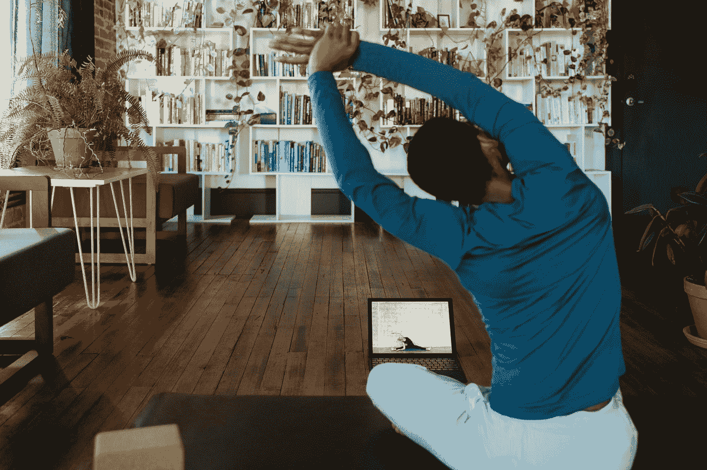

# 为什么视频预训练很重要？

> 原文：<https://medium.com/mlearning-ai/why-video-pretraining-matters-cdabcbf6ab46?source=collection_archive---------6----------------------->

## OpenAI 训练的视频预训练(VPT)模型用 70k 小时玩《我的世界》。缩放版本可能包括超过 100 万小时的视频。

Photo by [Windows](https://unsplash.com/@windows?utm_source=medium&utm_medium=referral) on [Unsplash](https://unsplash.com?utm_source=medium&utm_medium=referral)

**简介**

[视频预训(VPT)模型](/mlearning-ai/the-video-pretraining-vpt-707bfa186b36)学会了在人类层面玩《我的世界》。这位模特制作钻石工具。游戏环境是: