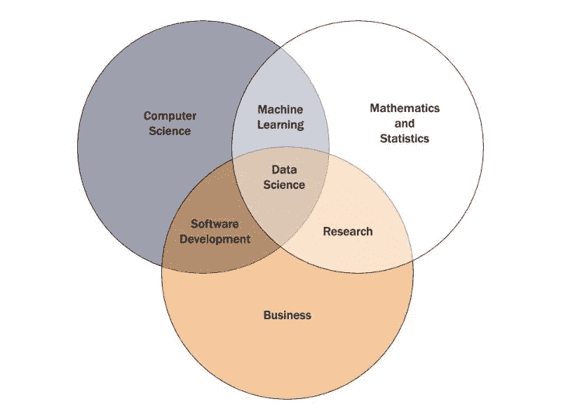
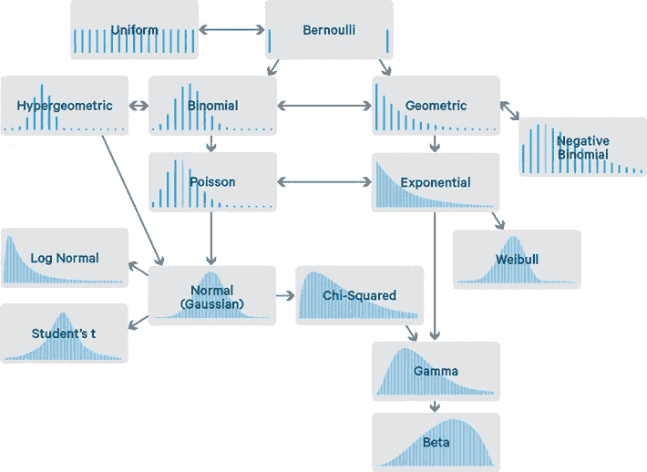

# 为什么你需要 ML、DL 和 AI 的统计数据？

> 原文：<https://medium.com/mlearning-ai/why-you-need-statistics-for-ml-dl-ai-e8e701266fa1?source=collection_archive---------5----------------------->

The normally distributed church of Iceland [[Source](https://www.google.com/search?q=normal+distributed+building&tbm=isch&ved=2ahUKEwjv4Ib-3pD5AhVlT3wKHZUeBTUQ2-cCegQIABAA&oq=normal+distributed+building&gs_lcp=CgNpbWcQAzoECCMQJzoECAAQQzoECAAQAzoICAAQsQMQgwE6CwgAEIAEELEDEIMBOggIABCABBCxAzoFCAAQgAQ6CggAELEDEIMBEEM6BwgAELEDEEM6BggAEB4QCDoECAAQGDoGCAAQChAYOgQIABAeUOcOWJFHYMJIaABwAHgAgAHFAYgB1ySSAQQwLjI4mAEAoAEBqgELZ3dzLXdpei1pbWfAAQE&sclient=img&ei=w9HcYq_zL-We8QOVvZSoAw&bih=577&biw=1280#imgrc=8kBlTOesnEDt4M&imgdii=ceTRFXCMhrdXyM)]

> 统计学是对令人困惑的问题进行数字推测的艺术。[……]这些方法是由数百年来一直在寻找自己问题的答案的人 *开发出来的。* —第十三页，[统计](https://amzn.to/2pUA0tU)，2007 年第四版。

人工智能的所有嗡嗡声都关注于从理论角度理解算法，但在内心深处，隐藏在背后并发挥重要作用的是数学和统计学。让我们详细理解这一点。

让我们从“我们如何定义统计”开始。

正如维基百科所说，

> [*统计是* ***复杂的机器学习算法的核心，捕捉数据模式并将其转化为可操作的证据*** *。*](https://www.google.com/search?q=what+is+statistics+in+data+science&sxsrf=ALiCzsaAUyLbD0nEI-24gO3Wpct5Sf2_Dw%3A1658635838561&ei=PsbcYqjhIdmMseMP7tqS6A4&oq=what+is+statistics+&gs_lcp=Cgdnd3Mtd2l6EAEYATIECAAQQzIFCAAQgAQyBAgAEEMyBQgAEIAEMgQIABBDMgUIABCABDIKCAAQgAQQhwIQFDIFCAAQgAQyBAgAEEMyBQgAEIAEOgcIABBHELADOgcIABCwAxBDSgQIQRgASgQIRhgAUOoJWOoJYLYZaAFwAXgAgAHSAYgB0gGSAQMyLTGYAQCgAQHIAQrAAQE&sclient=gws-wiz)

## 数据科学

Source: [Towards Data Science](https://towardsdatascience.com/introduction-to-statistics-e9d72d818745)

数据科学总是处理数据，但决策的方式在于统计。收集完数据后，了解它的分布、异常值、中心趋势和许多其他信息是很重要的。在这里，统计数据可以帮助你。了解统计学使您能够选择最佳的数据收集技术，应用正确的分析，并有效地交流发现。根据数据做判断，做预测，做科学发现，都要靠统计。多亏了统计学，你可以对一个主题有更深刻的理解。

## 数据

数据在当今的技术世界中扮演着重要角色。所有的技术都是数据驱动的，每天都会产生大量的数据。数据科学家是分析数据源、清理和处理数据、了解此类数据产生的原因和方式、从数据中获得洞察力以及做出有利于业务的改变的专家。最近的数据就是一切。

Data growth in past years [[source](https://www.google.com/search?q=data+growth+graph&sxsrf=ALiCzsaQn9cE3b0UOjYvp62Vvw8G5sE67g:1658814371534&tbm=isch&source=iu&ictx=1&vet=1&fir=lOJ1q-uJke6aLM%252C37Gq_E1NdkxPTM%252C_%253BbOjonZIfXAdLbM%252C37Gq_E1NdkxPTM%252C_%253BMRd1t3tPeclHJM%252Chttwck6i7ylWIM%252C_%253B5VS2f82rZnP58M%252CFGjt3PiwuAe4AM%252C_%253BoVIIQ9Nov-7ElM%252C37Gq_E1NdkxPTM%252C_%253BzERtsROSH-OshM%252CoBAumbjCxvfxvM%252C_%253Bv8gaPIafjFWuPM%252C37Gq_E1NdkxPTM%252C_%253BxDczW_92d5R-jM%252CWWEhb9P4bfHHBM%252C_%253BwB2pwgq-dxYVdM%252CvLe4DI2l6hxiAM%252C_%253BDqECyP3v9ToFvM%252CIVoddNeMCVTj9M%252C_%253Boxv5kmK_0DzpCM%252Cwa9eYVeQeYCw3M%252C_%253Bh8MkNmHsElDRSM%252Cpl0QUFYwlDx1AM%252C_&usg=AI4_-kRNlpQLyp73Rh8x0EGkskrpFvL3sg&sa=X&ved=2ahUKEwij1vOK7ZX5AhUztlYBHYxrB78Q9QF6BAgMEAE#imgrc=5VS2f82rZnP58M)]

随着数据的大规模增长，常规和传统的技术将很难处理这些数据。**统计**有能力并将永远有能力处理数据的所有预处理和后处理。正如传说中所说，**数据科学家应该是一个优秀的故事讲述者**，无论是对他的孩子还是对客户。在这里你可以期待统计数据的帮助。概率函数讲述分布的故事，分布讲述如何处理数据，最后数据讲述输出的故事。

我认为有助于处理数据的几个主题如下。

Different distributions in one frame [[source](https://www.google.com/search?q=all+distributions+in+one+image&sxsrf=ALiCzsbpZ6zihF_pa7Co-i7wVnGUqGKlSw:1659342565657&source=lnms&tbm=isch&sa=X&ved=2ahUKEwi62r7hnKX5AhXKCIgKHfHZCS0Q_AUoAXoECAEQAw&biw=1280&bih=577&dpr=1.5#imgrc=k6gE9HD0Wbq_EM)]

# 描述和显示数据

*图形显示
数字汇总
正态分布
分类数据*

# 线性回归和相关

*线性回归
相关性
线性回归中的推断
多元线性回归
方差分析用于回归*

# 实验和取样

*实验设计
抽样
统计推断中的抽样*

# 可能性

*概率模型
条件概率
随机变量
随机变量的均值和方差
样本均值*

# 假设检验和置信区间

*置信区间
显著性检验
两个平均数的比较
分类数据的推断
卡方拟合优度检验
双向表和卡方检验*

有许多统计概念你应该知道，而不是我提到的。继续这个系列，在接下来的博客中，我会写更多关于统计学从基础到高级的内容。你可以关注我这样一个有趣的博客和统计系列。

你可以在 LinkedIn 上联系我。

Photo by [Pete Pedroza](https://unsplash.com/@peet818?utm_source=medium&utm_medium=referral) on [Unsplash](https://unsplash.com?utm_source=medium&utm_medium=referral)

 [## Mlearning.ai 提交建议

### 如何成为 Mlearning.ai 上的作家

medium.com](/mlearning-ai/mlearning-ai-submission-suggestions-b51e2b130bfb)