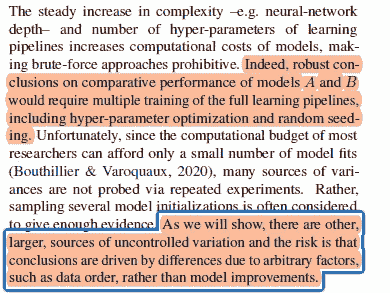
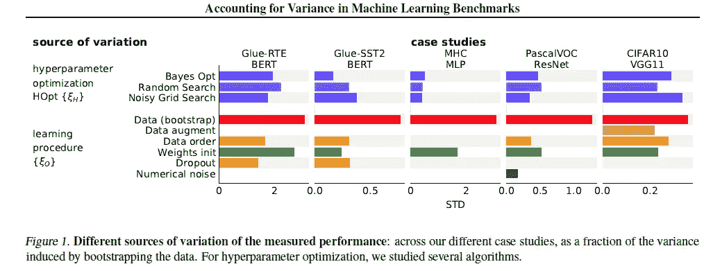

# 为什么你需要花更多的时间来评估你的机器学习模型

> 原文：<https://medium.com/mlearning-ai/why-you-need-to-spend-more-time-evaluating-your-machine-learning-models-e1e3258fe7d?source=collection_archive---------1----------------------->

## 事实证明，很多人工智能研究都弄错了这一点

为了帮助我了解您[请填写此调查(匿名)](https://forms.gle/7MfQmKhEhyBTMDUD7)

验证。如此甜蜜的事情。关注我的人会知道，我总是建议在你的机器学习模型训练中添加随机性来源。想要收据吗？我的文章“[为什么以及如何将随机性整合到你的机器学习项目中](https://medium.datadriveninvestor.com/why-and-how-to-integrate-randomness-into-your-machine-learning-projects-53c1c30561e)”称赞了将随机性添加到你的模型训练过程中，并给出了你可以做到这一点的各种可能的方法。在其他文章和视频中，我已经谈到了我如何更喜欢在进入复杂的深度学习网络之前探索配置和添加随机性。“ [**计算机器学习基准中的差异**](https://arxiv.org/abs/2103.03098) ”是一篇支持我所做的一切的论文。这是报纸上的一段令人高兴的引文:

> 我们展示了一个与直觉相反的结果，即在不完美的估计量上增加更多的变异源可以更好地接近理想的估计量，而计算成本却降低了 51 倍。

在这篇文章中，我将(试图)把幸灾乐祸保持在最低限度。我还将从这篇论文中获得一些有趣的东西，包括作者提出的为机器学习管道建立出色基准的建议。让我知道你的想法，以及你认为最有见地的几点。如果你喜欢这样的内容，请确保你在这里关注我，以便你可以跟上机器学习的研究和想法。如果在机器学习/人工智能研究领域有任何你想分解的主题，请联系我。

# 为什么评估模型很重要

简单，帮助我们比较，以确定最佳的机器学习模型。我们有多种度量标准和方法来比较模型的原因是，对于不同的问题，不同的度量标准会更相关。

# 大多数模型比较出错的地方。

More complexity->Too Costly to accurately evaluate the model over the diverse sets

花些时间阅读这篇文章。它暗示了一些非常关键的东西。拥有极其复杂的模型将直接阻止您检查多个配置(和数据分割)以及在不同的测试集上比较模型。当我们不测试这些变异的来源时，我们可能会得到客观错误的答案。

Remember these are relative to the variance from bootstrapping

上面是一个非常简洁的例子，说明了我们可以将差异引入学习代理的各种方法。这些数字不容忽视。这种差异确实会改变你的比较结果。下面的一段话总结了这一节的要点。

This picture is the TL;DR of the whole section

自然，除了我们关心的纯度量标准之外，还有其他因素。如果模型太贵，它就一文不值。你可能想知道我们如何计算模型的复杂性。这里有一个视频，用不到一分钟的时间介绍了计算效率(相对于复杂性的性能)的最佳指标之一，贝叶斯信息标准。

# 如何为 ML 管道设计更好的基准

如果你已经读到这里，你脑海中的下一个问题将是我们如何为我们的模型建立更好的基准。不要害怕。如前所述，以下是您希望重点关注的方面，以便进行出色的比较基准测试。

## 随机选择尽可能多的变异源

好的模型比较会有很多随机选择。回想一下我们在机器学习过程中做出的许多任意选择。初始化的随机种子，数据顺序，我们如何初始化学习者，等等。将这些随机化将允许更好地执行模型。引用一下，

> *“改变这些任意选择的基准测试不仅会评估相关的方差(第 2 节)，还会减少预期性能的误差，因为它们支持在相关性较低的测试集上测量性能(3)。这种反直觉的现象与 bagging 的方差减少有关(Breiman，1996aBuhlmann 等人，2002 年)，有助于更好地描述机器学习管道的预期行为，而不是特定拟合*

我发现和装袋的比较特别有趣。这就是为什么我建议花些时间复习各种 ML 概念等。它会帮助你接触到一些想法和联想，从而更好地理解事物并有所创新。

## 使用多个数据拆分

大多数人使用单一的训练-测试-验证分离。他们将对数据进行一次批处理，然后就完事了。更勤奋的人可能也会进行一些交叉验证。我建议你也可以在构建集合时使用一些比率。用该团队的话来说，“*对于用更多的统计能力来计算机器学习基准比较中的差异的管道，进行多次测试是有用的，例如用非引导方案生成随机分裂(详见附录 B)。*

## 考虑差异以发现有意义的改进

重要的是你要永远记住你的结果有一定程度的随机性。运行多个测试是减少它的一种方法。但是它永远不会消失，除非你尝试每一种可能的排列(这可能是不可能的，而且肯定是不必要的昂贵)。微小的改进可能只是随机的结果。当处理模型时，总是在手边放几个性能相近的。

# 关闭

这是一篇有趣的论文。作者做了大量工作，展示了机器学习过程中有多少任意选择会扭曲结果。它谈到需要有全面的测试来解释随机性。这篇论文证实了我所说的很多东西，这是锦上添花。虽然这篇论文声称没有什么有争议的，但它显示方差如何改变结果的程度确实令人大开眼界。

为了充分利用这篇论文，我建议浏览一下附录。它包含了一些非常有趣的细节，比如他们的引导程序和一个完整的参数列表，这些参数可以被随机化以获得彻底的测试。

# 纸张:

这是这篇论文的注释版本。请随意下载并浏览它，看看我发现了什么有趣的/遇到了我的见解。

# 向我伸出手

此部分包含我所有的链接/工作的细节。

如果那篇文章让你对联系我感兴趣，那么这一部分就是为你准备的。你可以在任何平台上联系我，或者查看我的其他内容。如果你想讨论家教，发短信给我。如果你想支持我的工作，使用我的免费罗宾汉推荐链接。我们都有免费的股票，对你没有风险。所以不使用它只是失去了免费的钱。如果你正在准备编码/软件面试，请跟随我的子栈。我在这里发布高质量的问题和解释，帮助你搞定 FAANG/software 面试。

查看我在 Medium 上的其他文章。:[https://rb.gy/zn1aiu](https://rb.gy/oaojch)

我的 YouTube:【https://rb.gy/88iwdd 

在 LinkedIn 上联系我。我们来连线:【https://rb.gy/m5ok2y】T4

我的 insta gram:[https://rb.gy/gmvuy9](https://rb.gy/gmvuy9)

我的推特:[https://twitter.com/Machine01776819](https://twitter.com/Machine01776819)

我的子任务:[https://devanshacc.substack.com/](https://devanshacc.substack.com/)

twitch 现场对话:[https://rb.gy/zlhk9y](https://rb.gy/zlhk9y)

获得罗宾汉的免费股票:[https://join.robinhood.com/fnud75](https://www.youtube.com/redirect?redir_token=QUFFLUhqa0xDdC1jTW9nSU91WXlCSFhEVkJ0emJvN1FaUXxBQ3Jtc0ttWkRObUdfem1DZzIyZElfcXVZNGlVNE1xSUc4aVhSVkxBVGtHMWpmei1lWWVKNzlDUXVJR24ydHBtWG1PSXNaMlBMWDQycnlIVXNMYjJZWjdXcHNZQWNnaFBnQUhCV2dNVERQajFLTTVNMV9NVnA3UQ%3D%3D&q=https%3A%2F%2Fjoin.robinhood.com%2Ffnud75&v=WAYRtSj0ces&event=video_description)