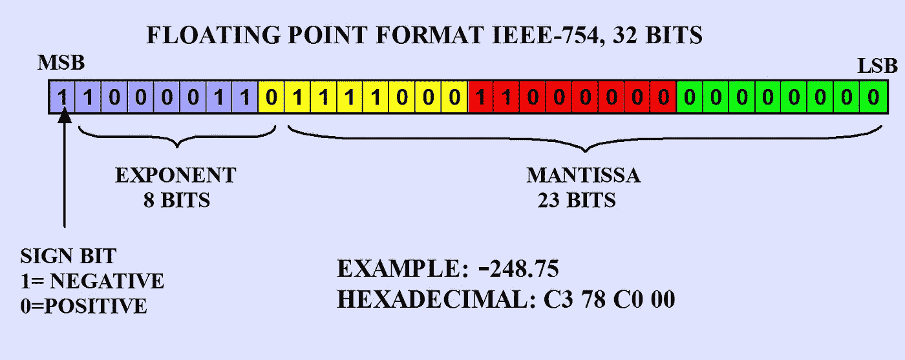

# 为什么你应该小心使用 FAISS

> 原文：<https://medium.com/mlearning-ai/why-you-should-be-careful-using-faiss-c44996eda9ee?source=collection_archive---------3----------------------->


The image was generated using [DALL·E](https://openai.com/dall-e-2/)

AISS(脸书的相似性搜索库)是来自脸书的一个非常有名的库，用于对非常大的数据集进行相似性搜索。由于搜索速度和 GPU 实现的可用性，这个库很有吸引力。

然而，FAISS 的优势并不是本文的主题。你可以在[官方文档](https://github.com/facebookresearch/faiss)或者[这篇惊人的文章](https://towardsdatascience.com/understanding-faiss-619bb6db2d1a)中读到更多。

今天，我想更深入地探讨一下基本 FAISS 指数的原理。当您需要使用*欧几里德距离*进行精确搜索时，该索引非常有用。这种类型的索引不会压缩或聚集你的向量。然而，它有一些特性可能会恶化你的体验。让我们看一个有趣的例子。

> 关于这些向量的一点历史。
> 
> 在我工作的公司，我们有一个项目，我们一直致力于威胁检测和响应。所以最近我试图在已经标记的数据中找到相似的命令行来对不同的事件进行分组。但是，令人惊讶的是，我发现了一件奇怪的事情…

想象一下，我们有两个不同的向量，第一个在索引中，第二个在数组中，我们想和索引中的向量进行比较。

让我们详细解释一下我们的计划:

1.  创建要写入索引的向量数组
2.  创建向量数组以在索引向量中进行搜索
3.  创建 FAISS**index flat 2**
4.  进行搜索并检查我们的结果

## 1.创建要写入索引的向量数组

正如我们之前注意到的，我们有两个不同的向量，其中一个在索引中。让我们声明第一个向量`a`，这里我们应该记住 FAISS 只处理`float32`数据并返回距离的平方。

> 这个数组的前两个元素是两个值的类的数量，用 **LabelEncoder** 编码。剩下的就是从 **fastText** 中获取的字符串(**C:\ Program Files(x86)\ Yandex \ Yandex browser \ Application \ browser . exe**)的嵌入(有剪切，但不影响实验结果)。

仅仅使用`filecmdline`的向量并不重要。我们可以生成我们的`train`数组，然后加入向量`a`。

## 2.创建向量数组以在索引向量中进行搜索

声明第二个向量`b`。

> 这个向量的最后 10 个元素是从 **fastText** 获得的字符串(**c:\ windows \ explorer . exe**)的嵌入。

然后创建一个随机的`test`数组来进行相似性搜索。然后加入我们的向量`b`。

## 3.创建 FAISS**index flat 2**

这里我们创建了索引。我们使用 IndexFlatL2。

## 4.进行搜索并检查我们的结果

最后，搜索并检查我们的矢量`b`的结果。我们想要得到 3 个最近的向量，所以设置`k = 3`。

这里我们得到:

```
The 3 nearest indices for the vector b: [   0  758 7946]
These distances are: [ 0\.       52.73952  52.905334]
```

我们看到最接近的向量是向量`a`(我们首先将它添加到`train`数组中)。但是距离为什么是`0.`？

## 欧几里得距离

让我们使用`scipy`来检查*欧几里德距离*:

```
Euclidean distance between a and b: 0.0019346786430105567
```

> **IndexFlatL2 功能**
> 
> 当数组中有≥ 20 个向量用于搜索时，FAISS 使用另一个公式:d(x，y) = ||x|| + ||y|| — 2xy。
> 
> 你可以找到更多的[信息](https://github.com/facebookresearch/faiss/issues/297)。

让我们来看看:

并且它返回`0.0`。

# 为什么会这样？

先说第一步:`a * a`。它给了我们

```
array([2.5000000e+01, 3.1360000e+03, 9.3236319e-10, 5.1964488e-08,
       1.1749649e-08, 1.1432079e-08, 1.6719305e-07, 7.7145108e-09,
       4.6266206e-07, 1.1049407e-07, 2.8362024e-09, 1.5480767e-08],
      dtype=float32)
```

然后算出`sum()`。这里我们得到以下输出:

```
3161.0
```

现在让我们逐个元素地计算总和:

```
25.0
3161.0
3161.0000000009322
3161.0000000528967
3161.0000000646464
3161.0000000760783
3161.000000243271
3161.0000002509855
3161.0000007136478
3161.000000824142
3161.000000826978
3161.000000842459
```

## Float32

为了找到问题的根源，我们需要记住如何将十进制数转换成浮点数。



Image from the [puntoflotante.net](https://www.puntoflotante.net/FLOATING-POINT-FORMAT-IEEE-754.htm)

我们取第 3 个数`3161.0000000009322`换算成`float32`。

1.  首先，我们需要将整数部分(`3161`)转换成二进制。这里我们会得到`110001011001`。s *ign* 等于`0`，因为数字是正数。在这种情况下，我们需要将小数点向左移动 11 位，使其以单个`1`开始，就像这样:`1.10001011001`。由于左移了 11 位，记录的*指数*等于`11`。 **IEEE 短实数** (32 位)指数存储为偏差为`127`的 8 位无符号整数。所以在这一步，我们需要将`127`加到上一步的归一化指数值上。而这一步的结果应该是`138` ( `11 + 127 = 138`)。将其转换成二进制，我们将得到`10001010`。因此，作为最终结果，我们将拥有`0 10001010 10001011001000000000000`。
2.  在下一步中，我们需要将分数转换成二进制。背后的数学很简单:我们应该继续乘以 2，直到得到一个等于零的小数部分。所以这里我们会得到`00000000000000000000000000000100000000001...`。而且由于我们需要把它加到我们数的整数部分的*尾数*上，我们就得到`1000101100100000000000000000000000000000100000000001...`。我们记得`float32`对于*尾数*只有 23 位。这就是为什么我们需要将它限制为`10001011001000000000000`，这样我们就得到了`3161.0`。

# 我们如何解决这个问题？

你必须记住，FAISS 使用的公式会在添加不同大小的浮点时导致灾难性的抵消。

使用以下方法可以避免这种情况:

*   制作批量< 20

```
The 3 nearest indices for the vector b: [   0 4680 5188]
These distances are: [1.9346786e-03 5.2794106e+01 5.2798298e+01]
```

*   Set 【 equals to number of vectors inside your array + 1

```
The 3 nearest indices for the vector b: [   0 1225 4361]
These distances are: [1.9346786e-03 5.2317425e+01 5.2593662e+01]
```

*   We can also avoid it by using *双精度浮点格式(float64)。*然而，这里我们应该记住 FAISS 只适用于 *float32* 格式。所以我们需要编写自己的索引。
*   看起来，调整公式可能会让我们减少灾难性取消的数量。这里我们使用 *d(x，y) = ||x|| + ||y|| — 2xy* ，但是我们也可以使用 *d(x，y) = ||x — xy||+||y — xy||。让我们试一试并检查输出:*

```
0.0019346786
```

因此，我们看到，通过使用*欧几里德距离*公式，我们得到了相同的结果。

在这里，我们看到这个意想不到的特性在研究过程中给我们带来了许多问题，甚至可能导致我们出错。这就是为什么没有什么比早期测试更好的了:)

如果我忘记了什么，或者你对这篇文章有任何有价值的补充，请考虑在下面添加你的评论。

## 感谢您的阅读！

我希望这篇文章的阅读对你和它的写作对我一样有用。如果你想联系我，请随时添加我的 [LinkedIn](https://www.linkedin.com/in/ekrupenina/) 。

[](/mlearning-ai/mlearning-ai-submission-suggestions-b51e2b130bfb) [## Mlearning.ai 提交建议

### 如何成为 Mlearning.ai 上的作家

medium.com](/mlearning-ai/mlearning-ai-submission-suggestions-b51e2b130bfb)