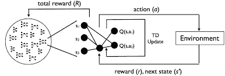
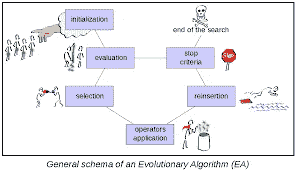
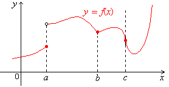
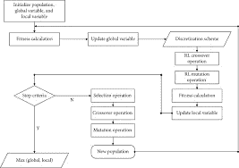
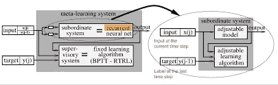
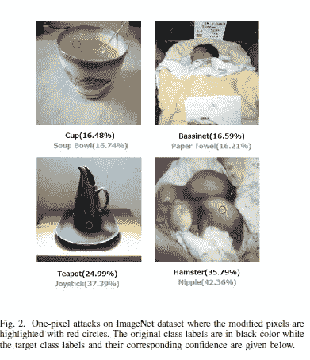
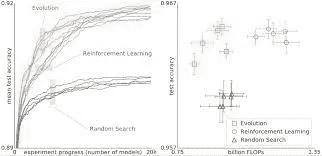

# 为什么你应该在你的机器学习项目中实现进化算法

> 原文：<https://medium.com/mlearning-ai/why-you-should-implement-evolutionary-algorithms-in-your-machine-learning-projects-ee386edb4ecc?source=collection_archive---------3----------------------->

## 进化算法被严重利用不足

为了帮助我了解您[请填写此调查(匿名)](https://forms.gle/7MfQmKhEhyBTMDUD7)

如果你从事机器学习研究，你会遇到各种有趣的目标函数和优化器。它们对你的模范学习行为至关重要。优化器和不同的网络架构都有一个目标:在给定一些输入的情况下，以最佳方式遍历搜索空间。

但是，您经常会遇到很多难以提取/建模领域中的数据特征的情况。在这种情况下，编写有效的机器学习代理来遍历空间将是困难的。然而，这通常是我们可能使用强化学习的地方。RL 可以成为解决许多复杂问题的非常强大的工具。

RL has a lot in common with EAs. They both rely on feedback on the environment to get better. RL learns the good and bad actions, while EAs focus on the good.

然而，RL 带来了它自己的一系列问题。模拟带有一些假设，它可能非常昂贵，并且在多目标优化方面不太好。为了更全面地了解[强化学习，请查看这个视频](https://www.youtube.com/watch?v=_J1Xn8fgUAc&t=36s)。那我们在这里做什么？

# 输入进化算法(ea)

进化算法相对简单。它们是基于生物学的进化过程。它们遵循以下步骤:我们创建一组初始的候选解决方案。这些解决方案被视为个体，并被迭代更新。每一代都是通过随机去除不太理想的解决方案(通常是)在可行的候选方案之间混合而产生的。小的随机变化也可以被添加到一些剩余的“合适的”候选者中。因此，种群将逐渐进化以增加适应度。

这看起来像是简单的试错法。的确如此。但是记住我们有选择的标准，所以我们过滤掉弱解。这种方法与梯度下降和探索搜索空间以减少损失/最大化可能性的其他损失最小化方法非常相似。从这个角度来看，你可以理解为什么广告如此强大。

从多个候选解决方案开始，您可以对搜索空间的更大部分进行采样。当我们在重组和突变中找到合适的解决方案时尤其如此。这应该是没有争议的。然而，有几个好处可能并不明显，我们将在接下来讨论它们。

# 进化算法的卖点

## 范围

Here a,b,c show 3 ways a function can not be differentiable

EAs 的最大好处来自于它们的灵活性。因为他们不计算一点的梯度，所以他们不需要可微函数。这是不容忽视的。对于一个可微的函数，它需要在定义域上的每一点都有导数。这需要一个规则的功能，没有弯曲、间隙等。ea 不关心这些功能的本质。它们可以很好地处理连续和离散函数。因此，进化算法可以(并且已经)用于优化许多现实世界的问题，并产生了惊人的结果。我将在下一节详细阐述这一点。

RL and Genetic Algorithms combined

这种灵活性也给了它们易于集成到其他方法中的优势。你会经常看到 EAs 被用在其中一个循环中。“基于种群的进化优化了元学习目标”这篇论文对感兴趣的人来说是一篇有趣的读物。我将很快对它进行分解，所以请确保您与我保持联系以了解最新情况。

We can use EAs here. Since they are flexible, they will be able to traverse the landscape without issues.

## 表演

Keep in mind that Deep Neural Networks take millions of times more resources.

如果没有稳定的表现，这个系列就没有任何意义。EAs 甚至可以胜过**更昂贵的基于梯度的方法。拿神奇的[一个像素攻击纸](https://arxiv.org/abs/1710.08864)(文章即将推出)。它能够通过**仅改变图像中的一个像素(向左看)来欺骗经过训练对图像进行分类的深度神经网络。**该团队使用差分进化进行优化，因为 DE " *可以攻击更多类型的 dnn(例如，不可微分的网络或梯度计算困难的网络)。”结果不言自明。*在 Kaggle CIFAR-10 数据集上，只需修改三种常见深度神经网络结构上的一个像素就能发起无针对性攻击，成功率分别为 68:71%、71:66%和 63:53%。”****

Google AI Blog, Evolutionary AutoML

谷歌的 AI 博客有一篇文章叫做，“ [AutoML-Zero:学习](http://ai.googleblog.com/2020/07/automl-zero-evolving-code-that-learns.html)的进化代码”使用 EAs 创建 ML 算法。进化方法的结果令人印象深刻，甚至优于强化学习。这是相当可观的。以下是作者的引语，

> “我们提出的方法称为 *AutoML-Zero* ，从空程序开始，仅使用基本的数学运算作为构建模块，应用进化方法来自动找到完整 ML 算法的代码。给定小的图像分类问题，我们的方法重新发现了基本的 ML 技术，例如具有[反向传播](https://en.wikipedia.org/wiki/Backpropagation)、[线性回归](https://en.wikipedia.org/wiki/Linear_regression)等的 2 层神经网络，这些都是研究人员多年来发明的。这一结果证明了自动发现更多新颖的 ML 算法以解决未来更困难问题的合理性。”

From the blog

## 易于引导

进化算法通常很容易编写。一旦你有了足够的领域知识来编写适应性评估和重组/初始化/变异协议，它就变成了一个简单的实现。当你需要一个足够好的解决方案(大多数使用)而你没有足够的资源将输入完全转换成更传统的 ML 兼容的东西时，这可能是好的。

希望这篇文章能让你相信在你的机器学习管道中使用进化算法的一些好处。我发现很多人在他们的管道中忽略了他们，这是一个耻辱，因为他们可能是如此强大。

如果你喜欢这篇文章，看看我的其他内容。我定期在 Medium、YouTube、Twitter 和 Substack 上发帖(所有链接都在下面)。我专注于人工智能、机器学习、技术和软件开发。如果你正在准备编码面试，看看:[编码面试变得简单](https://codinginterviewsmadesimple.substack.com/)。

为一次性支持我的工作，以下是我的 Venmo 和 Paypal。任何数额都值得赞赏，并有很大帮助:

https://account.venmo.com/u/FNU-Devansh

贝宝:[paypal.me/ISeeThings](https://www.paypal.com/paypalme/ISeeThings)

# 向我伸出手

如果那篇文章让你对联系我感兴趣，那么这一部分就是为你准备的。你可以在任何平台上联系我，或者查看我的其他内容。如果你想讨论家教，发短信给我。如果你想支持我的工作，使用我的免费罗宾汉推荐链接。我们都有免费的股票，对你没有风险。**所以不使用它只是损失免费的钱。**

查看我在 Medium 上的其他文章。:[https://rb.gy/zn1aiu](https://rb.gy/oaojch)

我的 YouTube:【https://rb.gy/88iwdd 

在 LinkedIn 上联系我。我们来连线:【https://rb.gy/m5ok2y】T4

我的 insta gram:[https://rb.gy/gmvuy9](https://rb.gy/gmvuy9)

我的推特:[https://twitter.com/Machine01776819](https://twitter.com/Machine01776819)

我的子任务:[https://codinginterviewsmadesimple.substack.com/](https://codinginterviewsmadesimple.substack.com/)

获得罗宾汉的免费股票:[https://join.robinhood.com/fnud75](https://www.youtube.com/redirect?redir_token=QUFFLUhqa0xDdC1jTW9nSU91WXlCSFhEVkJ0emJvN1FaUXxBQ3Jtc0ttWkRObUdfem1DZzIyZElfcXVZNGlVNE1xSUc4aVhSVkxBVGtHMWpmei1lWWVKNzlDUXVJR24ydHBtWG1PSXNaMlBMWDQycnlIVXNMYjJZWjdXcHNZQWNnaFBnQUhCV2dNVERQajFLTTVNMV9NVnA3UQ%3D%3D&q=https%3A%2F%2Fjoin.robinhood.com%2Ffnud75&v=WAYRtSj0ces&event=video_description)

 [## Mlearning.ai 提交建议

### 如何成为 Mlearning.ai 上的作家

medium.com](/mlearning-ai/mlearning-ai-submission-suggestions-b51e2b130bfb)