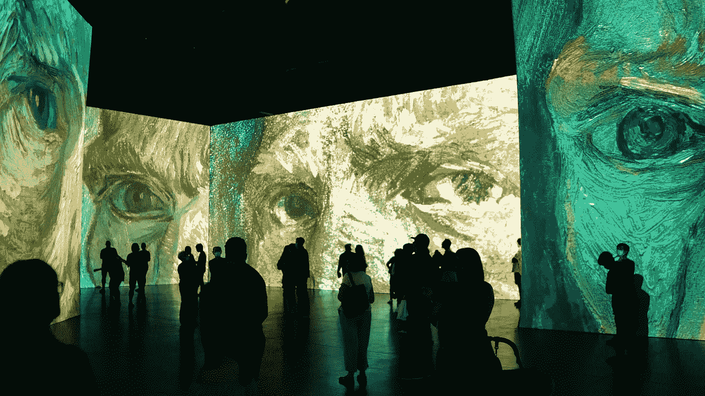

# 为什么你应该开始收集数字艺术

> 原文：<https://medium.com/mlearning-ai/why-you-should-start-collecting-art-21f3d6576796?source=collection_archive---------0----------------------->

## **8 个原因**

Photo by [Redd](https://unsplash.com/@reddalec?utm_source=unsplash&utm_medium=referral&utm_content=creditCopyText) on [Unsplash](https://unsplash.com/s/photos/art-gallery?utm_source=unsplash&utm_medium=referral&utm_content=creditCopyText)

拥有一个自己的画廊可以让你与世界分享你的艺术，并记录下来。你可以展示自己的作品，而不用去其他国家可能没有的画廊。[艺术](/mlearning-ai/is-ai-art-really-art-a363073d62d0)不仅仅局限于数码绘画或艺术品。它也可以是涂鸦、摄影、数字插图和雕塑。[收藏数码](/mlearning-ai/can-ai-replace-artists-378d466f69b8)艺术让你…