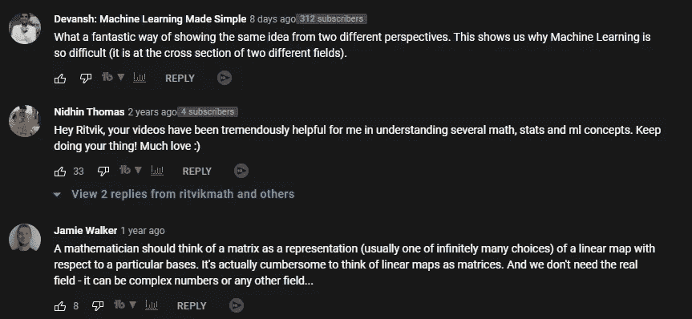
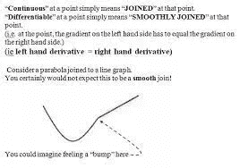
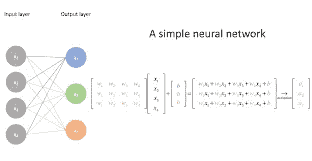
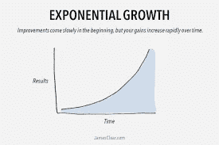

# 为什么你会纠结于机器学习

> 原文：<https://medium.com/mlearning-ai/why-you-will-struggle-with-machine-learning-677403d04c7c?source=collection_archive---------2----------------------->

## 一位杰出的数学天才启发了这篇文章

为了帮助我了解您[请填写此调查(匿名)](https://forms.gle/7MfQmKhEhyBTMDUD7)

在我的空闲时间，我看了很多数学/人工智能视频。这些视频不仅向我介绍了新的概念/实现，还帮助我学习如何更好地交流我的想法和知识。我解释复杂定义和研究的能力很大一部分来自于观看其他出色的老师教授这些想法。如果你关注我的内容，你就会知道我是多么建议你去看 YouTubers 内容创作者来跟上这个行业，并不断地保持在最前沿。

Many people including myself found this video very valuable. Make sure you give ritvikmath some love

我最近看到的一个非常有趣的视频是，“[那么……矩阵到底是什么？:数据科学基础](https://www.youtube.com/watch?v=hEQ6j0eRDtg)”作者 ritvikmath。在那个视频中，他从计算机科学(编码)和数学的角度介绍了矩阵的概念。他继续展示了这些观点中的每一个对于构建和解决问题都是有用的。即使你对这些话题很熟悉，我也建议你看视频。重温基础知识偶尔会带来“啊哈”的时刻，对我来说就是如此。**我明白了为什么这么多人纠结于学习机器学习**。在这篇文章中，我将分享为什么你在学习 ML 时会很挣扎。然后我们将讨论如何克服这一点。因为，即使 ML 很难，你也可以做得很好。

# 为什么人们会纠结于机器学习。

当我浏览社交媒体，寻找有趣的想法/讨论时，我看到了这个。这是一个人在 Twitter 上发布的一条消息，他在试图学习机器学习时感到沮丧。我们会打电话给发件人史蒂文。

Go online and you will see this sentiment very often.

对我来说，这里最突出的是信息的最后部分。史蒂文在苦苦挣扎，一直在用谷歌搜索东西。谷歌机器学习可能特别恶毒。这是因为根据上下文，你对一个概念的应用会发生变化。以史蒂夫的微积分为例。在我日常生活的大部分时间里，我并不真的在 ML 函数中使用它。Keras 和 Tensorflow 为我处理错误传播和错误计算的后端。所以我的微积分知识更有助于我理解论文和优化，而不是在大多数实现中。

然而，偶尔我不得不将情况和变量分布建模为函数。能够检查函数是否光滑和可微是一项有用的技能。这两种技能都要求我精通微积分的不同方面。他们需要从不同的角度看待概念/文献。

Think back to Ritvik’s video. He talks of Matrices through the eyes of both a Computer Science student and a Math student. However, in Machine Learning, you will use them in both ways. Your models will use matrices to compute the results going b/w layers etc. These operations are the more mathematical side of matrices. However, that’s not all. Good use of matrices comes when dealing with relational databases. Remember, most dataframes are loaded as matrices. When operating on these, there are tons of little optimizations you can make to reduce the costs of loading the data onto your system. This requires an understanding of matrices from a Computer Science/Hardware perspective. And it is as much a part of ML as the other bit.

Matrices are both used to store data (sets of vectors) and in the computations (multiplication with weights)

Machine Learning is hard because it requires you to be able to think from different perspectives. You have to be willing to switch from a Math/theoretical perspective to more computer-oriented thinking while approaching the same problem. Add to this the complexities of most modern domains, and you can see why it is a struggle to get into. For a rather extreme example of this, check out, [Paper shows why you will struggle at Machine Learning](/mlearning-ai/paper-shows-why-you-will-struggle-at-machine-learning-a6885fb76d12). In that article, I break down the most complicated paper I’ve read till date. I spent a solid month on that paper, trying to understand the details. The reason I found this paper so challenging was because of how many domains/ideas it covered. It was quite impressive

# How can you learn ML

This is bound to be on your mind right now. It’s not easy to excel in both Math and CS. But fear not, I got you.

There is one thing that will help you do well in Machine Learning: **doing bad machine learning.** You might be confused by this. However, this is really all there is to it.

Photo by [Brett Jordan](https://unsplash.com/@brett_jordan?utm_source=medium&utm_medium=referral) on [Unsplash](https://unsplash.com?utm_source=medium&utm_medium=referral)

You will have to start small and keep at learning. First, you’ll set up your environment and copy a project from MachineLearningMastery. Then you’ll tweak a few hyperparameters. Eventually, you’ll experiment with a few other models/metrics. Now you’ll work on a completely new dataset. You’ll come across weird learning curves/errors which will make you test other kinds of preprocessing. [And finally, you’ll end up conceptualizing and creating your own project, from data collection to model deployment.](https://www.youtube.com/watch?v=O187gv9rwzQ&t=688s&ab_channel=Devansh%3AMachineLearningMadeSimple)

In the beginning, you will struggle and connecting all these ideas will seem like magic. This won’t last.

任何声称他们可以在 3 个月/1 年内让你成为机器学习专家的课程/专家都是骗局。学习 ML 是一生的承诺。人家每年都会推正常，你不跟上就会落后。结果是指数级的。在阅读你的第一篇论文的一年内，你会注意到你浏览文献和在不同观点之间建立联系变得容易多了。

大约 6 年前，我开始了我的机器学习之旅。如果你读了那篇文章，你就会知道我对人工智能的接触是渐进的。我试验过，失败了。我做了很多事情。从 2020 年 6 月开始，我才真正独立做硬核 ML。**我花了 4 年时间才真正开始自己在这个领域做出深刻而有意义的贡献。**

如果你想要 2022 年学习机器学习/AI 的完整路线图，请查看“[2022 年如何学习机器学习](/geekculture/how-to-learn-machine-learning-in-2022-9ef2ea904986)”。它提供了一个成熟的路线图，让你精通 ML。这篇文章链接了大量的免费资源，所以你可以免费学习。记住，罗马不是一天建成的。当你在学习基础知识并着眼于所有复杂的发展时，目标会显得非常遥远。

如果你喜欢这篇文章，看看我的其他内容。我定期在 Medium、YouTube、Twitter 和 Substack 上发帖(所有链接都在下面)。我专注于人工智能、机器学习、技术和软件开发。如果你正在准备编码面试，看看:[编码面试变得简单](https://codinginterviewsmadesimple.substack.com/)，我的每周时事通讯。您可以以每天不到 0.5 美元的价格获得高级版本。高级版将解锁每周编码问题的高质量解决方案、特殊讨论帖子和一个伟大的社区。它帮助了很多人做准备。

如果你也有任何有趣的工作/项目/想法给我，请随时联系我。总是很乐意听你说完。

以下是我的 Venmo 和 Paypal 对我工作的金钱支持。任何数额都值得赞赏，并有很大帮助。捐赠解锁独家内容，如论文分析、特殊代码、咨询和特定辅导:

https://account.venmo.com/u/FNU-Devansh

贝宝:[paypal.me/ISeeThings](https://www.paypal.com/paypalme/ISeeThings)

# 向我伸出手

如果你想讨论家教，发短信给我。查看免费的罗宾汉推荐链接。我们都得到一个免费的股票(你不用放任何钱)，对你没有任何风险。不使用它只是在浪费钱。

查看我在 Medium 上的其他文章。:【https://rb.gy/zn1aiu 

我的 YouTube:【https://rb.gy/88iwdd 

在 LinkedIn 上联系我。我们来连线:[https://rb.gy/m5ok2y](https://rb.gy/f7ltuj)

我的 insta gram:[https://rb.gy/gmvuy9](https://rb.gy/gmvuy9)

我的推特:[https://twitter.com/Machine01776819](https://twitter.com/Machine01776819)

如果你正在准备编码/技术面试:[https://codinginterviewsmadesimple.substack.com/](https://codinginterviewsmadesimple.substack.com/)

获得罗宾汉的免费股票:[https://join.robinhood.com/fnud75](https://www.youtube.com/redirect?redir_token=QUFFLUhqa0xDdC1jTW9nSU91WXlCSFhEVkJ0emJvN1FaUXxBQ3Jtc0ttWkRObUdfem1DZzIyZElfcXVZNGlVNE1xSUc4aVhSVkxBVGtHMWpmei1lWWVKNzlDUXVJR24ydHBtWG1PSXNaMlBMWDQycnlIVXNMYjJZWjdXcHNZQWNnaFBnQUhCV2dNVERQajFLTTVNMV9NVnA3UQ%3D%3D&q=https%3A%2F%2Fjoin.robinhood.com%2Ffnud75&v=WAYRtSj0ces&event=video_description)

 [## Mlearning.ai 提交建议

### 如何成为 Mlearning.ai 上的作家

medium.com](/mlearning-ai/mlearning-ai-submission-suggestions-b51e2b130bfb)