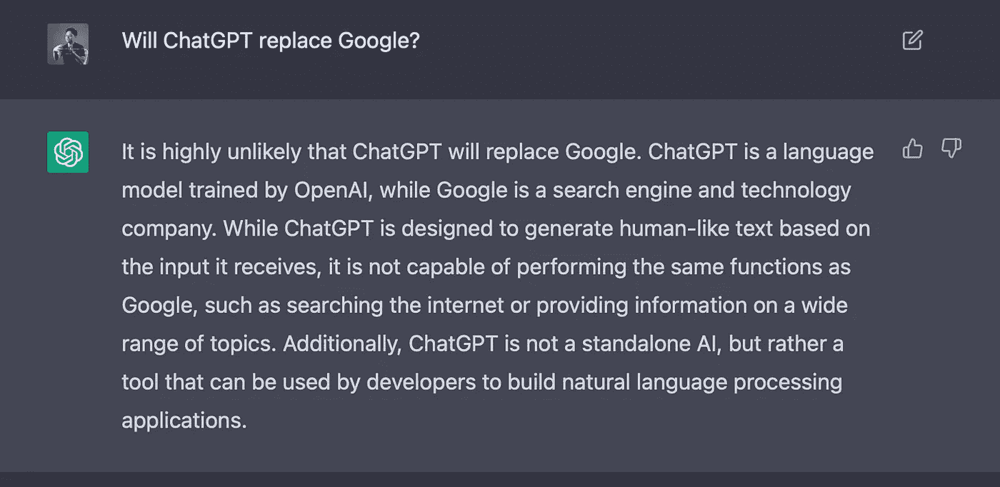

# ChatGPT 会取代或启发谷歌吗？

> 原文：<https://medium.com/mlearning-ai/will-chatgpt-replace-or-inspire-google-62cb8a2c1209?source=collection_archive---------2----------------------->

## ChatGPT 能革新或改造搜索引擎吗？

Photo by [Arthur Osipyan](https://unsplash.com/@arty_nyc?utm_source=medium&utm_medium=referral) on [Unsplash](https://unsplash.com?utm_source=medium&utm_medium=referral)

大多数人可能是在 2016 年从 [DeepMind 的](https://www.deepmind.com) AlphaGo 中了解到 AI 的。从那以后，我们一直期待 AI 能显著改变世界。不幸的是，几年前我们经历了某种人工智能泡沫，并意识到这可能是一个通往[【AGI】](https://en.wikipedia.org/wiki/Artificial_general_intelligence)、强人工智能的漫长旅程。

2022 年是生成式人工智能年。 [OpenAI](https://openai.com) 从 DALL-E2 到现在的 ChatGPT 让我们大吃一惊。ChatGPT 可以对自然语言输入产生智能响应。太惊艳了！它可以回答一般问题，编码，写故事和诗歌，建议行程等。

它看起来类似于谷歌搜索引擎。您可以根据您的搜索词来查找信息。谷歌在互联网上搜索智能内容。ChatGPT 基于大规模学习模型生成智能信息。

谷歌现在是一个超过 1 万亿美元的企业。但是，我们能想象几十年前网页上的搜索功能，而谷歌很可能被收购吗？然而，这个搜索工具彻底改变了所有的网页公司，改变了互联网和世界。

人工智能是未来。它是通向知识和信息的最后一扇门。ChatGPT 或另一个 AGI 工具会是那个小小的谷歌吗？

## 谷歌现在是一个什么样的帝国？

罗马不是一天建成的。谷歌搜索引擎的几个关键特性和优势使其成为全球用户的热门选择。例如:

快速准确的搜索结果:谷歌的搜索引擎以提供快速准确的搜索结果而闻名，用户可以很容易地找到他们想要的信息。

相关性:谷歌的搜索算法旨在为给定的查询提供最相关的结果，使用户更容易找到他们需要的信息。

个性化:谷歌的搜索引擎可以根据用户过去的搜索历史和其他因素来个性化搜索结果，提供更加定制化的体验。

语音搜索:谷歌的搜索引擎允许用户使用语音进行搜索，这使得在旅途中查找信息更加容易。

多语言支持:谷歌的搜索引擎支持多种语言，使其可以在全球范围内使用。

与其他谷歌产品的集成:谷歌的搜索引擎与其他谷歌产品集成，如 Gmail 和 Google Drive，使用户可以轻松地从各种设备上访问他们的信息。

总的来说，谷歌搜索引擎的基础是互联网上最大规模、最全面的信息索引，具有广泛的内置智能。

训练大规模模型来包含谷歌的所有索引信息需要时间。用更准确、更相关和更个性化的功能来调整它们需要时间。它需要时间来建立和扩展基础设施，并提供比谷歌更快的服务。

可能需要几个月，几年，甚至几十年。但似乎唯一的问题是时间。

## ChatGPT 和 Google 的关键区别是什么？

ChatGPT 和谷歌的搜索引擎有几个关键的区别。一个主要的区别是，ChatGPT 是一种语言模型，它使用机器学习来基于给定的输入生成文本，而 Google 是一种用于在互联网上查找信息的搜索引擎。ChatGPT 不能像 Google 那样搜索互联网或提供特定主题的信息。

另一个关键的区别是，ChatGPT 是一个单一的大型语言模型，而谷歌的搜索引擎包含许多不同的技术和算法，它们协同工作，提供相关和准确的搜索结果。

ChatGPT 经过训练，可以根据特定的输入数据集生成文本，而谷歌的搜索引擎旨在处理广泛的查询，并从数十亿网页中提供最相关的结果。

此外，ChatGPT 是一个可以帮助完成特定任务的工具，例如生成文本或回答问题。它不能执行谷歌搜索引擎所能执行的所有功能。

谷歌提供广泛的产品和服务，包括电子邮件、云存储和许多其他服务，而 ChatGPT 只专注于根据给定的输入生成文本。

然而，它们基于根本不同的技术(索引与人工智能)，这是彻底改变前者的关键。其他的都是次要的。那是时间问题。

Photo by [Ash from Modern Afflatus](https://unsplash.com/@modernafflatusphotography?utm_source=medium&utm_medium=referral) on [Unsplash](https://unsplash.com?utm_source=medium&utm_medium=referral)

## 我们能断定 ChatGPT 会取代谷歌吗？

这个问题先问问 Google 和 ChatGPT 吧。谷歌遵循“不作恶”的座右铭，它的搜索结果充满了关于这个问题的各种意见。

ChatGPT 在下面提供了一个预先训练好的答案:

毫无疑问，谷歌是一个成熟的搜索引擎，也是一家提供广泛产品和服务的科技公司，但 ChatGPT 只是一个刚刚推出其研究预览版的语言模型。

ChatGPT 或任何其他语言模型是否会很快取代 Google 值得怀疑。虽然 ChatGPT 可能能够帮助完成特定的任务，但它无法在几年内取代像谷歌这样的大型搜索引擎的功能。

然而，人工智能是知识和信息的最终解决方案。每一个里程碑都让我们激动不已。我们无法想象人工智能在未来会发生什么，会有多快。

Twitter 和 GPT-3 2 花了两年时间才达到 100 万用户。脸书花了 10 个月的时间。副驾驶花了 6 个月。用了 Dall-E 和 Instagram 2.5 个月。但是 ChatGPT 只用了 5 天。

从技术上来说，强人工智能 AGI 将通过全面的信息和生成知识来彻底改变搜索引擎。它将改变世界，极大地改变我们的生活。

但这可能会引发另一个问题。例如，微软必应会取代谷歌吗？我们知道答案。生意是另一回事。资本是另一个关键因素。

谷歌也在积极开发 GPT 和聊天机器人。ChatGPT 应该会启发谷歌。未来的搜索引擎可能主要基于由索引信息辅助的智能模型，但谷歌可能仍是顶级科技公司之一。

 [## 用新的人工智能驱动的微软 Bing 和 Edge 重新发明搜索，你的网络副驾驶

### 让人们能够释放发现的喜悦，感受创造的奇迹，并更好地利用世界知识…

blogs.microsoft.com](https://blogs.microsoft.com/blog/2023/02/07/reinventing-search-with-a-new-ai-powered-microsoft-bing-and-edge-your-copilot-for-the-web/)