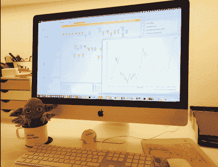

# Will the gold price rise again? -> Time Series Analysis with KNIME and Python

> 原文：<https://medium.com/mlearning-ai/will-the-gold-price-raise-again-time-series-analysis-with-knime-and-python-3f0e271ab7d7?source=collection_archive---------1----------------------->

## Predict the gold price with KNIME and Python by uncovering underlying trends and business cycles with the Hodrick-Prescott filter and by forecasting the trend with RBF Networks

Fig 1: Gold price prediction with KNIME and Python (image by author)