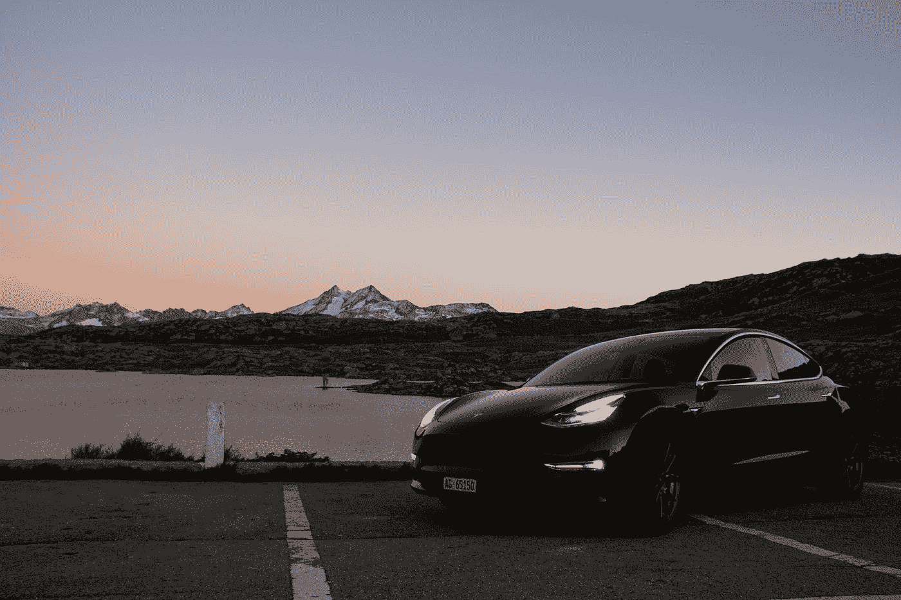
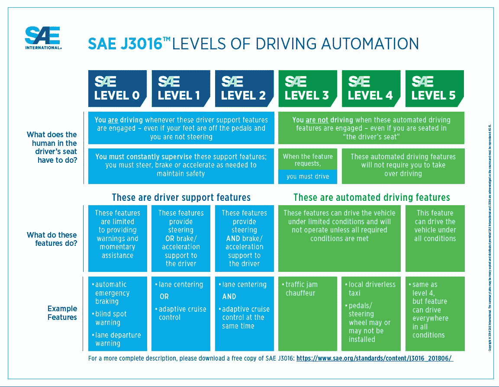
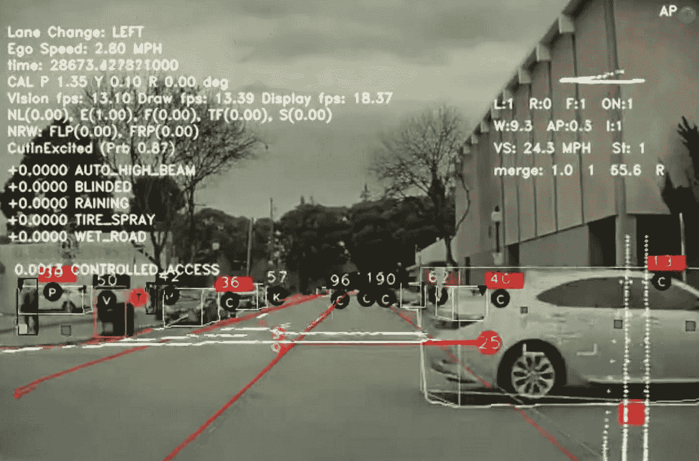

# 我们会达到 5 级自治吗？

> 原文：<https://medium.com/mlearning-ai/will-we-get-to-level-5-autonomy-2b958bfeb16e?source=collection_archive---------1----------------------->

Photo by [Stefan Lehner](https://unsplash.com/@st_lehner?utm_source=medium&utm_medium=referral) on [Unsplash](https://unsplash.com?utm_source=medium&utm_medium=referral)

# 介绍

自动化处于现代世界的前沿。我们喜欢几乎所有事情的自动化，从煮咖啡到股票交易，并且已经成功地将自动化大规模引入新的领域。但在这一切之中，似乎有一项基本而琐碎的任务还没有完全自动化:驾驶。

《卫报》早在 2015 年就预测“到 2020 年，你将永远是后座司机”。然后，在 2016 年，一个商业内幕头条大胆地表示，“到 2020 年，将有 1000 万辆自动驾驶汽车上路”，特斯拉首席执行官埃隆·马斯克(Elon Musk)在推特上说，特斯拉汽车将在 2018 年前实现完全自动驾驶能力，后来又将其改为 2020 年。截至发稿时，现在已经是 2022 年，我们仍然没有收到任何真正自动驾驶汽车的消息。这让我们想到了这个研究项目提出的问题:我们的汽车会实现真正的自主吗？

在回答这个问题之前，我想澄清一下什么是“真正的自主”或“完全自动驾驶”。让汽车自动驾驶是一项复杂的任务，因此汽车工程师协会定义了一个自动驾驶程度的国际标准，以区分真正的自动驾驶和高级驾驶辅助系统(ADAS)。这实际上将自治划分为六个不同的级别，自治能力随着级别的增加而增加:

*   自动化的第一级是 0 级，在这一级，系统几乎没有控制。这个级别存在于今天的大多数车辆中，它们可能只具有基本的驾驶员辅助功能，如紧急制动。
*   1 级自动化稍微高级一些，有可以部分驱动车辆的功能。这些功能通常集中在操作的一个方面，例如在驾驶员处理驾驶所需的其他任务时保持恒定速度(巡航控制)。
*   2 级自动化是指车辆控制加速和转向，被称为高级驾驶辅助系统(ADAS)。这种自动化水平的一个例子是特斯拉的 Autopilot，它允许(也可以要求)随时进行人工干预。这种人为因素意味着 2 级自动化不符合被称为“自动驾驶”的要求
*   第三级自动化是第一种类型的自动化，在这种自动化中，系统比人工更能监控环境。3 级车辆具有“环境检测”能力，可以做出明智的决定，但在紧急情况下仍然需要人工干预。事实上，驾驶员有责任保持警惕并监控道路，以防汽车无法应对特定情况。
*   然而，第 4 级车辆可以在出现问题的情况下自行干预，但仍然为人类提供手动超越系统决定的选项，这意味着车辆不是完全自动驾驶的。请注意，在图 1 中，4 级自治栏中不再有“你必须驾驶”框，这强调了人工超越是可选的，不是必需的。然而，第四级自治有一个缺点，即除非满足某些条件，否则它不能保证有效。
*   最后一级自动化，第 5 级车辆，将完全不需要人类驾驶员的输入。汽车制造商不可避免地朝着这个方向努力，这在以前被称为“真正的自主”或“完全自动驾驶”。第 5 级自动驾驶汽车需要像人类司机一样工作，考虑基于几个因素发生某些事件(如撞车)的概率和不确定性。

我们需要首先考虑为什么我们甚至需要自动驾驶车辆；首先，自动驾驶汽车的社会效益无与伦比；它们将提高我们的机动性、效率和安全性。

图 1 — SAE 的驾驶自动化水平

人们将更自由地在自己的车里完成工作，交通流量将得到更好的优化，安全性也将提高，因为计算机不会疲劳、紧张或喝醉。

自动驾驶汽车提供的这些承诺从根本上推动了所有的研究、投资和宣传。

因此，考虑这个项目提出的基本问题是‘我们会实现第五级自治吗？’是合适的。为了了解自动驾驶汽车的当前和预测进展，我们必须首先了解它们是如何工作的:

# 在后台

乍一看，创造自动驾驶汽车的任务似乎微不足道。GPS 系统已经可以在几秒钟内为我们计算出路线，而“汽车需要做的就是沿着这条路线行驶”。这对我们来说似乎很简单，因为驾驶是人类的日常工作之一。然而，计算两个地方之间的路线和从一个地方到另一个地方是两个非常不同的问题。

当我们专注于汽车在“沿着路径”行驶时需要完成的任务时，驾驶的复杂性变得更加清晰。这些包括留在车道内，检查并避开障碍物，以及识别交通灯/其他路标。虽然这些任务对人类来说是微不足道的，但它们不容易通过计算方法来解决。

为了说明这个问题的难度，让我们考虑让计算机识别手写数字的例子。通过传统的方法，几乎不可能涵盖如何使用简单的 if-then 语句写入 2 的所有边缘情况(即，如果第 8 行和第 4 列的像素是白色的，并且如果第…行的像素，数字是 2)。

为了让计算机识别一个数字，它需要检查许多不同的情况，这是不准确的，并且对于程序员来说，将所有这些情况编码到程序中是相当不方便的。

这种方法也绝对不是人类所做的。我们的大脑搜索记忆中所有我们以前见过的数字，并确定我们正在看的数字是否与我们以前见过的数字完全匹配。

相反，我们只是看着一个数字，即使它是我们以前没有见过的笔迹，我们也能识别它。我们能够做到这一点，是因为我们的大脑由近 1000 亿个神经元组成，这些神经元相互连接，毫不费力地解读我们周围世界的信息。

为了让计算机更有效地做到这一点，我们需要从大自然，更具体地说，从我们的大脑中获取灵感。就像我们大脑中的神经元相互连接并形成复杂的路径一样，我们可以通过使用人工神经网络(ann)在计算机中形成复杂的路径。这些本质上是受生物神经网络启发的数学学习模型。它们允许计算机接受信息，像我们一样学习信息的属性，然后在呈现新信息时识别这些属性。

人工神经网络在计算机视觉中特别有用，通过人工神经网络，计算机可以解释图像数据，并根据这些数据做出决策。分类是计算机视觉的主要任务之一——例如，识别一幅图像是否包含交通灯或停车标志。这曾经是计算机的一项艰巨任务。然而，事实证明，通过使用现代人工智能方法和硬件的进步，这已经以一种计算成本低廉的方式成为可能。与任何其他人工智能任务一样，计算机视觉任务需要大量的训练数据。用于计算机视觉的神经网络可能必须在成千上万张图像的标记数据集上进行训练，才能达到合理的精度。即使这样，他们也可能无法准确地对一些图像进行分类。这就是特斯拉相对于业内其他公司的优势所在:特斯拉自动驾驶车队已经行驶了超过 30 亿英里，这使得他们的算法能够不断自我改进。

相比之下，业内第二大知名品牌 Waymo 仅行驶了约 2000 万英里。这种数据优势最终使特斯拉能够在很大程度上依赖计算机视觉来实现 ADAS。不幸的是，这仍然不足以将它们推高到 2 级自动化以上，然而，根据英国立法，司机必须随时把手放在方向盘上。

需要注意的一件重要事情是，由于今天所有的 AI 应用程序都使用狭义的 AI(专注于一项任务的 AI)，它无法从新的例子中建立概念或应用常识。这意味着，在人类仍然能够准确解决问题的情况下，欺骗人工智能做一些意想不到的事情是可能的。这种情况的一个例子是对抗性扰动，其中图像中一些像素的值被改变，使得图像仍然可以被人类识别。然而，神经网络将图像分类为不同的东西，即停止标志可以被分类为“最大速度 100”标志。如果这些类型的神经网络用于自动驾驶汽车等应用，这将被证明是灾难性的。例如，中国网络安全集团腾讯基恩安全实验室(Tencent Keen Security Lab)通过在道路上放置小方块纸，成功欺骗了特斯拉自动驾驶算法，使其向迎面而来的车辆改变车道。这表明，虽然人工智能似乎在做正确的工作，但重要的是要记住，当面临以前从未见过的情况时，它可能而且不可避免地会失败。完善我们的算法，收集尽可能多的训练数据，将有助于提高我们人工智能的准确性。

无论如何，计算机视觉是自动驾驶汽车在其他传感器的帮助下执行诸如车道寻找、道路弯道估计和交通灯估计等任务的主要技术。在自动驾驶汽车中，计算机视觉有两个用途:

*   检测——这是确定*物体相对于车辆的位置*的过程，这一点至关重要，因为它将允许做出决定，例如车辆何时需要停下来，从而确保乘客和行人的安全。
*   分类——这是利用深度学习来找出*一个物体是什么*的过程(图像识别)。在图像识别中，神经网络是在大数据集上“训练”的，在这种情况下是图像，网络最终“学习”每个图像的抽象表示，并成功识别这些图像代表什么。

图 2——自动驾驶汽车如何使用计算机视觉感知世界

因此，为了在该图像中的对象上绘制边界框，算法必须首先识别哪些相关对象可以从场景的其余部分中分离出来(对象检测)。然后，根据这些物体的位置，将它们分类，并在它们周围画一个边界框。

以待在车道内的任务为例。要做到这一点，汽车必须首先检测并分类道路上的车道线，计算其与车道线中心的偏移，然后执行操作以最小化该偏移。有几个程序用于检测这些车道线，这两个都属于计算机视觉:

● Canny 边缘检测—这种技术将原始图像缩小到只有边缘，留下图像要跟踪的线条的特征图。

●霍夫线变换——这是一个使用图像的负像来提取图像的有价值的轮廓的过程，

在撰写本文时，汽车制造商特斯拉完全依靠计算机视觉和超声波传感器来帮助引导汽车从开始到结束。然而，其他汽车制造商使用传感器融合技术将他们的摄像头输入与其他传感器输入相结合，以更好地了解环境，如 Alphabet 的 Waymo。Waymo 利用了一种称为 LiDAR(光探测和测距)的额外传感方法，该方法将光线从汽车周围反射回来，以生成周围环境的 3D 地图。目前，特斯拉不包括激光雷达的原因是它们太笨重，太昂贵，并且在某些天气条件下不能很好地工作。计算机视觉已经足够先进，可以精确地估计车辆周围物体的速度，因此，除了自适应巡航控制之外，雷达没有任何用处。由于雷达无法探测到停止的物体，也无法进行分类，最合理的决定是拆除雷达传感器。

然后使用“过滤器”将来自这些传感器的数据结合起来。卡尔曼滤波器是最受欢迎的滤波器之一，用于预测其他车辆的最佳速度等无法直接测量的事情。它可以产生车辆周围环境的“最佳估计”。卡尔曼滤波器是一种迭代数学过程，它使用一组方程，并在测量值存在随机误差、不确定性或变化时，采用连续的数据输入来快速估计被测对象的实际值。这就是如何从传感器中去除“噪声”,以获得传感器测量的更准确的值。当组合两个或更多变量时，卡尔曼滤波器变得更加复杂，例如在传感器融合中，来自相机、激光雷达和雷达的数据被组合以绘制车辆周围环境的地图。

定位是车辆在相对于其当前位置的特定地图上的定位过程。据推测，这应该很容易，有 GPS 技术来帮助找到车辆的位置。全球定位系统允许识别车辆的位置，它只能以 2 米的精度进行识别，而 10 厘米的精度是必需的，以避免车辆试图根据其位置的错误假设进行操纵的灾难性情况。在这种情况下，依靠 GPS 技术是不可行的。相反，SLAM(同步定位和测绘)技术被用于允许车辆确定其在道路上的精确位置，误差不超过几厘米。顾名思义，这是一个机器人代理可以同时创建其周围的虚拟地图，并在该地图上定位自己。可以通过使用来自上述计算机视觉算法的车道中心数据的摄像机偏移来改进定位。

还需要控制系统来允许车辆进行正确的运动并保持在其计划的轨迹上。软件中发生的事情不一定会被硬件复制。自动驾驶车辆和所有机器人系统进行的操作通常存在少量的不确定性。改善这一点的唯一方法是通过引入更准确和精确的硬件，并使用反馈回路算法来检查车辆是否在给定的准确度内遵循软件给它的指令。如果不是，则需要采取进一步的措施，车辆控制系统的某些方面(如轮胎、刹车)可能会磨损。与机器人和自动驾驶汽车这方面相关的专业研究被称为控制理论，今天仍在不断研究中。

尽管有这些最先进的算法和控制系统，但不幸的是，有时自动驾驶汽车会导致死亡。此类悲剧的第一个记录实例是自行车手伊莱恩·赫尔茨贝格在亚利桑那州坦佩市的死亡。当时，出租车公司优步正在该地区进行自动驾驶汽车测试，为了安全起见，车上至少有一名人类操作员。该车辆配备了摄像头和激光雷达传感器套件。

赫尔茨贝格大约在晚上 9 点开始过马路，大约在事发前 6 秒，车辆在路边发现了一个不明物体。然而，它被编程为继续以当前速度行驶，直到它识别出道路上的物体。糟糕的照明条件使得计算机视觉更难将赫尔茨贝格识别为行人。最终，算法将她分类为车辆，然后是自行车，对她的预测轨迹没有一致的决定。仅在撞击前 1.3 秒，系统才确定需要紧急制动，这是车辆安全驾驶员的责任。然而，据报道，方向盘后面的安全驾驶员被她的手机分散了注意力，这可以从车内用于监控驾驶员的摄像头画面中看出。

这只是一个无知和糟糕的编程的例子；据 NTSB 称，这辆沃尔沃 XC90 本应配备内部安全系统，但却因紧急制动而失灵，据称是为了“降低车辆行为异常的可能性”。除了在主屏幕上显示无声通知之外，车辆也没有被编程为提醒驾驶员，这在驾驶员分心时没有帮助。这种情况很容易避免，因为激光雷达和雷达传感器套件即使在黑暗的照明条件下也能捕捉到行人。类似这样的事件导致研究和资金被暂停，并给自动驾驶汽车带来了不良的公众形象。

特斯拉的自动驾驶系统同样臭名昭著地卷入了事故。一个例子是沃尔特·黄(Walter Huang)的 Model X 在自动驾驶模式下撞上了混凝土护栏，司机当场死亡。黄之前抱怨说，autopilot 会试图在高速公路的特定部分转向障碍，但在事故发生当天，他的手机分散了他的注意力。这一事件表明，我们不能完全信任我们的技术，我们的车辆还没有完全自主。司机也有责任认识到这一点，并准备应对任何情况。虽然这恰恰是第 5 级自治所反对的，但这种心态对于人的安全和自动驾驶汽车的进一步发展是必要的。

至于技术故障，一种解释可能是雷达和计算机视觉的传感器融合有问题。这也是为什么特斯拉 autopilot 撞上了一辆高架卡车，因为来自计算机视觉和雷达的冲突输入导致 autopilot 将卡车分类为高架标志，允许它将前方的道路解释为可以自由移动，并最终导致汽车撞上卡车。司机没有受伤，但这仍然是一个错误。还有其他自动驾驶仪在卡车下面绘制计划好的轨迹的例子，比如这条推文。Autopilot 也有撞上拖车的例子，比如杰姆尼·班纳的 model 3 车顶脱落，滑出近 500 米，夺走了司机的生命。

然而，值得注意的是，自动驾驶汽车撞车事故比人类驾驶员事故要少得多。例如，特斯拉的自动驾驶仪每行驶 1 亿英里就会发生一起事故，而人类司机则有 2 起。这表明自动驾驶系统比人类驾驶员更好，这也是意料之中的，但这仍然不够；当涉及到这些系统时，作为人类，我们对这些系统可能存在的错误是零容忍的。该软件必须最大限度地降低危及生命的死亡风险，并通过考虑任何给定决定可能导致的死亡人数来权衡各种情况，墨菲定律总是会发挥作用——“如果它能失败，它就会失败”。

然而，这些悲剧和罕见的情况也引起了伦理困境，如电车问题；如果车辆遇到这种情况，无论它做出什么决定，都肯定会发生死亡事故，该怎么办？这种情况的一个例子是车辆的四周被其他车辆包围:一辆卡车在它的前面，一辆家庭 SUV 在它的右边，一个没有头盔的摩托车手在它的左边，一辆跑车就在它的后面。如果卡车突然刹车，汽车可能会追尾卡车，并可能杀死司机，或者它可能会撞上任何一侧的车辆，或者它可能会追尾自己。它撞上摩托车手是为了惩罚他们没戴头盔吗？还是会撞上 SUV，因为 SUV 的碰撞率更高？如果因为家用 SUV 里有小孩而撞上了摩托车手怎么办？这些决定将需要由机载道德调控算法作出。目前还没有 ADAS 系统具备这种功能，因为这是一个极具争议的话题。或许，一个国际公认的道德调控算法标准会有所帮助。再一次，这将是非常难以实现的，但是这将是实现我们 5 级自治目标的必要一步。

另一个可以帮助我们实现目标的概念可能是可解释的人工智能；目前的人工智能没有解释为什么它会做出特定的决定，因为神经网络只是数学模型，并没有在其中编码任何直觉或意识。可解释的人工智能解决了这个问题，它首先向人类解释为什么人工智能会做出决定。这将极大地帮助工程师解决错误和解决任何问题，最终使我们的系统更加准确。

然而，可解释的人工智能还有很长的路要走。随着现代人工智能的进步，我们才刚刚开始在更抽象的层面上理解我们的神经网络做什么。

由于所有这些悲惨的事故和伦理困境，自动驾驶汽车的未来似乎很黯淡。我们的算法似乎太天真，无法处理人类司机可能轻松处理的情况。当考虑到以前没有测试过自动驾驶汽车的地方，如没有严格遵守道路规则的国家，这一点得到了加强。例如，自动驾驶算法如何解释这种道路场景？最有可能的情况是，自动驾驶车辆要么行驶非常缓慢，要么根本不行驶，当出现这种场景时，会请求人类超越。如果我们的算法要达到更高的自主水平，它们最终需要克服像这样的新情况。

虽然很难说自动驾驶汽车的未来会怎样，但有一点是肯定的；收集的数据越多，我们的算法就越好。随着该行业公司之间良性竞争的增加，我们的自动驾驶算法似乎将会改进。立法的变化可能会看到更多的自动驾驶汽车上路，并可能为道德监管算法制定一个国际公认的标准。

回答这个问题:我们将达到第 5 级自治，但在此之前，我们需要人工智能算法取得重大进展，以允许它们处理所有边缘情况。也有必要推动立法，支持使用自动驾驶汽车，并让公众相信乘坐自动驾驶汽车是安全的，特别是通过防止碰撞和保持所用算法的透明度。通往 5 级自治的旅程现在完全掌握在人工智能进步、公众观点和立法的手中。

自动驾驶汽车是值得期待的，我们总有一天会体验到。

参考资料:

1.  t .亚当斯(2015 年)。自动驾驶汽车:从 2020 年起，你将成为永久的后座司机。卫报。可在:
2.  商业内幕。(2016).到 2020 年，将有 1000 万辆自动驾驶汽车上路。可用时间:
3.  美国汽车工程师学会国际标准(2021)。 *SAE J3016* 。地点:【https://www.sae.org/standards/content/j3016_202104/ 
4.  美国汽车工程师学会国际分会(2019)。 *SAE J3016 自动驾驶图形*。*sae.org*。可从以下网址获得:[https://www . SAE . org/news/2019/01/SAE-updates-j 3016-automated-driving-graphic](https://www.sae.org/news/2019/01/sae-updates-j3016-automated-driving-graphic)
5.  弗里德曼，L. (2019)。*自动驾驶汽车:最新技术水平(2019)* 。[www.youtube.com 在线。](http://www.youtube.com.)可在:[https://www.youtube.com/watch?v=sRxaMDDMWQQ](https://www.youtube.com/watch?v=sRxaMDDMWQQ)
6.  国际商业机器公司。*神经网络*。 *IBM* 。可在:[https://www.ibm.com/cloud/learn/neural-networks](https://www.ibm.com/cloud/learn/neural-networks)
7.  弗里德曼博士(2020 年)。特斯拉汽车交付和自动驾驶里程统计 Lex Fridman。[在线]莱克斯·弗里德曼。可在:[https://lexfridman.com/tesla-autopilot-miles-and-vehicles/](https://lexfridman.com/tesla-autopilot-miles-and-vehicles/)买到。
8.  Waymo LLC (2021)。 *Waymo 安全报告*。[在线] *Waymo 白皮书*，Waymo，第 4 页。可从以下网址获得:[https://storage . Google APIs . com/Waymo-uploads/files/documents/safety/2021-03-Waymo-safety-report . pdf .](https://storage.googleapis.com/waymo-uploads/files/documents/safety/2021-03-waymo-safety-report.pdf.)
9.  腾讯敏锐安全实验室(2019)。*特斯拉 Autopilot 的实验安全性研究*。【技术研究论文】见:[https://keen lab . Tencent . com/en/whites/Experimental _ Security _ Research _ of _ Tesla _ auto pilot . pdf](https://keenlab.tencent.com/en/whitepapers/Experimental_Security_Research_of_Tesla_Autopilot.pdf)

 [## Mlearning.ai 提交建议

### 如何成为 Mlearning.ai 上的作家

medium.com](/mlearning-ai/mlearning-ai-submission-suggestions-b51e2b130bfb)