# 葡萄酒质量预测

> 原文：<https://medium.com/mlearning-ai/wine-quality-prediction-6da930eb6ba1?source=collection_archive---------4----------------------->


photo by [Armands Brants](https://unsplash.com/@winephotos) on Unsplash

# 导入所需的模块

```
from sklearn.preprocessing import StandardScaler
from sklearn.model_selection import train_test_split
from sklearn.ensemble import RandomForestClassifier
from sklearn.neighbors import KNeighborsClassifier
from sklearn.tree import DecisionTreeClassifier 
from sklearn.metrics import accuracy_score
from sklearn.naive_bayes import GaussianNB
import matplotlib.pyplot as plt
from sklearn.svm import SVC
import pandas as pd
import numpy as np
```

# 正在加载数据集

```
df = pd.read_csv(“datasets/winequality-red.csv”)
```

# 了解数据集

```
df.head()
```

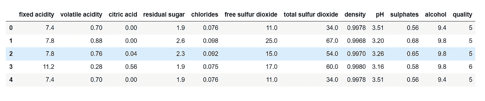

```
df.info()
```

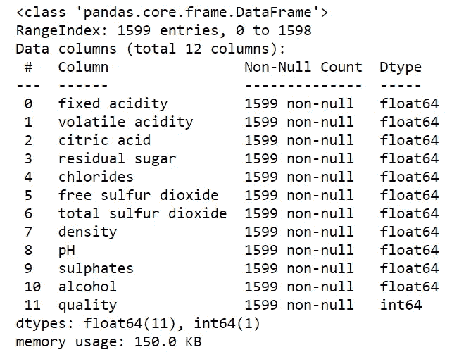

# 形象化

```
plt.bar(‘quality’,’fixed acidity’,data = df)
```

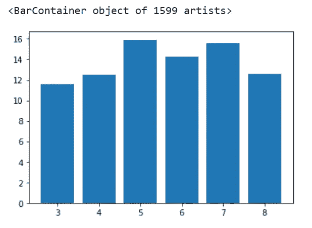

```
plt.bar(‘quality’,’volatile acidity’,data = df)
```

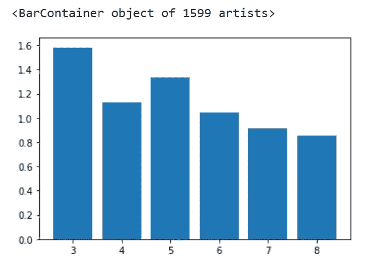

```
plt.bar('quality','citric acid',data = df)
```

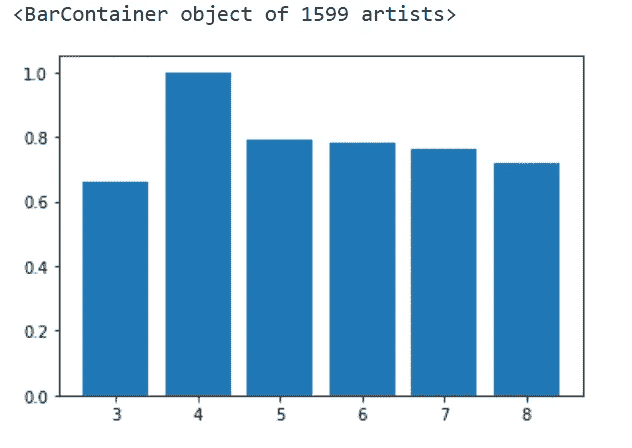

```
plt.bar('quality','residual sugar',data = df)
```

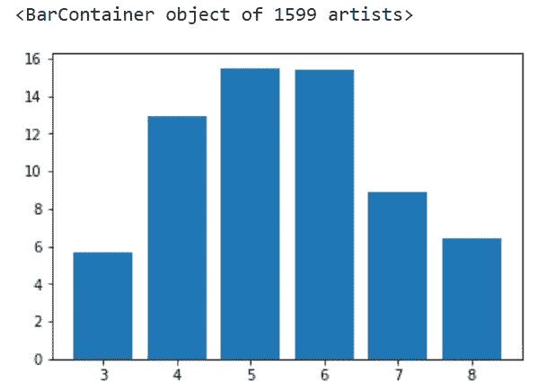

```
plt.bar('quality','chlorides',data = df)
```

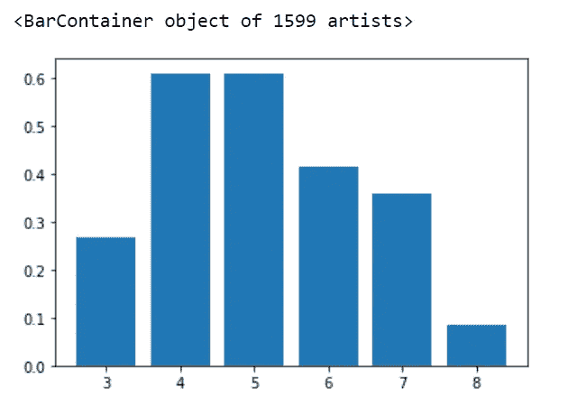

```
plt.bar('quality','free sulfur dioxide',data = df)
```

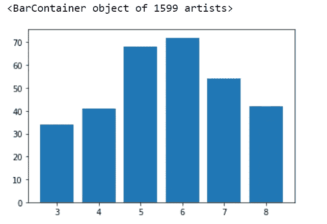

```
plt.bar('quality','total sulfur dioxide',data = df)
```


```
plt.scatter('quality','density',data = df)
```

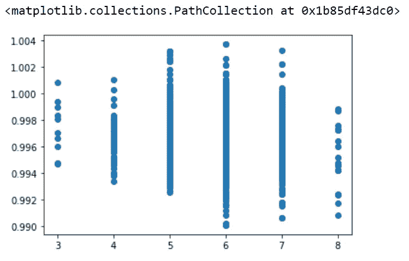

```
plt.bar('quality','pH',data = df)
```

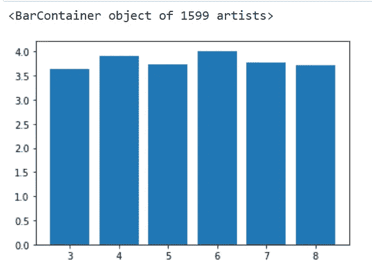

```
plt.bar('quality','sulphates',data = df)
```

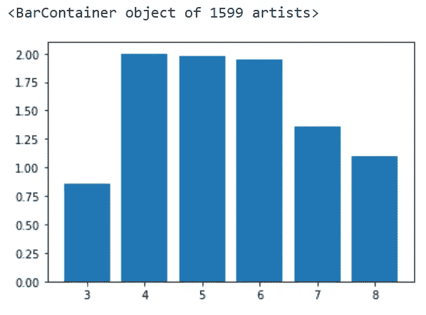

```
plt.bar('quality','alcohol',data = df)
```

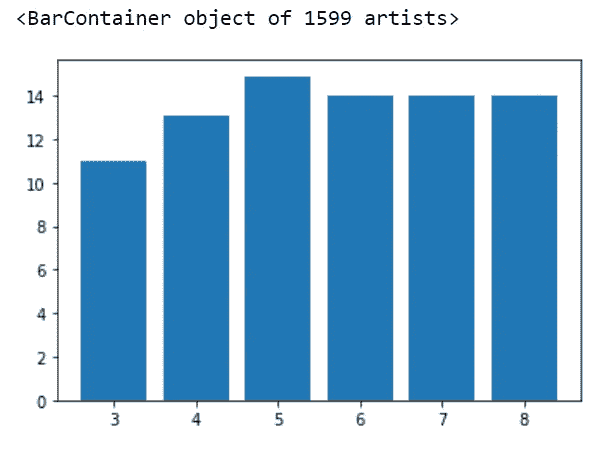

```
plt.plot(df["quality"])
```

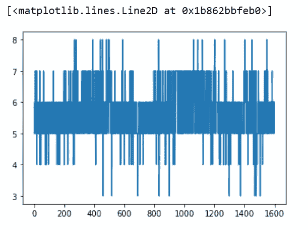

# 将葡萄酒质量分为好坏

```
#bins will set the limits for the classification.
bins = (3, 6, 8) #qualities ranging from 3–6 are classified as bad and 6–8 as good
group_names = [‘bad’, ‘good’]
df[“quality”] = pd.cut(df[“quality”], bins = bins, labels = group_names)
df["quality"].head()
```

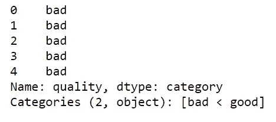

```
#one hot-encoding
df[“quality”] = pd.get_dummies(df[“quality”],drop_first=True)
df[“quality”][:5]
```

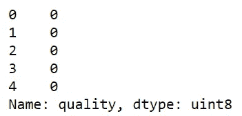

```
df[“quality”].value_counts()
```

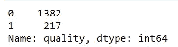

# 将数据集分离为目标变量和特征变量

```
X = df.drop(“quality”, axis = 1)
y = df[‘quality’]
X.head()
```


```
y.head()
```

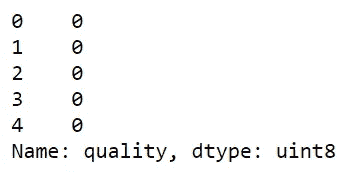

# 将数据集拆分为训练和测试数据

```
X_train, X_test, y_train, y_test = train_test_split(X, y, test_size = 0.2, random_state = 42)
```

将 y_train 转换为一维

```
y_train = np.ravel(y_train)
y_train
```

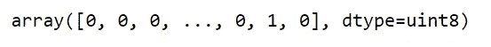

应用标准缩放以获得优化结果

```
sc = StandardScaler()
X_train = sc.fit_transform(X_train)
X_test = sc.fit_transform(X_test)
```

# 创建模型

```
models = [ 'DecisionTreeClassifier', 'Support Vector Machine', 'GaussianNaiveBayes', 'KNeighborsClassifier', 'RandomForestClassifier']
accuracy_score_list = []
```

# 决策树分类器

```
dtc = DecisionTreeClassifier()
dtc.fit(X_train, y_train)
pred_dtc = dtc.predict(X_test)acc = accuracy_score(y_test, pred_dtc)
accuracy_score_list.append(acc)
print(acc)
```

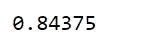

# 支持向量机

```
svm = SVC()
svm.fit(X_train, y_train)
pred_svm = svm.predict(X_test)acc = accuracy_score(y_test, pred_svm)
accuracy_score_list.append(acc)
print(acc)
```

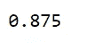

# 高斯贝叶斯

```
gnb = GaussianNB()
gnb.fit(X_train, y_train)
pred_gnb = gnb.predict(X_test)acc = accuracy_score(y_test, pred_gnb)
accuracy_score_list.append(acc)
print(acc)
```

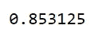

# 近邻分类器

```
knn = KNeighborsClassifier(n_neighbors=22)
knn.fit(X_train, y_train)
pred_knn = knn.predict(X_test)acc = accuracy_score(y_test, pred_knn)
accuracy_score_list.append(acc)
print(acc)
```

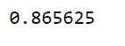

# 随机森林分类器

```
rfc = RandomForestClassifier()
rfc.fit(X_train, y_train)
pred_rfc = rfc.predict(X_test)acc = accuracy_score(y_test, pred_rfc)
accuracy_score_list.append(acc)
print(acc)
```

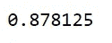

```
compare = pd.DataFrame({'Algorithms' : models , 'accuracy_score' : accuracy_score_list})
compare.sort_values(by='accuracy_score' ,ascending=False)
```

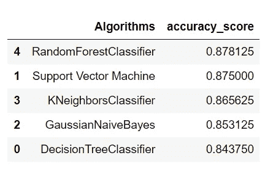

```
plt.plot(compare['Algorithms'], compare['accuracy_score'], label = "accuracy_score")
```

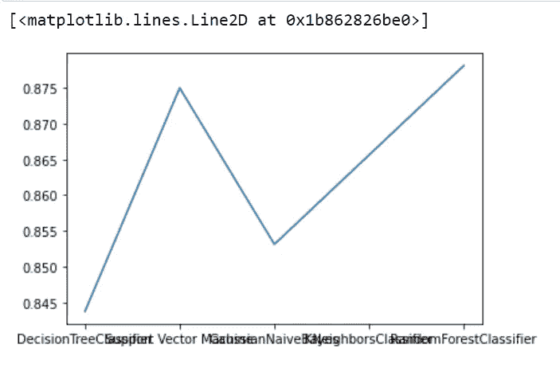

# 使用随机森林分类器的最大准确度是 87%