# Power BI 中的词云可视化

> 原文：<https://medium.com/mlearning-ai/word-cloud-visualization-in-power-bi-a993dc4afb77?source=collection_archive---------2----------------------->

# 认识一个词云

ord cloud 是一种可视化文本数据的优雅方式。数据中出现的单词越多，单词云中这些单词的大小就越大。

一个词云可以用丰富多彩的方式有效地传达重要信息。

有几种方法可以创建单词云，如单词云生成器网站、Python/R 编程和可视化工具。在这些方法中，我认为 Power BI 对于表格数据是最方便的，因为它可以在短时间内创建一个单词云，而无需编码。而且 Power BI 创建的一个词云，很容易调整，也很容易与表格中的其他数据进行交互。

# 步骤摘要

1.  检索数据
2.  下载 WordCloud visual
3.  创建单词云
4.  调整词云

# 1.检索数据

从[https://www . ka ggle . com/datasets/datatattle/新冠肺炎-NLP-text-class ification/download](https://www.kaggle.com/datasets/datatattle/covid-19-nlp-text-classification/download)下载数据

这是新冠肺炎·疫情时期的推特数据。

打开电源 BI。单击主页选项卡，选择获取数据，然后选择文本/CSV。

> 主页选项卡>获取数据>文本/CSV

然后，选择下载的。csv 文件并加载数据。

# 2.下载 WordCloud visual

在右侧的可视化平原，点击 3 点，并选择“获得更多的视觉效果”

> V 可视化普通> 3 点>“获得更多视觉效果”

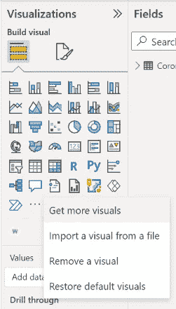

这将打开视觉市场。使用右侧的搜索区域搜索 Word Cloud。点击单词云产品(请确保与下图相同。然后，单击添加。

> 搜索词云>点击词云>添加

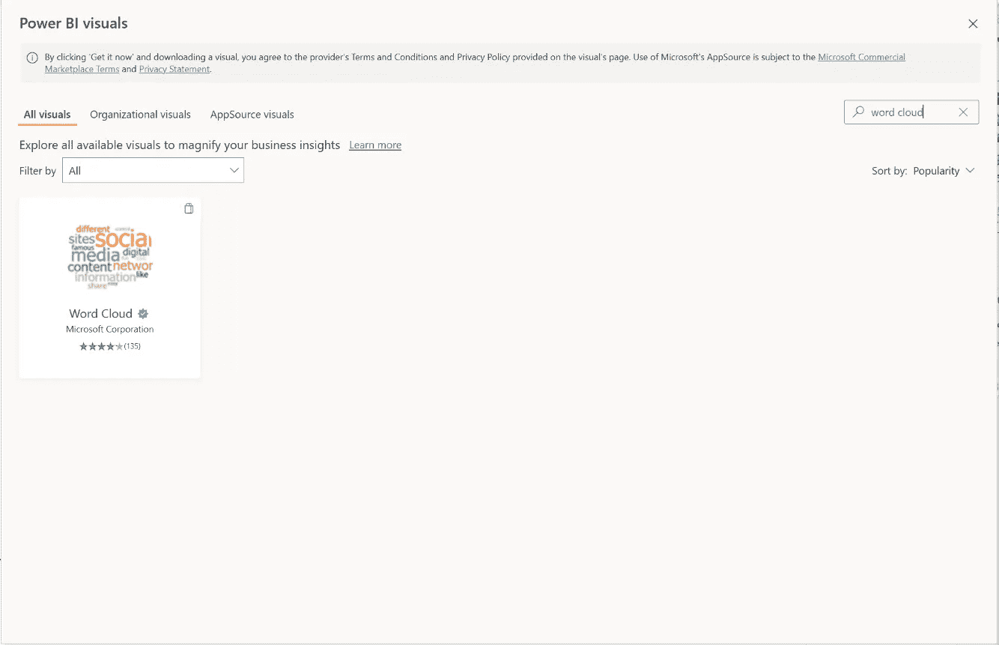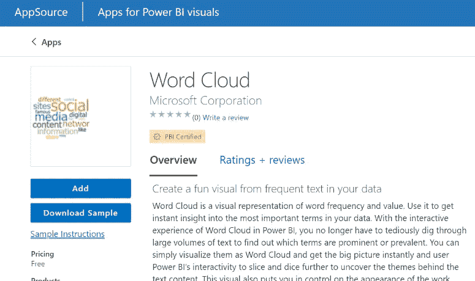

现在，你会在可视化效果中看到 WordCloud 图标。

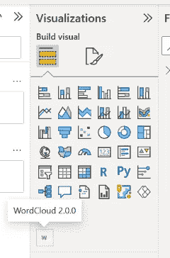

# 3.创建单词云

点击可视化效果中的单词云图标。

您将看到一个空的可视化。

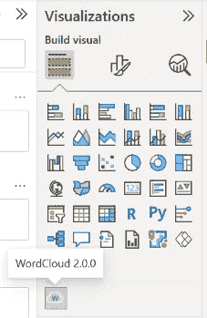

Empty visualization

在右侧的字段 plain 中，选择要在其中创建单词云的文本列(在本例中为 OriginalTweet)。

❗确保在选择列之前已经选择了空可视化。

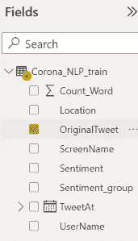

这个栏目的词云就创建好了。

> 点击 WordCloud 图标>选择一个文本栏

# 4.调整词云

*   通过拖动角度或边来扩展单词云。

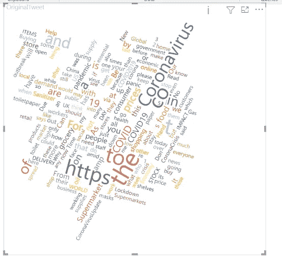

*   排除停用词。

> 可视化效果普通>停用字词打开>默认停用字词打开

停用词是一组常用词，如 to、for 和 as。我们通常会删除停用词，以便清楚地看到数据中的重要词。

你可以通过选择一个词云来实现。然后，在可视化平原，点击格式化你的视觉图标。将停用字词打开，切换停用字词，并将默认停用字词打开。

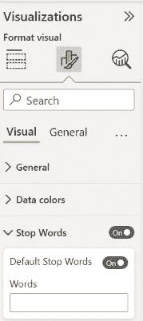

您甚至可以通过在“停用字词”下的“字词”框中键入来添加停用字词。比如我想把‘https’和‘around’从单词 cloud 中排除。使用空格排除多个单词。

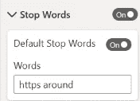

*   减少显示的单词

> 可视化效果普通>常规>减少最大字数

如果单词云看起来过于密集，您可以减少显示的单词数量。

在可视化效果平面中，切换常规选项卡并减少最大字数。在这个例子中，我将其从 200 减少到 100。

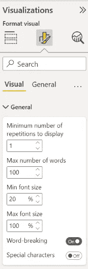

*   不旋转单词

> 可视化效果普通>关闭旋转文本

通过不旋转单词云中的单词，可视化将看起来更加正式和可读。

在可视化效果平面中，关闭旋转文本。

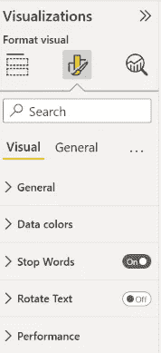

如您所见，从 Power BI 创建单词云非常简单。

如果你喜欢这篇文章，请鼓掌关注我更多关于数据科学的文章。

 [## Mlearning.ai 提交建议

### 如何成为 Mlearning.ai 上的作家

medium.com](/mlearning-ai/mlearning-ai-submission-suggestions-b51e2b130bfb)