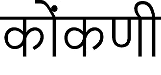
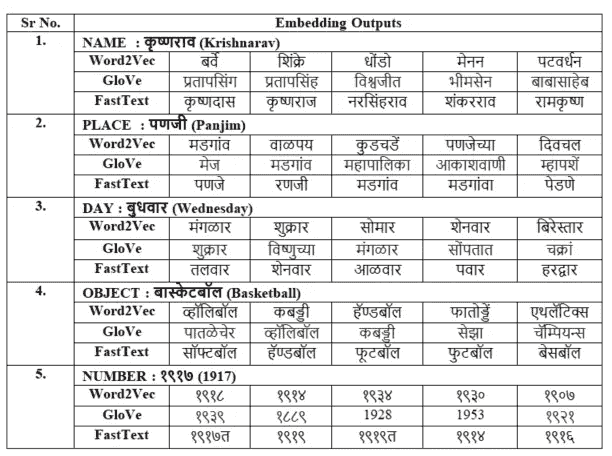
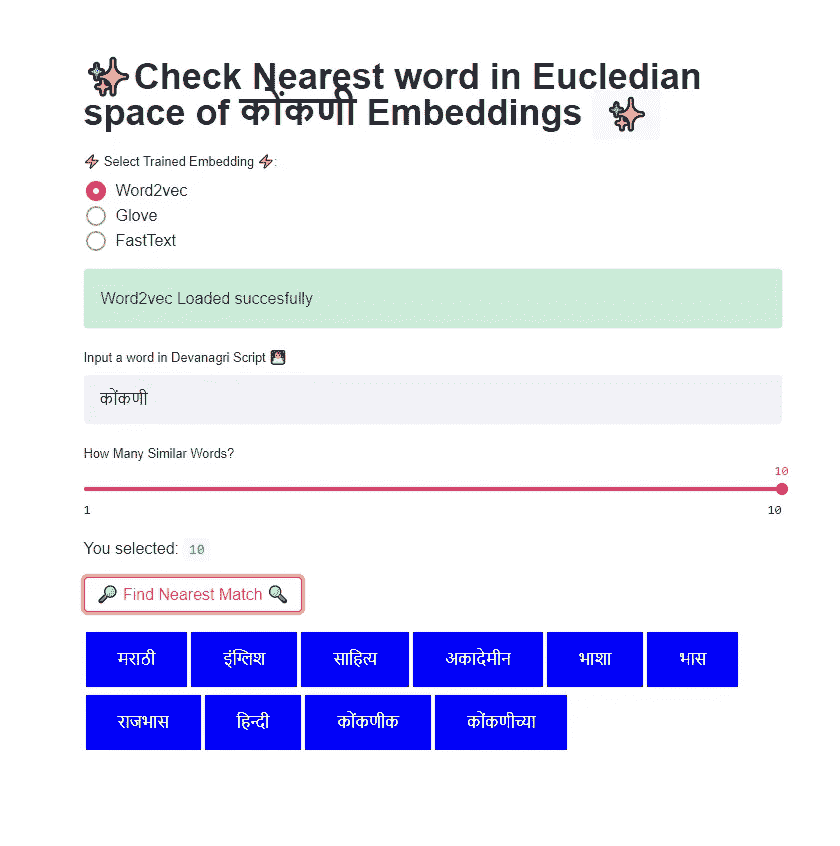

# 资源匮乏的果阿孔卡语的单词嵌入模型:NLP

> 原文：<https://medium.com/mlearning-ai/word-embedding-models-for-low-resourced-goan-konkani-language-nlp-c1ac452e86a?source=collection_archive---------5----------------------->

Image by Author (Satrem Waterfall)

*这篇博文参考了我提交的由* ***CIE IIIT 海德拉巴*** *举办的****NLP HACK 2021****。黑客马拉松的主题是研究* ***印度语言*** *。尽管在 AI/ML & NLP 领域取得了如此多的进步，但在资源匮乏的印度语言方面却几乎没有什么进展。Konkani 是一种不采用基于 AI/ML 的 NLP 技术的语言。作为一名果阿人，我决定研究果阿的母语。* ***我能够训练 3 个单词嵌入&开发一个基于 Streamlit 的应用程序。详情请跟随。***

# **康卡尼简介**

GOA🏖️是印度最小的邦。它不仅是印度，也是全球最受欢迎的旅游目的地。🌴果阿以其美丽的海滩、寺庙、教堂、古老的建筑结构、富饶的腹地而闻名，还有不可忘记的——腰果和菲尼🍹*。*

[***康卡尼语***](https://en.m.wikipedia.org/wiki/Konkani_language) 是果阿邦的官方语言*🌴*。康卡尼语有许多方言，根据人口统计和宗教信仰而有所不同。

康卡尼语可以用梵文、罗马文、卡纳达文、马拉雅拉姆文和波斯阿拉伯文书写。然而， ***梵文*** *才是正式的书写文字。*

> 由于缺乏数字格式的文本，康卡尼语被认为是资源匮乏的语言。我也没有发现任何预训练的 Konkani 嵌入。💡💭

> 我已经为 Konkani 语言从头开始训练了 3 个不同的单词嵌入模型，并提供了演示如何使用这些模型的代码片段。还开发了一个 streamlit 应用程序。

# 单词嵌入

单词嵌入是对文本的学习表示，其中具有相同含义的单词具有相似的表示。 ***查看我的文章了解更多详情:*** [单词嵌入:NLP 中的新时代文本矢量化](https://saurabhk30.medium.com/word-embedding-new-age-text-vectorization-in-nlp-3a2db1db2f5b)。对于任何像神经机器翻译这样的下游 NLP 任务，信息检索& others 单词嵌入是它的核心。

*对于小数据集，训练基于 BERT 的模型不是一个选项，因为这会导致稀疏向量表示。我训练的 word2vec，Glove，FastText 型号:*

# Word2Vec

Word2Vec 使用浅层神经网络生成嵌入，在低维特征空间中高效存储高质量嵌入(Mikolov，t .等人，2013)。它是由谷歌开发的，并被证明是最先进的任务，如单词类比和单词相似性。Word2Vec 可以使用两种不同的方法进行训练，即*连续单词包(CBOW):和 Skip-gram。*我用 **CBOW** 来训练嵌入。*给定上下文单词，预测目标单词。*

# GloVe(单词表示的全局向量)

GloVe (Pennington，J. et al.2014)结合了局部上下文窗口和全局矩阵分解两种方法，以无监督的方式为给定的词汇训练单词嵌入。手套捕获全局计数统计共现矩阵。GloVe 无法为字典/词汇表中没有的单词提供任何矢量表示。我训练手套模特的时间比其他两个模特都长。

# 快速文本

FastText (Bojanowski，P. et al. 2017)通过额外研究 n-gram 字符嵌入，用子词知识丰富了词嵌入。FastText 是字符级嵌入。然后，一个单词被表示为其相关联的 n 元字符嵌入的总和。在实践中，未知单词的表示是通过添加其组成字符的 3-6 个字母的嵌入来获得的。与 word2vec 和 GloVe 不同，它可以为词汇表之外的单词生成嵌入。

*可以以此为参考开发自己的酷炫 NLP 项目* ***。*** *训练好的模型文件都可以在这里下载***。**

# *估价*

*为了检查训练的模型，从 3 个嵌入中的每一个提取单词的向量表示，并提取向量空间中最相似的表示。这里，考虑属于每个更广泛类别的随机单词集，如名称、地点、星期几、对象、数值。*

> *所有这些模型都是上下文无关的，也就是说，它将不同的词义组合成每个单词的一个向量。经过训练的嵌入具有 200 个向量维数。*

**

*Word Vector Extracted from Euclidian Space*

# *推理*

*   *手套模型不一定更好地利用全局共现矩阵；GloVe 似乎没有 Word2Vec 和 FastText 那么有代表性。*
*   *此外，FastText 是字符级的单词，嵌入了返回的结果，这是因为 FastText 将每个字符视为最小单位；不像 Word2Vec 和 GloVe 那样认为 Word 是最小单位。次要字符级别的替换确实改变了词根的意思，它是*梵文*脚本的干扰。*
*   *这些单词嵌入将作为文本分类、文档摘要和其他下游 NLP 任务的基础资源。*

> *尽管聚类本身不是评估/判断的唯一参数；然而，Word2Vec 始终给出最接近和合理的聚类。*

# *演示*

**

****Find link to the*** [***code***](https://github.com/GladiatorX/Konkani-Embeddings) ***Streamlit*** [***app***](https://www.youtube.com/watch?v=1maOt8B4H2c)*

# ***未来工作***

*   *Konkani 社区应该更加专注于为机器翻译系统、情感分析、文档分类、语音转文本等创建和开发有管理的标注数据集。*

# *参考*

*Mikolov，Chen，k .，Corrado，g .，Dean，J. (2013 年)。向量空间中单词表示的有效估计。学习表征研讨会(ICLR)国际会议记录，美国亚利桑那州，第 1301–3781 页..【https://arxiv.org/pdf/1301.3781.pdf 号*

*Pennington、r . Socher 和 c . Manning(2014 年)。Glove:单词表示的全局向量。2014 年自然语言处理经验方法会议录(EMNLP)。【https://doi.org/10.3115/v1/d14-1162 *

*Bojanowski，p .，Grave，e .，Joulin，a .，& Mikolov，T. (2017 年)。用子词信息丰富词向量。计算语言学协会汇刊，5，135–146。[https://doi.org/10.1162/tacl_a_00051](https://doi.org/10.1162/tacl_a_00051)*