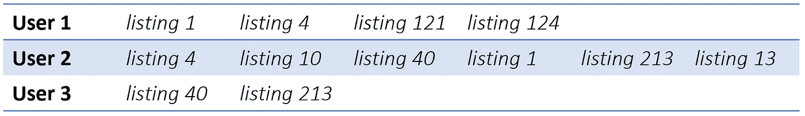
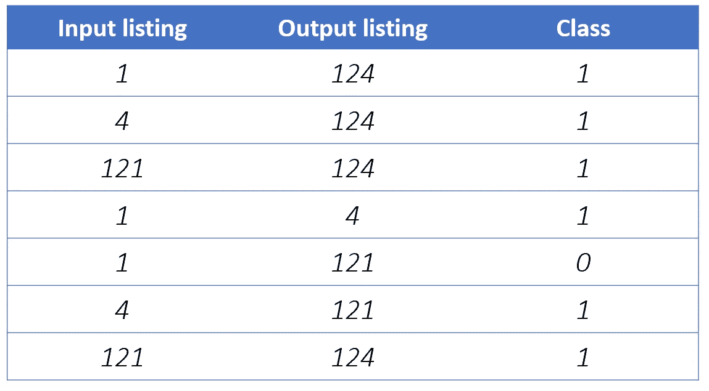

# 单词嵌入:组织如何使用它们来构建推荐系统？

> 原文：<https://medium.com/mlearning-ai/word-embeddings-how-do-organizations-use-them-for-building-recommendation-systems-e0341cf5e638?source=collection_archive---------2----------------------->

推荐系统对于我们今天使用的几乎所有应用程序都是至关重要的。有了大数据，我们有了大量的选择，并且越来越需要构建系统来帮助我们筛选和优先考虑我们的选择。这些系统也给我们一种个性化内容和服务的感觉。

Picture credit: [Blog](/@hari4om/word-embedding-d816f643140) on Word Embedding: Basics

现在，单词嵌入指的是单词在低维空间的分布式表示。单词嵌入使机器更容易理解文本。有各种算法用于将文本转换成单词嵌入向量，例如，Word2Vec、GloVe、WordRank、fastText 等。所有这些算法给出了不同的单词向量表示，但是它们可以直接输入到 NLP 模型中。这些[算法的用法](https://www.youtube.com/watch?v=7530Tn2J0Mc)取决于我们想要执行的任务类型，例如，如果我们想要执行单词相似性任务，并且我们想要输出可互换的单词，那么应该使用 Word2Vec，否则如果我们想要输出与特定单词相关的属性，那么我们应该使用 WordRank。

单词嵌入是任何任务的基础，例如情感分析、文本摘要、语言翻译或任何其他 NLP 任务。像 Airbnb、Spotify 等公司。大规模使用它们来建立推荐系统，从而提供实时个性化。但是他们使用单词嵌入来构建这些系统的方式各不相同，这就是我们将在这里讨论的。

**Airbnb** 使用点击会话来构建单词嵌入，即他们从用户点击的列表中提取模式。他们将每个列表转换成一个单词嵌入向量，然后最终根据用户的点击会话向用户显示最相似的列表。为了将列表转换成向量，他们将用户的每次点击视为一个句子，并在上面加上[skip gram](https://jalammar.github.io/illustrated-word2vec/)(word 2 vec 的两个变体之一)。他们找到正样本和负样本，这些样本可用于训练并最终计算嵌入向量。考虑下面的例子:

Fig 1\. User click sessions

Fig 2\. Positive and negative sampling for training to generate word embeddings

每个用户的这些点击会话被认为是句子。然后，进行正负采样。每当用户不点击推荐的列表，它被认为是一个负面的例子。为了进一步提高模型的性能，他们将用户的最终预订列表作为用户点击的其他列表的正面例子。例如，如果我们考虑用户 1 最终预订了列表 124，那么正样本和负样本的生成将有点像图 2。并且通过这种方式，Airbnb 为他们的用户进行实时推荐。要深入了解他们的工作，请看这篇[论文](https://www.kdd.org/kdd2018/accepted-papers/view/real-time-personalization-using-embeddings-for-search-ranking-at-airbnb)。

Fig 3\. Weighted graph for click sessions depicted in Fig 1.

现在**阿里巴巴**以不同的方式使用单词嵌入。他们也利用产品点击会话，但他们并不直接跳过它们，而是从中构建一个有向图。考虑图 1 中的例子，图看起来像图 3 中的图。现在，他们使用[随机漫步](https://people.math.osu.edu/husen.1/teaching/571/random_walks.pdf)的概念来计算我们所说的图形嵌入。在这里，他们随机选择一个节点，并继续前进，直到到达终点。然后跳过这些随机游走序列，从而为这些产品中的每一个找到单词嵌入。他们还使用影响这些嵌入的产品的辅助信息来进一步提高准确性。在这里了解更多他们的工作[。](https://arxiv.org/pdf/1803.02349.pdf)

现在来说说 **Spotify** 。Spotify 会跳过由用户创建和收听的播放列表。他们还考虑了用户跳过的歌曲、用户在一首歌曲上花费的时间以及用户的整体收听历史。他们从这些活动中构建正样本和负样本，然后运行单词嵌入算法。最后，他们以此为基础推荐相关艺术家。

最后，我们来谈谈一家名为 **ASOS** 的在线时尚和化妆品零售公司。他们使用单词嵌入作为输入来预测*客户价值寿命预测。*如果客户的访问次数因销售额、产品价格等不同而不同，那么他们的终身价值就很低。另一方面，高生命周期值意味着您在相似的时间有相似的访问。现在，ASOS 不会跳过用户点击时间的程序。他们所做的是找到访问过产品页面的用户序列，然后在这些用户序列上跳过程序。因此，每个用户被转换成一个嵌入向量。然后，这些嵌入被模型用作预测的输入。他们还额外使用其他功能，你可以在这篇[论文](https://arxiv.org/pdf/1703.02596.pdf?mod=article_inline)中找到更多信息。

**参考文献**

[1] Grbovic and Cheng，[Airbnb](https://www.kdd.org/kdd2018/accepted-papers/view/real-time-personalization-using-embeddings-for-search-ranking-at-airbnb)
搜索排名嵌入的实时个性化【2】黄等，[阿里巴巴](https://arxiv.org/abs/1803.02349)
电子商务推荐中的亿级商品嵌入【3】Chamberlain 等，[利用嵌入的客户终身价值预测](https://arxiv.org/abs/1703.02596)
【4】Jay Alammar 的[演讲](https://www.youtube.com/watch?v=4-QoMdSqG_I)关于“直觉&NLP 中嵌入的用例&