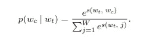
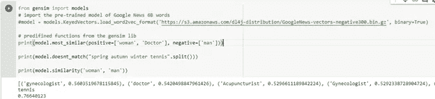
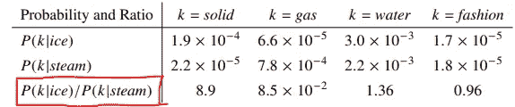
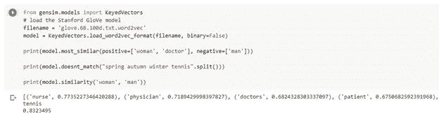
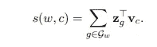
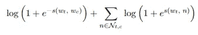
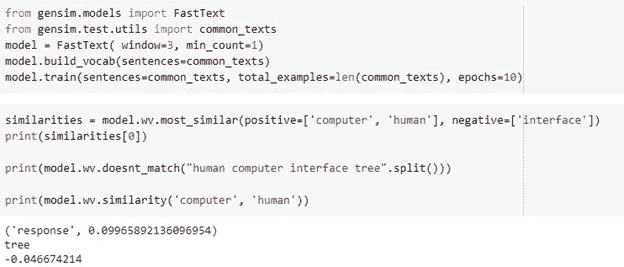
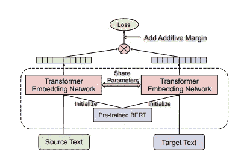
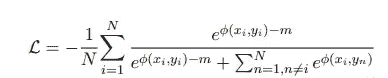

# 单词嵌入、单词块和语言无关的 BERT (LaBSE)

> 原文：<https://medium.com/mlearning-ai/word-embeddings-wordpiece-and-language-agnostic-bert-labse-98c7626878c7?source=collection_archive---------0----------------------->

单词嵌入是用数字格式表示单词，可以被计算机理解。最简单的例子是(是，否)表示为(1，0)。但是当我们处理大型文本和语料库时，这可能不是表示单词和句子的有效方式。对于大型语料库，词的共现及其概率起着重要作用。

让我们探索一些单词表示的技巧…

# 一键编码

在一键编码中，句子中的每个单词都由一个向量表示。

例如，考虑句子“我喜欢狗。”它有 3 个单词，每个单词都表示为

我— (1，0，0)

爱— (0，1，0)

狗— (0，0，1)

向量中单词出现的位置被赋予 1。

然而，当我们想要进行情感分析或问答时，这种方法不是一种认知方法。

此外，对于大型语料库来说，这些向量变得巨大而无意义。

# CBOW 和连续跳格模型

重要的是用数字格式表示单词，而且这些单词要有意义，简单地说，它们应该有上下文意义来执行几个 NLP 任务。

在论文“向量空间中单词表示的有效估计”中，Google 提出了两种用于从非常大的数据集中计算单词的连续向量表示的架构，称为连续单词包(CBOW)和连续 Skip-Gram 模型。

CBOW 模型的目标是预测上下文单词，给定 4 个未来单词和 4 个历史单词作为输入。这些未来和历史单词被转换成它们在句子中同现的概率，并作为输入提供给模型。这是使用一个带有一个隐藏层的前馈神经网络在来自谷歌新闻的 6B 单词语料库上训练的。隐藏层使用激活函数 ReLU，输出层使用 softmax，如下所示:

其中 wc =上下文单词，wt =给定单词，s 是评分函数。

由于这些模型不依赖于语料库中词的顺序，因此被称为词袋。

Skip Gram 模型使用对数线性分类器预测给定输入单词前后一定范围内的单词。这也以与 CBOW 相似的方式训练。

这两个模型能够产生更有效的词与词之间的语义和句法关系。这些模型的准确率为 60%，通过词语相似度和词语类比来衡量。

Genism 包中的 Word2Vec 库可以用来生成 CBOW 和 skip grams。请参见下面的示例。

# 手套

斯坦福大学提出了一个新的单词嵌入模型，称为 GloVe，即单词表示的全局向量。GloVe 在词语类比数据集上取得了 75%的准确率，在词语相似性任务上也优于其他模型。

Glove 的工作方式类似于 word2vec，使用同现概率的比率作为输入，而不是仅使用上下文单词的概率。下面给出了目标单词 ice 和 steam 与所选上下文单词(k)的共现概率。与原始概率相比，比率(用红色标记)能够更好地区分相关词(固体和气体)和不相关词(水和时尚)，也能够更好地区分两个相关词。

GloVe 在 CBOW 和 Skip grams 中使用对数双线性模型，而不是对数线性模型。Word2vec genism 包可以通过使用手套预训练模型作为其输入用于手套，如下所示。它执行与 word2vec 相同的任务。

# 快速文本

来自脸书的 FastText，基于 skip gram 模型的相同逻辑工作，重点是单词的词法。这意味着，该模型考虑单词的变形、派生和组成。每个单词都被表示为一包字符 n-grams 或称为子单词。向量表示与每个字符 n 元语法相关联，并且单词被表示为这些表示的总和。从而获得如下的评分函数

w 是给定的单词，

Gw ⊂ {1，。。。，G}，—出现在 w 中的 n 元文法的集合，

zg —每个 n 元语法 g 的向量表示。

该模型也称为子词模型，允许跨词共享表示，从而允许学习罕见词的可靠表示。该评分函数然后被用于前馈神经网络的输出层的激活函数。

与使用 softmax 作为输出层中的激活函数来预测上下文单词的 skip gram 模型相反，FastText 将其视为一组独立的二进制分类任务。那么目标是独立地预测上下文单词的存在(或不存在)。

对于选定的上下文位置 c，使用二元逻辑损失，负对数似然被给出为

Genism 库中提供了 FastText 模块，我们可以使用已经训练好的语料库，也可以在全新的语料库上训练模型。下面是一个来自已经训练好的数据的例子。

# BERT 中的词块嵌入

单词块嵌入是为亚洲语言如朝鲜语和日语的 google 语音识别系统开发的。这些语言有大量的字符、同音异义词，单词之间没有或只有很少的空格。没有或更少的空格意味着文本需要分段。然而，切分会在模型中产生大量的未收录词(OOV)。因此，单词块表示被创建来从大量数据中自动学习单词单元，并且不会产生任何 OOV 氏现象。这种处理 OOV 氏症的技巧被用在了伯特身上。OOV 在 word2vec 和 GloVe 中被忽略，但是在 FastText 字符中，单词的 n-gram 表示补偿了 OOV。

BERT 使用 30，000 个单词的单词块嵌入。每个序列的第一个标记总是一个特殊的分类标记([CLS])。对应于该令牌的最终隐藏状态被用作分类任务的聚集序列表示。成对的句子被打包成一个序列。使用特殊的标记([SEP])并通过向每个标记添加学习嵌入来区分句子，该学习嵌入指示句子是属于句子 A 还是句子 b。对于给定的标记，其输入表示通过对相应的标记、片段和位置嵌入求和来构建。这些输入用于预先训练用于掩蔽语言建模和下一句预测任务的 BERT。BERT 已经革新了许多 NLP 应用，但是 BERT 的构造使得它不适合于语义相似性搜索以及无监督的任务，例如通过语义搜索的聚类和信息检索。

句子-BERT (SBERT)是使用连体和三元组网络结构的预训练 BERT 网络的修改，被提出来导出语义上有意义的句子嵌入，这些句子嵌入可以使用余弦相似度进行比较。

访问[https://www.sbert.net/docs/pretrained_models.html](https://www.sbert.net/docs/pretrained_models.html)了解英语句子嵌入。

# LaBSE

语言不可知的 BERT 句子嵌入是对 BERT 的改编，用于为 109 种语言产生语言不可知的句子嵌入。SBERT 可以产生英语句子嵌入，但是这不能用于多语言情况。LaBSE 模型使用双向双编码器将掩蔽语言模型(MLM)和翻译语言模型(TLM)预训练与翻译排序任务相结合。

在上图中，我们可以看到有一个双编码器，其中包含成对的编码器，提供点积评分功能。使用基于共享 BERT 的编码器对源句子和目标句子分别进行编码。最终的层[CLS]表示被作为每个输入的句子嵌入。源句子和目标句子之间的相似性使用余弦对由 BERT 编码器产生的句子嵌入进行评分。

双向双编码器使用带批内负采样的附加裕量 softmax 损耗进行训练，如下所示:

x 和 y 的嵌入空间相似度由φ(x，y)给出其中，φ(x，y) =余弦(x，y)。

Github 链接，包括以下 LaBSE 代码:

[https://github . com/bijular/data science/blob/master/Word _ embedding . ipyn](https://github.com/bijular/datascience/blob/master/Word_Embedding.ipynb)b