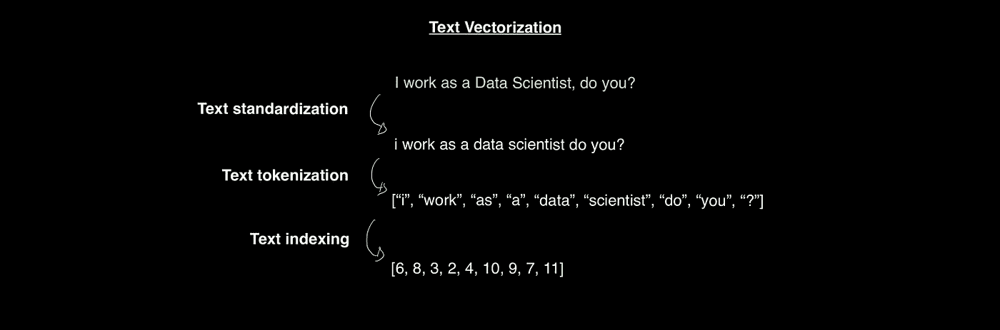
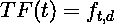
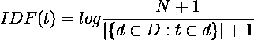
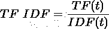

# 文字处理方法——现代自然语言处理的起点

> 原文：<https://medium.com/mlearning-ai/word-processing-approaches-where-modern-nlp-starts-8ccef781d23e?source=collection_archive---------2----------------------->

在本文中，我概述了什么是文字处理方法以及当前的技术水平。在深入研究这些方法之前，我先介绍自然语言处理(NLP)和一些重要的任务。

Photo by [Kelly Sikkema](https://unsplash.com/@kellysikkema?utm_source=medium&utm_medium=referral) on [Unsplash](https://unsplash.com?utm_source=medium&utm_medium=referral)

Natural in **“自然语言处理”**允许我们区分人类语言(如英语或法语)和机器语言(如 Python 或 C++)。现代 NLP 是数据科学和人工智能领域，它使用文本数据来解决诸如**文本分类**、**语言建模**、**翻译** …

这显然是最难处理的数据之一，因为一个单词、一个句子、一段文字的实际含义……根据句子的上下文，一些单词可能有不同的含义，对于一些语言来说，这种情况会成倍增加。

在现代 NLP 之前，开始研究文本的工程师们正在寻找一套经典的**规则**来理解任何句子的意思。但是语言并不是可以用 **if/then/else** 规则概括的数据，这样做效果不好。

> 现代 NLP 是应用于单词、句子、段落的模式识别(用 Python 深度学习，Franç ois Chollet)。

这种模式识别是由机器实现的，不是通过编程规则，而是通过使用它们的计算能力。机器通过对训练数据集进行学习来帮助找到语言的含义，以便解决特定的任务。

在深入主要的文本预处理方法之前，让我们了解机器如何处理数据以及 NLP 中需要的主要任务。

## 从文本到矢量—文本矢量化

文本数据不能不加修改就使用，机器必须处理数值，当你给它文本时，数据就丢失了。

**文本矢量化**是将文本转化为矢量(数值张量)的过程。它由多项任务组成，每项任务都很重要:*文本标准化*、*文本标记化*和*文本索引*。

1.  文本标准化旨在消除不想要的字符，并转换文本以便于处理。
    例如:删除标点符号、特殊字符、重音符号、大写字母……
    **词干**是一种更高级的标准化，因为它将一个术语的变体转换为其词干，词干是给定单词的基础或词根(*【鱼】*是*【钓鱼】*的词干)。
2.  **文本记号化**或**拆分**顾名思义，就是将每个单词拆分成记号的过程，记号可以是一个字符、一个单词、一组词。 **N-grams** 是一种标记化类型，专注于分裂 N 长度的单词组:*双元是 2 个单词的组*。
3.  **文本索引**包括两个步骤:
    -首先，**构建词汇表**，该词汇表是在整个数据集(语料库)中找到的所有术语的索引。
    - **为词汇表中的每个术语**分配一个唯一的整数。因此，每个单词都可以用它在词汇表中的索引来代替，这可以被看作是一个巨大的字典。
    **不在词汇表中(OOV)** 是不存在于词汇表中的术语，通常放在索引 1 中。
    **掩码标记**是词汇自愿忽略的术语，放在索引 0 中(这一般用来填充过短的序列)。

下面是对以下句子执行的文本矢量化过程:*我是数据科学家，你呢？*

现在我们知道了如何将文本表示成向量，让我们看看不同的单词预处理方法…

# 词序重要性——词汇预处理模型

一种语言和另一种语言的词序是不同的，即使在同一种语言中，你也可以改变句子中的词序，同时保持意思不变。

这是最常见的单词预处理方法的主要区别:**单词袋模型**与**序列模型**。

## 词汇袋模型

这种方法将文本视为一组无序的单词，不考虑任何顺序。

> 一个**包**指的是你处理**套令牌**而不是一个**列表**或者**序列**(用 Python 深度学习)。

因此，你可以连接所有的文本，把它们混合在一起，而不会有任何问题。
**字袋**也可以称为**N 字袋**，因为它可以将 N 个字编码为集合。

但是这个想法是将整个文本表示为由 0 和 1 组成的单一向量，但主要是 0，这产生了**稀疏度**。它基本上是一个**巨大的多热点编码**。

那些词预处理的模型已经通过从**添加的信息** **每个词/N 元文法的频率**而被**增强**和**改进**。但这还不够，因为有些词毫无意义，在任何文本中都存在: *a* ， *the* ，*have*…这就是 **TF-IDF** **规范化**出现的原因，它可以最大限度地利用词的频率，同时限制无用的词。

> TF-IDF 代表**词频—逆文档频率**

在看 TF-IDF 之前，我们先介绍一下什么是**文档**，什么是**文档集**。文档可以由任意长度的句子或几个句子(一个文本)组成，而语料库是各种文档的集合。例如，语料库可以是几部电影描述的集合。

现在清楚了，这是 TF-IDF 的两个术语:

*   **词频**是一个词在特定文档中的计数。

*   **逆文档频率**是一个单词在整个语料库中至少出现一次的文档数的倒数。

其中 ***N*** 是语料库中的文档数，分母是术语*的**文档频率**。我们添加 1 以防止被零除的错误，并使用对数来削弱大型语料库的重要性(如果 N 是 10M，文档频率是 10，则 IDF 将是 10M/10 = 1M，而使用 log 将其更改为 6)。*

*最后:*

**

*TF-IDF 允许为文档中的单词提供更多的信息和意义，但并没有改变单词袋模型的原则，即在单词的重要性很强的情况下放弃单词顺序。*

## *序列模型*

*虽然单词袋方法将文本输入表示为唯一的固定表示，但是**序列模型**保留原始单词序列，目的是找到其中的模式。*

*这些是顺序模型的 **3 步**:*

1.  ***文本索引**:序列的每一项由一个整数索引表示。*
2.  ***文本矢量化**:将每一个整数映射到一个矢量，从而得到矢量序列。*
3.  ***将这些矢量序列输入到一堆层中** (RNN，变形金刚)，目的是从这些原始序列中找到模式。*

*然而，使用一键编码来表示创建向量并不是最好的方法，因为输入的维数会非常大(词汇表也是如此)。这将导致神经网络的计算缓慢和性能不佳。这就是**单词嵌入**出现并彻底改变单词表示的地方。*

*的确， ***单词嵌入*** *是将人类语言映射到结构化几何空间的单词的向量表示* *(用 Python 深度学习)*。*

*与将每个单词独立于其他单词并因此独立于正交矢量的独热编码相反，*

**

*单词嵌入认为两个单词的**几何关系**应该代表它们的**语义关系**通过某种**几何距离**来计算，例如余弦相似度。*

> *单词嵌入将更多的信息打包到比一热编码少得多的维度中，因为后者是二进制和稀疏向量。*

*单词嵌入的一大优势是**它可以整合信息，因为它从单词的相似性中学习到另一个**(结构化表示)。表示同一事物的两个词应该有相近的向量。*

*例如，用车辆词语:*

**

*在神经网络中有两种使用单词嵌入的方法:*

*   *要么**基于你想要完成的任务(文本分类、翻译……)构建你自己的单词嵌入**。*
*   *或者通过**加载从不同的机器学习任务构建的预训练嵌入**。*

***建造自己的房子***

*想法是训练一个模型，并添加一个**嵌入层**，该层将调整最初的随机字向量，该向量可以被视为具有反向传播过程的层中的权重。在训练结束时，嵌入表示给定任务的最佳语义关系。*

***加载预加应力的预埋件***

*预训练嵌入背后的假设是**将从另一个任务中获得的知识**转移到你自己的任务中。*

> *您期望您需要的特性是相当通用的——通用的语义特性，因此即使预训练的嵌入空间来自不同的问题(使用 Python 的深度学习)也是有用的。*

*那些嵌入的预训练不一定用神经网络来完成，而是特别使用**单词出现统计**。*

*预训练嵌入的示例:*

*   *[**Word2vec**](https://code.google.com/archive/p/word2vec/)*
*   *[**手套**](https://nlp.stanford.edu/projects/glove)*
*   *来自 HuggingFace 的 [**句子变形金刚库**](https://huggingface.co/sentence-transformers) 的任何模型*

*最后，今天的最佳序列模型是 **Transformers** ，一种彻底改变了现代 NLP 的神经网络架构。*

# *结论*

***现代 NLP** 代表使用大型文本数据集，以获得有用的模式来解决特定问题。*

*文本数据需要特殊的**预处理**，因为特征就是单词本身。这一过程从通过移除不想要的字符的**标准化**开始，继续通过分割 N 元语法的**标记化**，并以将词汇表中的每个单词关联到唯一整数的**索引**结束。*

*这种预处理导致了词序重要性的问题。事实上，可以区分两种方法:**词汇袋**和**序列模型**。后者目前最常用于复杂的 NLP 任务，因为它认为词序是学习的基础。*

*感谢你阅读这篇文章，我希望你喜欢它，现在更好地理解什么是文本/文字预处理！如果你对数据科学和机器学习感兴趣，可以在这里查看我的其他文章。*

## *资源*

* [## 使用 Python 进行深度学习

### Python 深度学习介绍了使用 Python 语言和强大的 Keras 的深度学习领域

www.manning.com](https://www.manning.com/books/deep-learning-with-python)  [## Mlearning.ai 提交建议

### 如何成为 Mlearning.ai 上的作家

medium.com](/mlearning-ai/mlearning-ai-submission-suggestions-b51e2b130bfb)*