# 使用 Python 的单词云

> 原文：<https://medium.com/mlearning-ai/wordclouds-with-python-c287887acc8b?source=collection_archive---------1----------------------->

创建和自定义单词云的分步指南

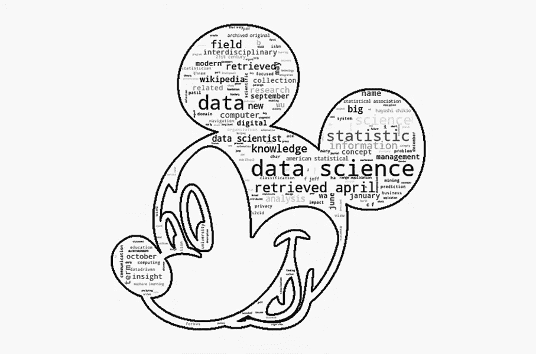

Image by Author

**Word cloud** 对于文本数据来说，是最强大、最直观的可视化方法之一。单词的大小取决于出现频率(文本在上下文中的重要性)，因此它对于自然语言处理机器学习项目或文本分析来说很方便。为了我最近的项目探索[](https://github.com/MBM-nlp/github_classification_project)**，我和他们一起玩。**

**在这篇文章中，我将向您展示如何用 Python 创建单词云，并发挥它们的创造力。**

**现在让我们开始吧！**

## **步骤 1:安装软件包**

**我们需要单词云生成器来为我们创建视觉效果，记住单词云依赖于基本的库 NumPy 和 pillow。我们还需要 matplotlib 在本地显示或保存图像。**

**在您的终端(Linux / maxOS)或命令提示符(windows)中键入下面的代码取决于您的环境。**

**如果您使用 pip:**

```
$ pip install wordcloud
```

**如果您使用 conda:**

```
conda install -c conda-forge wordcloud
```

## **第二步:正文**

**为了这篇文章，我通过在维基百科上搜集 FAANG 公司与 [**美汤**](https://www.crummy.com/software/BeautifulSoup/bs4/doc/) 相关的话题来获取数据。如果你想知道我获取文字的详细步骤，请访问我 GitHub 上的这个 [**笔记本**](https://github.com/m3redithw/data-science-visualizations/blob/main/WordClouds/wordclouds.ipynb) 。**

**对于数据准备，我使用以下步骤清理了文本:**

*   **删除特殊字符**
*   **[标记化](https://www.analyticsvidhya.com/blog/2020/05/what-is-tokenization-nlp/)**
*   **[词汇化](https://www.techslang.com/definition/what-is-lemmatization/)**

**如果想看代码和功能，请访问这个 [**prepare.py**](https://github.com/m3redithw/data-science-visualizations/blob/main/WordClouds/prepare.py) 文件。**

**对于我创建的每个单词云(公司)，相应的文本以字符串的形式存储在一个变量中。这里给你一个思路，内容清理后是什么样子。**

*   ****元(57k 字)****

****

**meta_text**

*   ****苹果(168k 字)****

**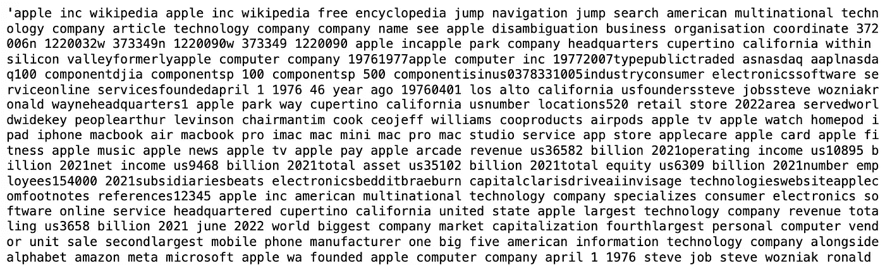**

**apple_text**

*   ****亚马逊(112k 字)****

**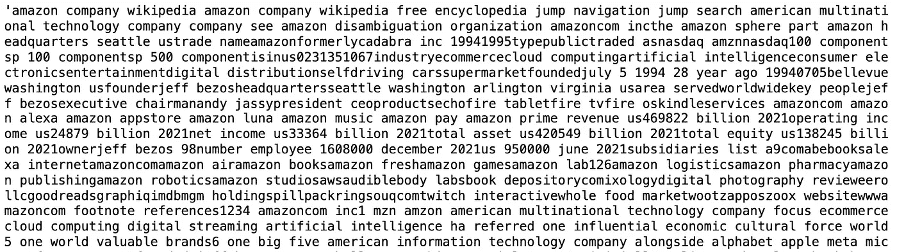**

**amazon_text**

*   ****网飞(147k 字)****

**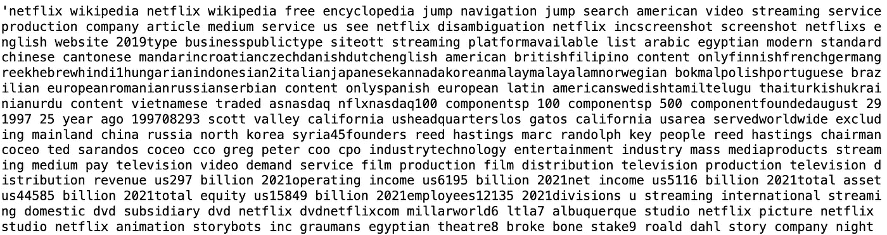**

**netflix_text**

*   ****谷歌(113k 字)****

**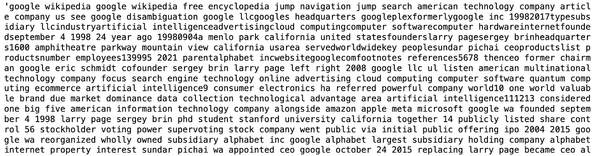**

**google_text**

## **步骤 3:导入库**

**在安装了所有必要的库(步骤 1 中提到的)并准备好文本主体之后，我们需要确保导入它们。**

**Essential Imports**

## **第四步:生成单词云**

**现在我们有了生成单词云所需的一切。用您选择的名称创建一个 WordCloud 类的对象，并调用 generate()方法。**

**注意，WordCloud()接受几个参数，允许我们定制形状、颜色等。我们将在下面的例子中讨论。**

**Generate Default WordCloud**

**这里我将我的单词云对象命名为“wc”。我没有在 WordCloud()中传递任何参数，其他都是默认的。我们来看看简单元词云默认是什么样子的。**

**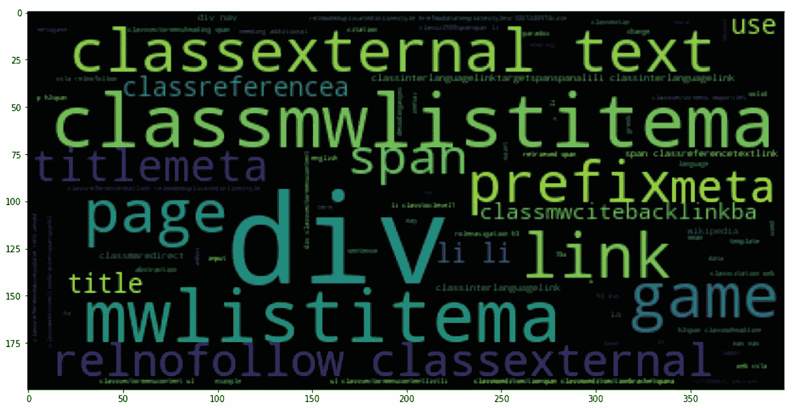**

**Simple Default WordCloud Setting — Image by Author**

**如您所见，轴上有一些数字，我们可以通过调用以下命令来关闭它们:**

**Turn Off Axis in matplotlib**

**WordCloud()包含以下参数:**

*   **背景颜色:背景的颜色**
*   **max_words:使用的唯一单词的最大数量**
*   **停用字词:停用字词列表，用于排除不想显示的字词**
*   **色彩映射表:色彩主题**
*   **width:word cloud 图像的宽度**
*   **height:word cloud 图像的高度**

# **第五步:定制颜色**

**我最喜欢的一个特性是“颜色图”参数，它允许我们自定义调色板。让我们尝试在元文本语料库中使用这些参数。**

**Generate WordCloud with Colormap ‘binary’**

**结果:**

**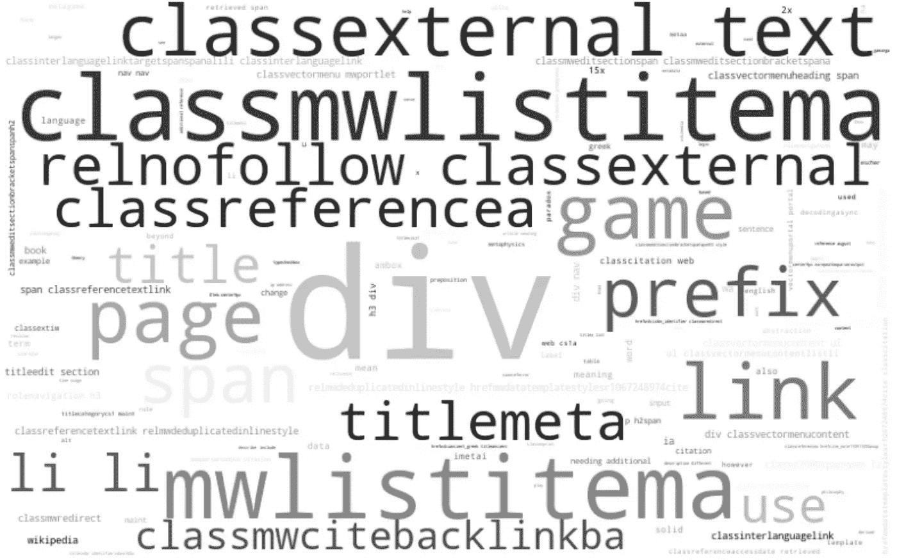**

**Meta WordCloud with Colormap ‘binary’ — Image by Author**

**我将背景颜色设置为“白色”，它也接受任何十六进制代码格式的颜色(#FFFFFF)。我在停用词列表中添加了“Meta ”,这样单词云将显示更多与 Meta 相关的文本。**

**在这个例子中，我使用“二进制”的色彩映射表，这里是完整的值列表，您可以从中选择:**

```
'Accent', 'Accent_r', 'Blues', 'Blues_r', 'BrBG', 'BrBG_r', 'BuGn', 'BuGn_r', 'BuPu', 'BuPu_r', 'CMRmap', 'CMRmap_r', 'Dark2', 'Dark2_r', 'GnBu', 'GnBu_r', 'Greens', 'Greens_r', 'Greys', 'Greys_r', 'OrRd', 'OrRd_r', 'Oranges', 'Oranges_r', 'PRGn', 'PRGn_r', 'Paired', 'Paired_r', 'Pastel1', 'Pastel1_r', 'Pastel2', 'Pastel2_r', 'PiYG', 'PiYG_r', 'PuBu', 'PuBuGn', 'PuBuGn_r', 'PuBu_r', 'PuOr', 'PuOr_r', 'PuRd', 'PuRd_r', 'Purples', 'Purples_r', 'RdBu', 'RdBu_r', 'RdGy', 'RdGy_r', 'RdPu', 'RdPu_r', 'RdYlBu', 'RdYlBu_r', 'RdYlGn', 'RdYlGn_r', 'Reds', 'Reds_r', 'Set1', 'Set1_r', 'Set2', 'Set2_r', 'Set3', 'Set3_r', 'Spectral', 'Spectral_r', 'Wistia', 'Wistia_r', 'YlGn', 'YlGnBu', 'YlGnBu_r', 'YlGn_r', 'YlOrBr', 'YlOrBr_r', 'YlOrRd', 'YlOrRd_r', 'afmhot', 'afmhot_r', 'autumn', 'autumn_r', 'binary', 'binary_r', 'bone', 'bone_r', 'brg', 'brg_r', 'bwr', 'bwr_r', 'cividis', 'cividis_r', 'cool', 'cool_r', 'coolwarm', 'coolwarm_r', 'copper', 'copper_r', 'cubehelix', 'cubehelix_r', 'flag', 'flag_r', 'gist_earth', 'gist_earth_r', 'gist_gray', 'gist_gray_r', 'gist_heat', 'gist_heat_r', 'gist_ncar', 'gist_ncar_r', 'gist_rainbow', 'gist_rainbow_r', 'gist_stern', 'gist_stern_r', 'gist_yarg', 'gist_yarg_r', 'gnuplot', 'gnuplot2', 'gnuplot2_r', 'gnuplot_r', 'gray', 'gray_r', 'hot', 'hot_r', 'hsv', 'hsv_r', 'inferno', 'inferno_r', 'jet', 'jet_r', 'magma', 'magma_r', 'nipy_spectral', 'nipy_spectral_r', 'ocean', 'ocean_r', 'pink', 'pink_r', 'plasma', 'plasma_r', 'prism', 'prism_r', 'rainbow', 'rainbow_r', 'seismic', 'seismic_r', 'spring', 'spring_r', 'summer', 'summer_r', 'tab10', 'tab10_r', 'tab20', 'tab20_r', 'tab20b', 'tab20b_r', 'tab20c', 'tab20c_r', 'terrain', 'terrain_r', 'turbo', 'turbo_r', 'twilight', 'twilight_r', 'twilight_shifted', 'twilight_shifted_r', 'viridis', 'viridis_r', 'winter', 'winter_r'
```

**我将在下面的例子中展示一些色彩映射表的值，我鼓励你尝试这些调色板！**

# **第五步:自定义形状**

**在这里，我导入了我想用于“面具”的形状，这是 Meta 公司的标志:**

**Open Image for Mask**

**使用“meta_mask”变量，我们打开了图像“meta_logo.png”。正如您从输出中看到的，NumPy 将 PIL 图像转换为数组，指示图像中每个像素的值。**

**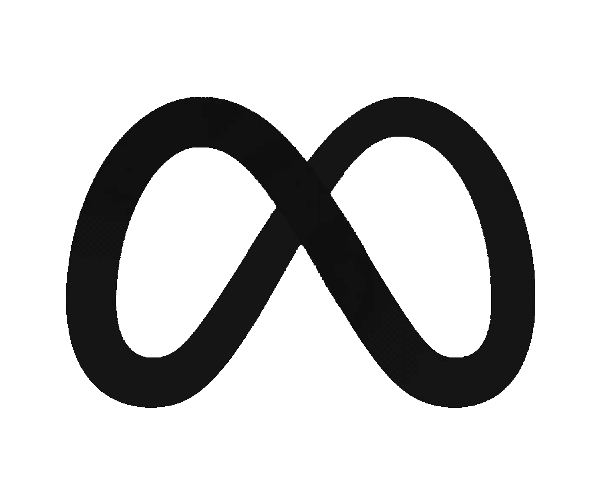**

**‘meta_logo.png’**

**数组中的“0”表示“纯白”，而“255”表示“黑色”。请记住，您导入的图像必须是黑白的。生成字云时，文字会填充在黑色区域，其余部分会被认为是背景。**

**现在让我们把这个面具放进我们的词云中！**

**Generate WordCloud with Meta Logo as Mask**

**结果:**

**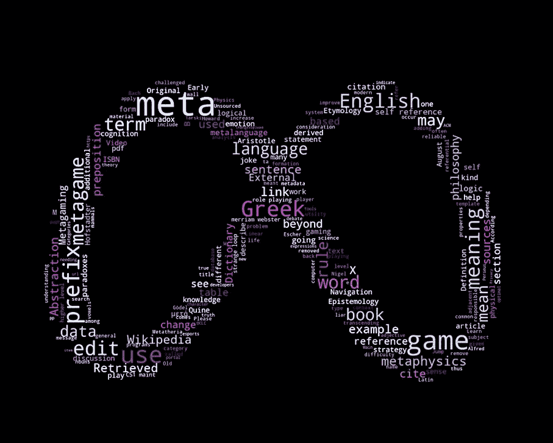**

**Meta WordCloud with Colormap ‘BuPu_r’ — Image by Author**

**创意的空间很大，让我们看看云这个词在其他公司徽标上是什么样子的。**

*   ****苹果****

**Generate WordCloud with Apple Logo as Mask**

**结果:**

**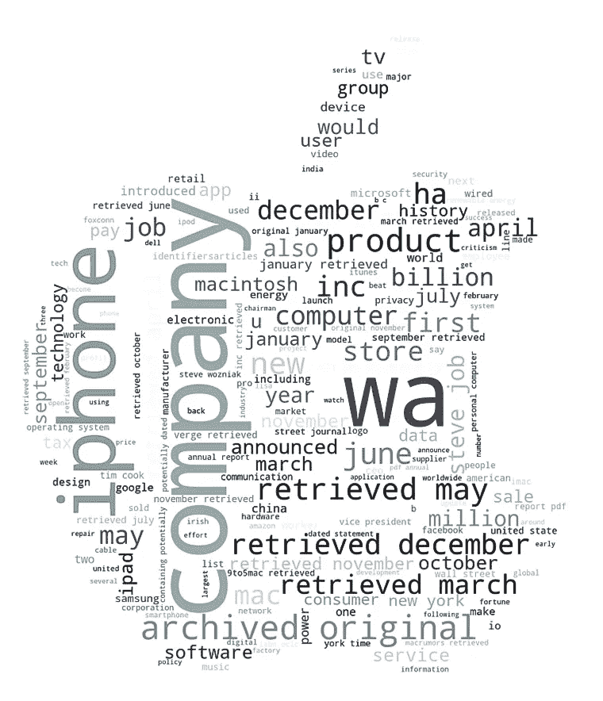**

**Apple WordCloud with Colormap ‘bone’. Image by Author**

*   ****亚马逊****

**Generate WordCloud with Amazon Logo as Mask**

**结果:**

****

**Amazon WordCloud with Colormap ‘copper’ — Image by Author**

*   ****网飞****

**Generate WordCloud with Netflix Logo as Mask**

**结果:**

**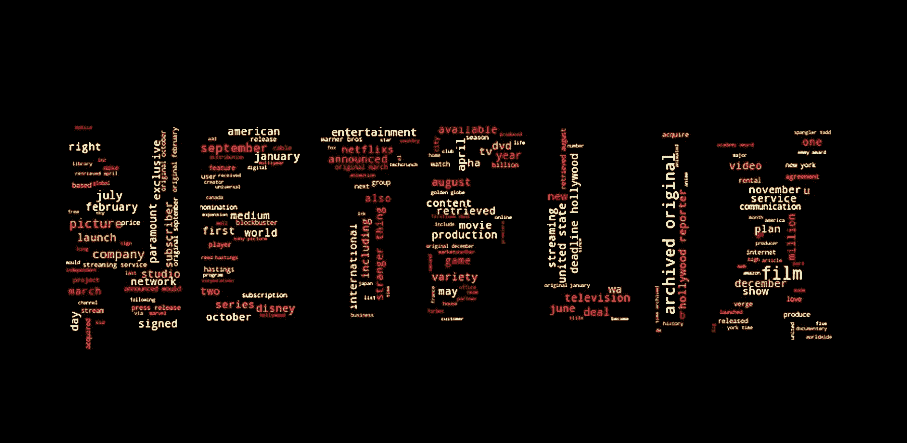**

**Netflix WordCloud with Colormap ‘YlOrRd’ — Image by Author**

*   ****谷歌****

**Generate WordCloud with Google Logo as Mask**

**结果:**

**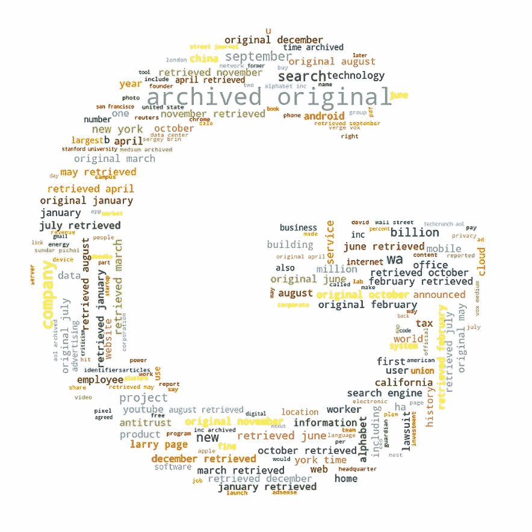**

**Google WordCloud with Colormap ‘Paired’ — Image by Author**

**在这里，我们探索了一些颜色图，包括“二进制”、“BuPu_r”、“骨”、“铜”、“YlOrRd”和“成对”以及 FAANG 公司徽标的形状。你可以用不同的文本、形状和颜色创造出很多其他的东西。我等不及要看你们的文字云是什么样子了！**

**我希望这篇文章清楚地向你展示了如何创建单词云，并请在评论中分享你的问题/想法。期待听听大家的想法！**

**[](/mlearning-ai/mlearning-ai-submission-suggestions-b51e2b130bfb) [## Mlearning.ai 提交建议

### 如何成为 Mlearning.ai 上的作家

medium.com](/mlearning-ai/mlearning-ai-submission-suggestions-b51e2b130bfb)**