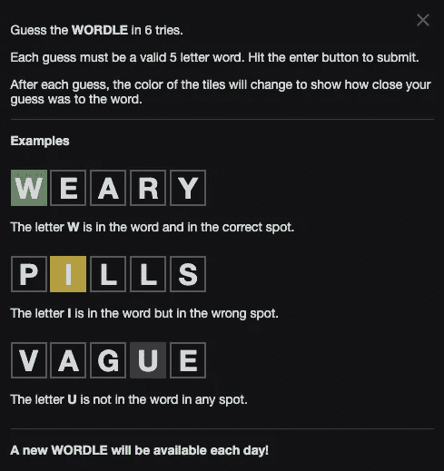
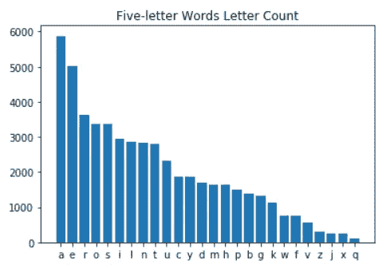
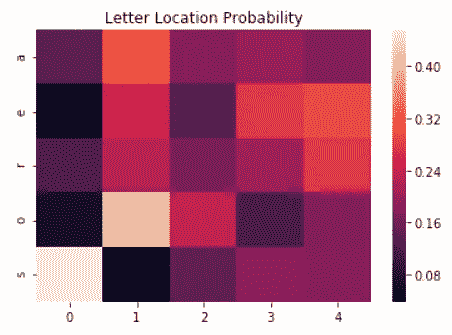
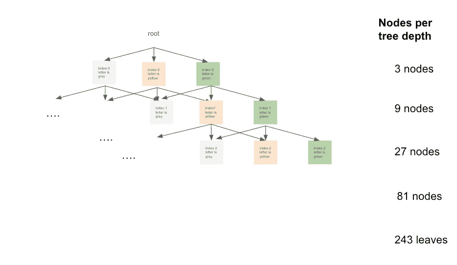

# wordle——从统计数据来看，游戏开始的最佳单词是什么？

> 原文：<https://medium.com/mlearning-ai/wordle-what-is-statistically-the-best-word-to-start-the-game-with-a05e6a330c13?source=collection_archive---------0----------------------->

## Wordle 粉丝:这篇博文将回答这个问题。

# 介绍

Wordle 是一款日常[游戏](https://www.powerlanguage.co.uk/wordle/)【1】。每天，每个人都需要发现一个常见的 5 个字母的单词。你有 6 次机会。每次你需要提交一个 5 个字母的英语单词。猜完每个字母后，你就知道它们是否出现在正确的位置(“绿色”)，出现在错误的位置(“黄色”)或没有出现(“灰色”)。目标是以最少的尝试次数猜出单词。



Game instructions Photo by Wordle [1]

现在，我确信所有的 Wordle 爱好者和粉丝会问他们自己，最好的单词是什么，玩这个游戏的最佳策略是什么。为了回答这些问题，我在 NLTK [2]中使用了英语单词。NLTK 英语词汇量为 236，736 个单词。我首先只过滤了长度为 5 的单词，剩下 10422 个单词。这是我们的搜索空间。

# 让我们从简单的开始

为了回答第一个问题，开始游戏的最佳单词是什么，我决定用这个简单的启发式方法开始:假设我正在寻找一个单词，它将给出最大数量的“黄色”方块(正确，但在错误的位置)，并且在这些方块中，我想要一个将最大化“绿色”方块(正确的位置)。当然，这是一种导航方法，但让我们从这一种开始。

我们希望根据英语中五个字母单词中最常见的字母来选择单词。基于 MLE 原理，让我们使用我们的数据集来计数字母:



Letter frequency based on 5-letter words

我们从这种分布中了解到，以字母 a 开头的单词中:“a”、“e”、“r”、“o”、“s”出现“黄色”方块的概率最高(正确，但位置错误)。让我们搜索字典，看看包含所有这五个字母的可能单词:

```
arose
oreas
```

现在让我们说，我们想在这两个单词中选择一个最有可能出现“绿色”(正确位置)方块的单词。我们将再次对 p(字母|位置)使用 MLE 原则，并根据 5 个字母单词的词汇表计算字母在特定位置的频率。稍后，我们将对每个字母计数进行标准化，以获得概率。

让我们绘制五个字母的位置热图:



让我们假设这些字母被识别，给定它们的位置和定义，我们没有最终的词汇表。我们可以讲这个生成的故事。给定以下内容，生成一个五个字母的单词:

p(由五个字母组成的单词，带有“a”、“e”、“r”、“o”、“s”)= p(字母|位置=0)*p(字母|位置=1)*p(字母|位置=2)*p(字母|位置=3)*p(字母|位置=4)

p('出现')= 0.0004
p('奥利斯')= 0.000007

p('上升)> p('上升')

根据这个简单的启发，我建议你用单词**‘崛起’**开始你的游戏。

# 我们能做得更好吗？

请注意，我们的启发式算法将字母(“黄色”)的频率和字母(“绿色”)的顺序分成两个连续的步骤，这显然是次优的。现在，让我们一起尝试对“绿色”、“黄色”和“灰色”建模。请记住，我们要选择的词，将有助于我们减少不确定性，因此最小化熵。但是我们将如何计算每个单词的熵呢？

我们可以把我们猜测的答案想象成一棵深度为 5 + 1 的树。每一层代表字母在单词中的位置，每个节点根据可能的单词结果分为“绿色”、“黄色”、“灰色”三种。这导致 3⁵树叶在树上。每个分支代表对我们猜测的反应。

对于每个猜测，我们可以计算每个分支中遵循规则的可能的英语单词。在每片叶子中，我们通过询问有多少单词遵循路径规则除以总单词数(10，422)来计算概率，注意叶子概率的总和应该是 1。



Tree Modeling Diagram

让我们确保你们都在跟随。在该图中，最右边的叶子将总是只有一个单词的 5 个精确匹配，因此概率为 1/10442，并且最左边的叶子将具有所有可能的单词，不包括我们的猜测中的五个字母除以单词总数。

我们现在可以对我们所有的五个字母的单词(10，422)运行这种分布树，并通过计算树叶的熵来计算每个单词的熵，具有最低熵的单词将为我们提供最佳单词*来开始游戏。*

*这种方法可以很容易地扩展到基于先前的猜测来玩构建条件概率树的游戏。*

*参考资料:*

*[1]Wordle Game—【https://www.powerlanguage.co.uk/wordle/
【2】*Bird，Steven，Edward Loper and Ewan Klein (2009)，*用 Python 进行自然语言处理*。奥莱利媒体公司**

*[](/mlearning-ai/mlearning-ai-submission-suggestions-b51e2b130bfb) [## Mlearning.ai 提交建议

### 如何成为 Mlearning.ai 上的作家

medium.com](/mlearning-ai/mlearning-ai-submission-suggestions-b51e2b130bfb) 

🟠 [**成为作家**](/data-driven-fiction/how-to-submit-5e0808dce313)*