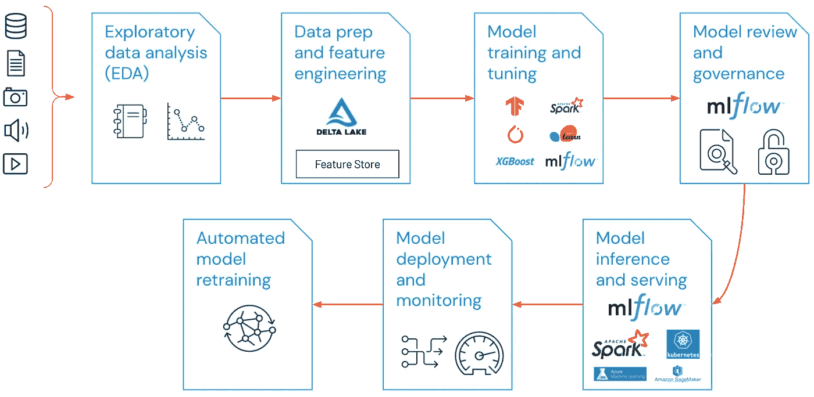

# ML 项目的工作流—ML 操作

> 原文：<https://medium.com/mlearning-ai/workflow-for-ml-projects-mlops-38c155d019c8?source=collection_archive---------1----------------------->

在我之前的一篇文章中，我提到了敏捷方法论——一种设计软件解决方案的有效方法。Agile/DevOps 在数据世界里有一个兄弟——MLOps。MLOps 由一系列实践组成，这些实践支持高效且可销售的机器学习解决方案的开发和部署。在本文中，我们将了解 MLOps 的全部内容。

## 窥探传销

在我们从 atom 开始之前，让我们对 MLOps 有一个抽象的认识。MLOps 是一种用于高效开发和部署 ML 解决方案的方法。与 DevOps 一样，MLOps 汇集了数据科学家、DevOps 工程师和运营部门，共同开发、部署、监控和维护 ML 解决方案。

MLOps Cycle — [https://databricks.com/glossary/mlops](https://databricks.com/glossary/mlops)

**为什么选择传销？**

让我们看看为什么要使用 MLOps。对于像数据科学这样的复杂任务，MLOps 将提供更高的效率，并且变得非常关键，尤其是当涉及到许多不同的工作角色时(分析师、数据工程师、ML 工程师等)。).其次，典型的 ML 项目将包含大量的团队/工程师协作，其中他们的每一项任务都同等重要。在这种情况下，遵循一套严格的实践将会提供更好的管理效率 **y.**

**了解 MLOps 循环**

了解 MLOps 周期首先需要了解数据科学项目流程。从 EDA 到监控和再培训，一个典型的数据科学项目从开始到结束经历了 7 个阶段。

[https://databricks.com/glossary/mlops](https://databricks.com/glossary/mlops)

**EDA:** 探索性数据分析专注于通过可视化分析数据并从中获得见解。EDA 对于理解 ML 的数据以及从数据中获得见解以做出业务决策至关重要。

**数据准备和特征工程:**从不认为数据是完美和干净的。因此，需要数据工程师来执行数据工程，执行清理和转换，并维护整个数据集的一致性。ML 模型的整体准确性取决于数据的清洁度和一致性。因此，这再次成为重要的一步。

**模型训练和调整:** ML 模型根据给定的输入预测任何值。这一步的重点是训练一个 ML 模型并对其进行微调，直到达到预期的性能。这里的核心部分通常被认为是微调，因为作为初始配置的模型可能不会提供富有成效的结果。微调采用了各种 ML 技术，以利用给定的数据实现最佳效果。

**模型审查和治理:**对生成的模型的准确性和性能进行测试。如果有任何组织特定的策略适用，这里也会对其进行评估，以确保模型符合要求。评估模型的可用性，特别是它与业务问题和用例的一致性。

**模型推理和服务:**这一步关注于为模型部署建立技术基础设施——CI/CD 管道、API 端点等。

**模型部署和监控:**模型被部署到已开发的云基础设施中，并被监控其性能和输出。

**自动模型再训练:**云上的模型训练服务采用给定的数据，训练模型并尽可能优化。这可以确保模型与数据保持同步，避免模型过时。

随着数据科学过程的清晰化，让我们看看 ML 循环是什么样子的(参见图 2)。

该团队从 EDA 开始，进行数据准备，开发模型，培训或重新培训模型，审查模型，部署模型，推理和监控模型。这种循环继续下去。

感谢您的阅读！

## 有用的链接:

*   在 LinkedIn 上找到我:[https://www.linkedin.com/in/vishnuu0399](https://www.linkedin.com/in/vishnuu0399)
*   更了解我:[https://bit.ly/vishnu-u](https://bit.ly/vishnu-u)
*   阅读更多关于 MLOps 的信息:[https://databricks.com/glossary/mlops](https://databricks.com/glossary/mlops)

 [## Mlearning.ai 提交建议

### 如何成为 Mlearning.ai 上的作家

medium.com](/mlearning-ai/mlearning-ai-submission-suggestions-b51e2b130bfb)