# 特征工程 CPT 代码

> 原文：<https://medium.com/mlearning-ai/working-with-cpt-codes-5a2b04a4d183?source=collection_archive---------3----------------------->

## 使用 Python/SQL 进行机器学习

当前的程序术语代码，或 CPT 代码，是一个特别微妙和具有挑战性的变量类型进行预处理。首先，它们是字母数字的、无序的、组合的、基于优先级的，并且经常更新以反映医疗保健标准的改进。

在这里，我提出了几个在 SQL 和 python 中预处理这个重要变量的选项，供以后在机器学习模型和预测分析中使用，例如预测未来的索赔是否会被拒绝。

## 快速背景

CPT 代码概述了美国医疗保健提供者执行的每个程序。这些程序由美国医学协会发布和维护，涵盖了实验室测试、评估、外科手术、放射程序等。

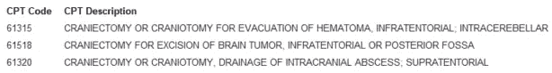

3 CPT code examples from AMA

当提供者向保险公司(付款人)开出服务账单时，这些 CPT 代码会告知所做的事情，并最终与报销挂钩。提供者通常为每次患者就诊分配多个 CPT 代码，并且每天治疗大量患者。因此，就其本质而言，综合 CPT 编码可以告知整个患者群体的实践趋势和治疗效果。

## **CPT 码格式**

快速分解 CPT 代码的结构，因为这种背景影响我们将在流程的后面解决的优先级排序。存在超过 10，000 个独特的 CPT 代码；329 在 [2021](https://journal.ahima.org/highlights-of-the-2021-cpt-code-updates/#:~:text=There%20are%20a%20total%20of,for%20each%20CPT%20code%20section.) 更新。每个 5 个字符长，可以是数字或字母数字，跨越 3 个高级类别:

> **第一类:**评估&管理服务、麻醉、手术、放射、操作程序、病理&实验室操作程序，以及医疗服务&操作程序。**5 个字符都是数字。**
> 
> **第二类:**可选，但提供关于通常使用第一类 CPT 代码执行的额外程序的额外信息，例如 3008F 是在评估&管理服务期间发生的“身体质量指数(身体质量指数)记录”。**前 4 位数字，后跟一个“F”。**
> 
> **第三类:**描述帮助提供者和政府机构跟踪这些医疗技术疗效的紧急或实验服务。它们可能成为第一类，但有 5 年的有效期。**前 4 位是数字，后面是任何其他字母。**

单次就诊可能有超过 50 个独特的 CPT 代码，尽管大多数只有 1-2 个代码。当存在多个代码时，每个代码通过缩进来表示不同的优先级。

增加了这种复杂性，代码经常被修改或删除，以满足医疗保健中不断变化的适应性，从而在代码之间产生“空间”。因此，必须更新现有的 CPT“查找”字典，以防止数据漂移、模型退化和不准确的分类。

## 返回干净的数据集:SQL 提取

使用电子健康记录(EHR)的提供者通常将患者信息存储在 SQL 数据库中，必须首先提取这些信息。但是 CPT 代码是高度多维的，这意味着每个唯一的 CPT 代码(以及相关费用)将占据自己的一行。当在几个月内观察许多患者时，行数可能会迅速增加。

*平均而言，对于中型医院一个月的住院/门诊就诊，CPT 代码维度可以轻松生成超过 400 万行。*

这看起来像什么？例如，此查询:

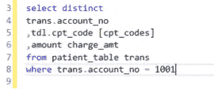

Basic query to extract CPT codes and charges

将返回:

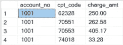

Patient 1001 generated 4 CPT codes for these amounts

如果每个 CPT 的唯一费用很重要，那么您可以保留上面的行，并在 python 中进行进一步的预处理。但是，如果维度级别不重要，您可能希望创建一个单行 CPT 代码，其中包含费用总额。

我们可以通过将 CPT 代码分组在一起，并使用 [STUFF，XML PATH](https://www.mssqltips.com/sqlservertip/2914/rolling-up-multiple-rows-into-a-single-row-and-column-for-sql-server-data/) 函数对总费用求和来做到这一点。例如，以下查询:

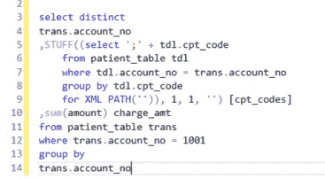

现在将返回:

这样做的主要好处是双重的:提高了(a)可读性(b)处理速度。主要的缺点是失去了对某个结果做出精确判断的能力。例如，我将不再能够陈述“这个 CPT 代码和相关费用增加了你的索赔被拒绝的 87%的机会。”我只能笼统地说，即“这些 CPT 代码和 sum 增加了您被拒绝索赔的几率达 87%。”

顺便说一下，你可以在 python 中使用熊猫 [groupby](https://pandas.pydata.org/pandas-docs/stable/reference/api/pandas.DataFrame.groupby.html) 和 transform 函数对 CPT 代码进行分组。例如，下面我可以根据患者帐号和发票号进行分组，然后调用转换函数来创建一个由“；”分隔的 CPT 代码列表像这样:

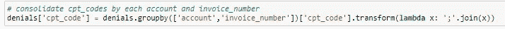

要退回这个:

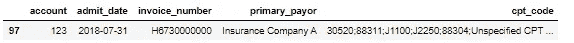

但是，这又在 python 预处理中增加了额外的步骤，这些步骤本来可以在 SQL 提取的上游实现。我个人倾向于让 SQL 处理尽可能多的数据(重新)结构化，并利用 python 进行实际分析。

## CPT 顺序很重要:Python 预处理

对于单个患者就诊，CPT 代码优先。必须对最高优先级代码进行计费。这对于健康的收入循环管理至关重要，因为不当计费的 CPT 代码可能导致完全索赔被拒，从而使医院面临财务风险。

假设程序 47350 发生:“肝出血的处理；肝脏伤口或损伤的简单缝合。”然后外科医生采取了一个额外的步骤，进行了 47360:“肝脏管理，用**复杂的**缝合肝脏伤口或损伤，用或不用肝动脉结扎。”

47360 包含更高的特异性和技术专长，胜过 47350，因此必须是计费代码。

因为 SQL 和 python 显然无法知道基于优先级的排序，所以我们必须强制执行它们。这些代码是字母数字的，在一个列表中，不可能进行整数排序。

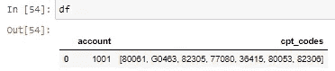

Patient 1001 exhibiting 7 alphanumeric CPT codes

然而，在 python 中，我们可以定义一个主函数，它接受整数或字符串字符(下面的“convert”)，并使用 regex 函数(下面的“alphanum_key”)将它们分开，最终按键对它们进行排序。

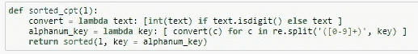

primary sort function

一旦构建完成，我就创建一个二级函数，它遍历每个患者的所有 CPT 代码，应用上面的 sorted_cpt 函数，并将它们附加回我的 dataframe(想象中标记为 df)。

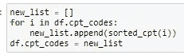

secondary append function

它返回一个字母数字排序的列表:

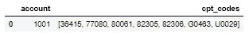

final sorted output

这种特殊的排序现在很有用，不仅是从计费的角度来看，因为后者的优先级更高的代码列在最后(字母数字修饰符)，而且因为我们对这个列表施加了密钥结构。

例如，假设我们想要应用一个分类模型来根据二元结果(即索赔被拒绝，索赔未被拒绝)评估这些 CPT 代码列表。我们希望将维数减少到最少、最精确的 CPT 码排列，使得[77080，82305]和[82305，77080]不共存。这些遭遇确实是一样的，但是正确的开单顺序只有一个。

## 更高级别的类别:更多的 python 预处理

即使减少了上面的 CPT 排列，我在**单个**月的所有访问中仍然有 19，330 个独特的 CPT 代码排列。这表明病人的遭遇是多么的不同。因此，我必须找到一种方法来将相似类型的过程集合在一起。

我有两种方法可以在就诊水平上实现这一点:(方法 A)我可以将每个 CPT 代码映射到一个更广泛的类别，确定列出的最常见的类别，并将整个患者就诊标记为该单一类别。(方法 B)我可以计算一次遭遇中 CPT 代码的数量，并用 CPT 代码的总数来标记这次遭遇。

**方法一:按最常见类别分类**

[医疗费用和使用项目(HCUP)](https://www.hcup-us.ahrq.gov/toolssoftware/ccs_svcsproc/ccscpt_license.jsp) 为每个 CPT 代码提供更高级别的临床类别。在撰写本文时，该映射的最新可用版本为 v2020.1。

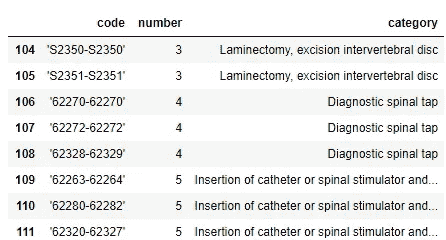

HCUP CPT codes and clinical categories

为了利用这个映射表，我必须解包代码范围，例如，62280–62282 上方的第 110 行变成新的行 62280、62281、62282。这部分是通过将范围分割成一个新列表来完成的:

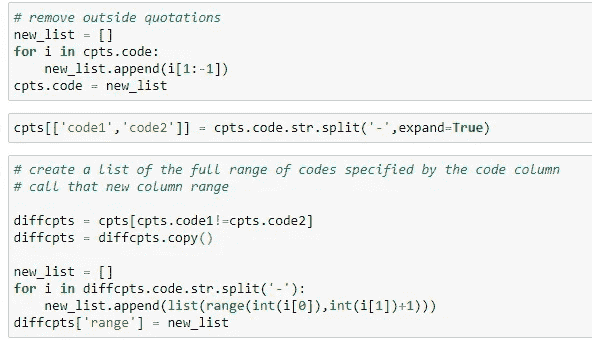

它在下面的范围列中返回了该列表:

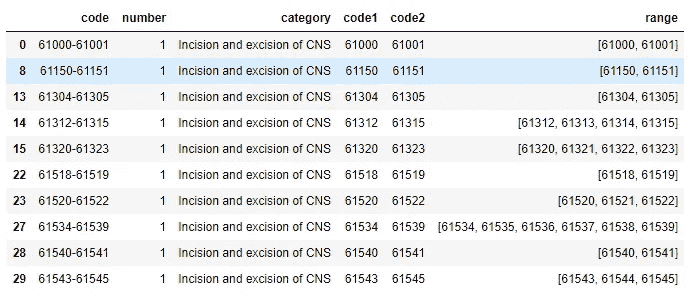

然后，通过应用[熔化函数](https://pandas.pydata.org/docs/reference/api/pandas.melt.html)，我能够将每个 CPT 代码和类别标签匹配到它自己的行上，这样我就可以[将](https://pandas.pydata.org/pandas-docs/stable/reference/api/pandas.DataFrame.merge.html)每个代码类别合并回原始患者数据集。

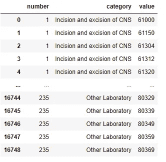

CPT code clinical category lookup table

使用上述 CPT 类别“查找表”，我们能够为所有 CPT 代码分配类别，并采用最常见的 CPT 类别。请注意，在 14%的患者就诊中，仅存在两个 CPT 代码，因此无法分配主要类别。我给这个贴上了“分裂 CPT 代码”的标签

Frequency of most new CPT code categories

考虑到“拆分 CPT 代码”是第二高的类别，我选择了下一个实现方法 B 分类，希望能有一个更清晰的表示。

**方法 B:根据存在的 CPT 代码数量存储桶**

我为该数量的 CPT 代码创建了 10 个类别(0-9)，并为“10 个或更多”CPT 代码创建了最终的“全部捕获”类别。这 11 个类别是使用[列表理解](/better-programming/list-comprehension-in-python-8895a785550b)函数创建的，后面跟着一个新的函数，该函数为 CPT 代码的空列表[' ']附加一个 0，为其他任何内容附加一个 1。[(其中](https://numpy.org/doc/stable/reference/generated/numpy.where.html)功能随后将标签分配回原始患者数据集。

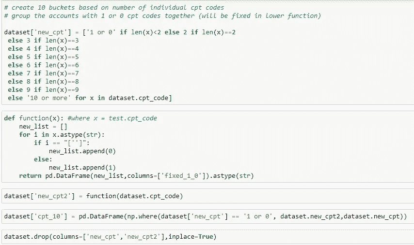

Creating categories for number of CPT codes per patient visit

查看每次患者访视的 CPT 代码数量的总体分布，近 20%的患者未进行任何手术，近一半的患者仅进行了 1 次手术。

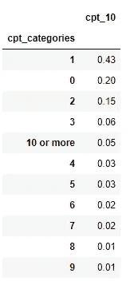

Frequency of CPT code counts

鉴于每种方法都以独特的方式评估 CPT 代码分布，我决定在训练模型时使用这两种类别类型来预测索赔被拒绝的可能性。

## 摘要

(1)对 SQL 中的 CPT 代码进行预处理提高了可解释性和处理速度。

(2)鉴于 CPT 代码结构意味着意义，必须考虑对该结构的元素进行适当的排序和优先排序。

(3)在这里，我只描述了 CPT 分类的两种方法，个人倾向于使用这两种方法来训练我的模型以预测被拒绝的索赔。然而，可能有其他创造性的方法来最好地分类这个变量的其他结果。

感谢阅读！本文的数据是为了 HIPAA/PHI 的目的而编造的，但是预处理方法仍然适用。如果您对医疗保健和数据交叉的其他方式感兴趣，或者如果您有有趣的挑战要分享，请留下评论或 DM。