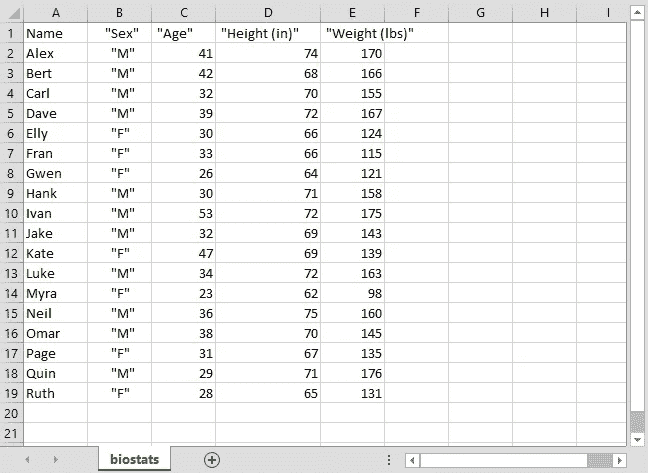
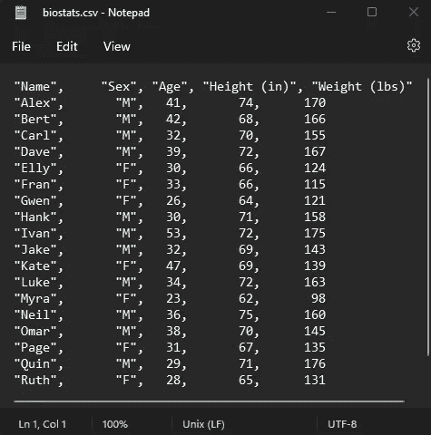
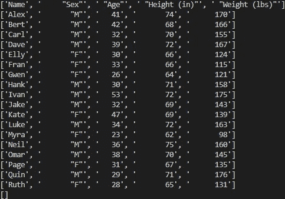

# 使用 csv 模块在 Python 中处理 CSV 文件

> 原文：<https://medium.com/mlearning-ai/working-with-csv-files-in-python-using-the-csv-module-34d9f5a646c5?source=collection_archive---------3----------------------->

您是否曾经只需要在 Python 中处理 Excel 中的数据，或者打开一个 CSV(逗号分隔值)文件并解析其内容？您可能不知道，Python 已经预打包了一个“csv”模块。所以不需要下载像“熊猫”这样的外部模块来处理 CSV 文件。

让我们首先深入了解一下什么是 CSV 文件:

在这个例子中，我将使用一个名为“biostats.csv”的文件，可以从这里的[下载。](https://github.com/jasonriek/CSV/blob/main/biostats.csv)

**当你打开 CSV 文件时，它在 MS Excel 中会是这样的:**



biostats.csv in Excel

**然而，如果你在记事本中以原始格式打开它，你会发现 CSV 文件的内部结构是多么简单:**



biostats.csv in Notepad

我们可以看到，该文件——正如 CSV 的名称所示——是由逗号分隔的值，并以新行结束。了解这种结构将使我们能够相对容易地把文件拆开。

现在，让我们开始编写代码吧！

csv module in Python

**当我们运行上面的代码时，我们应该看到下面的输出:**



Python output of biostats.csv

这很有用，现在我们可以开始用 Python 处理这些数据了。然而，我们可以让自己更容易地处理这些数据。因为我们现在知道了 CSV 文件是如何构造的，所以我们可以使用 Python 来简化处理这些数据的方式。对于初学者，我们可以将列号存储在常量中，以便在将数据读入 Python 后可以轻松地引用数据。

将常数写成独立的是合理的；然而，我发现在一个类对象中枚举我的常量非常有用，尤其是在使用自动完成的 IDE 时。

**例如:**

**好的，我们有很多事情要做:**

我们添加了一个类来表示关于 CSV 文件的信息。我们知道这个文件有头，所以我们设置一个布尔常量“HAS_HEADERS”为“True”，我们将头的列位置枚举到有意义的常量名称中。

然后，当我们读取文件时，我们使用 Python 原生的“next”函数将标题存储到一个单独的列表变量中，以备将来使用。

存储了头之后，我们告诉迭代器对象“reader”从下一行开始。了解了这一点，我们开始解析数据，并希望开始用它做一些有意义的事情。在这种情况下，我们只需获取参与者的姓名及其相关年龄。然而，我们只想看到 20 多岁的人。

在上面代码的第 26 行，有几个重要的条件需要提及。“if line”条件是检查该行中是否有数据，如果是空的，我们不会对该行做任何事情。下一个条件是“len(line) > BioStats”。权重 _ 栏”。因为我们知道“生物状态”。WEIGHT_COL”是最后一列，使用它作为参考来检查行列表值的长度是否足以检查它是否包含内容是安全的。在 CSV 文件中，当一行没有完全填充数据时，这种情况可能会发生，检查这样的输入错误以获得安全的读取算法是一种很好的做法。

最后，一旦我们完成了这些条件，我们检查以确保这个人的年龄在 20 多岁，然后将信息格式化成有意义的东西打印出来。

**输出:**

```
Gwen is 26 years old.
Myra is 23 years old.
Quin is 29 years old.
Ruth is 28 years old.
```

我喜欢用电脑工作，尤其是在数据和电子表格的环境中。我希望像这样的文章能让其他人对 Python 在现实世界中的实际应用感到兴奋。

干杯，

伊阿宋

[](/mlearning-ai/mlearning-ai-submission-suggestions-b51e2b130bfb) [## Mlearning.ai 提交建议

### 如何成为 Mlearning.ai 上的作家

medium.com](/mlearning-ai/mlearning-ai-submission-suggestions-b51e2b130bfb)