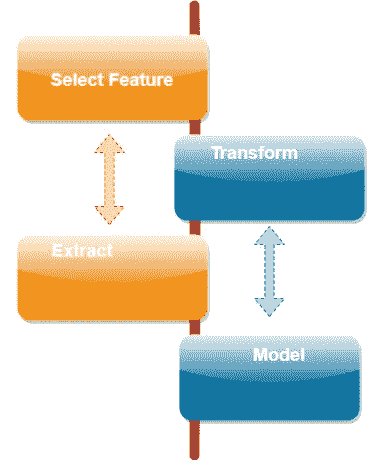
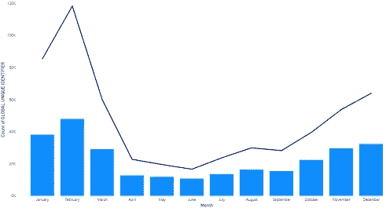
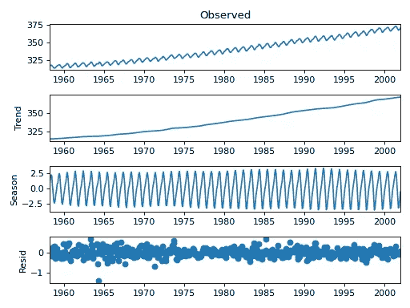
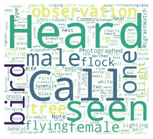

# 使用要素

> 原文：<https://medium.com/mlearning-ai/working-with-features-d03fbbefa92?source=collection_archive---------4----------------------->

识别和提取特征是项目成功的关键。等等，我还没提是软件项目还是机器学习项目呢:)。虽然这种说法对任何人来说都是正确的，但从软件背景来看，功能对我来说总是软件应用程序允许我做的一些花哨(或平凡)的事情。我发现许多人(包括领域 SME)都是如此，他们在任何关于机器学习数据的讨论开始时，都忙于讨论软件功能，以改变数据集“功能”的视角。因此，我发现有必要展开讨论，分享一些关于“功能”的想法和一些关于如何与它们一起解决机器学习问题的见解。

> “某事物的一个与众不同的属性或方面”是字典宣称的特征的意思。

我觉得，当你想到数据科学中数据集的“特征”时，这个意思非常合适。例如，时间和日期、观察到的物种数量、实际位置等等都是生态野外观察数据的特征。

在许多情况下，这些特征可能是数据集列的简单集合，特别是在那些具有数字、分类数据集的明确定义的域中，例如，用于检测欺诈检测的信用卡交易数据。但是在许多情况下，人们可能需要透过明显的事物来提取给定数据中不直接可用的特征，或者领域可能需要这样做。它可能是一些统计特征，或者是时间序列中的一种模式。当涉及到文本、图像、音频-视频数据时，它变得有点复杂。它需要大量的领域知识来识别用于建模的特征。除了使用实际的模型/算法，识别特征成为任何机器学习或人工智能项目的最重要的方面，尽管在许多深度学习的情况下，它被设计为直接从数据中识别和学习。但是，了解数据的哪一方面对算法来说是关键的，对于确保为算法准备和提供正确的数据集也是非常重要的。注意，由于这里讨论的重点是提取用于机器学习目的的特征；本文不讨论基于深度学习的特征提取方法。

# 出发

作为第一步，必须清理数据并进行初步分析，您可以在下面的文章中找到详细的讨论:[如何使用 Python](https://python.plainenglish.io/working-with-large-datasets-for-machine-learning-d8da0dd802fb) 有效地处理用于机器学习和数据分析的大型数据集。

在 EDA 分析和可视化创建的帮助下，是时候进一步卷起袖子开始选择功能，根据需求设计它们，提取额外的功能，以防有更多明显的功能。这可以是在简单的较小的、定义良好的数据集中的手动过程。在具有大量变量的大型数据集中，一些自动化技术被用于仅选择相关特征。常用的技术有:统计方法、基于模型的方法，如决策树、网格搜索等。但是在任何阶段，特征选择过程的输出都将是输入数据的缩减集。

在许多情况下，仅仅选择特征可能是不够的，可能需要根据模型和数据类型的需求进行一些转换，例如标准化或规范化。仅选择相关的特征和变换有助于降低模型的复杂性，避免模型的过度拟合，减少输入数据量等。

特征提取是基于数据类型和/或领域的另一个重要过程，即使作为降维的工具。

让我们停下来讨论不同类型(如果不是全部)数据的特征提取，以及一些常用技术的例子。

# 数字/统计特征

正如前面在许多数字数据案例中所讨论的那样，选择重要的列来进行一些转换，如标准化并将其传递给模型，这可能很简单。

但在许多情况下，许多数值变量需要某种基于领域的转换，这可能是基于问题领域或科学计算的一些统计特征。示例:在某些情况下，需要考虑某个特性对系统其余部分的随机影响。当分析医生的经验或专长及其对患者诊断的影响时，随机效应统计模型的使用是相关的。一年中的某一天对生态观测数据中的物种观测的影响，对最终结果有季节性影响。

有许多通用的统计建模库，如 scikitlearn、statsmodels。此外，许多领域特定的科学计算库也可以用 python 来实现，尽管它们最初大多是用 R 或 MatLab 编写的。这些库在某些情况下是开源的，例如:用于研究流行病/流行病的网络扩散模型的 Ndlib，以模拟或计算传播，这将进一步用于某种预测模型。

# 时间序列特征

许多收集的数据是时间序列的，即带有日期和时间信息。一旦包含了时间线数据，就可以基于时间维度导出许多统计数据。首先，人们可能会理解季节性，认识到数据中重要变量的模式。根据一周中的某一天、一年中的某个月或某个时间，提取许多关于不同关键变量表现的额外统计数据。

Time series Analysis (Ref: statsmodels.org)

像 Skitlearn、statmodels 这样的库提供了基本的时间序列分析功能。还有许多其他高级库可用于时间序列特征提取功能，其中还包括多处理、分布式选项、预测模型和特征评估功能。

# 文本特征提取

有了这些强大的设备，再加上社交网络时代，除了定性数据，越来越多的应用程序也在收集各种文本信息。文本数据带来了人类交流的许多方面，这些方面在早期没有被系统量化，为决策或理解机器的行为增加了许多价值。

它可以是理解通信的情感，或者提取和添加文本通信的概要作为分析的维度。问题包括从纯粹的交流总结到基于评论文本的消费者细分或分类。

有各种方法可以从文本中提取特征用于机器学习。选择一个还是另一个完全取决于手头问题的背景。

*   文本的统计特征——一些技术，如单词计数、单词包、TFIDF，在所说单词的上下文和语言敏感度不是推断的关键时很有用。许多库，如 scikitlearn、gensim，都提供了这些技术的 python 实现。
*   单词嵌入——涉及在向量空间中表示文本文档的不同技术。这种方法考虑了单词的上下文和语义。使用的流行算法是 Word2Vec、Glove，在这两种情况下，预训练的模型可用于大型单词语料库。但是 Word2Vec 也可以从头开始训练。Gensim 库为 python 提供了这些算法的实现。
*   还有其他基于神经网络的流行的 NLP 算法，如 BERT 执行许多更高级的人工智能任务，但也可以在某些情况下方便地进行文档分割。

# 音频特征提取

音频数据正变得越来越相关，许多尖端技术和用例正在被各种人工智能爱好者考虑。在深度学习的情况下，要求从这些音频文件中提取特征变得不太可能，因为算法能够自己学习特征。但是在许多情况下，目标要求使用任何机器学习算法，需要特征提取过程，以便能够从手边的音频数据中收集各种模式。

当涉及到音频时，像文本一样，可以从各种维度提取特征，如频域、时域和其他高级技术，如 melspecograms。

Visualization Spectrogram with the help of Librosa

Python 确实提供了一组定义良好的库，用于从众所周知的格式(如 mp3、wave 等)的音频文件中提取这些特征。例如 Librosa，它提供不同级别的高级特征提取能力。

特征提取取决于数据的质量和手边的要求，可能需要对音频进行上/下采样的预处理，或者增加音频样本等等。音频特征提取是一个相当资源密集型的过程，可能的 GPU 或一个良好的配置 CPU 将公然帮助优化时间。

# 图像/视频和其他科学数据

有各种针对图像和视频的标准特征提取技术，有深度学习技术也有深度学习技术，然后可以用于各种问题，如对象检测、分割和重新生成。许多流行的库，如 scikitlearn，都提供了图像特性的功能。我不会深究这些技术，因为到目前为止我还没有深入研究过它们。

特定领域的科学特征提取，需要主题专家对其进行定义。在 R 和 python 中，有各种特定领域可用的库，可以基于领域进行探索。

# 过程——实验、迭代、跟踪

使特征为建模做好准备的整个处理通常成为一个迭代过程，生成多个版本的特征作为输出。某些数据可能需要预处理，例如音频/视频数据，或者数值数据也需要多次统计变换才能得到最终的特征集。为每个迭代的发现过程建立一个可靠的管道肯定是任何 ML 过程的基本要求。这将使数据工程师/科学家能够自由地在不同阶段试验不同的数据集或算法，而且，在不失去对用于处理的数据版本或代码的控制的情况下，调试将会快得多。除此之外，关于如何分解这些过程以最大化代码重用，在需要时实现多处理或分布式处理，或者以优化的文件格式甚至在 RDBMS 中存储中间结果，还涉及到多个方面。

Iterations of ML Process (source: dvc.org)

市场上有很多这样的框架，包括开源的(例如:DVC)和商业的，都可以根据需要提供不同的功能。这是一个更大的话题，需要单独讨论。

# 结论

准备特征的阶段是解决任何机器学习问题的关键。基于手头的数据类型和问题领域，此阶段可能需要大量的时间和资源。大多数时候，领域专家的分析和输入在这个阶段变得至关重要。为处理数据以提取特征建立良好的管道管理策略也同样重要。

 [## Mlearning.ai 提交建议

### 如何成为 Mlearning.ai 上的作家

medium.com](/mlearning-ai/mlearning-ai-submission-suggestions-b51e2b130bfb)