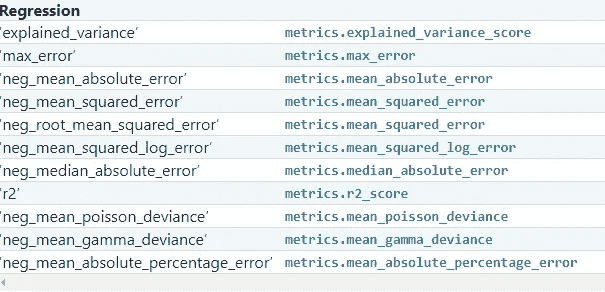
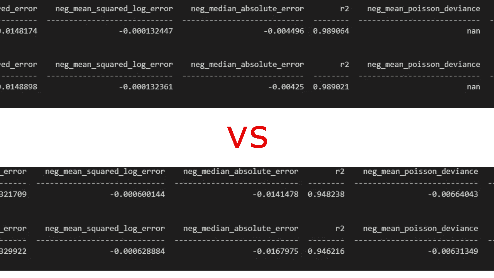
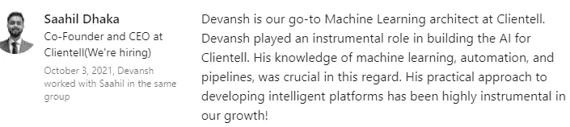

# 编写更好的机器学习评估协议(回归)

> 原文：<https://medium.com/mlearning-ai/writing-better-machine-learning-evaluation-protocols-regression-4efa804f3587?source=collection_archive---------2----------------------->

## 用这个真正使你的 ML 管道变得清晰

当你训练机器学习模型时，你可以在模型中采取的最重要的步骤之一是决定正确的评估协议。您选择评估模型性能的方式会改变您的学习算法的结果。谈到回归，大多数人倾向于坚持 MSE 或 r MSE。这些都是伟大的算法，但它们并非没有缺陷。还有流行的 R 度量，它在允许我们比较模型方面做得很好(并且调整了 R，它修改了 brother)。但这还不是全部。有时在机器学习中，你可能最终会编写自己的回归指标。



An example of all the different error metrics available to us w/ just sklearn

其中许多彼此非常相似。然而，像泊松偏差这样的指标是他们自己的事。将它们进行比较可能会给你提供一些非常有趣的见解。我处理过这样的运行，其中一个模型具有更好的 R /MSE，但是泊松误差更差。只犯错误不会告诉你全部情况。



By the end of this article, you will be able to generate similar-looking reports for your comparison.

这两个表都是使用相同的数据集生成的。唯一的区别是模型本身。看到结果，你会选择哪个？想一想，并在下面的评论中分享。

现在你已经看到了标准 MSE/RMSE/R 之外的世界，请继续阅读。在本文中，我将分享如何生成这样的报告的代码。您可以复制粘贴我分享的代码，但是我建议您也考虑一下何时应该使用哪种度量标准，以及如何在我这里分享的基础上进行改进。

# 设置基础

显然，您希望从设置基础开始。为此，我们采取了以下措施:

```
names=["RFR","Lasso","ElasticNet","KNR"]models=[RandomForestRegressor(),Lasso(),ElasticNet(),neighbors.KNeighborsRegressor()]bestScore=100000scoring = ['neg_mean_squared_error','explained_variance','max_error','neg_mean_absolute_error','neg_root_mean_squared_error','neg_mean_squared_log_error','neg_median_absolute_error','r2','neg_mean_poisson_deviance','neg_mean_gamma_deviance']
```

注意，我们没有对值进行硬编码，而是将它们保存在变量中。这解决了几个目的。一个是这使得以后修改代码更加容易。想要添加新型号/删除弱型号？只需调整型号和名称列表。想要添加您自己的时髦指标/来自其他来源的指标吗？改变你的得分列表。其次，它使你的代码更短。我可以将它们作为一个列表来引用，而不是打出 20 个模型。由于您必须重复使用您的分析，这种便利性真的增加了。

# 写出你的误差函数

现在我们已经设置了组件，是时候编写误差计算函数了。

```
def error_metrics(i, train_data, train_targ, kfold):
    """
    Compute all the relevant metrics. 
    [@params](http://twitter.com/params)
    [@i](http://twitter.com/i)-model number
    [@train_data](http://twitter.com/train_data): X values (predictors)
    [@train_targ](http://twitter.com/train_targ): predictions (y vals)
    [@kfold](http://twitter.com/kfold): k value for cross val"""

    model=[models[i]]
    error_metrics = pd.DataFrame()
    # define the function used to evaluate a given configuration
    for scor in scoring:
        score = []
        for mod in model:
            result=""
            try: 
              result = model_selection.cross_val_score(estimator= mod, X=train_data, y=train_targ,cv=kfold,scoring=scor )
              score.append(result.mean())
            except Exception:
              score.append("Error not Applicable")error_metrics[scor] =pd.Series(score)

    return error_metrics
```

大部分都相对简单。但是现在我们还不支持自定义错误度量。我们如何做到这一点？看看“尝试-例外”部分。当我们尝试交叉验证部分时，我们的自定义/非 scikit 错误将导致异常。我们可以再加一张支票。如果 scor 是我们的特殊指标之一，我们将添加一个意外情况来运行计算。如果你想要最好的实现方式，请联系我。但是我建议你先自己动手。这是很好的练习。你可以随时向我寻求评论、指点和讨论。快乐编码。



Writing such functions/ideas in my pipelines are a huge part of my work

如果你喜欢这篇文章，看看我的其他内容。我定期在 Medium、YouTube、Twitter 和 Substack 上发帖(所有链接都在下面)。我专注于人工智能、机器学习、技术和软件开发。如果你正在准备编码面试，看看:[编码面试变得简单](https://codinginterviewsmadesimple.substack.com/)，我的免费每周时事通讯。如果你也有任何有趣的项目/想法，请随时联系我。

以下是我的 Venmo 和 Paypal 对我工作的金钱支持。任何数额都值得赞赏，并有很大帮助。捐赠解锁独家内容，如论文分析、特殊代码、咨询和模拟面试的折扣率:

https://account.venmo.com/u/FNU-Devansh

贝宝:【paypal.me/ISeeThings 

# 向我伸出手

如果那篇文章让你对联系我感兴趣，那么这一部分就是为你准备的。你可以在任何平台上联系我，或者查看我的其他内容。如果你想讨论家教，发短信给我。如果你想支持我的工作，请使用我的免费 Robinhood 推荐链接。我们都有免费的股票，对你没有风险。因此，不使用它只是失去免费的钱。

查看我在 Medium 上的其他文章。:[https://rb.gy/zn1aiu](https://rb.gy/oaojch)

我的 YouTube:[https://rb.gy/88iwdd](https://rb.gy/88iwdd)

在 LinkedIn 上联系我。我们来连线:[https://rb.gy/m5ok2y](https://rb.gy/f7ltuj)

我的 insta gram:[https://rb.gy/gmvuy9](https://rb.gy/gmvuy9)

我的推特:[https://twitter.com/Machine01776819](https://twitter.com/Machine01776819)

如果你正在准备编码/技术面试:[https://codinginterviewsmadesimple.substack.com/](https://codinginterviewsmadesimple.substack.com/)

获得罗宾汉的免费股票:[https://join.robinhood.com/fnud75](https://www.youtube.com/redirect?redir_token=QUFFLUhqa0xDdC1jTW9nSU91WXlCSFhEVkJ0emJvN1FaUXxBQ3Jtc0ttWkRObUdfem1DZzIyZElfcXVZNGlVNE1xSUc4aVhSVkxBVGtHMWpmei1lWWVKNzlDUXVJR24ydHBtWG1PSXNaMlBMWDQycnlIVXNMYjJZWjdXcHNZQWNnaFBnQUhCV2dNVERQajFLTTVNMV9NVnA3UQ%3D%3D&q=https%3A%2F%2Fjoin.robinhood.com%2Ffnud75&v=WAYRtSj0ces&event=video_description)

[](/mlearning-ai/mlearning-ai-submission-suggestions-b51e2b130bfb) [## Mlearning.ai 提交建议

### 如何成为 Mlearning.ai 上的作家

medium.com](/mlearning-ai/mlearning-ai-submission-suggestions-b51e2b130bfb)