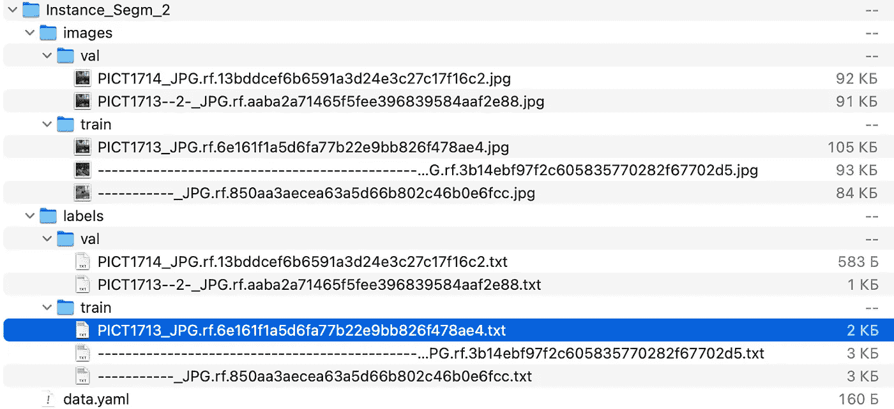
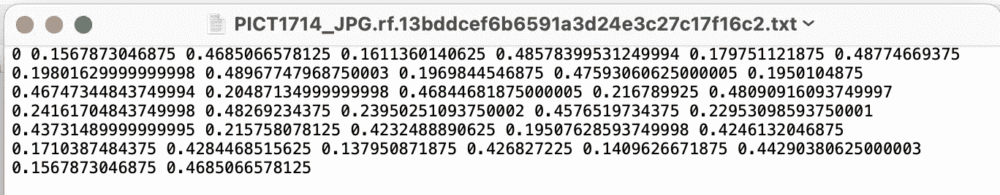
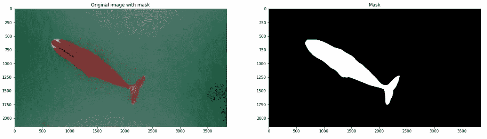
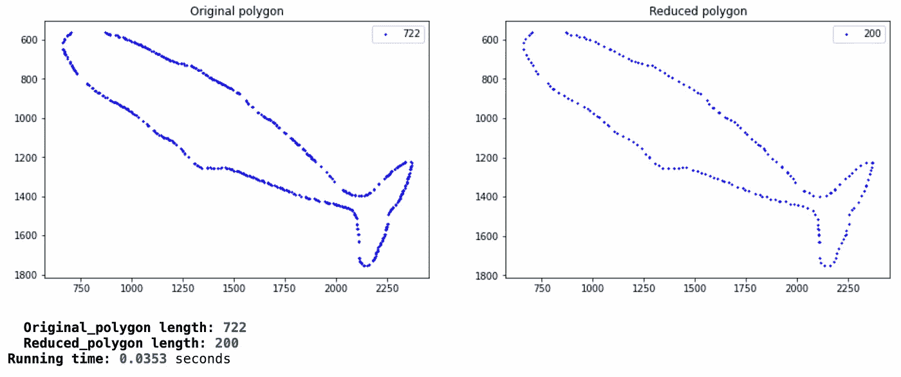
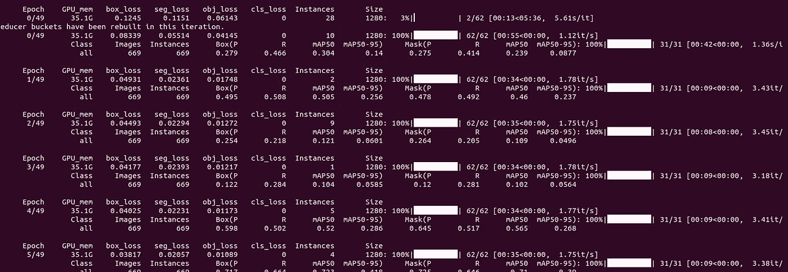
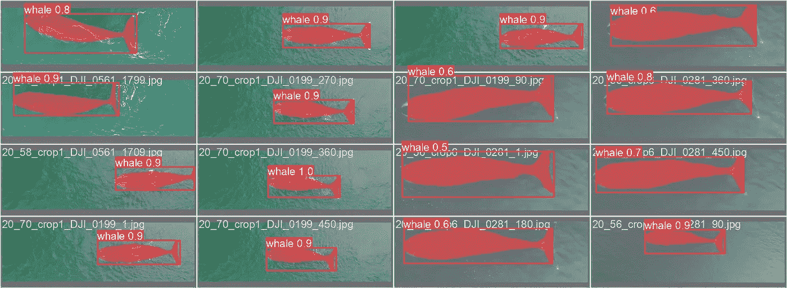
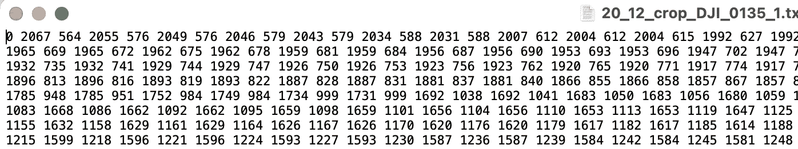

# 用于分段的 YOLOv5

> 原文：<https://medium.com/mlearning-ai/yolov5-for-segmentation-fab39c3487f6?source=collection_archive---------0----------------------->

大家好！今天我要讲的是“如何训练 YOLOv5 进行分段”。

我的故事由几个步骤组成:

1.  为分段准备数据集
2.  在自定义数据集上训练 YOLOv5
3.  用 YOLOv5 推理

1.  **为分割准备数据集**

第一步，您需要以适当的格式准备数据集。这种格式与用于检测的 YOLOv5 格式非常相似。您需要创建如下所示的目录:



下面我们来看看 ***data.yaml*** 文件里面的内容。该文件的结构与检测任务的结构相同。其结构如下所示:


The structure of **data.yaml** file

```
**train** - path to your train images
**val** - path to your validation images
**nc** - number of classes
**names** - сlass names
```

让我们来看看. txt 文件的内部。



第一个元素是“0”。这是班级的人数。接下来的值是多边形的 x 和 y 坐标。奇数元素是 x，偶数元素是 y。这些坐标被归一化为原始图像的大小。如果你想用这个多边形看一个图像，你应该使用下面的函数。第一个打开图像和标记文件，第二个显示图像和标记。

代码的结果如下所示:



有些情况下，你没有多边形，但有二进制遮罩。拥有将二进制掩码转换为多边形的函数将非常有用。此类功能的一个示例如下所示:

上图的结果将是:

```
Number of points: **1444**
```

其中 **722** 分别指向 **x** 和 **y** 坐标。

原则上，我们可以继续在这方面训练模型，但我想给出另一个函数的例子，它允许您在将遮罩转换为多边形后减少获得的点数。当您不想用太多的点高亮显示一个对象时，这很有用。

这些函数不是我自己写的，而是在一个堆栈溢出讨论中找到的。这些函数的输出如下所示:



x 和 y 分别有 722 个点。x 和 y 分别变成了 200 分。

至此，我想结束这一章，继续训练模型。

**2。在自定义数据集上训练 yolov 5**

在这里，您需要在控制台中遵循以下步骤:

```
1\. git clone [https://github.com/ultralytics/yolov5.git](https://github.com/ultralytics/yolov5.git)
2\. pip install -r requirements.txt
```

当您将 YOLOv5 存储库克隆到您的计算机上并安装了所有必需的库之后，您就可以开始学习了。我用的是预训练模型。

```
python3 segment/train.py --data "/Users/vladislavefremov/Downloads/Instance_Segm_2/data.yaml" --weights yolov5s-seg.pt --img 640 --batch-size 2 --epochs 50
```



培训结束后，您可以在验证集上查看结果:



Model predictions on validation.

如果你想了解更多关于 YOLOv5 的参数，你应该去官方知识库([https://github.com/ultralytics/yolov5](https://github.com/ultralytics/yolov5))或者阅读，比如这篇文章([https://towards data science . com/the-practical-guide-for-object-detection-with-yolov 5-algorithm-74c 04 AAC 4843](https://towardsdatascience.com/the-practical-guide-for-object-detection-with-yolov5-algorithm-74c04aac4843))。

**3。用 YOLOv5** 进行推理

我们已经训练了模型，现在我们可以从一张照片、一个包含照片的目录、一个视频、一个包含视频的目录等等中做出推断。

我们先对一个视频做个推断，看看最后的结果。

```
python3 segment/predict.py --weights "/home/user/Disk/Whales/weights/whale_3360/weights/best.pt" --source "/home/user/Disk/Whales/Video" --imgsz 1280 --name video_whale
```

推理后得到的标记是什么形式？多边形还将具有类别索引和绝对 x 和 y 坐标。



**结论**

在本文中，我们研究了如何为 YOLOv5 算法的分段准备数据。我们看了一些有用的函数，它们可以快速地将一个遮罩转换成一个多边形，反之亦然。我们看了一下如何训练 YOLOv5 算法，并在训练好的尺度上做出推断。

用 jupyter 笔记本链接 github:[https://github . com/Vlad 188-1/yolov 5 _ segmentation _ medium _ article](https://github.com/Vlad188-1/YOLOv5_segmentation_medium_article)

[](/mlearning-ai/mlearning-ai-submission-suggestions-b51e2b130bfb) [## Mlearning.ai 提交建议

### 如何成为 Mlearning.ai 上的作家

medium.com](/mlearning-ai/mlearning-ai-submission-suggestions-b51e2b130bfb)