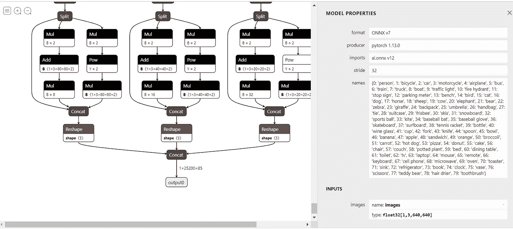

# ONNXRuntime 和 OpenCV DNN 上的 Yolov5 推理。

> 原文：<https://medium.com/mlearning-ai/yolov5-inferencing-on-onnxruntime-and-opencv-dnn-d20e4c52dc31?source=collection_archive---------1----------------------->

我们来探讨一下 yolov5 模型推断。

在搜索在 CPU 上部署对象检测模型的方法时，我遇到了 ONNX 格式。ONNX 是一种开放的神经网络交换，一种统一的模型表示格式。它支持在任何框架中训练的模型在任何部署目标上部署。ONNX 图显示了为获得预测值而对要素进行的逐步变换。ONNX 型号针对任何部署目标进行了优化。

首先，我们需要将 [**yolov5 PyTorch 模型导出到 ONNX**](https://github.com/ultralytics/yolov5/issues/251) 。**[**Netron app**](https://netron.app/)用于可视化 ONNX 模型图形、输入和输出节点及其名称和大小。**

****

**Yolov5s ONNX model graph visualization in Netron app.**

**为了加载和运行 ONNX 模型，使用了 OpenCV DNN 和 ONNXRuntime 模块。**

## ****ONNXRuntime 和 OpenCV DNN 模块****

*   **ONNXRuntime 是一个跨平台的模型加速器。它执行与提供者无关的优化，并将模型图划分为子图，这些子图由硬件上的**执行提供者**使用执行环境中预安装的执行提供者库来执行。**
*   **OpenCV DNN 使用 OpenCV 实现深度学习推理。它可以从不同的框架中加载不同的模型。它针对 CPU 进行了高度优化。**

# ****约洛夫 5 推论****

**为了执行推理，使用导出到 ONNX 的 yolov5s 模型。**

## **W**with onnx runtime****

**ONNX 模型由计算和运算符的图形组成。它们针对不同的硬件目标进行了优化。使用特定于执行目标(CPU、GPU、IoT 等)的执行提供者来执行这些操作符。).使用参数**提供者**配置执行提供者。**

1.  **在下面的例子中，如果 CUDA 执行提供程序 ONNX 运行时在 GPU 上执行内核。如果不是，内核就在 CPU 上执行。**

```
providers = ['CUDAExecutionProvider', 'CPUExecutionProvider'] if ort.get_device()=='GPU' else ['CPUExecutionProvider']
session = ort.InferenceSession('yolov5s.onnx', providers=providers)
```

**2.**。get_outputs()** 和**。get_inputs()** 方法用于获取节点的输入和输出元数据。**

```
outname = [i.name for i in session.get_outputs()] 
inname = [i.name for i in session.get_inputs()]
```

**3.若要计算预测，请运行 ONNX 模型。该函数采用输出名称和输入字典{输入名称:输入值}。输出是一个结果列表，其中的结果是一个数组或张量。**

```
inp = {inname[0]:im}
outputs = session.run(outname, inp)
```

**4.为了避免多个重叠的边界框，实现了非最大值抑制。基于置信度和 IOU 阈值，边界框被过滤掉。**

```
output= torch.from_numpy(outputs)
out = non_max_suppression(output, conf_thres=0.7, iou_thres=0.5)
```

**5.在图像上绘制边界框以进行最终检测。**

```
for i,(x0,y0,x1,y1,score,cls_id) in enumerate(out):
      box = np.array([x0,y0,x1,y1])
      box -= np.array(dwdh*2)
      box /= ratio
      box = box.round().astype(np.int32).tolist()
      cls_id = int(cls_id)
      score = round(float(score),3)
      name = names[cls_id]
      color = colors[name]
      name += ' '+str(score)
      cv2.rectangle(img,box[:2],box[2:],color,2)
      cv2.putText(img,name,(box[0], box[1] - 2),cv2.FONT_HERSHEY_SIMPLEX,0.75,[225, 255, 255],thickness=2) 
```

## ****与 OpenCV DNN****

1.  **加载 ONNX 模型。**

```
net = cv2.dnn.readNetFromONNX('yolov5s.onnx')
```

**2.将图像转换为斑点，并将其设置为网络的输入。函数**getUnconnectedOutLayersNames()**给出输出层的名称，图像通过该输出层向前传播到检测。**

```
blob = cv2.dnn.blobFromImage(img, 1/255 , (640, 640), swapRB=True, mean=(0,0,0), crop= False)
net.setInput(blob)
outputs= net.forward(net.getUnconnectedOutLayersNames())
```

**3.循环检测，并根据置信度阈值和类分值筛选出好的检测。每个检测包含 **x，y，w，h，置信度得分，以及取决于类别数量的类别分数值**。**

```
for i in range(n_detections):
  detect=out[0][i]
  confidence= detect[4]
  if confidence >= conf_threshold:
    class_score= detect[5:]
    class_id= np.argmax(class_score)
    if (class_score[class_id]> score_threshold):
      score.append(confidence)
      class_ids.append(class_id)
      x, y, w, h = detect[0], detect[1], detect[2], detect[3]
      left= int((x - w/2)* x_scale )
      top= int((y - h/2)*y_scale)
      width = int(w * x_scale)
      height = int( y*y_scale)
      box= np.array([left, top, width, height])
      boxes.append(box)
```

**4.应用非最大抑制来移除多个重叠检测。**

```
indices = cv2.dnn.NMSBoxes(boxes, np.array(score), conf_threshold, nms_threshold)
```

**5.基于最终检测在图像上绘制边界框。**

```
for i in indices:
    box = boxes[i]
    left = box[0]
    top = box[1]
    width = box[2]
    height = box[3] 
    cv2.rectangle(img, (left, top), (left + width, top + height), (0, 0, 255), 3)
    label = "{}:{:.2f}".format(classes[class_ids[i]], score[i])
    text_size = cv2.getTextSize(label, cv2.FONT_HERSHEY_SIMPLEX, 0.7, 1)
    dim, baseline = text_size[0], text_size[1]
    cv2.rectangle(img, (left, top), (left + dim[0], top + dim[1] + baseline), (0,0,0), cv2.FILLED)
    cv2.putText(img, label, (left, top + dim[1]), cv2.FONT_HERSHEY_SIMPLEX, 0.7, (255, 255, 0), 1, cv2.LINE_AA)
```

**这将有助于您在 CPU 上部署定制的 yolov5 型号。在 [**my GitHub**](https://github.com/poojatambe/Yolov5-inference-on-ONNXRuntime-and-opencv-DNN) 上查看完整代码。**

## **参考**

1.  **[https://github.com/ultralytics/yolov5](https://github.com/ultralytics/yolov5)**
2.  **[https://learnopencv . com/object-detection-using-yolov 5-and-opencv-dnn-in-c-and-python/](https://learnopencv.com/object-detection-using-yolov5-and-opencv-dnn-in-c-and-python/)**
3.  **[https://onnx.ai/](https://onnx.ai/)**
4.  **[https://onnxruntime.ai/](https://onnxruntime.ai/)**

****以前的故事，****

1.  **[关于焦损的一切](/geekculture/everything-about-focal-loss-f2d8ab294133)。**
2.  **[带 Streamlit 的图像分类器](/geekculture/image-classifier-with-streamlit-887fc186f60)。**
3.  **[决策树分裂:熵与误分类误差](/towards-artificial-intelligence/decision-tree-splitting-entropy-vs-misclassification-error-27fdf2f5e3bf)。**

**快乐学习！！！**

**[](/mlearning-ai/mlearning-ai-submission-suggestions-b51e2b130bfb) [## Mlearning.ai 提交建议

### 如何成为 Mlearning.ai 上的作家

medium.com](/mlearning-ai/mlearning-ai-submission-suggestions-b51e2b130bfb)**