# YOLOX 解释——YOLOX 是如何工作的？

> 原文：<https://medium.com/mlearning-ai/yolox-explanation-how-does-yolox-work-3e5c89f2bf78?source=collection_archive---------0----------------------->

本文是我全面解释 YOLOX(你只看一次 X)模型如何工作的系列文章的第二篇。如果您对该代码感兴趣，可以在下面找到它的链接:

[](https://github.com/gmongaras/YOLOX_From_Scratch/tree/main) [## GitHub-gmongaras/YOLOX _ 从头开始

### 试图从头开始构建 YOLOX 算法。

github.com](https://github.com/gmongaras/YOLOX_From_Scratch/tree/main) 

本系列有 4 个部分来全面介绍 YOLOX 算法:

*   什么是 YOLO，它有什么特别之处？
*   【YOLOX 是怎么工作的？ ( [自我](/p/3e5c89f2bf78))
*   [用于动态标签分配的 SimOTA](https://gmongaras.medium.com/yolox-explanation-simota-for-dynamic-label-assignment-8fa5ae397f76)
*   [用于数据增强的镶嵌和混合](https://gmongaras.medium.com/yolox-explanation-mosaic-and-mixup-for-data-augmentation-3839465a3adf)

# 暗网-53——YOLOX 的主干

YOLOv3 算法是许多对象检测算法的基础，也是 YOLOX 使用的算法。在进入 YOLOv3 之前，我假设你已经知道 YOLOv1 是如何工作的，在上一篇文章中[对此有简要的解释。](/p/c01f6a8a0830)

YOLOv3 算法与最初的 YOLO 算法非常相似，但是它做了一些小的改变，这些改变产生了重大的影响。

YOLOv3 的一个主要变化是它使用了一个叫做 **Darknet-53** 的大型主干。(主干只是一个非常不专业的结构，数据最初是通过它发送的)。主干的架构使用 1×1 卷积、剩余连接和 3×3 卷积来构成非常强大的特征提取器。这个主干也是 YOLOX 使用的，它有以下架构。

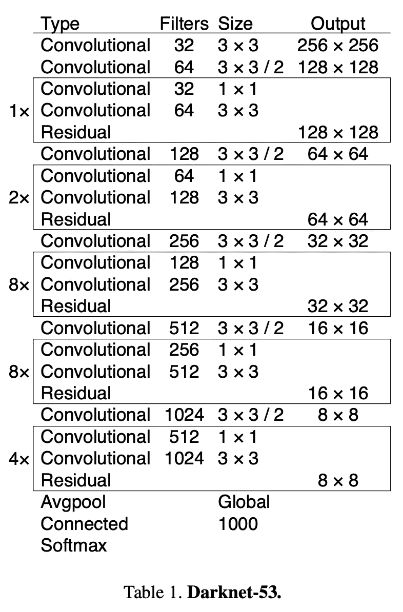

Darknet-53 architecture from the YOLOv3 paper: [https://paperswithcode.com/method/darknet-53](https://paperswithcode.com/method/darknet-53)

从 YOLOv3 获得预测的第一步是通过这个主干发送图像，然后对数据进行编码，这样 YOLOv3 头就可以进行最终预测。(与主干不同，头是一种用于进行预测的专门架构)。

YOLOv3 车型的车头和 YOLOv1 车型基本一致。在我们的例子中，两者之间的差异并不重要，因为 YOLOX 完全改变了模型的头部。请记住，YOLOv1 模型的最终预测基本上是一个巨大的三维张量，其中长度和宽度是不同的预测，深度是预测的不同特征。

我在阅读 YOLOv3 论文时遇到的一个问题是，既然输出要通过 softmax 层，我如何从 Darknet 主干网获得特性？这个模型使用了一种叫做**特征金字塔网络(FPN)** 的东西。特征金字塔网络从具有不同方面(不同宽度和高度)的图像中提取信息。为了用暗网做到这一点，我们从模型中取出转换状态，并把它们作为几个输出，而不是来自网络末端的单个输出。下面是如何工作的示意图。

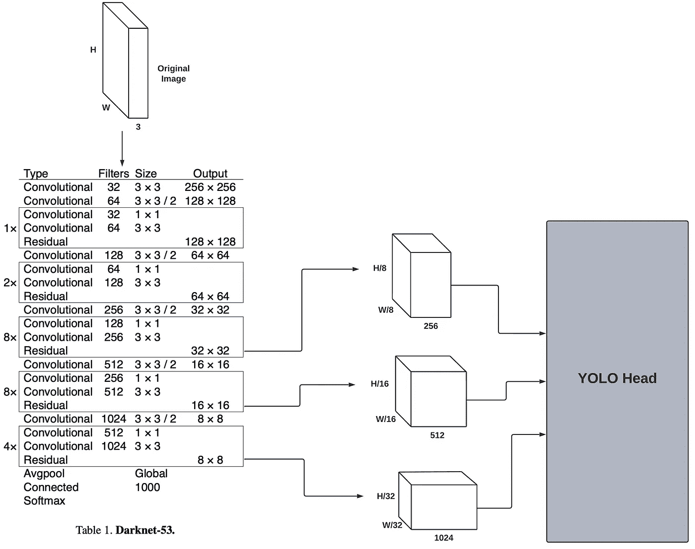

The Darknet backbone and its three outputs

本质上，Darknet-53 主干(从现在开始我可以称之为 FPN)在不同的尺度上输出三种不同的预测:

1.  256 通道(第一转换输出)
2.  512 通道(第二转换输出)
3.  1024 通道(第三转换输出)

这些输出中的每一个都以不同的尺度提取信息。请注意，随着通道数量的增加，图像的长度和宽度会减小。因此，256 通道过渡输出以较小的比例提取特征，而 1024 通道输出以较大的比例提取特征，因为 1024 通道输出具有较少的来自原始图像的信息来处理。

# YOLOv3 头与 YOLOX 头

虽然 YOLOv3 脊梁和 YOLOX 脊梁是一样的，但是模型从头部开始不同。下图显示了两个头的区别。

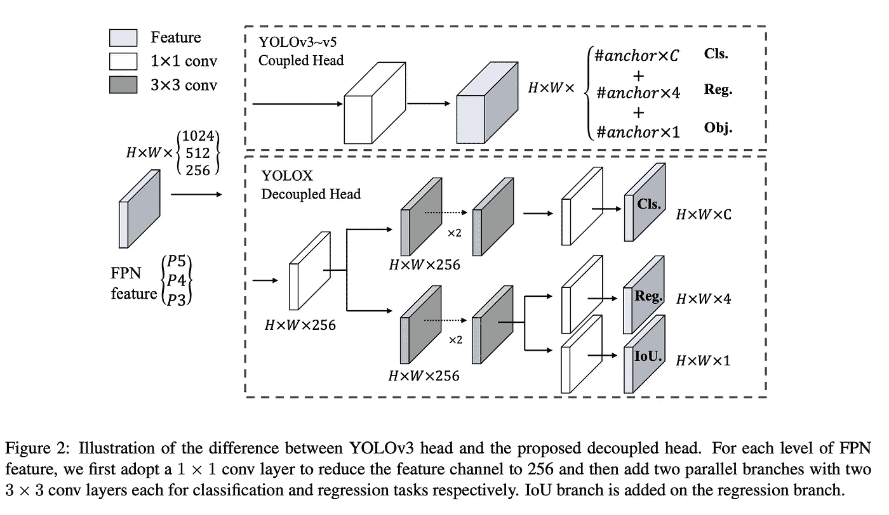

YOLOv3 vs. YOLOX head from the original YOLOX: [https://paperswithcode.com/method/yolox](https://paperswithcode.com/method/yolox)

当我第一次看到这个图表时，我发现它有点混乱，所以下面是我的图表的标记版本，我希望它能更容易理解。

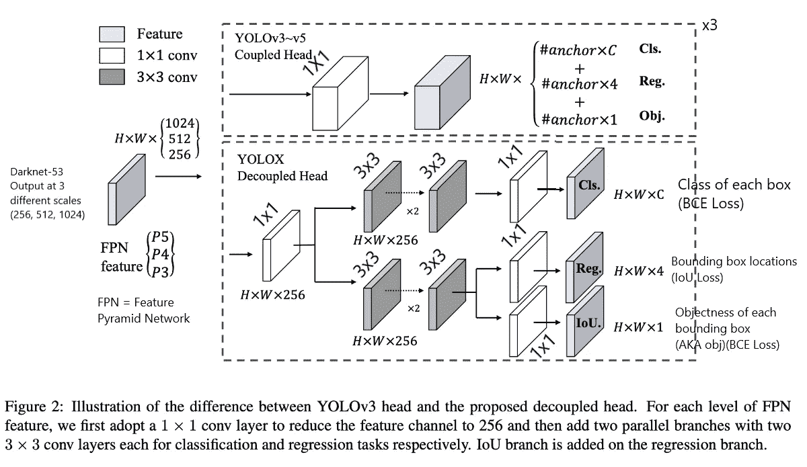

该图说明了 YOLOv3 头和 YOLOX 头的输入是来自 FPN(暗网)主干的三个不同规模的输出，即 1024、512、256 个通道。

两个头的输出在尺寸(高×宽×特征)上基本上完全相同，就像原始的 YOLO 一样。两个头的区别在于 YOLOv3 采用耦合头，YOLOX 采用解耦头。因此，YOLOX 的输出实际上是 3 个张量，每个张量包含不同的信息，而不是 1 个包含所有信息的大质量张量。

三个张量 YOLOX 输出包含与大质量张量 YOLOv3 输出相同的信息:

1.  Cls:每个边界框的类
2.  Reg:边界框的 4 个部分(x，y，w，h)
3.  IoU (Obj):出于某种原因，作者使用 IoU 而不是 Obj，但这个输出只是网络对边界框中有一个对象有多确信(objectness)

就像原始输出一样，输出的高度和宽度中的每个“像素”都是不同的边界框预测。所以，有 H*W 种不同的预测。

上面列出的输出仅针对 FPN 的单个输出。记住，FPN 有三个输出，分别馈入 YOLOv3 和 YOLOX 的头部。这意味着实际上每个磁头有三个不同的输出，而不是一个。因此，YOLOv3 的输出实际上是(3×h×w×features ), YOLOX 的输出实际上是 Cls、Reg 和 IoU (obj)输出的 3 倍，总共 9 个输出。

# 切换到无锚点模式

YOLOX 做出的最重要的改变之一是不使用锚点，而 YOLOv3 严重依赖锚点。

**什么是主播？**

锚点基本上是一个预定义的边界框形状，有助于网络。先前的 YOLO 算法不是预测直接边界框，而是预测从预定义锚框的偏移。假设锚盒的长度和宽度分别为 100 和 50，而模型预测的长度和宽度分别为 10 和 15。最终的边界框预测将是从锚框的偏移，长度和宽度分别为 110 和 65。更多关于锚箱的信息可以在对话中[找到。](https://github.com/pjreddie/darknet/issues/568)

基本上，锚框是帮助模型的一种方式，因此它不必直接预测边界框。

**锚箱的问题**

锚盒基本上是额外的参数。模特要用几个主播？锚的尺寸应该是多少？这些问题导致模型中更多的超参数调整和更少的多样性。

【YOLOX 如何修复锚箱问题？

YOLOX 只是让模型直接预测边界框的尺寸，而不是预测锚框的偏移量。为了直接预测一个边界框，YOLOX 使用了一个上面解释过的解耦头。此外，它使用了一种叫做大步走的东西。

**大步流星**

YOLOX 不仅仅基于 YOLOv3，它还基于 FCOS，这是另一个边界框模型，但它不是 YOLO 系列的一部分，这使得它不是很酷。

FCOS 用大步来帮助模型。想象一下，模型必须学会预测从 0，0 处的图像的左上角到 1024，1024 处的图像的右下角的任何地方的边界框。在离散空间中，模型有 1048576 个可能的预测位置，由于预测范围如此之广，它可能无法了解任何信息。

跨越解决了这个问题，并允许模型从偏移而不是从图像的左上角进行预测。基本上，我们可以根据模型进行预测的三种不同尺度将图像分割成网格。例如，网格可能如下所示:

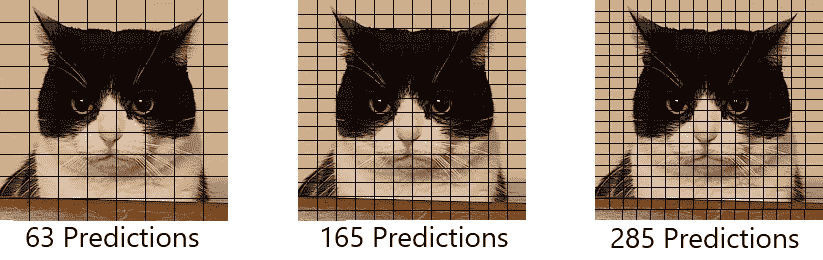

Cat Grids

使用这些网格，我们可以将每个预测分配给网格上的每个交叉点。YOLOX 模型预测的好处在于它们已经是长×宽的格式了。因此，我们可以将每个输出直接映射到网格上的一个唯一点，然后使用该网格点作为偏移来缩放边界框。

上面的网格可以通过定义某一步距来创建，该步距是网格上每个交叉点之间的距离。在 YOLOX 算法中，每个 FPN 级别分别使用 32、16 和 8 的步长。如果在 256×256 的图像上使用 32 的跨距，那么在每个维度上将有总共 256/32 = 8 个交点，总共 64 个交点。

例如，我将使用上面定义的 YOLOX FPN 步幅在下面的图像上添加网格:

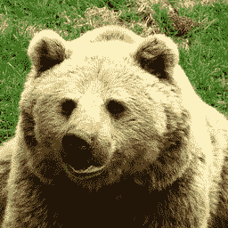

Bear

下图显示了熊图像的网格覆盖:

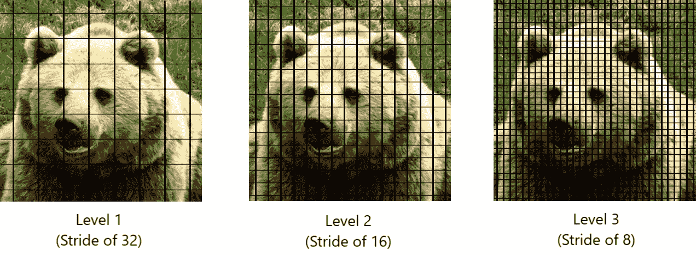

Bear Grids

图像上的每个交点被称为**锚点**。不要把这个和前面解释的锚混淆，因为这种类型的锚略有不同。锚点是移动预测的 x，y 位置的偏移量，而之前解释的锚点(这是 YOLOX 去掉的)是一个预定义的框，用作预测的 w，h 部分的偏移量。锚盒不好，因为它们是需要调整的额外超参数，而锚点很好，因为它们不涉及我们需要调整的额外参数。

注意:从现在开始，当我说 anchor 时，我指的是 YOLOX 使用的网格上的位置，而不是 YOLOv3 使用的预定义边界框。

图像上的锚位置可通过以下公式获得:

```
x = s/2 + s*i
y = s/2 + s*j
```

其中 *s* 为步幅， *i* 为 *x* 轴上的 *i* 交点， *j* 为 *y* 轴上的 *j* 交点

对于 YOLOX，我们使用网格点作为边界框的左上角偏移量。以下公式用于将预测的边界框(p_x，p_y，p_w，p_h)映射到图像上的实际位置(l_x，l_y，l_w，l_h ),如果(x，y)是预测所属的网格上的交点，并且 *s* 是当前 FPN 级别的步幅:

```
l_x = p_x + x
l_y = p_y + y
l_w = s*e^(p_w)
l_h = s*e^(p_h)
```

我们通过将预测添加到锚点(分配给该预测的 x，y 点)来移动预测点。我们还通过确保宽度和高度不是负的指数函数，并根据图像的步幅来移动它，来反规格化宽度和高度。

例如，让我们回到熊的形象，步幅为 32。如果这个预测的定位点是( *i* ， *j* ) = (2，1)，意味着交点 2 在*x*-轴上，交点 1 在*y*-轴上，我将看到图像上的以下点:

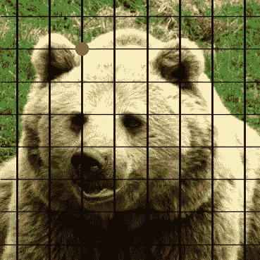

Bear Grid with a point at (2, 1) assuming index starts at 0 and (0, 0) is the top left corner

注意:该点位于网格上的(2，1)处，但就像素而言，它位于:

```
x = 32/2 + 32*2 = 16 + 64 = 80
y = 32/2 + 32*1 = 16 + 32 = 48
```

如果模型给我的预测值是(20，15，0.2，0.3)，那么我们可以将盒子计算为:

```
l_x = 20 + 80 = 100
l_y = 15 + 48 = 63
l_w = 32*e^(0.2) = 39
l_h = 32*e^(0.3) = 43
```

因此，最终图像可能如下所示:

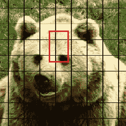

Bear Grid with bounding box

# 标签分配

不是所有的预测都是相等的。有些显然是垃圾，我们甚至不希望我们的模型优化它们。为了区分好的和坏的预测，YOLOX 使用了一种叫做 **SimOTA** 的东西，用于动态标签分配。

**SimOTA** 将在下一篇文章中解释，但现在，你需要知道的是，被认为是“好的”(限制了一个地面真理对象)的预测被标记为正面，而那些“坏的”(限制了背景)的预测被标记为负面。

当损失函数之一使用它们时，负标签的预测不仅仅被丢弃。

另一方面，正面的标签真的很重要。我们如何知道我们希望每个锚点优化哪个地面真实边界框？(注:ground truth 是指我们希望模型预测的边界框)SimOTA 不只是分配正/负标签，它还会将 ground truth 边界框分配给图像中每个正标签的锚点。这个基本事实包围盒对于优化模型非常重要。

# 损失函数—评估 YOLOX

YOLOX 模型有三个输出，每个输出都有自己的损失函数，因为它们需要以不同的方式进行优化。

**班级优化**

正如 YOLOX 模型所述，类输出具有以下形状:H×W× *C* 。因此，对于每个预测，模型都预测一个包含 *C* 个元素的向量。

*C* 是可供选择的类别数。因此，每个元素代表该类的概率，或者模型认为该类是边界框中的一个类的置信度。

为了优化这一点，我们可以使用一个[独热编码向量](https://machinelearningmastery.com/why-one-hot-encode-data-in-machine-learning/)，它为每个锚/预测编码地面真实边界框的类。对于每个预测，独热向量具有 *C* 个元素。独热向量中的 1 位于我们希望模型预测的类的位置，而 0 位于所有其他位置。例如，如果我有四个类，并且我希望模型预测第二个类，则向量可能如下所示

```
pred1: [0.45, 0.25, 0.05, 0.25] # The model is most confident in the 1st class
pred2: [0.25, 0.25, 0.25, 0.25] # The model is not confident in any class
pred3: [0.1, 0.7, 0.1, 0.1] # The model is very confident in the second class
labels: [0, 1, 0, 0] # 1 in the second location which is what we want the model to predict
```

为了优化这些预测，我们可以通过[**【BCE】**](https://towardsdatascience.com/understanding-binary-cross-entropy-log-loss-a-visual-explanation-a3ac6025181a)二进制交叉熵损失函数来放置预测(形状为 H×W×C)和基本事实标签(形状也为 H×W×C)。具体来说，我们将**所有正面预测**通过 BCE 和 logits，这是一种有趣的说法，即通过 sigmoid 进行预测，然后通过 BCE 函数进行预测。

注:在这一损失中不使用负标预测

使用独热编码向量而不是仅使用正确的类的原因是为了帮助模型了解正确的类应该具有权重 1，而其他类应该具有权重 0。请注意模型的类输出如何具有与一键向量相同的维数。该模型不是预测单个值，而是预测所有可能类别的分布。所以，我们不应该针对单个值进行优化，相反，我们希望针对它预测的所有值进行优化。

**回归优化**

优化回归(边界框预测)输出比类输出稍微复杂一些。请记住，回归输出的形状是 H×W×4，其中每个预测是(x，y，w，h)。

有人可能认为使用[**【MSE】**](https://www.freecodecamp.org/news/machine-learning-mean-squared-error-regression-line-c7dde9a26b93/)是一个很好的评估指标，因为它是一个回归任务。YOLOv3 实际上使用了一种类似的度量标准，称为误差平方和(SSE)。这些指标的问题是，它会导致模型过度适应训练样本中的回归目标。

**并集上的交集(IOU)**

为了克服这个问题，YOLOX 使用了一个名为 **IoU** 的评估指标。

IoU 的计算方法是取一个预测的边界框，并将其与实际边界框进行比较。IoU 首先计算两个边界框之间的交集，然后是并集。最终结果是由盒子的并集划分的盒子之间的交集。

让我们仔细看看欠条。首先，交集永远不能大于并集，最小交集是 0，这给了我们以下约束:

0 ≤ I ≤ U

当没有交集时，并集将是两个框组合的面积(A₁+A₂),当两个框有 100%交集时，并集将是其中一个框的面积(A₁),给我们以下约束:

A₁ ≤ U ≤ A₁+A₂

因此，随着交集的增长，IoU 趋向于 1，因为交集和并集收敛到相同的值。随着交集的减少，IoU 趋向于 0，因为并集增大，分子变小，分母变大。因此，IoU 具有以下值:

0 ≤ IoU ≤ 1

我们实际上想要最大化 IoU 值，因为我们想要交集包含两个框的整体。问题是梯度下降会将损耗降至最低，因此 IoU 的损耗等于 1-IoU，值相同，但方向相反。因此，当交点接近 0%时，损耗值较高，当交点接近 100%时，损耗值较低。

**评估回归输出**

为了评估回归输出，我们实际上使用 [**泛交集超过并集【GIoU】**](https://giou.stanford.edu/)。GIoU 类似于 IoU，只是它的值介于-1 和 1 之间。IoU(值，而不是损失)的问题是 IoU 为 0 的盒子没有任何额外的信息。有很多借据的值都是 0，所以 GIoU 解决了这个问题。这种想法是相同的，只是它编码了更多的信息，并允许在 IoU 为 0 时具有非零值的更平滑的函数。

为了优化模型，我们通过对所有正面预测求和并最小化该和来直接最小化 GIoU 损失。

注:在这一损失中不使用负标预测

**借据/实物** **损失**

如果模型认为盒子里有物体，我们希望它的客观分数接近 1，如果它不认为盒子里有东西，它的客观分数大约为 0，如果它不确定，它的客观分数介于两者之间(希望在 0.5 左右)。

因此，我们想要一个介于 0 和 1 之间的函数，当边界框完全覆盖对象时，它更接近于 1，当对象完全不覆盖对象时，它更接近于 0。一个完美的功能就是 IoU。具体来说，我们希望使用 IoU，而不是 GIoU，因为 GIoU 的范围是 2，而 IoU 的范围是 1。

类似于类损失函数，我们将使用 **BCE** 来优化对象预测。要优化单个预测，有两种可能性:

1.  容易考虑的预测是那些被标记为积极的预测。
2.  我们必须考虑的第二组预测是那些被标记为负面的预测。

由于 SimOTA 将基本事实边界框分配给正预测，我们可以采用预测边界框和基本事实边界框之间的 IoU 来获得我们希望模型预测的值。然后，我们可以将预测的对象和 IoU 值放入 BCE 损失函数中，以获得该预测的损失。

负面预测的问题是，我们希望对象损失优化坏预测，以便它了解坏预测和好预测的区别。SimOTA 不会为负标签预测分配边界框。那么，我们如何获得负面预测的基本事实边界框呢？

为每个负面预测分配对象标签的一种方法是为所有负面预测分配值 0。这个策略的一个问题是有更好的负面标签和更坏的负面标签。并非所有的负面标签都一样糟糕。

获得负面预测的基本事实的更好方法是查看图像中的所有基本事实边界框。我们可以计算预测的负标签边界框和所有地面事实之间的 IoU。然后，我们取最大的 IoU 值(意味着预测边界框比所有其他地面事实更多地覆盖该地面事实),并将该 IoU 值分配给预测边界框。然后，我们可以采用 BCE 和预测对象与分配的 IoU 值之间的逻辑值来获得该负标签的损失。

注意:所有的预测，包括负面标记的预测，都被用在这个损失中。

**最终损失函数**

最终损失函数是上述三种损失的组合，定义如下:

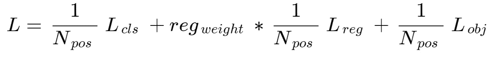

Final Loss function for YOLOX

损失函数基本上是所有损失的总和，这些损失是阳性标签数的平均值。请记住，我们使用 SimOTA 为每个预测分配标签。

*reg_weight* 是一个平衡术语，用于权衡回归损失与其他损失，因为这是最重要的优化。作者使用的权重为 5.0。

# 做出推论

YOLOX 模型像大多数其他机器学习模型一样进行推理，但有一个主要问题需要处理。和往常一样，为了做出推断，我们应该像平常一样通过模型发送数据。

在对输出做任何事情之前，记住我们使用 BCE 和 logits，而不是 BCE 来优化类和对象预测。带有 logits 的 BCE 正在优化输出的 sigmoid，而不是默认输出。因此，要获得正确形式的数据，首先要做的是获取 class 和 objectness 值的 sigmoid。此外，请记住，模型预测的是每个类预测的分布，而不是类值。因此，我们希望获取每个类预测的 argmax，以获得该类的最终预测:

```
final_cls = argmax(sigmoid(cls), axis=-1)
final_obj = sigmoid(obj)
```

至于回归目标，我们必须将它们移动到正确的位置，就像本文前面定义的跨越一样。

我们在进行推理时面临的一个问题是，YOLOX 输出了许多边界框，而这些边界框中的大多数都不是好的预测。为了处理这个问题，模型的输出经过两个修剪步骤:

1.  移除置信度得分(客观)低于某个阈值的所有输出。当我编写 YOLOX 模型时，我删除了所有置信度低于 0.5 的预测。
2.  使用软非最大抑制来进一步修剪预测。

在通过这两个步骤进行预测之后，应该留下少量的预测，这些预测就是模型的最终预测。

**非最大抑制**

非最大值抑制是一种非常好的修剪边界框的方法，不需要知道图像中的基本事实在哪里。为此，该算法基本上删除了高度重叠的预测，如下图所示:

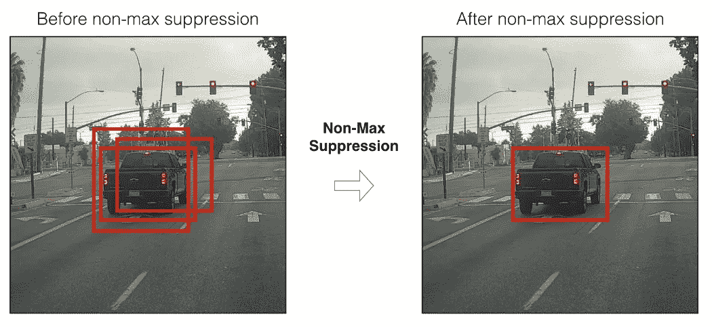

非最大值抑制移除高重叠边界框的方法是使用重叠边界框之间的 IoU 分数。具有高 IoU 的那些被移除，以便保留单个边界框。

下面是我用来实现软 NMS(非最大抑制)的伪代码:

```
Definitions:
B - The predicted bounding boxes with shape (x, y, w, h)
S - The confidence score for each bounding box (objectness)
C - The class for each boudning box
score_thresh - The score threshold to remove boxes
IoU_thresh - The IoU threshold to update scoressoftNMS(B, S, C, score_thresh, IoU_thresh):
  D = []   <- Boudning boxes we want to keep for all images for img in imgs:
    b = B[img]
    s = S[img]
    d = [] while b not empty:
      Get the bounding box with the highest score and save it
      m = argmax(s)
      M = b[m]
      d.append(M)

      Remove the bounding box with the highest score from the lists

      Get the mean of all confidence scores
      mean_scores = mean(s) Get the IoU between M and all b
      IoU = IoU_funct(M, b)

      Update all scores, s, where the IoU > IoU_thresh
      idx = argwhere(IoU > IoU_thresh)
      s[idx] = s[idx]*e^(-(IoU[idx]**2)/mean_scores) Remove the bounding boxes from b where s < score_thresh
      b = b[s >= score_thresh] Save the bounding boxes for this image
    D.append(d)return D
```

以下是不同格式的步骤:

1.  获取具有最高客观性分数的边界框
2.  从列表中删除所选预测
3.  获取所有剩余客观性分数的平均值
4.  获取所选边框 *M* 和所有其他边框 *b* 之间的借据
5.  用高 IoU 更新边界框的分数
6.  从分数小于分数阈值的 *b* 中移除所有边界框
7.  重复步骤 1-7，直到 *b* 为空

用于更新分数的公式可以在[原始软非最大值抑制论文](https://arxiv.org/abs/1704.04503)(第 4 页)中找到。这是该论文建议的公式之一，可以与其他几个公式一起用于创建软非最大抑制。

我不打算深入研究非最大值抑制的实现，但是如果您想查看[一个有效的编码示例](https://github.com/gmongaras/YOLOX_From_Scratch/blob/main/src/nonmaxSupression.py)，或者在本文中阅读关于它的更多信息[，您可以查看我的代码。](https://towardsdatascience.com/non-maximum-suppression-nms-93ce178e177c)

这基本上就是 YOLOX 的全部内容。在下一篇文章中，我们将讨论 SimOTA 如何为动态标签分配工作。

# 来源

约洛克斯:[https://arxiv.org/abs/2107.08430](https://arxiv.org/abs/2107.08430)

https://arxiv.org/abs/1804.02767

https://arxiv.org/abs/1904.01355

https://arxiv.org/abs/1704.04503[NMS](https://arxiv.org/abs/1704.04503)

[](/mlearning-ai/mlearning-ai-submission-suggestions-b51e2b130bfb) [## Mlearning.ai 提交建议

### 如何成为 Mlearning.ai 上的作家

medium.com](/mlearning-ai/mlearning-ai-submission-suggestions-b51e2b130bfb)