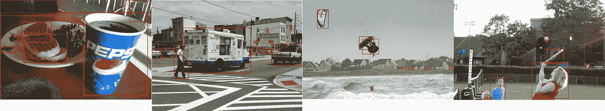
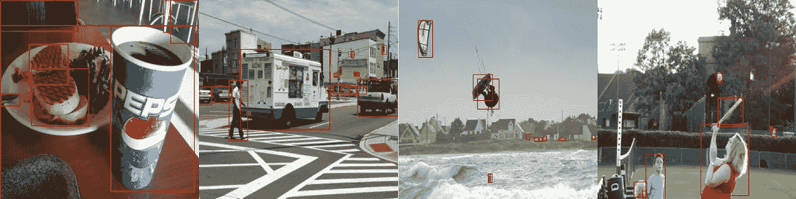
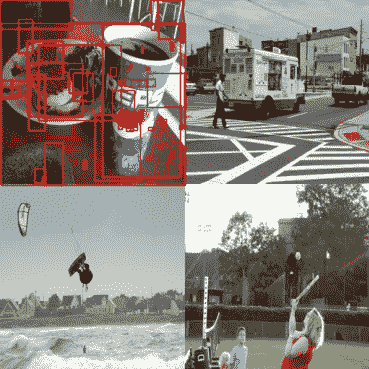
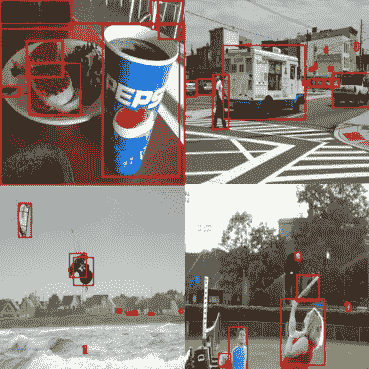
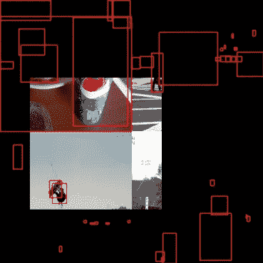
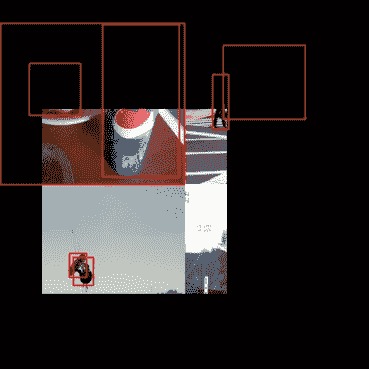
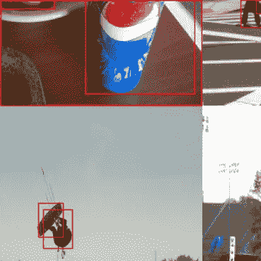
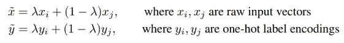
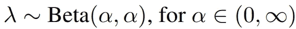
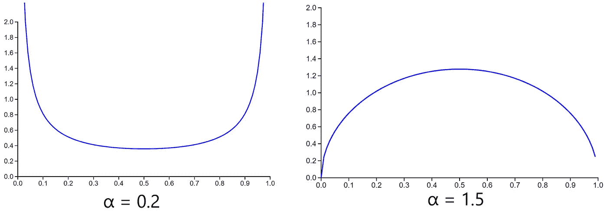

# YOLOX 解释—用于数据扩充的镶嵌和混合

> 原文：<https://medium.com/mlearning-ai/yolox-explanation-mosaic-and-mixup-for-data-augmentation-3839465a3adf?source=collection_archive---------0----------------------->

本文是我全面解释 YOLOX(你只看一次 X)模型如何工作的系列文章的第四篇，也是最后一篇。如果您对该代码感兴趣，可以在下面找到它的链接:

 [## GitHub-gmongaras/YOLOX _ 从头开始

### 试图从头开始构建 YOLOX 算法

github.com](https://github.com/gmongaras/YOLOX_From_Scratch) 

本系列有 4 个部分来全面介绍 YOLOX 算法:

*   什么是 YOLO，它有什么特别之处？
*   【YOLOX 是怎么工作的？
*   [用于动态标签分配的 SimOTA](/p/8fa5ae397f76)
*   **用于数据扩充的镶嵌和混合** ( [自身](/p/3839465a3adf))

# 数据扩充

数据扩充是帮助模型泛化的一种方式。当扩充数据时，模型必须在数据中找到新的特征来识别对象，而不是依赖一些特征来确定图像中的对象。

YOLOX 使用一些最好的数据扩充来帮助模型对数据进行更多的概括。我将在本文中讨论 YOLOX 使用的两个最好的数据增强。

# 马赛克

镶嵌数据扩充首先在 YOLOv4 中引入，是对 [CutMix](https://arxiv.org/abs/1905.04899) 数据扩充的改进。

马赛克背后的想法非常简单。取 4 张图片，组合成一张图片。Mosaic 通过调整四幅图像的大小，将它们拼接在一起，然后随机剪切拼接的图像来获得最终的马赛克图像。

当用 YOLO 算法执行镶嵌增强时的一个困难是，当创建最终图像时，我们必须担心边界框。这个任务并不太难，因为我们可以很容易地调整边界框的大小并移动它们。只是在将图像拼接在一起并创建剪切后，要弄清楚盒子应该移动到哪里有点烦人。

给定四幅图像和生成图像的最终尺寸，以下是创建最终镶嵌图像的步骤:

1.  调整图像大小。在这种情况下，我调整到输出图像的形状
2.  将所有图像合并成一个图像，其中 4 个调整大小的图像分别位于不同的角落
3.  将边界框放在新图像的正确区域。
4.  采取一个随机的剪切，这是我们想要的最终结果的图像大小。这个剪切可以在 4 个图像组合的任何地方，但是我做了一些限制，使最终的图像更好一些
5.  移除不在剪切块中的边界框
6.  调整被剪切掉的任何剩余边界框的大小

给定以下 4 幅图像，并希望最终图像尺寸为 256×256，让我们来看看这个过程是如何工作的:

4 images to Mosaic together

1.将图像大小调整为最终图像大小(256×256)。这一步可以用很多方法来完成，但我是通过找到图像的比例，然后手动调整图像的大小来完成的。当调整边界框大小时，比例开始起作用，因为那些边界框需要按照调整图像大小时的相同比例来调整大小。我的代码中有一个名为 [resize](https://github.com/gmongaras/YOLOX_From_Scratch/blob/main/src/dataAugmentation.py) 的函数，如果你想看看我是如何调整每个图像及其边界框的大小的。

Each image is now of size 256×256 and each bounding box is in the correct location

2.将所有图像合并成一个图像。为此，创建一个 3×512×512 的零张量，并将每个图像叠加到新张量的每个角上。注意下图中所有的边界框都是混乱的，所以我们必须把它们移动到正确的位置。

Combination of all four images

3.移动边界框非常简单:

*   左上角图像的边界框不必移动
*   右上角图像中的边界框应该向右移动 256
*   左下角的边界框应该向下移动 256 像素
*   右下角的边界框应该向右下方移动 256 像素

要将边界框移动 256，只需将边界框数组中的 x 或 y 值加上 256。记住每个边界框有 4 个部分(x，y，w，h)

Combination of all four images with bounding boxes in the correct location

4.随机截取图像。

在图像的任何地方随机截取一个图像的一个问题是，截取的图像通常包含一到两个图像，但是我们希望它包含所有四个图像。为此，我们可以在最终图像尺寸的平方根(16 到 240)内的任何地方进行剪切。虽然，我设置的条件可能太小了，但是您可以通过值约束来找到您喜欢的条件。

我制作剪影的方法是在最终图像尺寸的平方根(16)和当前组合图像尺寸的一半减去平方根(240)之间选择一个随机点，得到剪影的左上角。然后在这个随机的点上加上 256，就得到切口的右下角位置。这样，剪切部分永远不会超出最大图像尺寸，并保持在我们希望剪切部分所在的平方根边界内。

Cutout of the image

5.移除剪切块外的边界框。

请注意大多数边界框是如何位于剪切区域之外的。为了解决这个问题，我们可以首先移除剪切块外部的所有边界框，但是保留剪切块内部的那些边界框。

Cutout of the image with outside bounding boxes removed

请注意一些边界框仍然位于剪切块之外。我们本可以摆脱这些，但是这种技术的问题是模型没有学习我们想要它学习的东西。我们希望模型学习不同的特征来区分不同的项目，所以我们保留不完全在剪切中的边界框

6.调整剪切块中所有剩余边界框的大小

为了处理剩余的边界框，我们可以调整它们的大小，使它们位于剪切块中。要做到这一点，我们可以将所有边界框从剪切块中移到剪切块之外，然后根据我们重新定位每个边界框的量来调整边界框的大小。最终结果如下所示:

Final Mosaic image

请注意，即使是最小的边界框也保留在图像中，就像图像左上角的三明治一样。该模型必须进行更多的归纳，才能将该对象识别为三明治，因为该对象不包含典型三明治可能包含的所有特征。

我发现了马赛克的一个改进版本，它解决了马赛克算法的问题。如果你想了解更多，你可以通过链接找到论文[。](https://iopscience.iop.org/article/10.1088/1742-6596/1684/1/012094/pdf)

至于最初的马赛克算法，我找不到关于它的论文，但在 YOLOv4 中对它进行了简要介绍，并且网上有一些资料谈到了该算法的工作原理。

# 混合

Mixup 最初是为分类任务而创建的，但它仍然非常适合对象检测任务。Mixup 基本上基于加权参数λ将两幅图像平均在一起。更正式地，该论文通过以下两个公式来描述定义的混合:

Mixup Definition

因此，我们可以通过组合两幅图像 xᵢ和 xⱼ.来创建输出图像 x̃但是，由于这种增加是为了标签分配，我们也对一次性类嵌入进行平均。我们要解决的任务与边界框有关，所以我们不是将边界框平均在一起，而是将两幅图像的注释合并成一个。因此所有的边界框将被组合到相同的列表中，表示来自两个图像的所有边界框也属于组合图像。

该论文建议从贝塔分布中取样λ参数:

Original Lambda paper definition

这篇论文显示了α值为 0.2、0.3 和 0.4 时的结果，尽管我发现这导致平均值可能向 0 或 1 的高端倾斜。这意味着图像平均值不会真正成为两幅图像的平均值，而是更像一幅带有一些噪声的图像。我在网上的某个地方(我忘了是哪个网站了)发现α为 1.5 似乎效果更好，出来的图像更平均。

Beta Distribution at α=0.2 and α=1.5 [http://eurekastatistics.com/beta-distribution-pdf-grapher/](http://eurekastatistics.com/beta-distribution-pdf-grapher/)

看起来α = 1.5 时的β分布倾向于接近 0.5 的值，而α = 0.2 时的分布倾向于接近 0 和 1 的值。

Mixup 的结果有一些有趣的结果，如下所示:

Mixup example

《Mixup》一文还探讨了 Mixup 的工作原理。如果你想了解为什么 Mixup 会起作用，我已经在本文末尾链接了这篇文章。

实现对象检测的混合并不困难，需要一些基本步骤:

1.  将图像调整到相同的尺寸
2.  从 Beta 分布中取样以获得λ值
3.  将图像 1 中的所有值乘以λ
4.  将图 2 中的所有值乘以 1-λ
5.  将两幅图像相加得到最终图像
6.  合并注释以获得图像的最终注释

如果你想看看我是如何实现 Mixup 或者 Mosaic 的，你可以在我的 Github 上找到，链接在本文的顶部。

混合和镶嵌是 YOLOX 使用的两大增强功能。两者背后的思想都相对简单，实现起来也不太困难。这是关于 YOLOX 如何工作的最后一篇文章。如果你有任何问题，请让我知道，我会尽力回答他们。

# 参考

约洛夫 4:[https://arxiv.org/abs/2004.10934](https://arxiv.org/abs/2004.10934)

马赛克解释:【https://www.youtube.com/watch?time_continue=450】T2&v = V6uj-egme 7g&feature = emb _ title

混淆:【https://arxiv.org/abs/1710.09412v2】T4

 [## Mlearning.ai 提交建议

### 如何成为 Mlearning.ai 上的作家

medium.com](/mlearning-ai/mlearning-ai-submission-suggestions-b51e2b130bfb)