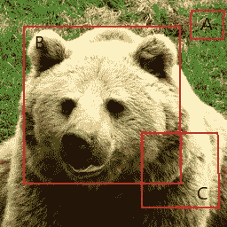
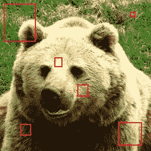
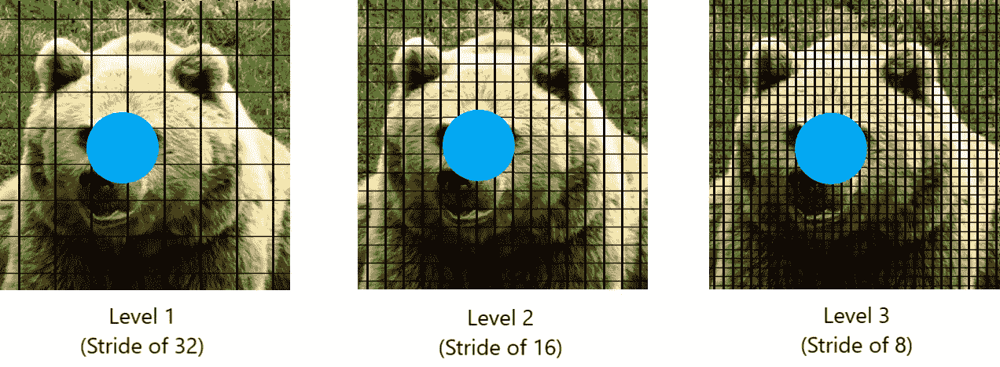

# YOLOX 解释— SimOTA 用于动态标签分配

> 原文：<https://medium.com/mlearning-ai/yolox-explanation-simota-for-dynamic-label-assignment-8fa5ae397f76?source=collection_archive---------0----------------------->

本文是我全面解释 YOLOX(你只看一次 X)模型如何工作的系列文章的第三篇。如果您对该代码感兴趣，可以在下面找到它的链接:

[](https://github.com/gmongaras/YOLOX_From_Scratch/tree/main) [## GitHub-gmongaras/YOLOX _ 从头开始

### 试图从头开始构建 YOLOX 算法

github.com](https://github.com/gmongaras/YOLOX_From_Scratch/tree/main) 

本系列有 4 个部分来全面介绍 YOLOX 算法:

*   什么是 YOLO，它有什么特别之处？
*   【YOLOX 是怎么工作的？
*   **SimOTA 进行动态标签分配** ( [self](/p/8fa5ae397f76) )
*   [用于数据增强的镶嵌和混合](https://gmongaras.medium.com/yolox-explanation-mosaic-and-mixup-for-data-augmentation-3839465a3adf)

# 目标检测中的标签分配

标签分配是对象检测中的一项关键任务，因为它决定了在训练期间什么样的边界框与什么样的地面真实对象相匹配。正如在上一篇文章中提到的[，标签分配将锚点分为正组和负组。](/p/3e5c89f2bf78)

正分组锚点被认为是绑定对象的好预测，而负分组锚点被认为是不绑定对象的坏预测。

例如，请看下图:



Bear Box

请注意，有三个边界框，分别标记为 A、B 和 C。如果一个人检查边界框并将其标记为正或负，他们可能会说 B 是正的，因为它完全限制了熊的头部，而 A 和 C 是负的，因为它没有限制熊的头部。如果熊的头是地面真实物体，他们也可能会说 B 会跟着地面真实物体走，而 A 和 C 不会跟着任何地面真实物体走，或者只是跟着背景走。

有很多方法可以将边界框标记为正或负，我将介绍 YOLOX 如何使用 SimOTA 解决这个问题。

# 为什么在训练中使用标签分配？

SimOTA 需要地面真值对象来分配标签。所以，它只在训练时使用，而不在推理时使用。

标签分配有助于模型在训练时更加稳定。我们可以使用标签分配来获得最佳预测，而不是优化所有预测(在 YOLOX 中，对于 256 个输入图像，预测的数量大约是 1344 个)。然后，我们可以优化最佳预测，使它们变得更好。

请记住，该模型优化了回归和类别目标的阳性预测，但优化了阳性/阴性目标的客观性。通过这种方式，模型可以学习做出更好的预测，而不用担心其他的预测。剔除不好的预测会使最终模型做出更好的预测。

训练更稳定的原因是模型必须处理更少的梯度更新。与处理回归和类损失的数千个梯度更新的模型相反，它只需要处理每个图像的几个梯度更新。由于模型更新处理较少的输出，优化空间更容易优化。

# SimOTA 之前的标签分配

标签分配可以通过多种方式完成。分配标签的一种最常见的方式是通过找到地面真实边界框和所有其他边界框之间的最高 IoU。具有最高 IoU 的预测被分配给该基础事实对象。

其他算法可能会使用其他类似的方法，但 SimOTA 的作者声称，“在没有上下文的情况下，为每个 gt(地面真实)独立分配 pos/neg 样本可能是次优的，就像缺乏上下文可能会导致不正确的预测一样。”为了处理次优标签分配问题，作者建议使用图像中的全局上下文来分配标签，而不是旧的标签分配算法所使用的局部上下文。

# 飞越顶部攻击(Overflying-Top Attack)

OTA 是提出的处理全局上下文标签分配的方法。OTA 将标签分配问题视为一个[最优传输(OT)问题](https://kantorovich.org/post/ot_intro/)。

OTA 的作者(他们也是 YOLOX 的作者)将 OT 问题定义为一个在某个区域有 *m* 个供给和 *n* 个需求的问题。第 *i* 供应商持有 s *ᵢ* 单位货物，而第 *j* 需求 d *ⱼ* 单位货物。每单位货物从一个供方 *i* 到需方 *j* 的运输成本记为 *cᵢⱼ.*该问题的目标是找到一个运输计划𝝅*，根据该计划，供应商的所有货物都可以以最小的运输成本运输到需求方(第 3 页)

本质上，OT 有供应商和需求者，目标是找到最佳的计划，以最低的成本将供应品运输给需求者。

OTA 将标签分配公式化为 OT 问题，其中 *m* 供应商是 *gt* 目标，而 *n* 需求者是图像上的预测或锚位置。请记住，每个预测都被分配给图像上的一个锚点，因此这两个可以作为同义词使用。 *gt* 目标是向有需求的主播提供正面标签，目标是形成向主播提供正面标签的最佳方案。如你所见，目标实际上是使用 OT 问题找到将锚/预测标记为 pos/neg 的最佳方式。

除了 gts，还有另一个供应商，后台。该供应商持有所有其他标签，并显示在算法的步骤 4 中。

在解释 OTA 算法之前，首先让我们定义一些符号:

*   *I* -输入图像
*   *A* -输入图像上的锚点集合
*   *G* -图像中的地面真实包围盒 *I*
*   *m* -地面真实目标的数量
*   *n* -锚的数量
*   *k* -每台 gt 可提供的阳性标签数量
*   s *ᵢ* -供应第*I*th gt(s*ᵢ*=*k*
*   d*ⱼ*-*j*号锚的需求
*   *c* -从 gt *ᵢ* 运输一个阳性标签到锚定 a *ⱼ* 的费用
*   -背景类，通常表示为 0
*   α -回归平衡系数(通常大于或等于 1，以加权大于 1 的回归损失)
*   *T* -运行 Sinkhorn-Knopp 迭代的迭代次数

获得最佳标签分配的算法如下。

1.  将 *m* 和 *n* 指定为地面真相数和锚数的计数
2.  通过在模型中发送图像 *I* 来获得类别预测 Pᶜˡˢ和回归预测 Pᵇᵒˣ。
3.  创建供应向量， *s* ，其值为 *m* + 1。使用**动态 *k* 估算**获得每个 gt 的供应量，并将其存储在向量中。
4.  *s*[*m*+1]=*n*-sum(*s*)，供给向量中位置 *m* + 1 处的背景供给等于 *n* - sum( *s*
5.  将需求向量 *d、*初始化为大小为 *n* 的向量，用 1 填充。
6.  获得每个第 *j* 个预测与其对应的第 *i* 个真实标签之间的成对 *cls* 损失。 *c* ᶜˡˢ = FocalLoss(Pᶜˡˢ， *G* ᶜˡˢ)
7.  获得每个第 *j* 个预测与其对应的第 *i* 个真实标签之间的成对 *reg* 损失。 *c* ʳᵉᵍ = IoULoss(Pᵇᵒˣ， *G* ᵇᵒˣ)
8.  在每个 *j* th 锚和其对应的 *i* th gt 之间获得成对的**中心优先**。*c*ᶜᵖ= center prior(a*ⱼ*， *G* ᵇᵒˣ)
9.  获取背景类成本: *c* ᵇᵍ = FocalLoss(Pᶜˡˢ，ψ)
10.  得到前台成本:*c*ᶠᵍ=*c*ᶜˡˢ+*αc*ʳᵉᵍ+*c*ᶜᵖ
11.  通过连接 *c* ᵇᵍ到 *c* ᶠᵍ来计算最终成本矩阵 *c* 以形成最终形状矩阵( *m* +1， *n* )
12.  将 *u* 和 *v* 初始化为一
13.  通过运行 Sinkhorn-Knopp Iter 进行 *T* 步骤来填充 *u* 和 *v* 。
14.  ^
15.  根据原始文件中的等式 11 计算最优分配计划𝝅*。
16.  返回𝝅*

论文给出了如下算法。


[https://arxiv.org/abs/2103.14259](https://arxiv.org/abs/2103.14259)

# 西蒙塔

算法看起来要处理很多，但也没那么糟糕。SimOTA 使算法更加简单和快速。

YOLOX 的作者意识到，即使 OTA 提高了模型的性能，它也使模型慢了 25%,这对于训练一个模型大约 300 次迭代来说是一个很大的时间。作者意识到，他们可以通过删除 Sinkhorn Iter 步骤，而不是近似最优分配计划，使 OTA OT 算法更快，同时保持良好的性能提升。

不使用 Sinkhorn 迭代，SimOTA 选择成本最低的顶部 *kᵢ* (或 s *ᵢ* )预测作为第 *i* 地面实况对象的正样本。使用 SimOTA 分配方法，在所有 gt 对象上的单次迭代近似分配，而不是使用优化算法来获得最佳分配。

SimOTA 算法如下所示:

1.  将 *m* 和 *n* 指定为地面真相数和锚数的计数
2.  通过模型发送图像 *I* 获得类别预测 Pᶜˡˢ和回归预测 Pᵇᵒˣ。
3.  创建供应向量 *s* ，其值为 *m* + 1。使用**动态 *k* 估算**得到每个 gt 的供应量，并存储在向量中。
4.  *s*[*m*+1]=*n*—sum(*s*)，供给向量中位置 *m* + 1 处的背景供给等于 *n* — sum( *s*
5.  将需求向量 *d、*初始化为大小为 *n* 的向量，并用 1 填充。
6.  获得每个 *j* 个预测与其对应的 *i* 个地面真实标签之间的成对 *cls* 损失。 *c* ᶜˡˢ = FocalLoss(Pᶜˡˢ， *G* ᶜˡˢ)
7.  获得每个第 *j* 个预测与其对应的第 *i* 个真实标签之间的成对 *reg* 损失。 *c* ʳᵉᵍ = IoULoss(Pᵇᵒˣ， *G* ᵇᵒˣ)
8.  获得每个 *j* 个锚与其对应的 *i* 个锚之间的成对**中心先验**。 *c* ᶜᵖ =中心优先(A *ⱼ* ， *G* ᵇᵒˣ)
9.  获取背景类成本: *c* ᵇᵍ = FocalLoss(Pᶜˡˢ
10.  得到前景成本:*c*ᶠᵍ=*c*ᶜˡˢ+*αc*ʳᵉᵍ+*c*ᶜᵖ
11.  通过连接 *c* ᵇᵍ到 *c* ᶠᵍ来计算最终的成本矩阵 *c* 以形成最终的形状矩阵( *m* +1， *n* )
12.  迭代 *s* 中的所有供应 *sᵢ* 并获得成本最低的顶部 *sᵢ* 最佳预测 *cᵢ* 。结果数组应该有 *m* 个值，其中结果数组中的每个 *mᵢ* 索引最多有 *sᵢ* 个预测。
13.  返回结果数组

运行 SimOTA 后，输出将是一个大小为 *m* 的数组，其中结果数组中的第 *i* 个元素是一个对应于第 *i* 个基本事实 *Gᵢ* 的正标签锚/预测。不在结果数组中的其余预测被认为是没有 gt 赋值的负标签预测。

# 动态 k 估计

*k* 是每个 gt 对象的供应量，有两种计算方式。计算 k 的简单方法是让它在所有 gt 对象中保持不变。这种给每个 gt 分配供给的方式的问题是，不是所有的地面实况都应该有相同数量的锚被分配给它们。

计算 *k* 的第二种建议方法是分别查看每个 gt。OTA 的作者建议使用动态 *k* 估算，该估算接近每个燃气轮机的供应量。为了估算每个燃气轮机的电源，我们可以查看所有预测，并根据每个预测和燃气轮机之间的 IoU 值选择顶部的 *q* 预测。然后，我们对顶部的 *q* IoU 值求和，并将其用作该 gt 的 *k* 值。

使用这种方法，我们通过观察每个预测限定 gt 的准确程度来估计每个 gt 的供应或阳性标签的数量。这样，当使用 SimOTA 算法时，预测更准确的 gt 更有可能被分配给该 gt。OTA 的作者陈述了这种算法背后的直觉，即“某个 gt 的合适的正锚的数量应该与很好地回归该 gt 的锚的数量正相关。”

注意:虽然 *k* 不再是我们必须改变的参数，但是 *q* 现在是必须调整的参数。在我的代码中，我使用 20 作为 *q* 值，这看起来很好。

下面是我的动态 *k* 估算代码:

```
# The supplying vector
s_i = np.ones(m+1, dtype=np.int16)# The sum of all k values
k_sum = 0# Iterate over all ground truth boxes (i = gt_i)
for i in range(0, m): # Get the ith truth value
    gt = G_reg[i] # Get the (x, y) coordinates of the intersections
    xA = np.maximum(gt[0], P_reg[:, 0])
    yA = np.maximum(gt[1], P_reg[:, 1])
    xB = np.minimum(gt[0]+gt[2], P_reg[:, 0]+P_reg[:, 2])
    yB = np.minimum(gt[1]+gt[3], P_reg[:, 1]+P_reg[:, 3]) # Get the area of the intersections
    intersectionArea = np.maximum(0, xB - xA + 1) * np.maximum(0, yB - yA + 1) # Compute the area of both rectangles
    areaA = (gt[2]+1)*(gt[3]+1)
    areaB = (P_reg[:, 2]+1)*(P_reg[:, 3]+1) # Get the union of the rectangles
    union = areaA + areaB - intersectionArea # Compute the intersection over union for all anchors
    IoU = intersectionArea/union # Get the q top IoU values (the top q predictions)
    # and sum them up to get the k for this gt
    k = np.sort(IoU)[-q:].sum() # Add the k value to the total k sum
    k_sum += k # Save the k value to the supplying vector
    # as an iteger
    s_i[i] = int(round(k))
```

# 中心先验

SimOTA 在分配标签时遇到的一个问题是，来自 gt 的正标签可以被分配给任何锚预测。有时，当分配正面标签时，gt 没有很好的选项可供选择，但由于它必须分配 *k* 正面标签，gt 必须向自己分配负面正面标签。例如，请看下图:



请注意，图像上的所有边界框都没有很好地覆盖熊的脸。如果熊的脸是一个 gt 对象，假设它有一个值为 2 的 supply 或 *k* ，那么它必须选择两个预测作为正标签。显然，没有两个预测是好的，gt 对象将求助于使两个坏的预测为正。

在训练初期，坏预测问题非常突出。因此，gts 没有一个很好的预测是一个大问题。

解决方案是定义一个半径 *r* 并选择距离每个 gt 中心最近的 r 个锚不被惩罚，同时通过向这些预测增加额外成本来惩罚该 r 半径之外的所有其他锚。如 SimOTA 算法的步骤 8 所示，计算中心先验成本并将其添加到所有预测的总成本中。

选择 r 半径内具有更高机会被选为该 gt 的正锚的预测背后的直觉是更接近的锚预测更容易优化，而进一步的预测更难优化。

为了得到最接近 r 的预测，我们可以使用古老的距离公式来得到所有点和 gt 中心之间的距离。

首先，我们可以找到 gt 的中心， *G* ，将 x 坐标增加一半宽度，y 坐标增加一半高度，如下所示:

```
center = (G[0]+G[2]//2, G[1]+G[3]//2)
```

然后，我们可以使用所有锚点 *A* 和 gt *G* 之间的距离公式:

```
diff = A-center
dist = np.sqrt(np.sum(diff**2, axis=-1))
```

注意:*中心*将是一对两个坐标。如果 *A* 是(x，y)轴上的锚位置，那么我们可以从 *A* 中减去*中心*来得到 *A* 的差对数。因此，距离公式是计算沿这些二维坐标对的距离。 *dist* 的结果应该等于 *A* 中的锚数量。

下面是我写的一个函数，它可以在我的代码中找到，用来计算单个基础事实和所有锚之间的中心先验:

```
# Get the center prior between a gt and the anchor locations
# on the image
# Inputs:
#   A - All anchors for a single image
#   G_box - A ground truth box for this image
#   r - radius used to select anchors in this function
#   extraCost - The extra cost to add to those anchors not in
#               the r**2 radius
# Output:
#   Array with the same number of values as the number of anchors
#   where each value is the center prior value of that anchor
def centerPrior(A, G_box, r, extraCost):
    ## Center Prior selects the r**2 closest anchors according to the
    ## center distance between the anchors and gts. Those anchors
    ## that are in the radius are not subject to any extra cost, but those
    ## anchors outside the radius are assigned extra cost to avoid
    ## having them be labelled as positive anchors for this gt.

    # Get the center location of the ground truth boudning box
    center = (G_box[0]+(G_box[2]//2), G_box[1]+(G_box[3]//2))

    # Get the difference between the center locations in A and the
    # center location of the gt bounding box
    diff = A-center

    # Use the distance formula to get the distance from the
    # gt center location for each anchor
    dist = np.sqrt(np.sum(diff**2, axis=-1))

    # Get the indices of the distances which are greater
    # than r**2 meaning the anchor is outside the radius
    idx_neg = np.where(dist > r**2)

    # Array of zeros corresponding to the center prior of each anchor
    c_cp = np.zeros(A.shape[0])

    # Those values not in the r**2 radius are subject to a constant cost
    c_cp[idx_neg] = extraCost

    return c_cp
```

记住每个 FPN 关卡有不同数量的锚。在 256 像素的输入图像上，在 FPN 级上将有 64、256、1024 个锚，分别具有 32、16 和 8 的步幅。如果半径相当大，熊的头是 gt，那么蓝色圆圈中网格上的交叉点就是锚点，不需要额外的成本。



OTA 的作者指出，挑选 r 个最接近的锚点可以稳定训练，尤其是在训练的早期阶段。此外，他们声称，由于模型训练中的这种额外稳定性，该模型会产生更好的性能。

YOLOX 实际上会删除 r 半径以外的标签。它没有给半径之外的预测额外的成本，而是移除了 r 半径之外的所有预测。有时这将导致该 gt 没有预测，但是移除半径之外的预测保持了中心先验，并有助于模型的稳定性，因此梯度不会由于一些坏的预测而爆炸。我实际上发现，完全删除半径以外的预测会影响性能，但这可能是因为我只对 1000 张图像进行了训练。

这就结束了西蒙塔。剩下要解释的就是 YOLOX 使用的数据扩充，这将在下一篇文章中解释。

# 参考

太田:【https://arxiv.org/abs/2103.14259】T2

约洛克斯:【https://arxiv.org/abs/2107.08430】T4

[](/mlearning-ai/mlearning-ai-submission-suggestions-b51e2b130bfb) [## Mlearning.ai 提交建议

### 如何成为 Mlearning.ai 上的作家

medium.com](/mlearning-ai/mlearning-ai-submission-suggestions-b51e2b130bfb)