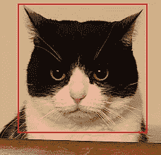
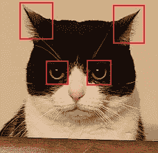
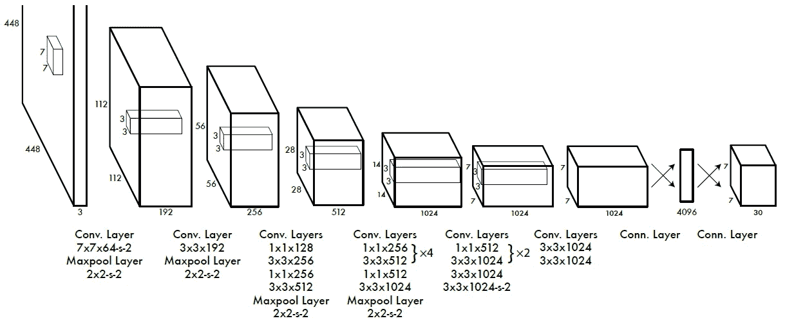
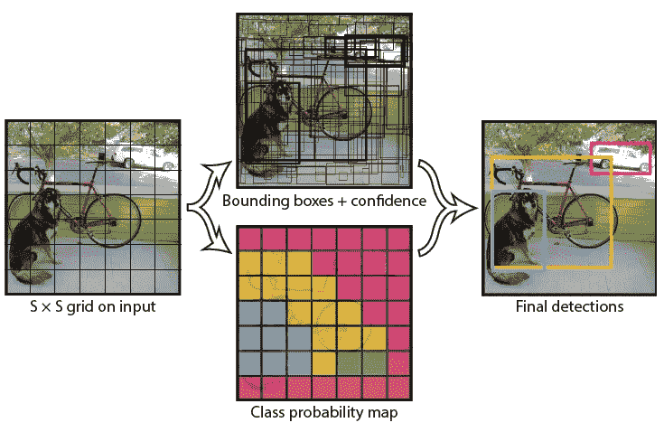
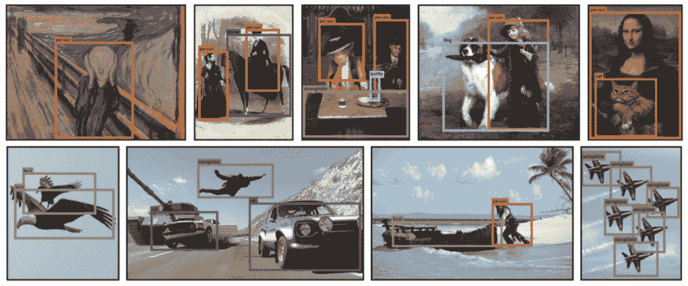

# YOLOX 解释——什么是 YOLO，它有什么特别之处？

> 原文：<https://medium.com/mlearning-ai/yolox-explanation-what-is-yolox-and-what-makes-it-special-c01f6a8a0830?source=collection_archive---------1----------------------->

本文是我全面解释 YOLOX(你只看一次 X)模型如何工作的系列文章的第一篇。我还从头开始编写模型代码。如果您对该代码感兴趣，可以在下面找到它的链接:

 [## GitHub-gmongaras/YOLOX _ 从头开始

### 试图从头开始构建 YOLOX 算法

github.com](https://github.com/gmongaras/YOLOX_From_Scratch/tree/main) 

本系列有 4 个部分来全面介绍 YOLOX 算法:

*   什么是 YOLO，它有什么特别之处？ ( [自我](/p/c01f6a8a0830))
*   【YOLOX 是怎么工作的？
*   [用于动态标签分配的 SimOTA](https://gmongaras.medium.com/yolox-explanation-simota-for-dynamic-label-assignment-8fa5ae397f76)
*   [用于数据增强的镶嵌和混合](https://gmongaras.medium.com/yolox-explanation-mosaic-and-mixup-for-data-augmentation-3839465a3adf)

要完全理解整个系列，您需要知道:

*   [神经网络如何工作](/@gmongaras/how-do-neural-networks-work-bfdd3ca6c23a?source=user_profile---------2----------------------------)
*   [卷积神经网络如何工作](https://towardsdatascience.com/a-comprehensive-guide-to-convolutional-neural-networks-the-eli5-way-3bd2b1164a53)(CNN 是 YOLO 算法的基础)
*   基本神经网络损失函数，如 [BCE](https://towardsdatascience.com/understanding-binary-cross-entropy-log-loss-a-visual-explanation-a3ac6025181a) 和 [MSE](https://www.freecodecamp.org/news/machine-learning-mean-squared-error-regression-line-c7dde9a26b93/)

# YOLO 算法解决了什么问题？

首先，让我们回顾一下 YOLO 试图解决的问题。

YOLO 算法于 2015 年首次推出，以解决对象检测问题。顾名思义，对象检测问题是当给计算机一幅图像，它必须检测图像中某些对象的位置。

为了解决对象检测问题，YOLO 使用包围盒。边界框是放在图像一部分周围的框，表示图像的框中部分有一个对象。例如，假设我想知道我的猫在这张照片中的位置:

Cat

包围我的猫的边界框可能如下所示:

Cat Box :)

如果相反，我想找到我的猫的耳朵和眼睛呢？那么可能会有如下所示的 4 个框:

Cat Boxes :O

这个任务对于人类来说足够简单，但是对于计算机来说，这个任务不是很直观。计算机面临的一些问题是:

*   没有固定数量的边界框放在图像上
*   必须在图像上放置不同大小的边界框
*   需要了解一个物体在不同尺度下的样子

# YOLO 是如何工作的？

YOLO 算法通过预测三种不同的特征来工作:

1.  图像上边界框的位置
2.  边界框中有一个对象的置信度(注意:这是模型知道的任何对象在框中的置信度，而不是特定类在框中的置信度)
3.  框中对象的类别或标签

因此，我的猫的脸周围的边界框可能具有以下属性:

1.  边界框:(25，5，185，183)
2.  置信度:0.9567
3.  类别:猫

注意边界框是如何被分成 4 个部分的。在某些边界框算法中，边界框具有以下属性:

(左上角的 x 坐标、左上角的 y 坐标、边界框的宽度、边界框的高度)

其他边界框算法可以使用以下属性:

(左上角的 x 坐标，左上角的 y 坐标，右下角的 x 坐标，右下角的 y 坐标)

不管怎样，这些预测本质上都意味着同样的事情。

# YOLO 是如何预测的？

最初的 YOLO 算法的目标是快速处理图像并做出准确的预测。这种速度对于实时任务是必要的，例如需要立即知道物体位置的自动驾驶车辆。

YOLO 算法将包围盒问题视为一个[回归任务和一个分类任务](https://machinelearningmastery.com/classification-versus-regression-in-machine-learning/)，后者将原始图像作为输入，并输出上面列出的 3 个预测。

在本文中，我将简单解释一下 YOLOv1 是如何完成这项任务的。在下一篇文章中，我将更深入地介绍这个算法的改进版本与 YOLOX 相比如何。

YOLOv1 算法将图像作为输入，并输出一个张量，该张量可以分解为边界框的三个属性:位置、置信度和类别:

Fig 1\. Picture from the original paper: [https://paperswithcode.com/method/yolov1](https://paperswithcode.com/method/yolov1)

注意输入是一个 448×448×3 的张量。这个张量本质上是一个 448 像素和 448 像素高的图像。3 来自 RGB 值。因此，一幅彩色图像可以分解成 3 个张量，这三个张量分别代表图像中的 R、G 和 B 值。

输出是一个 7×7×30 的张量。在研究这个张量代表什么之前，让我们看看作者是如何定义边界框的:

Fig 2\. Picture from the original paper: [https://paperswithcode.com/method/yolov1](https://paperswithcode.com/method/yolov1)

YOLO 算法的作者使用了一个 *S* × *S* 的网格，其中 *S* 是 7。请注意，图 1 所示的网络输出。也是 *S* × *S* 或 7×7。网络的输出是 7×7 网格，其中 7×7 网格的每个部分是不同的边界框预测，总共 49 个边界框预测。

7×7 网格的每个部分有 30 个值。作者表示，“[模型]将图像划分为一个 *S* × *S* 网格，并为每个网格单元预测 *B* 边界框、这些框的置信度以及 *C* 类概率。这些预测被编码为一个*S*×*S*×(*B*∫5+*C*)张量。

因此，每 30 个元素张量可以分解成类别 *C* 和边界框 *B* 。文中作者用 *B* =2、 *C* =20(这就是 30 的由来:*B** 5+*C*= 2 * 5+20 = 10+20 = 30)。

张量的 *C* 部分是包围盒中的类是第 *i* 个类的概率。由于 *C* 部分有 20 个元素，模型预测 20 个类中有 1 个在边界框中。为了获得类别预测，可以取向量中最高值的索引，并将该索引用作类别。索引 1-20 可以从数字映射到实际类别。比如 1 可能是狗，15 可能是猫。

张量的 *B* 部分被分成 5 个值:

1.  信心——这个模型对盒子里有物体有多大信心？
2.  *x* —边界框中心的 x 轴位置
3.  *y*-边界框中心的 y 轴位置
4.  *w* —边界框的宽度
5.  *h* —边界框的高度

当给定图像时，YOLO 算法移除它不信任的边界框，并保留它信任的边界框。(当然，为了避免这篇文章太长，这是一种过度简化，因为目标是解释 YOLOX，而不是 YOLOv1)下面是 YOLOv1 模型的一些结果:

Picture from the original paper: [https://paperswithcode.com/method/yolov1](https://paperswithcode.com/method/yolov1)

# YOLO 有什么特别之处？

当 YOLO 首次发布时，它是一种革命性的算法，比 SOTA(最先进的)模型速度更快，但也更准确，因为它使背景预测误差最小。

未来的 YOLO 算法提高了模型的准确性和/或速度，使其成为最好的对象检测算法之一，这也是为什么我想谈谈该系列的最新成员之一:YOLOX。

在下一篇文章中，我将解释 YOLOX 模型是如何工作的。

 [## Mlearning.ai 提交建议

### 如何成为 Mlearning.ai 上的作家

medium.com](/mlearning-ai/mlearning-ai-submission-suggestions-b51e2b130bfb)