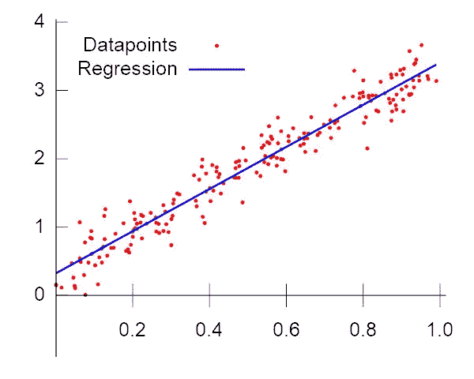
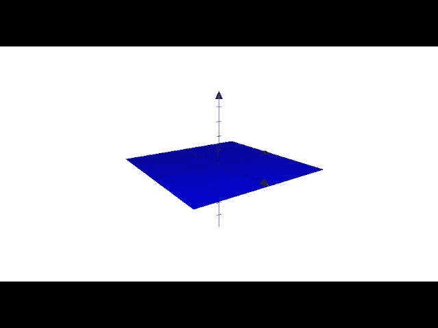
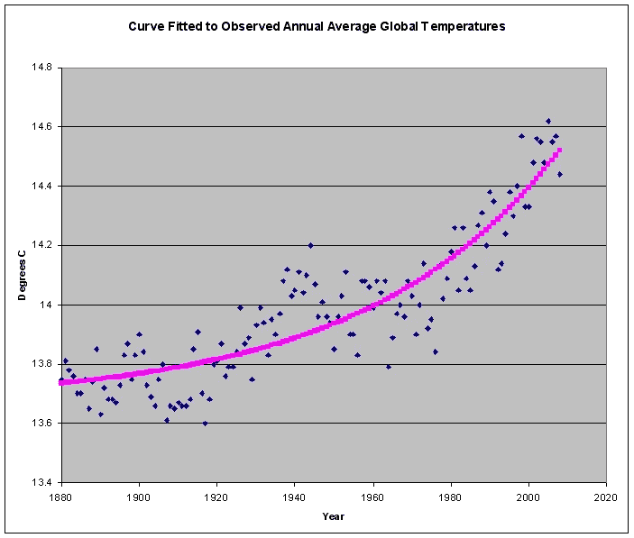
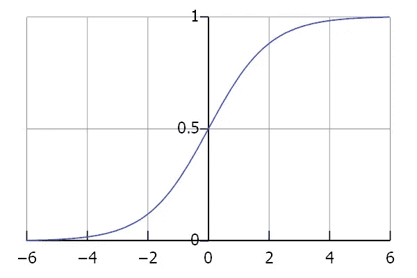
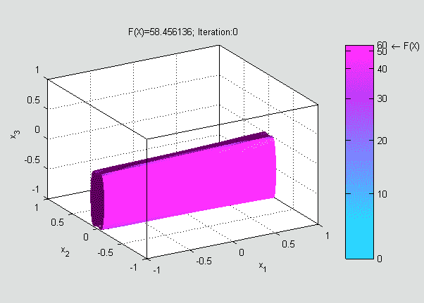

# 你能从单一的机器学习课程中学到什么

> 原文：<https://medium.com/mlearning-ai/you-can-learn-machine-learning-c0f0206e9db5?source=collection_archive---------7----------------------->

免责声明:这篇文章讨论了吴恩达在 Coursera 上最新更新的机器学习专业。除了是 Coursera 上的专业学生之外，我与 Coursera、ng 博士或 DeepLearning.AI 没有任何关系，这些完全是我自己的观点和看法。

最近，我有幸在 Coursera 上注册了吴恩达的[机器学习专业](https://www.coursera.org/specializations/machine-learning-introduction)，并刚刚完成了该专业三门课程中的第一门。在这篇文章中，我想做的不是为第一门课提供各种各样的标准复习，而是展示从一门非常好的为期三周的课程中可以学到什么样的强大工具。

我相信有很多人可以从掌握机器学习的本质中受益。然而，其中一些人可能不愿意进入这个主题，因为它是多么的技术性。如果这就是你，我希望在这篇文章结束时，你会:1)尝到机器学习提供的分析和预测能力的滋味，2)相信你也可以学会如何掌握和利用这种能力。

# 关于机器学习专业化

机器学习专业化课程由机器学习领域的超级明星之一吴恩达和他的技术教育公司 DeepLearning.AI 制作。当专业化的最初版本在 2012 年首次问世时，它立即引起了轰动，并帮助数百万分析师、数据科学家和机器学习工程师在该领域起步。今年早些时候，Ng 博士推出了专业化的更新版本，包括自 2010 年代初以来机器学习的一些最新进展。

按照推荐的学习进度，我最近在不到三周的时间内完成了第一门课程，名为“有监督的机器学习:回归和分类”。在那三周里，我首先了解了什么是机器学习，机器学习的不同类型和用例，以及如何实现最受欢迎的机器学习算法类别之一——监督学习。

# 机器学习先决条件

现在，在我介绍第一门课程中可以学到的具体概念之前，我想先介绍一下专业化的先决条件。要想在这门课上取得成功，你需要的只是对代数的基本理解和一些 Python 的基本经验(比如数据结构和 NumPy)。吴恩达出色地解释了你可能需要的所有数学知识。我个人可以证明这一点，因为我从未上过微积分或线性代数的课程。尽管如此，在 Ng 博士解释了算法如何工作背后的直觉之后，屏幕上又大又乱的方程不再令人困惑或害怕。

此外，如果你感兴趣的只是理解概念，以便更好地理解人们谈论机器学习时的意思，那么你甚至不需要 Python 知识——Ng 用简单的英语解释了回归和分类，并且在可选实验室之外不需要任何代码。然而，如果你真的学会了编码，你可以用 Python 实现复杂的微积分方程，让计算机在几秒钟内为你解答。这意味着不需要像数学课那样手动求解偏导数、多项式或点积。

# 那么你能学到什么呢？

有监督的机器学习课程，顾名思义，专注于当今机器学习领域最强大、最流行的两种学习算法——回归和分类。在其核心，学习算法创建模型，在给定特定输入的情况下预测特定输出。在监督学习中，数据被提供给算法，称为训练数据，它附有正确的答案。也就是说，给予算法的训练数据具有输入和输出，分别称为指定的 *x* 值和 *y* 值。

在整个课程中反复出现的例子是房屋销售，我将在这里用一种简略的、相对来说不涉及数学的方式进行总结。在本例中， *x* 或输入值可能是已经售出的房屋集合的一些特征， *y* 或输出值可能是这些房屋的售价。基于这些训练数据，该算法符合一个模型，该模型允许它根据新房子的功能预测新房子可能的售价。这个特殊的例子使用了一种称为线性回归的算法(许多分析师和研究人员也用它来建模变量之间的关系)。

# 线性回归

在机器学习的背景下，线性回归算法将直线拟合到一系列的 *x* 和 *y* 数据点。基于模型的参数，人们可以输入一个值 *x* 并得到一个关于 *y* 的预测。在住房示例中，这个 *x* 值可能是平方英尺，而 y 值可能是价格。这显然会导致一个非常简单且可能不准确的模型。例如，众多因素影响房价。

*Graphical representation of a linear regression line fit to data. By* [*Berland*](https://commons.wikimedia.org/wiki/File:LinearRegression.svg)*, Public domain, via Wikimedia Commons.*

# 多元线性回归

这就是多元线性回归(有时简称为多元线性回归)发挥作用的地方。多元线性回归与单变量线性回归的工作方式相同，都是将输入 *x* 映射到输出*y*；但是，多元线性回归允许使用多个 *x* 。现在，不再仅仅局限于平方英尺作为唯一的 *x* 变量，而是可以将平方英尺分配给*x*₁*t23】，同时包括卧室数量为 *x* ₂，浴室数量为 *x* ₃，楼层数量为 *x* ₄，等等。多元线性回归允许越来越复杂的模型更准确地拟合数据，从而允许更准确的预测。*

下图描述了一个多元线性回归模型，其参数经过调整以适应数据。如您所见，该模型现在不是平面上的一条线，而是一个三维平面，因为简单线性回归模型中添加了另一个变量。包含一个 *x* ₂通过增加一个 *z* 轴来改变图形。

*Graphical representation of a multiple linear regression model being adjusted to fit the data. By* [*Cfbaf*](https://commons.wikimedia.org/wiki/File:2d_multiple_linear_regression.gif)*, Public domain, via Wikimedia Commons.*

# 多项式回归

在某些情况下，直线并不能完全代表数据，例如，在某些地区，房屋价格的上涨可能会在超过某个平方英尺后逐渐减少，或者当您靠近繁忙的城市时，房屋价格可能会以指数速度增长。为此，使用了线性回归的子集多项式回归。多项式回归允许包含非线性要素，这些要素允许直线以更精确地拟合指数运算数据的方式弯曲。多项式回归不仅仅采用特征 *x* ₁、 *x* ₂和 *x* ₃，而是允许将 *x* ₁或者甚至 *x* ₁与原始特征一起包含在模型中，以在直线不能很好地拟合数据时提高模型的准确性。

*A polynomial regression model fit to non-linear data. By* [*Conhegarty*](https://upload.wikimedia.org/wikipedia/commons/1/13/CNH_Figure_3.jpg)*, Public domain, via Wikimedia Commons.*

# 线性回归有什么用？

线性回归是一种非常强大的方法，可以让人们了解哪些输入变量对输出变量的影响最大。然而，更重要的是，线性回归允许一个人基于新数据做出准确的预测。正如 IBM 所说，线性回归是“一种被证实的科学可靠地预测未来的方法。”虽然我警告说，这种预测是有限制的，即必须满足某些假设，但毫无疑问，线性回归在广泛的用例中非常重要。[Statology 的这篇文章](https://www.statology.org/linear-regression-real-life-examples/)提供了一些很好的例子，说明线性回归如何在现实世界中用于解决商业和科学问题。

# 逻辑回归

虽然以前的回归模型都是同一线性回归算法的变体，但逻辑回归的不同之处在于它用于分类。与线性回归不同，线性回归可以包含几乎无限不同的 *x* 和 *y* 的值，逻辑回归对 *y* 使用二进制值，其形式为 0 或 1。逻辑回归算法在分类中非常流行，这是一种基于两个类别(正面案例和负面案例)进行预测的方法。

所得到的模型基于预定的决策边界产生概率值，该概率值指示给定数据点属于一个篮子还是另一个篮子。这个概率值允许模型最终确定某个数据点应该如何编码。例如，基于输入值 *x* ，肿瘤是恶性的还是良性的，交易是合法的还是欺诈性的，或者图像描绘的是猫还是狗？然而，重要的是要注意，在每种情况下，不同的决策边界可能会根据手头的问题预先确定。

为了详细说明决策边界选择，如果我们预测肿瘤的恶性程度，我们可能会将决策边界设置为过度检测，因为错误的代价可能会导致死亡。因此，如果模型输出 0.35 或更高的概率值，我们可以将特定数据点编码为 1 或恶性，这意味着模型认为特定数据点有 35%的可能性是恶性的。相反，我们可以对低风险的例子使用更保守的边界，比如对猫或狗的图片进行分类。为此，0.5 及以上的输出会将图像分类为 1，对应于狗，如果低于 0.5，则分类为 0，对应于猫。

*Image of a logistic curve known as a* [*sigmoid*](https://en.wikipedia.org/wiki/Sigmoid_function) *function. By* [*Qef*](https://upload.wikimedia.org/wikipedia/commons/8/88/Logistic-curve.svg)*, Public domain, via Wikimedia Commons*

# 逻辑回归有什么用？

与线性回归一样，逻辑回归是一种非常强大的预测方法，尽管它的不同之处在于，它使这些预测具有分类成分，而不是数字成分。逻辑回归最受欢迎的应用领域之一是医学。除了帮助医生更早地发现恶性肿瘤，逻辑回归模型还可以用来预测患者患心脏病的风险。[银行业](https://activewizards.com/blog/5-real-world-examples-of-logistic-regression-application)也大量使用逻辑回归来预测交易是否是欺诈性的，或者预测一个人的信用评分在未来是上升还是下降。另一种常见的实现是将电子邮件标记为垃圾邮件或非垃圾邮件。大量现实世界的问题可以通过设计良好的逻辑回归模型来解决。

# 成本函数

在回归和分类中，算法通过努力最小化参数 *w* 和 *b* 的成本来确定最佳模型。考虑参数 *w* 和 *b* 的最佳方式是利用代数中的直线方程: *y = mx + b* ，其中 *m* 是直线的斜率， *b* 是直线与 *y* 轴在 0°处相交的点，称为 *y* 截距。在线性回归的情况下，假设 *w* 是 *m* 或斜率，而 *b* 仍然是*y*-截距。线性回归的目标是得到尽可能精确地拟合数据的直线，这意味着找到正确的斜率和*y*-截距以尽可能接近地通过数据。这是通过使用成本函数和梯度下降来实现的，这将在下一节中介绍。同样，成本函数用于逻辑回归，以确定最准确的决策障碍，尽管成本函数公式有所不同，其中包括本课程中讨论的一些附加步骤。

当算法试图找到适合数据的最佳值时，成本函数用于通过计算实际数据和模型预测之间的差异来计算模型的不准确性。该成本函数是一个数学方程，用于计算模型与数据的拟合程度。模型与数据的拟合度越差，成本就越高。这种成本有时被称为回归分析中的残差或标准误差，就像上面提到的研究人员所使用的那样。它可以被认为是线与数据集中每个观察点的平均距离。

# 梯度下降

然而，计算一堆不同的可能线路来寻找成本最低的线路是非常低效的。因此，采用了一种称为梯度下降的非常强大的算法。该算法根据一个被称为 alpha 的预设学习率(由小写希腊字母 *α* 表示)同时更新某些初始值 *w* 和 *b* ，通常设置为 0，以增量方式尝试不同的模型，直到达到最低可能成本 *w* 和 *b* 。学习率 *α* 决定了这些增量有多大，从而影响算法需要多长时间才能得出正确答案。在梯度下降的多次迭代中，模型的误差变得越来越小，直到它趋近于零，由于误差 *w* 和 *b* 向零收敛，这就是所谓的收敛。下图显示了函数 *F(X)* 中快速消除误差的直观表示。

*Three-dimensional simulation of gradient descent reducing the cost of a non-linear function. By* [*Peryeat*](https://upload.wikimedia.org/wikipedia/commons/b/b5/Gradient_Descent_Example_Nonlinear_Equations.gif)*, Public domain, via Wikimedia Commons.*

一旦梯度下降完成工作，它就输出参数值 *w* 和 *b* ，使模型有望拟合数据。然而这些价值观并不总是完美的。本课程讨论了寻找合适模型的一些挑战，如欠拟合、过拟合问题，以及梯度下降可能不会收敛到最佳值 *w* 和 *b* 的问题。

*On the left, we have an example of a model that is underfit. In the middle, the model is a good fit for the data. On the right, the model is overfit and curves wildly trying to encompass as many points as possible. Image my own.*

# 开始学习机器学习

正如您可能已经从最后一段中了解到的，实现回归和分类算法既是科学，也是艺术。必须仔细选择、设计和调整模型中的特征和参数，以适应当前的问题。然而，Ng 博士也深入研究了这一点，并提供了多种最佳实践和故障排除技巧，以确保生成的模型是最好的。

考虑到这一点，就你在 Coursera 上的机器学习专业化的第一门课程中所能学到的东西而言，我在这篇博客中所涵盖的材料只是冰山一角。如果你对使用机器学习感兴趣，或者即使你只是想了解越来越多地塑造我们日常生活的概念，我也不会推荐你选修这门课程。就机器学习领域的可能性而言，专业化本身也只是冰山一角，但这些课程是一个很好的地方，可以开始牢牢掌握该领域其他一切所依赖的基本概念。

 [## Mlearning.ai 提交建议

### 如何成为 Mlearning.ai 上的作家

medium.com](/mlearning-ai/mlearning-ai-submission-suggestions-b51e2b130bfb)