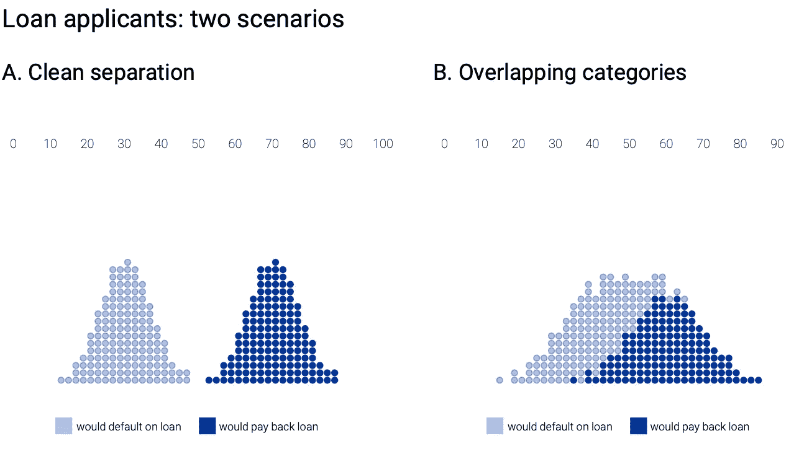
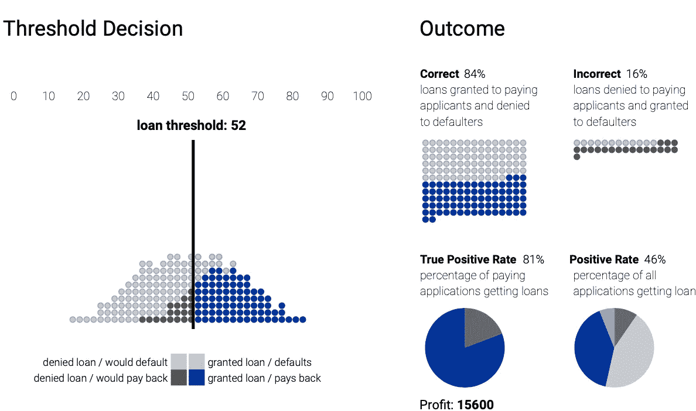
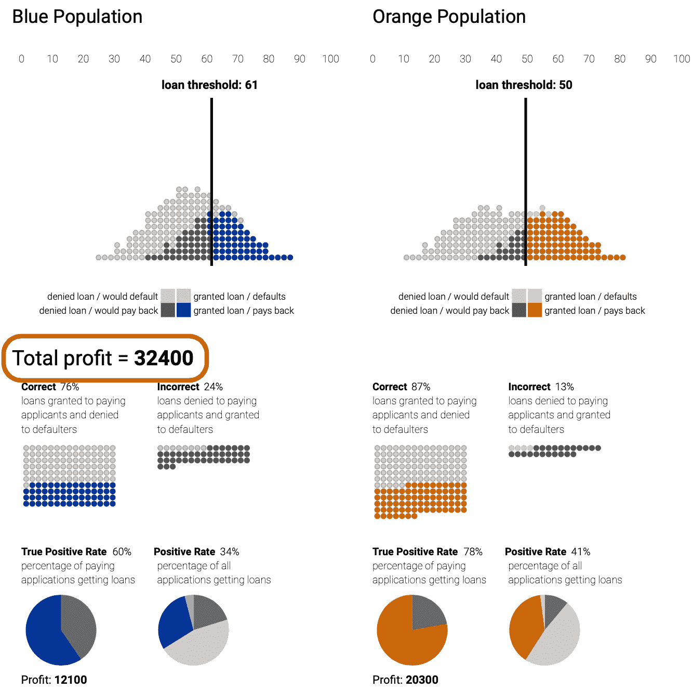
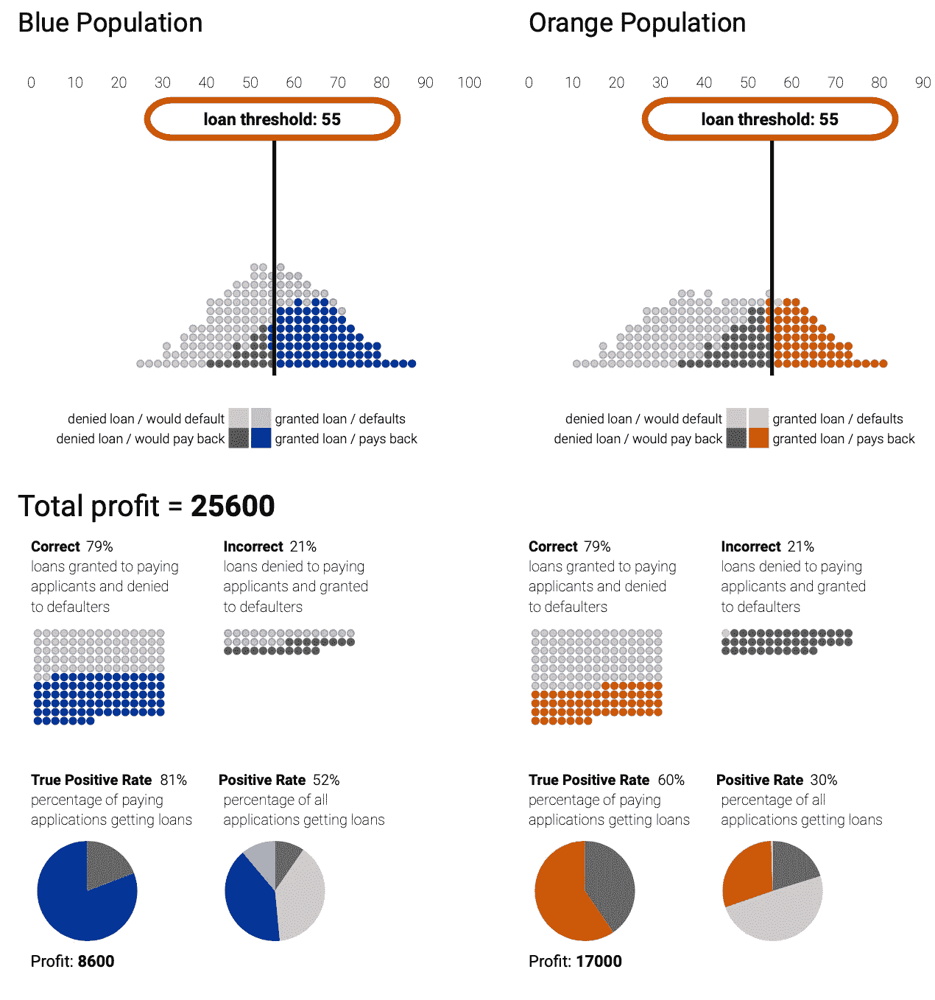
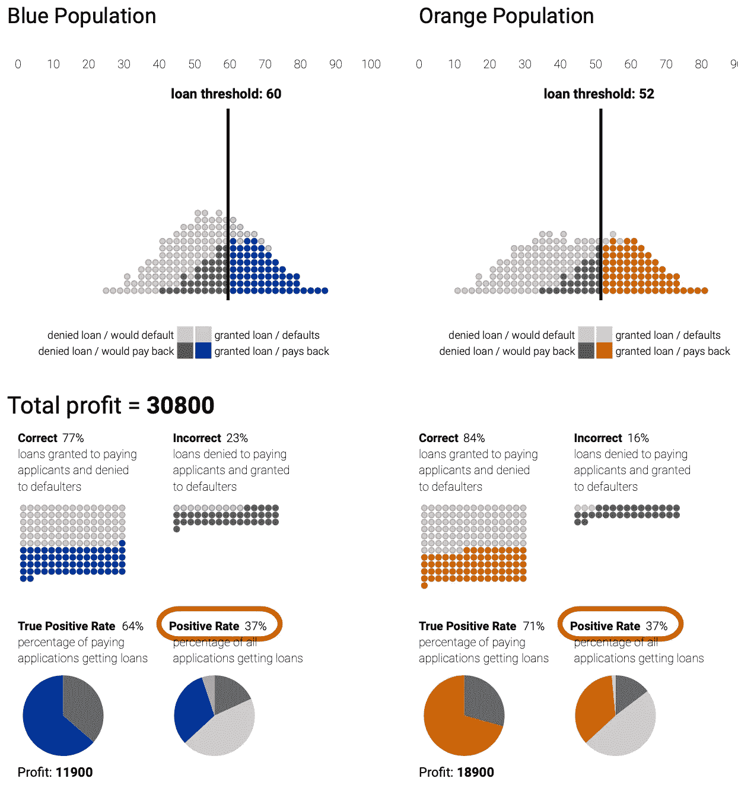
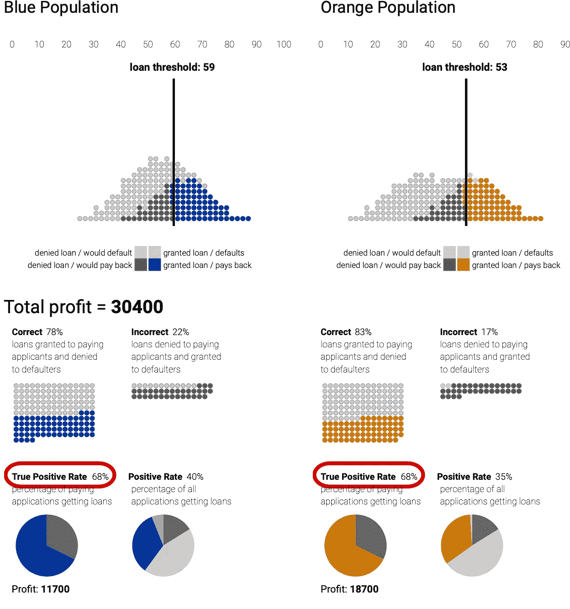

# 你不可能对每个人都公平

> 原文：<https://medium.com/mlearning-ai/you-cant-be-fair-to-everyone-560d09639bd5?source=collection_archive---------2----------------------->

## 算法的公平性有内在的数学限制

*Photo by* [*Tingey Injury Law Firm*](https://unsplash.com/@tingeyinjurylawfirm?utm_source=unsplash&utm_medium=referral&utm_content=creditCopyText) *on* [*Unsplash*](https://unsplash.com/s/photos/justice?utm_source=unsplash&utm_medium=referral&utm_content=creditCopyText)

随着机器学习(ML)越来越多地用于核心社会领域，如广告、信贷、就业、教育和刑事司法，以帮助(当不完全做出决定时)决策者，确保这些决定没有偏见或歧视是至关重要的。在一些司法管辖区，这些领域受到反歧视法的保护，这使得衡量和确保公平不仅仅是一个道德问题，而是一个法律问题。例如，2016 年发布的一份[白宫报告呼吁将“机会均等”作为信用评分等领域的指导原则。](https://www.hsdl.org/?abstract&did=792977)

# 阈值分类器:贷款发放用例

一些存在歧视风险的 ML 系统是由*阈值分类器*驱动的系统。阈值分类器是一种算法，它做出是/否的决定，将事物归入某一类别。下面的案例研究来自哈特等人(谷歌研究)发表的一篇[论文，并在](https://arxiv.org/abs/1610.02413)[谷歌研究网站](http://research.google.com/bigpicture/attacking-discrimination-in-ml/)上用通俗易懂的语言进行了解释。这是一个简单的贷款发放场景，银行可以根据 ML 算法计算出的信用评分来发放或拒绝贷款。银行选择一个特定的门槛，信用分数低于该门槛的人将被拒绝贷款，而信用分数高于该门槛的人将获得贷款。

让一个看似纯粹的商业决策(如批准/拒绝贷款)变成潜在歧视性决策的，是数据集中不可避免地存在*受保护的属性*，如种族、宗教、性别、残疾或家庭状况。

一种天真的方法可能要求算法忽略所有受保护的属性。然而，这种“通过无意识实现公平”的想法是无效的，因为存在 [r *冗余编码*](https://dl.acm.org/doi/10.1145/1401890.1401959) *，*属性，这些属性就像受保护属性的代理一样工作。Bias 通过代理从其余的数据中找到自己的方法:例如，在像邮政编码或地址，或就读的学校等属性中。

在法律上，偏见意味着基于先入为主的观念或偏见的判断，而不是对事实的公正评价。然而，在计算机科学中，公平，或者说没有偏见，必须用数学术语来定义。

例如，在贷款发放问题中，我们可以提议给予相同比例的白人和黑人申请人贷款(*统计均等*)，或者所有有资格获得理想结果的个人都应该有平等的机会被正确分类(*机会均等*)。另一种可能是，两组之间有利结果的概率比率是相同的(*不同的影响*，或者尝试在各组之间均衡错误率，以便算法在白人申请者身上犯的错误与在黑人申请者身上犯的错误一样多(*待遇平等*)。**所以我们必须*在众多可能的*互斥**** 指标中选择一个指标来优化。如果你为统计上的均等而优化，你就不能同时为机会均等而优化，对其他人也是如此，因为，正如在许多出版物中所显示的那样，[存在一些权衡，这些权衡对任何算法或人类决策者的公平程度构成了数学限制](https://blog.ml.cmu.edu/2020/02/28/inherent-tradeoffs-in-learning-fair-representations/)。

在下图中，黑点代表愿意偿还贷款的人，亮点代表不愿意偿还的人。在理想的情况下，我们将使用明确区分类别的统计数据，如场景 a。不幸的是，更常见的是场景 B，其中各组重叠。

Loan granting scenarios (Source: [Google Research](http://research.google.com/bigpicture/attacking-discrimination-in-ml/))

选择阈值需要一些权衡。太低的话，银行会贷款给许多潜在的违约者。太高了，许多通常有资格获得贷款的人将得不到贷款。那么什么是最佳门槛呢？这取决于我们想要优化什么。我们可能希望尽量减少错误决策，因为这对银行来说代价很高。另一个可能是利润最大化。假设一笔成功的贷款让银行赚了 300 美元，但违约成本是 700 美元，那么我们就可以计算出一个假设的“总利润”(或损失)，作为我们选择的阈值的结果。

Threshold Classifiers. (Source: [Google Research](http://research.google.com/bigpicture/attacking-discrimination-in-ml/))

# 偏见缓解策略

如果我们有两个由受保护的属性(如种族或性别)定义的子组，其中像信用评分这样的统计数据在两个组之间的分布不同，会发生什么？我们将这两组称为“蓝色”和“橙色”

如果我们选择使银行总利润最大化的一对阈值，我们可以在下图中看到，分配给蓝色组的阈值高于为橙色组选择的阈值，导致只有 60%的合格申请人获得贷款(*真实阳性率*)，而橙色组为 78%。

Optimizing for total profit. (Source: [Google Research](http://research.google.com/bigpicture/attacking-discrimination-in-ml/))

一个显而易见的解决方案是，银行通过为两组选择相同的阈值来实施**组无意识**策略。现在 orange 集团获得的贷款减少了。在愿意还贷的人群中，他们处于劣势，因为真正的阳性率是 60%，而蓝色组是 81%。

Group Unaware: same threshold is applied to both groups.(Source: [Google Research](http://research.google.com/bigpicture/attacking-discrimination-in-ml/))

如果我们改变另一种策略，保证这两个群体将获得相同数量的贷款，使用贷款阈值，为每个群体产生相同比例的贷款(**【人口均等】**)会怎么样。同样，人口均等约束只关注给定的贷款，而不是贷款偿还的利率。在这种情况下，该标准导致蓝色组中获得贷款的合格人员少于橙色组。

Demographic Parity: same positive rate for the two groups.(Source: [Google Research](http://research.google.com/bigpicture/attacking-discrimination-in-ml/))

最后一次尝试可以通过采用一种叫做 [**机会均等**](https://papers.nips.cc/paper/6374-equality-of-opportunity-in-supervised-learning.pdf)的衡量标准来进行，这种衡量标准强制规定，在能够偿还贷款的人群中，每组中的相同比例的人实际上应该获得贷款。现在两组的*真阳性率*是相同的。有趣的是，这种选择对银行来说几乎和人口均等一样有利可图，而且获得贷款的总人数也差不多。

Equal Opportunity: the true positive rate is identical in the two groups.(Source: [Google Research](http://research.google.com/bigpicture/attacking-discrimination-in-ml/))

[Google research](https://arxiv.org/abs/1610.02413)发表的论文显示，给定基本上任何评分系统，都有可能找到满足任何这些标准的阈值。换句话说，即使你无法控制基本的评分系统(一个典型的案例)，仍然有可能攻击歧视的问题。然而，它表明数学上不可能找到同时满足所有公平标准的阈值组合:你需要选择一个。

# 结论

ML 算法非常擅长优化单一指标。但是，如果我们想在存在受保护属性的情况下衡量算法的公平性，事情就变得复杂了。公平需要以一种可以在 ML 系统中使用的方式进行数学公式化，也就是定量化:在这里你会发现[超过 20 种公平的定义](http://fairware.cs.umass.edu/papers/Verma.pdf)，然而对于在每种情况下应用哪种定义并没有明确的一致意见。此外，这些通常是互斥的，因为算法不能一次优化多个指标。上面的用例表明，可以通过在不同的公平指标中进行选择来减轻偏差，从而在对业务指标影响很小的情况下进行优化，但由于任何算法或人类决策者的公平程度的数学限制，总会有权衡。