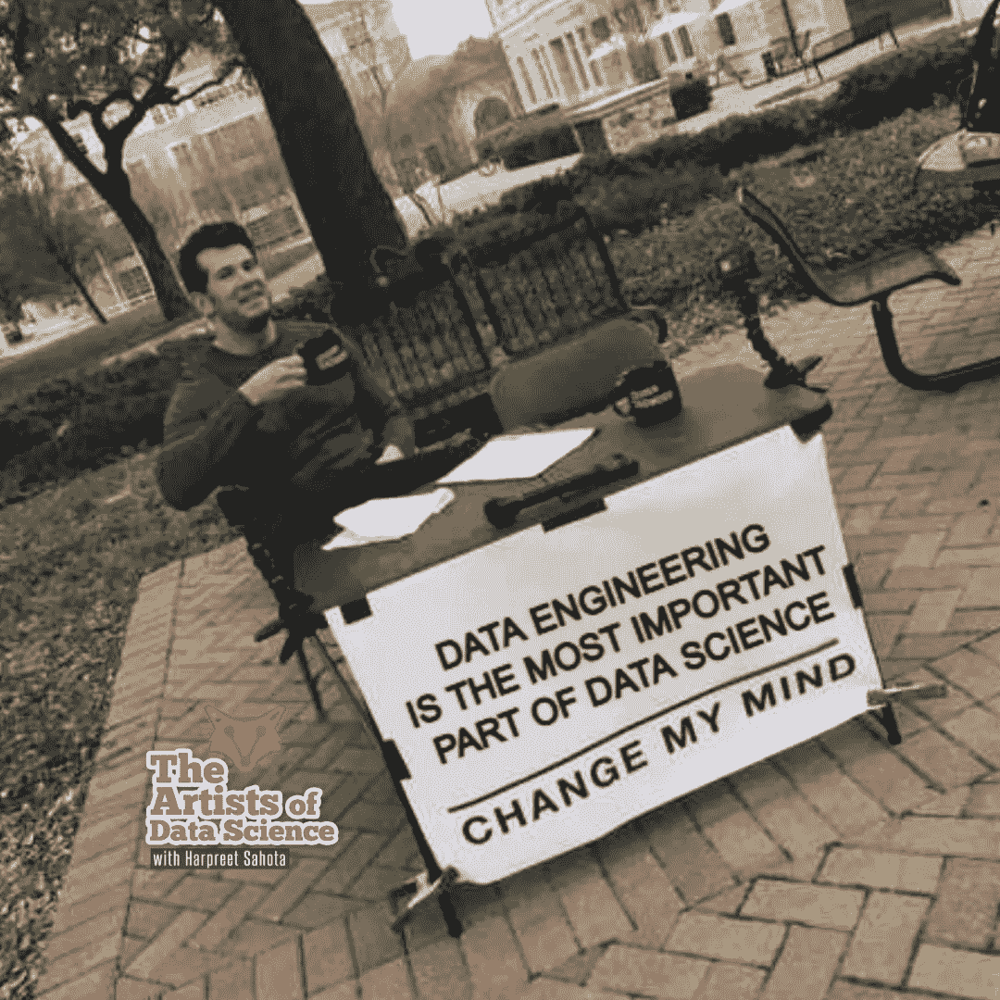

# 你不一定要成为数据科学家才能从事数据科学

> 原文：<https://medium.com/mlearning-ai/you-dont-have-to-be-a-data-scientist-to-be-in-data-science-9cfde5346b1?source=collection_archive---------1----------------------->

无论如何，成为一名数据科学家可能并不适合你

Photo by [Nikola Đuza](https://unsplash.com/@nikolalsvk?utm_source=medium&utm_medium=referral) on [Unsplash](https://unsplash.com?utm_source=medium&utm_medium=referral)

[在之前的一篇文章](/datacated/on-the-uniqueness-of-data-science-c309214ad6d8)中，我们谈到了数据科学是一种元技能——没有一种特定的技能集，我们可以指着它说，正是它造就了数据科学家！

> 数据科学是一个广阔的领域，在生态系统中有各种各样的角色。

一般来说，数据科学的主要角色是:

1.  “传统”数据科学家
2.  数据分析师
3.  机器学习工程师
4.  数据工程师
5.  研究科学家
6.  数据产品经理

> 现在，要明确的是:所有这些角色都可以被称为数据科学家。

除了这里和那里的几个地方，**我倾向于用术语数据科学家来指代这些角色。**

# “传统”数据科学家

Photo by [ThisisEngineering RAEng](https://unsplash.com/@thisisengineering?utm_source=medium&utm_medium=referral) on [Unsplash](https://unsplash.com?utm_source=medium&utm_medium=referral)

数据科学家利用科学方法、机器学习和统计计算技术来创建数据驱动的产品，这些产品将被部署到生产中以帮助解决业务问题。

从端到端:他们与利益相关者合作，了解业务问题，将问题构建为数据科学问题，并利用科学方法为业务提供前进的道路。

> 在这个职位上，您应该能够获取数据、理解和探索数据、执行特征工程以创建数据模型、执行统计分析、使用机器学习构建定量模型、自动化解决业务问题的解决方案，并且能够将您的结果传达给技术和非技术利益相关者。

你还必须展示一些软件工程方面的核心能力。

最终，你的模型必须投入生产。

你必须证明你有能力自动化和规模化你的原型。

这个角色涵盖了广泛的技能，你必须证明你擅长利用统计建模来有效地理解和解决业务问题。

# 数据分析师

Photo by [Lukas Blazek](https://unsplash.com/@goumbik?utm_source=medium&utm_medium=referral) on [Unsplash](https://unsplash.com?utm_source=medium&utm_medium=referral)

数据分析师探索数据，分析数据并提取关于行为的见解。

通常这些是与系统相关的行为。

无论是它的业务系统——这与企业的运营方式有关——对客户行为的洞察，还是市场系统的运作方式。

作为一名数据分析师，您将探索大型数据集，并深入了解这些系统的行为方式。

作为一名数据分析师，你将与数据科学家的工作有很多重叠，尤其是在更高级别的层面。

> 您将执行数据清理和数据建模，探索性分析，进行回顾性和前瞻性统计分析，并提供数据驱动的见解，为利益相关者的决策过程提供信息。

你可能会用到回归、聚类、决策、树等等。

**如果您对数据世界**是全新的，也就是说:您没有接受过任何定量领域的培训，没有编码或编程方面的经验，也从未从事过 IT 工作——那么**可以将这类工作视为您进入数据科学领域**的门户。

这是一个你必须精通技术的角色:了解 SQL 和一些其他编程语言，比如 Python 和 R 将是至关重要的！

幸运的是，这些工具是免费提供的，并且有很多在线教程——所以你不用在这个领域工作就可以建立这个技能集。

该角色通常执行描述性和回顾性分析，但有时会对需要前瞻性预测的项目有所贡献。

您可能会构建定期或临时报告。

> 在高层，数据分析师甚至可能使用机器学习来提供一些预测或预测，但通常不会创建将被集成到更大的决策系统中的数据产品。

数据分析师和数据科学家之间的主要区别在于分析师分析和科学家发现。这确实是关键的区别点，即分析师将使用数据来理解行为。数据科学家将通过实验来理解系统。

我的好朋友、良师益友，以及我长大后想成为的人——文·瓦希什塔(Vin Vashishta )在 YouTube 上有一段很棒的视频，我很喜欢这段视频。在这里查看[。](https://www.youtube.com/watch?v=lKRBqcSsE5Q)

# 机器学习工程师

Photo by [Kevin Ku](https://unsplash.com/@ikukevk?utm_source=medium&utm_medium=referral) on [Unsplash](https://unsplash.com?utm_source=medium&utm_medium=referral)

毫无疑问:ML 工程师绝对是一个软件工程职位。

扮演这个角色的人采用机器学习模型并将其投入生产。

> 他们帮助公司自动化原型，扩展它，使它可移植，测试它，并使它完全自动化，这样公司就可以把它推向市场并从中获取价值。

这个角色本质上是一个软件工程的角色，是特定于编写机器学习模型的。

这个角色**将与数据科学家一起重构他们的原型模型**，通过使原型更加高效和可伸缩，从而将其集成到更大的系统中。

您的大部分时间将花在构建软件、库、自动化和测试数据科学家模拟的原型代码上。

请注意，这个角色不一定具有面向客户的前瞻性责任。您不需要负责传达见解或发现。

你要确保模型在生产中不会破裂。

> 如果它坏了，你应该能修好它。

# 数据工程师

Source: a meme the author created

毫无疑问:数据工程师也是一个软件工程的角色。

这是为数据科学团队准备数据的人。

> 在这个角色中，您将构建从数据源提取数据的管道，实现将原始数据转换为数据科学家指定的数据模型的代码，并将其加载到某个位置，以便团队的其他成员可以轻松访问。

该角色将负责自动化功能工程，确保数据正确编码，确保数据为下游分析或模型构建正确建模。

该角色专注于大量的数据基础设施工作，以便数据科学团队能够取得成功，并将更多精力放在建模上。

请注意，这个角色不一定有面向客户的责任。

你不需要负责交流见解或发现。

您要确保数据以需要的格式到达需要的位置。

现在，我想指出的是，数据工程有几种风格。

实际上，公司倾向于将三种不同的角色归入“数据工程”的大伞下

## **类型 1:专业软件开发人员**

这是一个专注于数据驱动应用的开发人员。

如果公司希望迁移到依赖流媒体平台的面向微服务的架构，他们会雇用这个人。

> 担任此角色的人所做的常见任务要么是编写产生事件流的服务，要么是侦听或使用这些事件来执行某些操作的服务。

如果你对这种类型的角色感兴趣，可以拿起一本很棒的书——马丁·克莱曼的《T2 设计数据密集型应用》。

## **第二类:商业智能(BI)开发人员**

商业智能领域有两个不同的领域

> 一个以业务为中心，关注 KPI 定义和仪表板。这个人参与数据的前端呈现。这个角色的重点是我们如何将这些数据放入仪表板或分析软件中以收集见解。

另一个以技术为中心，负责数据仓库和 ETL 过程。

为了让数据进入 dice 仪表板并可视化，需要有一个适当的管道来很好地设置用于分析的数据集。

您甚至可能听说这个角色被称为 ETL 开发人员。

在这两种情况下，BI 开发人员都是多面手。

他们在所有领域开展工作，专注于为企业带来有意义的结果。

> 如果你是高级软件开发人员，这是一个很好的角色。

当然，你需要有很强的商业头脑，并提高自己的技能，以生成报告系统、设计数据、构建和部署机器学习模型以及分析数据。

如果这是你感兴趣的，那么你最大的财富就是你能够在所有领域工作，并弥补流程和系统中的差距。

**第三类:专注于系统的数据科学家**

像这样的角色，你将负责建立和维护处理大数据的系统

> 您不应该害怕 bash 脚本，并且可以轻松地处理软件密集型工作。

这里的大部分工作是管理数据科学基础设施。

同样，我在这里推荐的书是《设计数据密集型应用程序》。

## 研究科学家

Photo by [Scott Graham](https://unsplash.com/@homajob?utm_source=medium&utm_medium=referral) on [Unsplash](https://unsplash.com?utm_source=medium&utm_medium=referral)

研究科学家是创造新的机器学习算法的人。

它通常更多的是一个学术或研究导向的角色。它远不如典型的数据科学角色应用广泛。

> 这个角色利用科学方法为公司创造新的知识，进行因果分析，并且更关注所有事情的“为什么”。

是一个对学历要求比较严格的角色。

公司通常会寻找拥有博士学位或研究型硕士学位的候选人。

没有博士学位，没有以研究为基础的硕士学位，你肯定也可以进入其他角色，因为它们更具应用性。

> 然而，要成为一名研究科学家，你通常需要接受高等教育，或者至少在同行评议的期刊或白皮书上发表过一些东西(作为作者或投稿人)。

# 数据产品经理

Photo by [Austin Distel](https://unsplash.com/@austindistel?utm_source=medium&utm_medium=referral) on [Unsplash](https://unsplash.com?utm_source=medium&utm_medium=referral)

这是一个使用他们建立的机器学习模型来提高他们在传统产品管理角色中的效率的人。

这非常合适，因为一般来说，产品管理是一个高度数据密集型的角色。

以至于我觉得大多数人会将其归类为“数据职业”中的一个角色

传统的产品经理将管理公司产品开发和上市的所有方面。

这包括构思、研究、设计、开发、绩效评估和发布。

典型的产品经理使用数据来指导他们在产品开发和上市方面的决策。

数据产品经理将承担这些相同的职责，甚至更多。

数据产品经理将拥有更多技术技能，并深入数据科学和预测分析，以指导和管理围绕产品的所有决策。

> 数据产品经理将拥有足够的专业知识和技术能力，他们可以实际构建机器学习模型，并使用复杂的数据科学算法来揭示更深入的见解，从而引导产品开发决策、发布决策和整体产品战略。

它实际上是“传统产品工作”加上数据科学能力的结合，以交付更好的业务成果

我的好朋友 [Lillian Pierson](https://www.linkedin.com/in/lillianpierson/) 是数据产品经理的一个很好的例子。如果这是你感兴趣的事情，看看她的[自学成为数据产品经理的课程](https://www.data-mania.com/blog/self-taught-data-product-manager-curriculum/)。

# 不管你过去的经验如何，数据科学都有你的一席之地

如果你是一个职业过渡者，你不需要从初级水平开始，你不需要以助理的身份开始。

如果你有一些职业经验，你肯定可以利用这些经验来帮助你的职业专业化。

如果你曾经是一名软件开发人员，如果你能利用你的软件开发技能，你可以成为一名中级或高级数据科学家。

所以绝对不要觉得你必须在这个领域重新开始，因为有这么多不同的方面。

你可以进来，利用你过去的经验来帮助你变得更专业，并从一开始就给你获得更好工作的机会。

数据科学中有许多工作职能是新兴的，我们甚至还没有讨论过。

比如:MLOps 工程师、数据策展人、AI 伦理学家、ML 架构师、分析工程师，不一而足。

这个领域一直在发展，无论你来自什么背景，每个人都有发展的空间！

**这就是我的咆哮。下一集再见。**

让我知道你的想法。请在下面留言，让我们打开话题。

我也有一个[免费开放的 Slack 社区](https://join.slack.com/t/artofdatascienceloft/shared_invite/zt-dgzn8abm-ge_dKGxrc9Dsuhnly90WTw),我很高兴在这里与你交流项目想法！

> 记住我的朋友们:你在这个星球上只有一次生命，为什么不试着做些大事呢？

 [## Mlearning.ai 提交建议

### 如何成为 Mlearning.ai 上的作家

medium.com](/mlearning-ai/mlearning-ai-submission-suggestions-b51e2b130bfb)