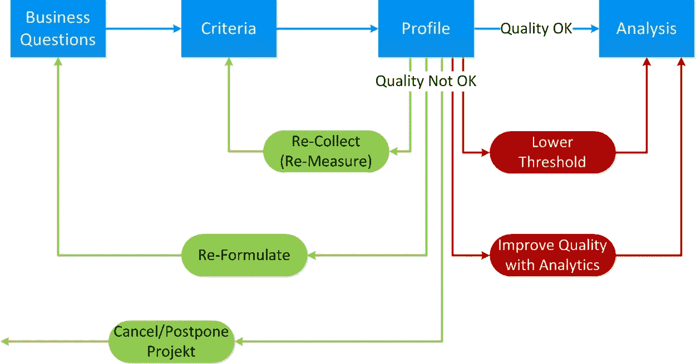
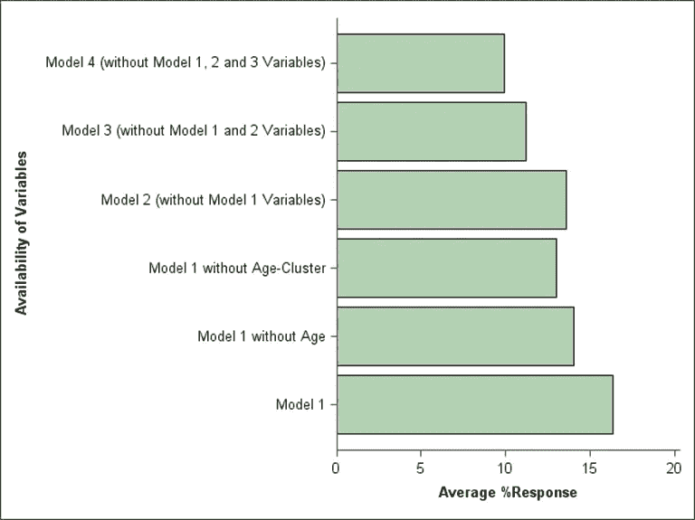
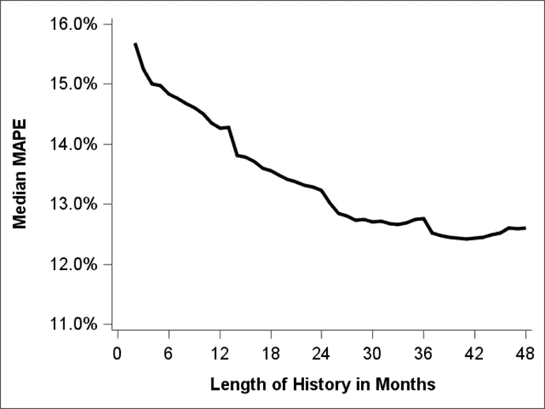
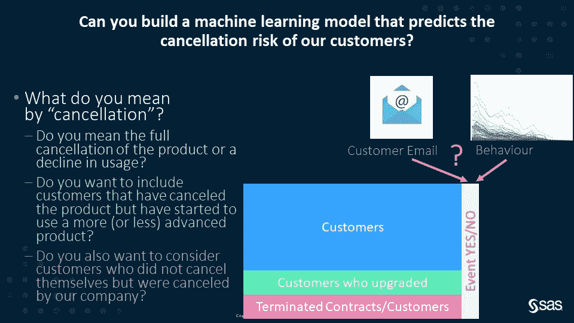
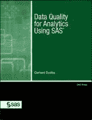

# 您刚刚发现您的分析数据质量很差，您有什么选择？

> 原文：<https://medium.com/mlearning-ai/you-just-found-out-that-the-quality-of-your-analysis-data-is-poor-what-are-your-options-13da59cfa71c?source=collection_archive---------1----------------------->

您发现您的分析数据的数据质量没有满足定义的需求。你该怎么办？闭上眼睛走过去？停止项目，等待情况好转？分析能帮助你克服这些障碍吗？

本文讨论了您的选择并举例说明。

# 在完美的世界里

首先看看分析过程的最佳流程。您从一个业务问题开始，定义并检查数据质量标准，您发现您的分析数据质量很好，然后您执行分析。

请注意，该图表不包括分析的所有必要步骤。例如，为了更加清晰，省略了数据准备、数据探索/数据理解以及模型验证、模型操作和模型治理。这里的目标是关注数据质量的重要方面。

## 1.业务问题—“你能帮我计算一下吗…”

通常旅程从一个商业问题开始。考虑下面两个商业问题的例子:

*   **需求预测和计划**:对我的消费者未来 26 周的每周需求模式进行预测。不仅在全球一级，而且在国家一级详细说明这一预测。此外，每周一上午 7 点更新短期规划预测。
*   **客户维系**:每月预测我的电信业务商业客户的取消风险，并提供一份高取消风险客户名单，以纳入维系活动。

## 2.定义数据质量标准——“让我先检查一下…”

在下一步中，您将定义您的分析数据应该满足的数据质量标准。这种标准例如可以包括**数据可用性**、**数据完整性**、**数据正确性**或**数据数量**。更多详情见文章《[你的数据准备好数据科学了吗？—从一个帆船赛分析例子引出这个话题](https://gerhard-svolba.medium.com/is-your-data-ready-for-data-science-motivating-this-topic-from-a-sail-race-analysis-example-7dde97a68e4d)

对于需求计划示例，这可能是如下需求

*   需求历史超过 52 周
*   拥有国家级别的历史数据，而不仅仅是全球级别的
*   能够在 3 小时内在系统中获得实际需求数据

对于客户保持示例标准，如

*   具有足够数量的取消(例如 250 个案例)以能够训练受监督的机器学习模型
*   数据完整性，缺失值少于 10%

## 3.数据质量分析—“在这里我们看到……”

在分析步骤中，您可以检查数据的数据质量状态。这可以包括描述性统计，如计算缺失值的数量、检查跨产品组的可用需求历史、检查数据中适当详细程度的历史数据的可用性。

## 4.执行分析—“这就是我们(数据科学家)在这里的原因……”

在您发现您的数据的数据质量状态良好之后，您就可以开始分析了。例如，使用客户数据上的二元目标“取消是/否”来训练监督机器学习模型，或者应用时间序列预测技术，如 ARIMA、指数平滑、未观察组件模型(UCM)，或者对历史每周需求数据使用递归神经网络。

# 在现实世界中

在许多情况下，上述流程过于乐观。在实践中，您经常会发现您的数据不符合预先定义的要求。然而，这不应该扼杀你的项目想法。重要的是要能够评估形势，决定你的选择是什么，以及如何继续下去。

下图中显示了一些选项，它们可以分为两大类:

1.  更改分析项目的参数或状态(绿色箭头)
2.  向前推进实际数据质量状态(红色箭头)

## 1.更改分析项目的参数或状态

*   它们包括**重新收集或重新测量**数据，例如提高数据的正确性或完整性。在客户维系示例中，您可能会发现，客户关怀系统中的数据并不适用于所有的客户群。您必须回到 IT 部门，以确保它们可用于您的分析和预测模型的定期应用。
*   在某些情况下，你需要**重新制定你的业务问题**，例如，你可能能够在全球层面上运行需求预测分析，但你不能在国家层面上进行详细分析(此时)。
*   然而，如果你发现你的一些主要要求根本没有实现，你可能需要**取消或推迟你的项目**。如果您没有收集客户的历史取消事件，您将无法向您的机器学习模型提供已标记的数据，并且可能不得不将分析推迟到稍后的时间点，那时您将收集足够多的数据。

## 2.向前推进实际数据质量状态

*   在某些情况下，您会发现数据质量无法追溯提高。例如，无法再次联系在调查中缺失值的客户以提供完整数据。因此，你可以**降低数据质量阈值**，在需求预测中接受更大比例的缺失值、更少数量的事件或更短的时间历史。
*   您还可以使用分析来**提高您的分析数据**的数据质量。例如，您可以使用决策树来估算缺失值。您可以使用分析方法来检测和标记数据中的异常值。您还可以处理(少量)数据，例如通过应用特殊方法来分析罕见事件。

## 结论

本概述向您展示了当您发现您的数据质量不符合您的要求时的典型选择。您可以使用上图所示的流程，与数据科学、业务部门或 IT 部门的同行讨论不同的选项。该流程还允许您强调良好的数据质量对于分析的重要性，因为它说明了在数据质量差或使用数据进行分析时需要接受的情况下需要采取的措施。

下一节提供了上述选定选项的更多细节。

# 上述选项的特定细节

## 降低阈值并接受用于分析的数据

在《[数据质量分析](https://github.com/gerhard1050/Data-Quality-for-Data-Science-Using-SAS/blob/master/README.md)》一书中，我进行了大量模拟研究，以评估在监督机器学习和时间序列预测中较低的数据质量对模型准确性的影响。这些模拟研究的发现已经发表在 medium.com 的三篇文章中:

文章“[量化监督机器学习模型中缺失值对模型准确性的影响](/mlearning-ai/quantifying-the-effect-of-missing-values-on-model-accuracy-in-supervised-machine-learning-models-8d47d7eca921)”为您提供了以下见解，并允许您(大致)量化模型准确性的下降。

*   **训练数据中随机缺失的**值只有有限的影响(红线)
*   同样出现在评分数据中的**缺失值具有更大的影响(橙色对红色，浅绿色对绿色)**
*   **系统缺失**值的影响更大(绿线)

文章“[(不良)数据质量对监督机器学习中模型准确性的影响—模拟研究的结果](/mlearning-ai/the-effect-of-bad-data-quality-on-model-accuracy-in-supervised-machine-learning-results-from-117d150df755)”举例说明了如果主要输入变量(如客户年龄)在分析数据中不可用，模型准确性的损失。

## 在时间序列预测中接受较短的数据历史

文章“[为时间序列预测确定时间序列数据历史的最佳长度](/mlearning-ai/determining-the-best-length-of-the-history-of-your-timeseries-data-for-timeseries-forecasting-f8600a3c086)”显示的结果证实了直觉，即平均而言，随着可用时间历史数据量的增加，预测模型的质量也会提高。

还可以看出，前两个完整年份的可用性表明对模型质量的巨大贡献。额外的几个月仍然提供质量改进，但是相对较低。此外，这个发现是直观的:当只有几个月可供分析时，对模型质量的边际影响更高。

## 通过分析提高数据质量

以下几点概述了与数据质量相关的典型分析功能。

**离群点检测**

*   单变量数据的简单分析:分析在基于统计测量(如标准偏差或分位数)检测异常值时起着重要作用。
*   用聚类分析和距离度量方法检测异常值。这些方法允许您从多元角度识别数据中的异常值。
*   用预测模型和时间序列方法检测单个异常值。这些方法允许您单独计算验证限和最佳校正值。由于总体平均值可能会在分析中引入不必要的偏差，组内平均值可能是更好的替代选择。参见带有示例分析的 [youtube 网络研讨会](https://www.youtube.com/watch?v=zDagWnxhlNw&list=PLdMxv2SumIKs0A2cQLeXg1xb9OVE8e2Yq&index=4)。
*   分析不仅提供了分析和识别异常值和不合理值的方法，还可以提供应该输入的最可能值的建议。

**缺失值插补**

*   分析可以提供缺失值的替换值。例如，每个主题一行的数据集市和时间序列数据集市中的缺失值可以被估算。
*   这些插补方法的范围从基于平均值的插补值到分析主题的单个插补值，这些插补方法基于决策树或时间序列样条插值法等分析方法。

**数据标准化和重复数据删除**

*   在没有用于分析主题的唯一关键字的情况下，可以基于描述记录之间相似性的统计方法来识别和消除数据库中的重复项。
*   这些方法根据地址、姓名、电话号码和帐号等信息来衡量记录之间的接近程度和相似程度。

**处理数据量**

*   分析允许您使用样本大小和功效计算方法为受控实验规划最佳观察次数。
*   在预测建模中的小样本或小数量事件的情况下，提供了用于建模罕见事件的方法。
*   在时间序列预测的情况下，提供了所谓的间歇需求模型，该模型仅使用偶然的非零数量对时间序列进行建模。

**输入变量的解析变换**

*   分析方法用于将变量转换为适合相应分析方法的分布。例如，对数和平方根转换用于将右偏数据转换为正态分布。
*   对于有许多类别的变量，分析提供了组合类别的方法。这里，这些类别的组合逻辑取决于每个类别中的观察值数量以及与目标变量的关系。这些方法的例子包括决策树或证据权重计算。
*   文本挖掘允许您将自由形式的文本转换为结构化信息，然后可以通过分析方法进行处理。

**变量选择**

*   变量选择的各种方法允许您识别与预测建模中的目标变量有密切关系的变量子集。这些方法包括像 R-square 这样的简单度量和像 LARS，LASSO 这样的度量。
*   许多分析方法在各自的分析模型本身中允许不同的变量选择方法。例如，考虑回归中的向前、向后和逐步模型选择。

## 定义和重新表述业务问题

考虑上面介绍的业务问题:**你能建立一个预测我们客户取消风险的机器学习模型吗？**

在运行分析之前，有许多方面需要详细说明，这些方面对数据准备和数据质量有很大影响。比如:你说的“取消”是什么意思？

*   你是指产品的全面取消还是使用量的下降？
*   您是否希望包括已经取消产品但开始使用更高级(或更低级)产品的客户？
*   是不是也要考虑那些没有自己注销而是被我们公司注销的客户？
*   联系客户的业务流程是怎样的？
*   还需要什么附加属性和解释？
*   在分数的可用性和营销活动的执行之间，我们应该考虑哪个潜伏期？

在我的网络研讨会“[准备数据时的概念考虑](https://www.youtube.com/watch?v=bow8hzFNPWY&list=PLdMxv2SumIKsqedLBq0t_a2_6d7jZ6Akq&index=2)”中，我们已经详细讨论了这些方面。

# 链接

## 文章@中等

*   [您的数据为数据科学做好准备了吗？—从一个帆船比赛分析例子引出这个话题](https://gerhard-svolba.medium.com/is-your-data-ready-for-data-science-motivating-this-topic-from-a-sail-race-analysis-example-7dde97a68e4d)
*   [(坏)数据质量对监督机器学习中模型准确性的影响——模拟研究的结果](/mlearning-ai/the-effect-of-bad-data-quality-on-model-accuracy-in-supervised-machine-learning-results-from-117d150df755)
*   [量化监督机器学习模型中缺失值对模型准确性的影响](/mlearning-ai/quantifying-the-effect-of-missing-values-on-model-accuracy-in-supervised-machine-learning-models-8d47d7eca921)
*   [为时间序列预测确定时间序列数据的最佳历史长度](/mlearning-ai/determining-the-best-length-of-the-history-of-your-timeseries-data-for-timeseries-forecasting-f8600a3c086)

## Youtube 上的网络研讨会

## SAS 出版社的书

我的 SAS 出版社书籍“[使用 SAS 进行分析的数据质量](https://github.com/gerhard1050/Data-Quality-for-Data-Science-Using-SAS#readme)”中的第 2–9、13 和 16–21 章更详细地讨论了这些主题。

 [## Mlearning.ai 提交建议

### 如何成为 Mlearning.ai 上的作家

medium.com](/mlearning-ai/mlearning-ai-submission-suggestions-b51e2b130bfb)