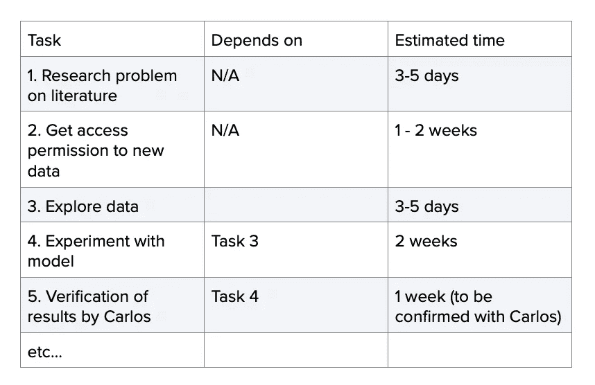

# 你可能会低估数据科学项目的持续时间:原因如下

> 原文：<https://medium.com/mlearning-ai/youll-probably-underestimate-the-duration-of-your-data-science-project-here-s-why-4da3b8938dcd?source=collection_archive---------0----------------------->

Credits to [Aron Visuals](https://unsplash.com/@aronvisuals?utm_source=unsplash&utm_medium=referral&utm_content=creditCopyText) on [Unsplash](https://unsplash.com/s/photos/time-keeping?utm_source=unsplash&utm_medium=referral&utm_content=creditCopyText)

数据科学从业者经常会意外成为项目经理。也许他们的项目团队太小，没有全职项目经理，或者，即使有全职项目经理，数据科学家仍然需要设置和负责与更高级别的项目里程碑相关联的粒度任务。例如，在一个大型项目团队中，数据科学家可能负责“开发一个预测定价模型”的任务，该任务本身由较小的任务、实验、细微差别和依赖关系组成，这些任务太细，不适合传统的项目管理结构。

当作为一个[非官方项目经理](https://www.amazon.co.uk/Project-Management-Unofficial-Manager-FranklinCovey-ebook/dp/B00RTYMOQS/ref=sr_1_6?crid=XPYJM5DTBFLQ&keywords=informal+project+manager&qid=1668033589&sprefix=informal+project+manage%2Caps%2C61&sr=8-6)的时候，这通常需要导航多个移动部分，例如利益相关者参与、设定期望、理解项目或任务的商业价值以及建立成功标准。从我的经验来看，拥有良好软技能的数据科学家通常会在上述方面取得成功。相反，我看到数据科学家反复低估的一个因素是一项任务的*持续时间*。

这将发生在我们所有人身上。当主要利益相关者漫不经心地问:“你认为完成这个项目需要多长时间？”时，我们会对项目感到兴奋。我们几乎总是会低估完成的时间。

下面是两个基于真实故事的虚构人物，他们举例说明了时间估计中常见的陷阱。

# 编码器克里斯

一位高级利益相关者希望一位数据科学同事(让我们称他为 Chris the Coder)训练一个模型，从他们公司购买的数据库中对相关和不相关的新闻文章进行分类。

“嘿，克里斯，训练一个模型识别相关和不相关的新闻需要多长时间？”

“嗯，根据数据的大小，我需要一到两天来处理它，然后再花几天来微调模型(我将从基线开始)。由此，我可以生成预测，这样主要的利益相关者可以仔细检查它，并基于这些迭代，再花几天时间进行微调，用一天时间记录它并将其打包成可重用的代码”

根据 Chris 的估计，训练一个模型大约需要 7 天，如果是乘法因子，可能需要 10 天。然而，这个特定的项目花了五个月的时间来完成并交付最终结果，这让高级涉众非常失望。

克里斯怎么会对完成这个项目的时间估计错误呢？碰巧的是，Chris 忽略了旧的项目管理公理，它告诉我们*工作不同于持续时间。*克里斯估计*他的工作*将要花费多少时间。他没有估计到这样一个事实，即要获得新闻数据，他需要访问一个只有两个人可以在每个季度举行的工程会议上批准后授予他的表格。他没有估计到这样一个事实，即一旦他得到了数据集，这些表是如此混乱，以至于他不得不安排与资产所有者的会议来解释。他没有估计到数据集如此之大，以至于可视化需要一整天的时间，所以他不得不求助于他的一个工作“盟友”，一个忙碌的数据工程师，为他预处理数据。最终，他没有估计依赖关系的**持续时间**，这将项目完成的总时间增加了一个数量级！

# **艾莉估算师**

另一个错误估计持续时间的常见例子是，有人在项目中途被带去“帮助”一个可能要休假很长时间的同事。或者可能是一个需要重新启动的旧项目，而从事这个项目的团队早已不在了。这个场景发生在我的朋友 Ellie 身上，众所周知她精通项目管理。以下是与她的经理的对话。

“去年，我们做了一个关于印象时间序列预测的项目。培训模型的人离开了，但是现在一个高级涉众想要更新项目以包含新的数据。我觉得应该只需要一两天，你觉得呢？”

“我需要至少花两天时间看一下这个项目，试着了解更新数据的步骤，然后我可以给你一个估计。”

“Charting goals and progress” by [Isaac Smith](https://unsplash.com/@isaacmsmith?utm_source=unsplash&utm_medium=referral&utm_content=creditCopyText) on [Unsplash](https://unsplash.com/s/photos/forecast-graph?utm_source=unsplash&utm_medium=referral&utm_content=creditCopyText)

埃莉的回答让她的经理有点失望，但从长远来看，这节省了她的时间。仅仅试图理解这个项目可能会被视为“浪费两天时间”，但这提供了一个很好的任务描述。如果她没有“浪费两天”，她不会注意到:

*   代码缺乏清晰的文档。她对这个模型不是很熟悉，附带的幻灯片演示也没有帮助阐明如何重现结果。
*   有些特性似乎是硬编码的，很少解释为什么必须这样
*   受过训练的模型似乎是针对那一年的，如果她想要准确的话，需要重新训练
*   代码的一部分说“由 Carlos 手动验证”，这意味着一旦数据更新，另一个涉众必须验证数据。

这些步骤中的每一步都是预期的风险，并增加了项目的总持续时间(以及成功的概率)。没有一个是完全的阻挡者，但是必须采取行动。通过清晰地传达，她可以给经理一个更准确的截止日期，降低期望值。

这两个例子告诉我们，估计你自己的工作通常只是评估项目预期持续时间的一个要素。我们知道训练一个机器学习模型、生成一个图表或开发一个基本的浏览器应用程序需要多长时间。然而，为了估计一项任务的持续时间，我们需要考虑一些我们无法控制的因素。以下是一些常见的主题，但绝非详尽无遗:

*   获取数据需要多长时间？
*   我有必要的权限吗？谁可以授予我访问权限，他们能以多快的速度这样做？
*   数据是如何组织的？有字典吗？我能接触到了解它的资产所有者吗？
*   当项目进行到一半时，项目文档化程度如何？
*   如果团队中的其他人必须为流程提供输入，他们有多忙，他们的截止日期有多可靠？
*   如果你需要利益相关者的输入，同上。

将任务写在一个表格中，确定哪些是关键的，这通常是有用的，项目经理喜欢称之为*依赖映射的工具。*您使用的具体软件并不相关——不同的团队将使用不同的软件来记录任务(或者，如果您是便利贴使用者，请使用它！).下面是如何考虑依赖关系的高级示例:

Simple high-level overview of a data science dependency map

拥有一个准确的依赖关系图是一项艰巨的任务，您可能需要定期更新它，以适应不可预见的情况。另一方面，没有地图肯定会低估项目的持续时间。该图必须对主要利益相关者可见，并反映出你对每项任务的最佳猜测。请放心，最初投入考虑你的任务的时间是非常值得的！

> 就编写代码而言，你可能是地球上最快的数据科学家，但如果你不考虑依赖关系的持续时间，你就无法在截止日期前完成工作。

如果您有任何其他工具来帮助您估计数据科学项目的持续时间，请在下面发表评论！

注意:术语“偶然的”或“非官方的”项目经理来自我强烈推荐的两本书:由卡莉·卡坤、苏珊蒂·布莱克莫尔和詹姆斯·伍德所著的《非官方项目经理的项目管理,以及由雷·弗罗纳霍弗和其他作者所著的《偶然的敏捷项目经理:7 次迭代中从零到英雄。

## [**成为 MLearning.ai 的作家**](https://mlearning.substack.com/about)

 [## Mlearning.ai 提交建议

### 如何成为 Mlearning.ai 上的作家

medium.com](/mlearning-ai/mlearning-ai-submission-suggestions-b51e2b130bfb)