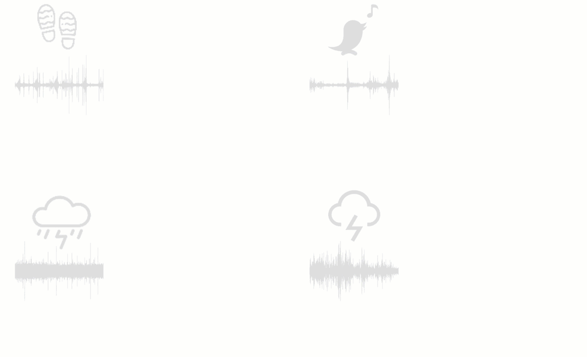

# 你最喜欢的声音作为一个愉快的图片

> 原文：<https://medium.com/mlearning-ai/your-favorite-sound-as-a-pleasant-picture-ef0917e77917?source=collection_archive---------1----------------------->

## [机器学习艺术](https://mlearning.substack.com)

## 交叉模态图像合成

[**Audio-driven image stylization**](https://mlearning.substack.com)

你能通过声音想象出图像吗？答案是肯定的！**从视听联想中学习视觉风格。**这是计算机视觉中的一个实验，用来测试视觉和声音交织的程度。