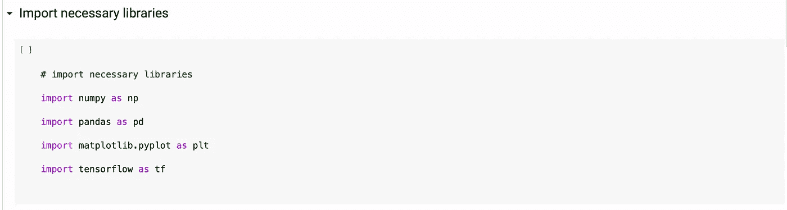
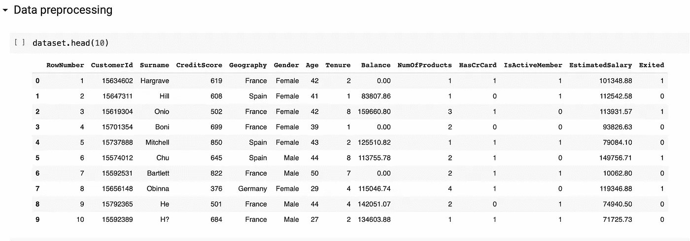
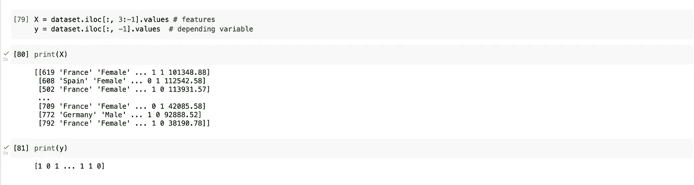
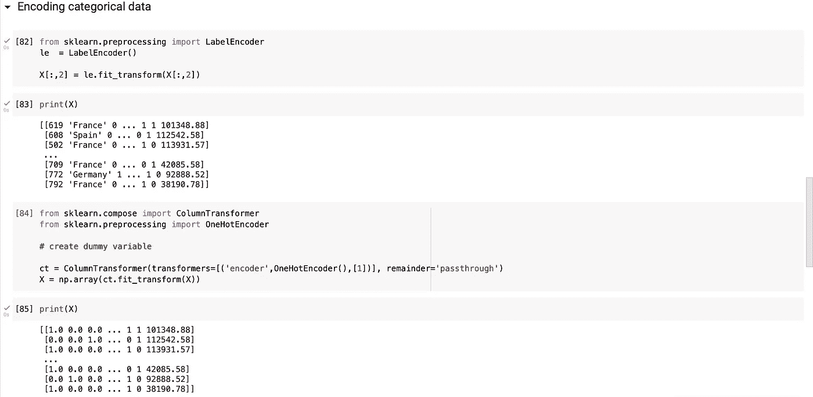
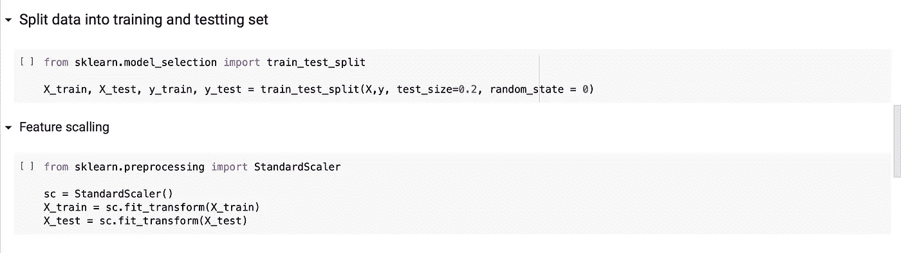
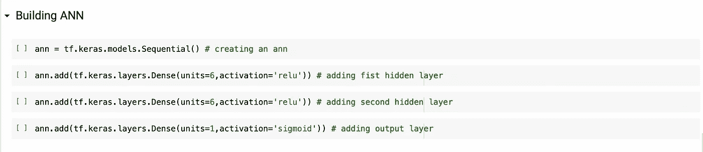
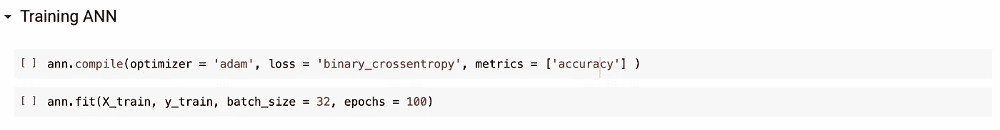
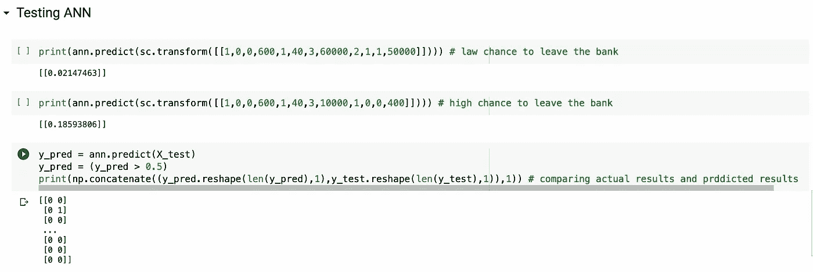
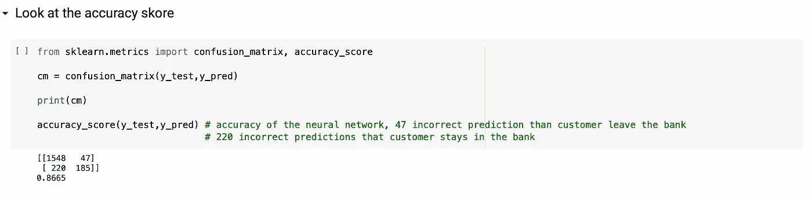

# 你的第一个深度学习现实世界项目

> 原文：<https://medium.com/mlearning-ai/your-first-deep-learning-real-world-project-64f81edf5111?source=collection_archive---------7----------------------->

## 逐步指导如何建立你的第一个神经网络

我们的计划:

*   导入必要的库
*   观察数据背景
*   做数据预处理
*   将数据分成训练集和测试集
*   构建人工神经网络
*   训练人工神经网络
*   测试人工神经网络
*   看准确率得分

所以，现在就行动吧！

Photo by [Vackground](https://unsplash.com/@vackground?utm_source=medium&utm_medium=referral) on [Unsplash](https://unsplash.com?utm_source=medium&utm_medium=referral)

> 1.基本进口

因此，基本上我们需要导入 NumPy 来处理数组，导入 Pandas 来处理数据框，导入 Matplotlib 来实现可视化，导入 TensorFlow 来构建人工神经网络。

> 2.数据背景

首先，让我们看看我们的数据。我们对银行中的随机客户在某段时间的活动进行了 10000 次观察。数据帧包括客户活动的不同特征以及客户是否离开银行。

现在，我们的目标是建立一个能够预测客户是否会离开银行的神经网络。

> 3.数据预处理

我们的第一步是创建输入特征变量为 *X* ，期望输出变量为 *y.*

第二步是使用不同的编码算法处理分类数据。

> 4.拆分数据

现在，我们将数据分为训练部分和测试部分，以便稍后能够测试我们模型的准确性。

> 5.使用 Python TensorFlow 库构建人工神经网络

在这里，我们将创建第一个人工神经网络。之后，我们应该添加隐藏层，输入和输出层，并指定两种类型的层的激活功能:隐藏和输出。在你的例子中，修正的线性激活函数用于隐藏层，sigmoid 函数用于输出层。

> 6.使用我们先前创建训练数据来训练 ANN

因此，这里我们将训练数据输入到模型中，并指定训练循环的数量— 100。这意味着神经网络将 100 尝试最小化适应权重的损失功能。

> 7.使用我们之前创建的测试数据测试人工神经网络

用真实数据测试神经网络是相当重要的一步。在这里，我们试图预测客户是否离开银行的概率，并将实际结果与预测结果进行比较。

> 8.最后，看看我们模型的主要指标——准确性

最后，让我们看看人工神经网络的精确度。差不多 87%的准确率！

总之，我想说这是一个非常基础的项目，只是为了说明深度学习算法的力量。这背后没有魔法，只有数学、编程和海量数据。

 [## Mlearning.ai 提交建议

### 如何成为 Mlearning.ai 上的作家

medium.com](/mlearning-ai/mlearning-ai-submission-suggestions-b51e2b130bfb)