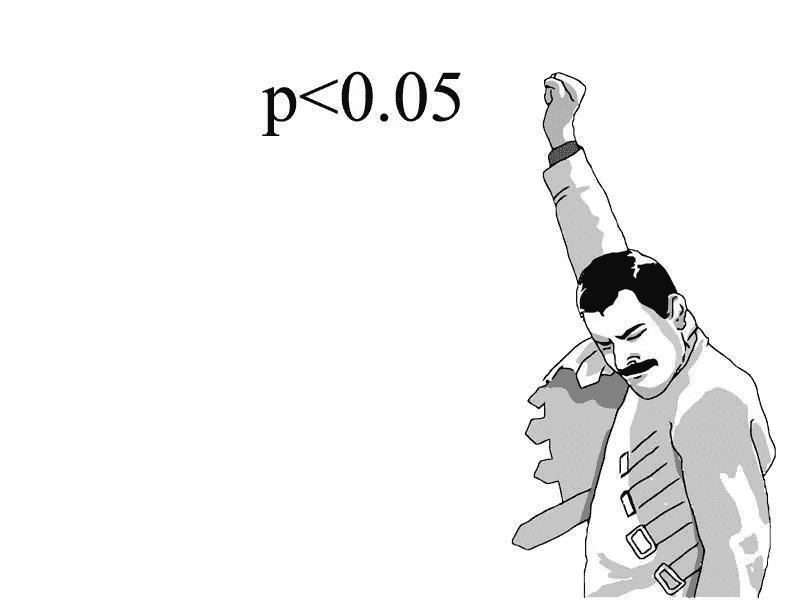
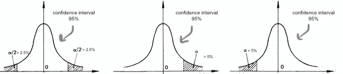

# 假设检验和 P 值指南

> 原文：<https://medium.com/mlearning-ai/your-guide-to-hypothesis-testing-and-p-values-6411ec21655b?source=collection_archive---------1----------------------->

很有可能你遇到了这些流行词汇中的一个，你有一些问题。如果这是你，那么你来对地方了。在这篇文章中，我们将以非常简单的方式解释 ***假设检验、置信区间、统计显著性*** 和 ***P 值*** 。所以，请不要走开，因为我们将深入探讨每一个问题。

# 假设检验

**假设检验**是检验假设是否合理的科学过程(换句话说，这是检验假设是否被接受的过程)

在每一个假设检验中，都有无效假设和备择假设，分别以 H0 和 H1 或何和哈为代表。

那么……什么是无效假设和替代假设呢？

> **零假设(H0 或何):**这是对总体的一种假设，即没有新的事情发生，旧的/默认的理论是正确的，直到有证据证明不是这样。
> 
> **替代假设(H1 或哈):**它是对零假设的补充，实际上它只是零假设的对立面，当我们拒绝零假设时，它被接受。

在法庭的例子中，我们知道“每个人在被证明有罪之前都是无辜的(T21)”

> 无效假设(H0 或何):一个人是无辜的。
> 
> **另类假设(H1 或哈):**一个人有罪。

当我们谈到回归问题时，零假设仅仅意味着因变量和自变量之间没有关系，反之，则是备择假设。

# 显著性水平(α)

在假设检验中，有两种错误是可能的，第一类和第二类错误:

> **I 型错误(也叫 alpha α)** :当真的零假设为真时，支持替代假设。
> 
> **第二类错误(称为 beta β** ):当替代假设真的为真时，不支持替代假设。

在我们之前的法庭例子中， ***第一类错误*** 是判断一个人有罪，应该被关进监狱，而实际上他是无辜的。而 ***第二类错误*** 是判断一个人是无辜的，应该被无罪释放，而实际上他是有罪的。

## 非常感谢，但是…这和*显著性水平有什么关系？*

显著性水平是 I 类错误的概率，通常用α表示。alpha 最常见的值是 5%。

因此，如果一个结果是**统计上显著的**，这意味着我们可以确信它是真实的，而不是我们只是幸运(或不幸)地选择了样本。不太可能仅仅用偶然或随机因素来解释。

例如，如果α是 0.05。这意味着有 5%的时间我们会错误地得出结论，我们应该拒绝零假设，而我们不应该，因此有 5%的概率我们会因为拒绝一个真正的零假设而遭受 I 型错误。

# 置信区间和置信水平

对于为样本计算的给定统计数据(如平均值)，**置信区间**基本上是该统计数据周围的值的范围，我们认为它包含了该统计数据在一定概率(如 95%)下的真实值(如总体值)。

**Tl；dr:** 它是可能包含真实值的值的范围。

*Ook …那么* ***信心水平*** *呢？* **置信水平**无非是我们多次抽取随机样本时，置信区间包含真实总体值的概率或确定性。

它是根据平均值的标准误差计算出来的，即标准偏差除以样本大小的平方根。95%的置信区间是假设检验中最常用的，即观察值两侧的 2 个标准差，它是我们可以 95%确信真实值所在的值范围。

# p 值

p 值用于假设检验，以帮助支持或拒绝零假设。这是反对无效假设的证据。如果 p 值小于或等于α，那么它在统计上是显著的，我们决定拒绝零假设。

> **重要提示:**如果我们不能拒绝零假设，那么我们说“*我们未能拒绝零假设*”,“未能拒绝”零假设并不意味着“接受”零假设。另一种假设可能确实是对的，但我们当时没有足够的数据来证明这一点。

## 那么 p 值在图中的什么位置呢？

p 值越小，支持替代假设和反对无效假设的证据就越强，例如，小于 0.05 的 p 值告诉我们结果具有统计学意义。

因此，p 值实际上只不过是观察到的效应偶然发生的可能性或概率。这给了我们一个统计意义的度量，帮助我们决定我们的假设。

希望这篇文章有用，你喜欢它..:)

直到下一个 time✌🏻