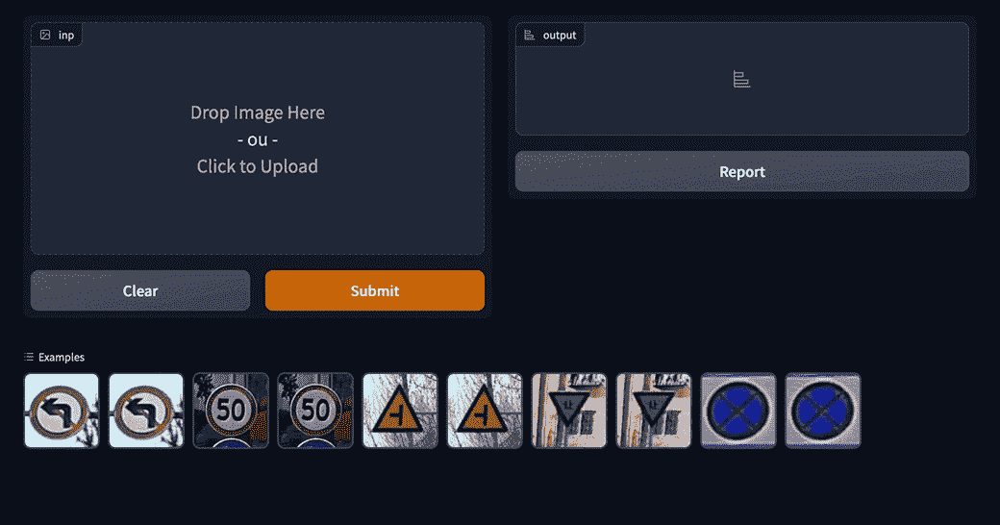
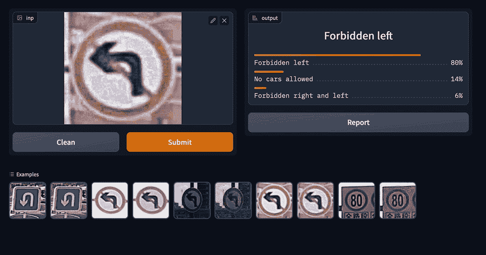

# 你的模型受到攻击——一个对抗性的机器学习项目

> 原文：<https://medium.com/mlearning-ai/your-model-is-under-attack-an-adversarial-machine-learning-project-9d9f75d8fe42?source=collection_archive---------6----------------------->

这篇文章旨在展示机器学习模型是如何被攻击的。这是我上两篇关于[对抗性机器学习](/mlearning-ai/adversarial-machine-learning-fight-against-attackers-e38d5f0917f6)和[卷积神经网络(CNN)](/mlearning-ai/convolutional-neural-networks-learning-from-what-matters-b05e6121cb7a) 的文章的继续，因为它是 CNN 被攻击的代表。

Photo by [the blowup](https://unsplash.com/@theblowup?utm_source=medium&utm_medium=referral) on [Unsplash](https://unsplash.com?utm_source=medium&utm_medium=referral)

一个对立的例子是一个图像或其他类似于正常输入的输入，用于训练模型，但其中的内容会造成失真。

我已经在另一篇文章中概述了什么是对抗性机器学习，这篇文章将只关注模型训练后完成的攻击。我们称之为**规避攻击**，因为这个想法是发送愚弄模型的输入，而不是改变模型本身。

先说攻击用的方法…

# 有哪些强大的攻击手段？

这些攻击旨在创建相互矛盾的例子，以使 ML 系统做出错误的预测。这里我们介绍四种著名的方法:**快速梯度符号法**、**投影梯度下降法**、**基本迭代法**和**卡里尼&瓦格纳攻击。**

**快速梯度符号法(FGSM)** :这是一种旨在扭曲分类的“白盒”攻击。其背后的想法很简单，在根据输入图像的分类计算损失之后，它计算损失的梯度，但不是使用这个梯度来最小化损失，而是使用它来**最大化后面的**。在最大化损失和增加未命中分类的方向上修改像素。

> 在 FGSM 中，攻击者试图找到一个最大化关于被攻击模型权重的损失函数的输入。

**投影梯度下降(PGD)** :类似于 FGSM 方法，但是它迭代地工作以缓慢地修改输入，而不是像 FGSM 那样具有独特的步骤。此外，背后的想法是添加一个不会大幅改变输入的扰动，这是通过也被称为约束的*ε*项来管理的。约束的目标是保持对立的例子看起来和正常的例子一样，这是通过使用 L 或 L∞范数来实现的。

**基本迭代方法****【BIM】**:顾名思义，它是一种迭代方法，与 FGSM 受相同的方法支持。它也被称为迭代 FGSM (IFGSM ),和 PGD 一样，其思想是保持新像素与输入像素相对相似。PGD 和 BIM 的不同之处在于感兴趣的球内的示例的初始化(来自规范)。虽然这是在 PGD 随机完成的，但初始化是在 BIM 中设置的。

**Carlini&Wagner Attack(C&W):**这种方法与之前的方法不同，因为它用于目标明确的攻击，目标是基于特定的类别创建敌对的例子。因此，C & W 不是简单地修改示例，而是基于图像的新类别(约束)来最小化损失函数。

让我们看看如何用 Python 实现它…

# 创造对立的例子

因为我们将模拟的攻击是白盒攻击，这意味着我们完全了解我们需要的模型架构:

*   具有权重和损失函数的**训练模型**
*   可用于模型的一些**输入(图像)**

我选择的模型是我在以前的[文章](/mlearning-ai/convolutional-neural-networks-learning-from-what-matters-b05e6121cb7a)中建立的模型，这是一个在数千个中国交通标志上训练的卷积神经网络(在这里找到)。

输入必须经过预处理，因为 CNN 只接受 134x128 的图像。因此，每个输入都通过一个函数来完成。

有了所有这些，我们将能够为**无目标攻击**和**有目标攻击** **和**创建对抗性示例。第一组的目标只是愚弄模型，而第二组的目标是将修改后的图像分类到特定的类别中。

## 无目标规避攻击

在这一节中，我们的想法是从测试数据集中创建修改后的例子，以欺骗模型。为此，我使用了 [**对抗性-鲁棒性工具箱(ART)**](https://github.com/Trusted-AI/adversarial-robustness-toolbox) ，这是一个为许多对抗性任务提供工具的库。

下面是从一系列图像中创建对立示例的代码:

它分两步工作:

*   **加载将要被愚弄的模型**并将其转换为**艺术分类器**。想法是从 Keras 创建一个分类器实例，允许对它进行攻击。
*   用模型初始化攻击方法，本例中**投影梯度下降**，**基于测试数据集生成** **对抗性** **示例**。

这里你可以看到模特小姐是如何对对抗性例子进行分类的:

这个应用程序是用 [**Gradio**](https://gradio.app/) 制作的，这是一个用于创建 web 应用程序的框架，可以在一分钟内演示模型系统。

## 有针对性的规避攻击

生成有目标的例子比无目标的例子更困难，因为它要求攻击者知道分类器的内部结构。

对于这个任务，库 [**CleverHans**](https://github.com/cleverhans-lab/cleverhans) 很棒，可以生成针对性攻击。我决定使用的方法是我之前介绍的**基本迭代法**。

下面是从一系列图像中创建对立示例的代码:

代码背后的想法是首先**加载模型**，通过**移除最后一层**(输出)来改变它，以便在新的训练期间用 **sigmoid 函数/逻辑回归**(用于二进制分类)替换先前的 softmax 函数(用于分类多个目标)。

一旦完成，第二步也是最后一步是**基于一些超参数和测试数据集生成对立的例子**。 *y_attack_target* 是与新图像数量相同大小的唯一目标(在本例中为 3 个)的列表。因此，训练考虑到所有图像都与该目标相关联，而不是真实图像。

看起来是这样的:

选择的目标是 ***极限速度 40*** ，我们看到它通过预测这个类别而不是像无目标攻击中的随机类别来有效地犯错误。

# 结论

攻击机器学习模型不是一件容易的事情。在这篇文章中，我展示了一些攻击者在 CNN 上进行的**白盒攻击**。然而，当模型参数被隐藏时，这是非常困难的。

感谢你阅读这篇文章，我希望你喜欢它，并发现了一些新的方法来执行攻击！如果你对数据科学和机器学习感兴趣，可以在这里查看我的其他文章。

## 资源

 [## 曼宁出版公司

### Manning 是计算机书籍、视频和课程的独立出版商。

www.manning.com](https://www.manning.com/)  [## 艺术- IBM 研究

### 编辑描述

art-demo.mybluemix.net](https://art-demo.mybluemix.net/)  [## 对神经网络的对抗性攻击:探索快速梯度符号方法

### 自发明以来，神经网络一直是机器学习算法中的精英。他们有…

海王星. ai](https://neptune.ai/blog/adversarial-attacks-on-neural-networks-exploring-the-fast-gradient-sign-method)  [## 基于梯度的对抗性攻击:介绍

### 神经网络最近在大多数机器学习问题上提供了最先进的性能，甚至可以…

medium.com](/swlh/gradient-based-adversarial-attacks-an-introduction-526238660dc9)  [## Mlearning.ai 提交建议

### 如何成为 Mlearning.ai 上的作家

medium.com](/mlearning-ai/mlearning-ai-submission-suggestions-b51e2b130bfb)