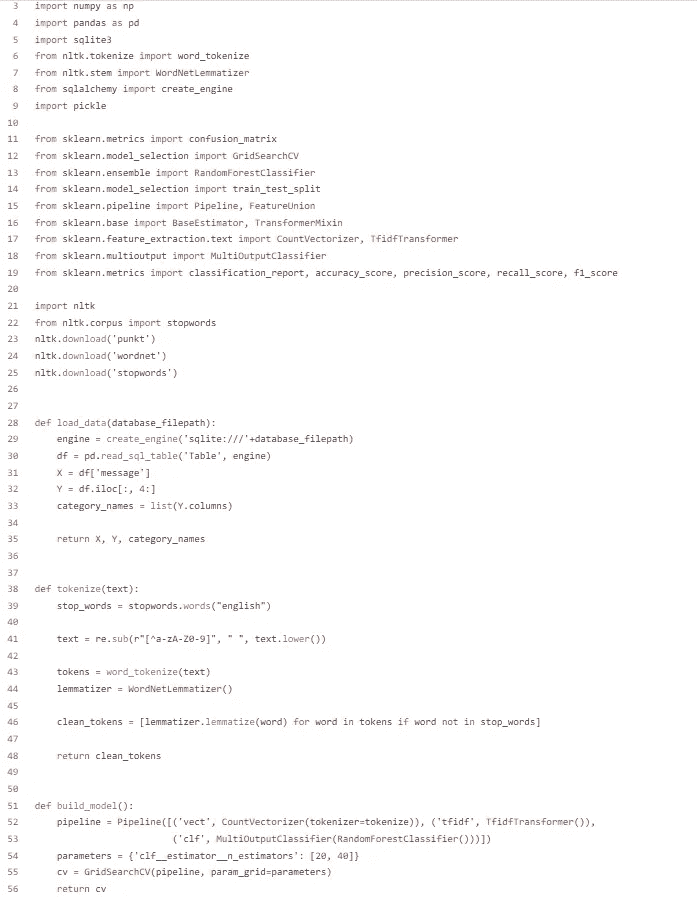
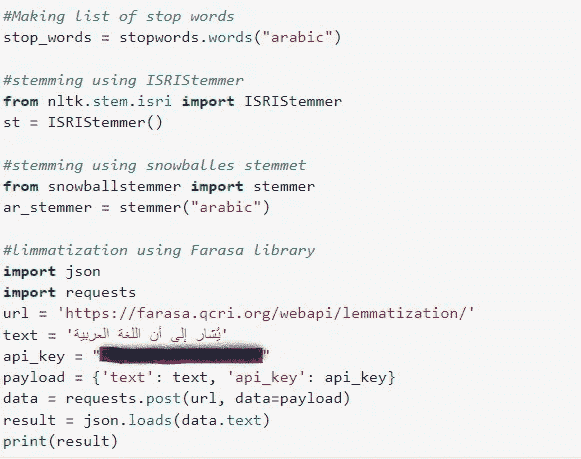
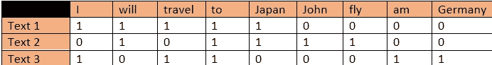
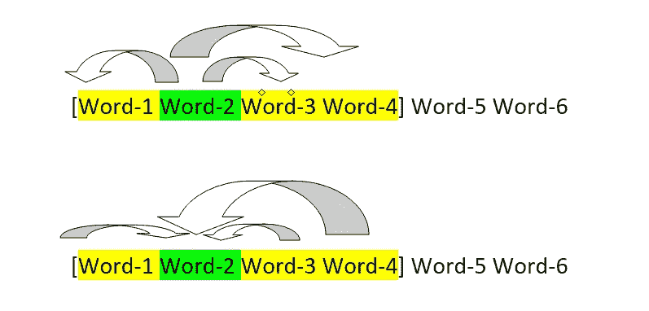
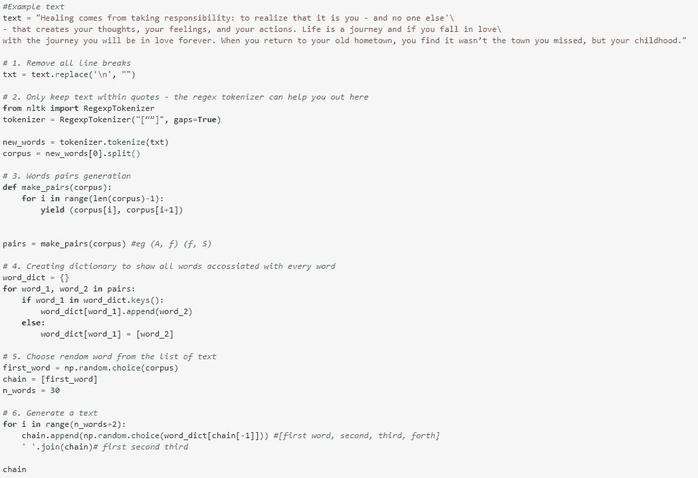

# Python 自然语言处理入门指南

> 原文：<https://medium.com/mlearning-ai/your-starter-guide-for-natural-language-processing-in-python-854f0a38ce17?source=collection_archive---------3----------------------->

你有没有想过你的手机是如何生成文本并为你预测正确的单词的(即使不是一直如此)？纠正你的话？或者你想过计算机如何进行情感分析并预测客户对某些主题的感受吗？

答案是自然语言处理或 NLP。定义 NLP 最简单的方法是计算机或机器如何理解和解释我们的人类语言，以提供输出，如垃圾邮件检测或情感分类。

NLP 领域始于 20 世纪 40 年代，几十年来不断发展，出现了许多新的应用和用例。如今，使用 Python 等开源软件构建 NLP 模型并不困难，这就是我在这里提供的，一个可以开始构建模型的指南。

在本文中，我将展示我为文本分类开发的代码，该代码用于构建应急响应，它将在两个方面为救灾组织带来好处:

1.过滤并提取推特上的求救信息。

2.正确分类这些求救信息，以提供所需的帮助。

文章分为三个部分。第一部分将描述文本处理所需的步骤，如所需的库、文本规范化、标记化和其他附加步骤。第二部分是我将要展示代码的地方，我将使用它作为一个例子来解释第一部分中提到的步骤。最后一节将解释单词嵌入和文本生成背后的理论。最后，您可以在文章末尾找到一些资源的链接。

# 第 1 部分:文本处理步骤

文本处理包括以下主要步骤:

1.  文本规范化:这一步包括去掉标点符号，将大写字母转换成小写字母。这对于避免文本分类过程中的混淆很重要，并且最终将大写字母的单词与小写字母的单词进行不同的分类。
2.  文本标记化:将文本分割成单个单词，并作为列表。这将有助于将文本信息作为数字信息处理。这对于接下来的单词计数或矢量化非常重要。此外，下一个过程(词干化或词汇化)处理的是单词而不是句子。
3.  词干化或词汇化:这发生在标记化之后，其中每个单词被转换为其词根，以避免因单词具有不同形式而造成的任何混淆，其中每个形式将被视为唯一的单词，而实际上它不是(单词 write、write、writing 具有与 write 相同的词根)。
4.  去除停用词:停用词(如；The，a，an，This)以避免错误的分类或更长的文本处理时间。此外，这些词本身对句子没有任何意义。
5.  特征提取:文本处理的这一部分是以两种方式中的一种来处理的，这取决于所寻找的是什么。例如，用于文档级任务(如垃圾邮件检测)的特征提取不同于用于单词或句子级的特征提取(如文本生成)。第一种要求我们使用单词包或**计数矢量器**。而第二个将使用 **Tfidf 矢量器。**在计数矢量器中，我们计算单词出现的次数。而在 Tfidf 中，矢量器(Tfidf =术语频率-逆文档频率)通过将单词出现的次数除以它出现在文档中的次数来为每个单词分配权重。例如，如果单词*苹果*在十(10)个文档中出现五(5)次，那么它的权重为 0.5。

这里要陈述的最后一件事是，我们到目前为止所看到的是否适用于阿拉伯语？简单的回答是肯定的。在参考资料部分，我将包括一些与用于阿拉伯语的 NLP 库相关的参考资料。此外，在第二部分的最后，我将展示相关的代码。

# 第 2 部分:代码示例

下面你会看到一个简单而全面的文本处理管道的例子。由于每一行都有编号，我将参考行号并解释其含义。我不会浏览完整的代码，只讨论与文本处理相关的部分，这些部分与第 1 节中提到的步骤相关。

*   第一部分是导入类和库。在第 21 行中，整个 nltk 库被导入。**第 6、7、22 行**分别导入了三个类；标记化、词汇化和停用词。然而，为了让这三个类工作，需要下载三个文件。这些文件是:

1.  ***punket****为了更好的分词处理(**第 23 行**)*
2.  ****wordnet****作引理(**第 24 行**)**
3.  *****停用词*** 文件中有所有停用词的英文(**第 25 行**)**

*   **第二部分是构建管道来执行处理步骤规范化、标记化、词汇化和停用词删除。**在第 38 行，**定义了一个名为 *tokenize* 的函数，这里我们有任何文本作为输入，输出是干净的 tokenized 单词列表。**在第 39 行**，英文停用词被上传到列表中以备后用。**在第 41 行，**文本被规范化，其中标点符号被替换为空格，所有字母都被转换为小写。**在第 43 行，**文本被标记化，其中每个文本被分割并存储在一个列表中。**在第 44 行，**创建了 lemmatize 类，文本将通过它将每个单词转换回它的根形式。文本处理管道的最后一部分，**在第 46 行，**停用词从词汇列表中取出，并返回一个称为“*干净标记*的干净单词列表。**
*   **代码的最后一部分是构建机器学习(ML)模型，从 l **行 51 到 56** 开始。该模型从管道类开始，管道类由三部分组成:计数矢量器、Tfidf 转换器和多分类器。通过使 tokenizer 等于 tokenize，文本处理函数( *tokenize* )被用作计数矢量器类的输入参数。如前所述，计数矢量器将计算词频。ML 管道的下一部分是进行 Tfidf-Transformation，其中通过将词频除以单词出现的文档数来对每个单词进行加权。这两个 ML 过程相当于使用 Tfidf-vectorizer。pipeline 类的最后一个参数是多分类器，因为有多个标签(超过 2 个标签)，所以使用它。机器学习功能的最后一部分是网格搜索，它使用估计器 20 和 40 的两个不同值作为多分类器类的输入参数来应用 ML 流水线。**

**这些都是大部分英文文本处理所需要的部分。一旦文本被处理，你可以使用任何机器学习算法。**

**关于阿拉伯语的文本处理，困难的部分是词汇化和词干化。这是因为没有多少库可以完成这个功能，但是很少。下面是你需要添加到我上面显示的代码中的唯一修改。**

****

**第一部分是获取阿拉伯语的停用词，将其从与第一代码相似的词列表中删除。接下来的三个部分是进行词干化或词汇化的不同选项。第一个和第二个选项是使用 ISRIStemmer 或 snowballstemmer。这两个选项都不完美，但对于简单的文本来说可能足够了。至于提供最佳结果的最后一个选项是使用 Farasa 库。你所需要做的就是使用显示的代码行，但是使用你的 API 代码，一旦你注册到他们的网站，你就会在你的电子邮件中收到这些代码。然而，这个库的主要问题是它的局限性。您只需要处理有限的文本，因为这个过程是通过 Farasa 库的 API 完成的。**

# ****第三部分:单词嵌入和文本生成概念****

**在这最后一节，我将解释单词嵌入(矢量化)背后的概念，以及文本生成是如何工作的，而不会深入讨论数学算法的细节。附加的参考资料显示在最后，这将有助于编程&提供更深入的数学解释。现在让我们从文本处理的最后一部分开始，这是计数单词或计数矢量器，我们在这里计数词频，从这一点我们可以进行单词矢量化(将单词表示为矢量)。让我们通过这三个文本来看一些简单例子:**

*   **文本 1:“我将去日本旅游”**
*   **文本 2:“约翰将飞往日本”**
*   **文本 3:“我要去德国旅游”**

**在第一个表格中，我们看到每个文本都由单词组成，这给了我们一个向量**

****

**例如，文本一有一个向量(1，1，1，1，0，0，0，0)，而文本二有一个向量(0，1，0，1，1，1，1，0，0)，通过对两个向量之间的角度取余弦，我们可以看到它们有多相似，对于这两个向量，余弦相似度为 0.6 (1 表示相同，0 表示不相似，而-1 表示相反)。因此，有了这个我们就可以检测出不同的单词有多么相似。**

**将文本转换为向量是神经网络和机器学习算法的重要输入，因为它们只接受数值。因此，这种神经网络可以用于情感分类、寻找相似的词或文本生成。**

**现在来谈谈文本世代，这个想法真的很简单。假设有一个由六(6)个单词组成的文本，现在我们决定用黄色突出显示一个单词窗口(见下图)。让我们假设我们有单词 2，这个单词在许多文本中重复出现，所以我们在这里做的是计算概率，这可以用两种方法之一来完成:**

1.  **如果我们有单词-2，我们计算单词-1、单词-3 或单词-4 出现的概率。所以它将是 *P(Word-1|Word-2)，*给定我们有 Word-2，有 Word-1 的概率。这对于单词 3 和单词 4 也是一样的。**
2.  **我们反过来做，因此我们计算 *P(单词-2 |单词-1)、P(单词-2 |单词-3)和 P(单词-2 |单词-4)，*这是在给定单词-1、单词-3 和单词-4 的情况下拥有单词-2 的概率。**

****

**下面你会发现一个简单的代码，你可以键入和尝试不同的文本，以简单的方式理解文本生成的概念。**

****

**最后，好消息是单词嵌入和文本生成可以由已经为 Python 开发的高级模型来处理，比如 word2vec 和 Glove。**

# **帮助您入门的有用链接**

**下面我将列出三个有用的资源来丰富你的知识:**

*   **[NLP 的历史](https://cs.stanford.edu/people/eroberts/courses/soco/projects/2004-05/nlp/overview_history.html)**
*   **[NLTK 文档](https://www.nltk.org/index.html)**
*   **[理解 NLP 单词嵌入](https://towardsdatascience.com/understanding-nlp-word-embeddings-text-vectorization-1a23744f7223)**
*   **[自然语言处理中的单词嵌入](https://www.geeksforgeeks.org/word-embeddings-in-nlp/)**
*   **[手套字嵌入](https://nlp.stanford.edu/projects/glove/)**
*   **[Word2vec 单词嵌入](https://www.tensorflow.org/tutorials/text/word2vec)**
*   **[自然语言处理应用使用案例](https://monkeylearn.com/blog/natural-language-processing-applications/)**
*   **[用于阿拉伯语处理的 Farasa](https://farasa.qcri.org/)**

** [## Mlearning.ai 提交建议

### 如何成为 Mlearning.ai 上的作家

medium.com](/mlearning-ai/mlearning-ai-submission-suggestions-b51e2b130bfb)**