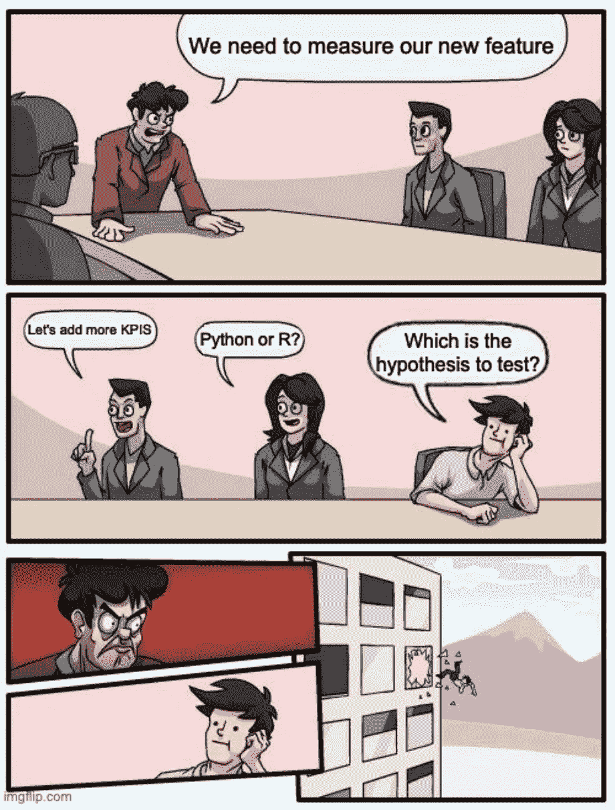
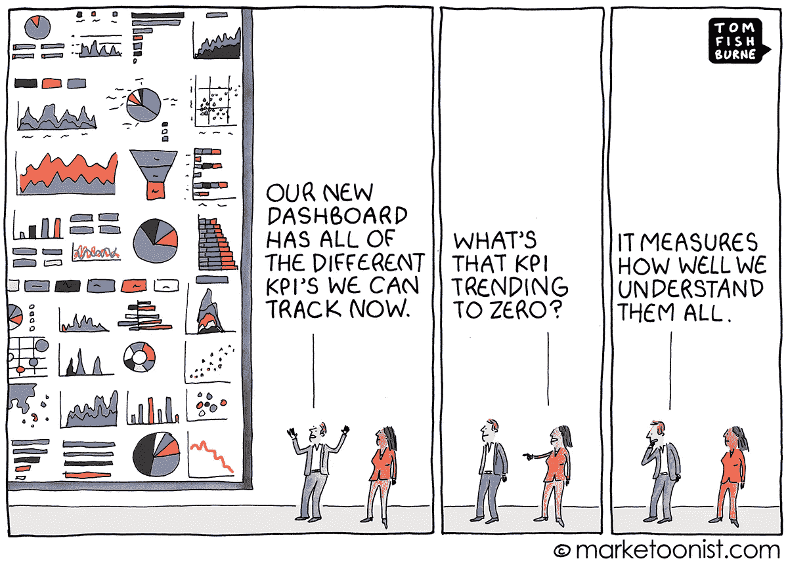
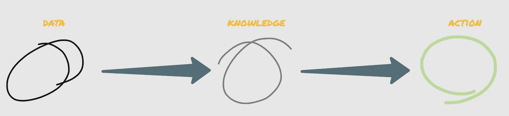

# 您的 UX 需要一个数据策略

> 原文：<https://medium.com/mlearning-ai/your-ux-needs-a-data-strategy-8467e8f2da26?source=collection_archive---------4----------------------->

## 如何从您的产品数据中恰当地提取价值

为了了解设计变更的结果，你花了多少时间在没有上下文的图表上？有多少次你绞尽脑汁创造新的用户流量，结果却没有引起同事的共鸣？如果答案是很多，也许**你的产品*需要一个数据策略。***

UX/UI design needs always a data strategy

正如我在之前的一篇博文中解释的那样，有时候最好是 [**停止向你的产品添加功能或新设计，开始研究你的用户的行为**](/p/d6cc27ea1412)

不管你是不是 UX/UI 设计师🎨研究员🔬或者数据科学家📊，当您处理产品数据时，**很容易在不同来源、图表、工具和要衡量的 KPI 之间迷失**。你会花很多时间研究你的数据，最后，你会提出你的见解，结果至少是好的。

> 如果你没有数据策略，你就不会从你产品的数据中产生价值。

在这篇文章中，我将写下我们在 BravoStudio 中遵循的数据策略。就像本杰明·富兰克林说的那样，如果你没有计划，你就是在计划着失败🖋。

当您想要从数据中产生适当的价值时，第一步就是**设计数据策略💡。**

> 数据策略是一个计划，它具有一个从选择合适的数据源到正确的信息交流的结构。

起初看起来很容易，但是在处理数据之前有一个战略性的数据方向是很关键的。拥有战略性数据方向有多种好处，例如:

*   通过团队协调目标和努力。
*   一旦你必须向团队的其他成员解释你的见解，增加你的自信。
*   去除误导性指标和噪音。

那么如何知道自己的战略数据方向是否防弹呢？你必须对以下问题有一个明确的答案:

*   作为一个公司或团队，我们的目标是什么？
*   我要测试的主要假设是什么？它们与目标有什么关系？
*   为什么拥有这些信息会有用？我想找什么？
*   我们有合适的数据来回答这些问题吗？
*   我们需要付出多少努力来回答这些问题？速赢与长期结果。

> 花些时间回答这些问题将为你提供一个清晰的方向，从所有混乱的数据中找到你想要提取的具体价值。

# 当数据隐藏了你的森林

一旦正确定义了策略数据方向，就该处理一些数据了。

> 缺乏数据策略导致我们在每项任务上花费 5 倍甚至 10 倍的精力。

在处理产品数据时，遵循数据策略至关重要。这并不像听起来那么简单，因为我们很容易被以下因素分散注意力:

*   花费不必要的时间处理与你想研究的假设无关的数据。
*   尝试自动化您将运行一次或两次的流程。
*   生成过多的 KPI 或指标，给结果带来干扰。

也就是说，我在这一点上发现的主要问题是，大多数时候，人们产生了**不必要数量的分支**，因为*他们忘记或者没有*他们想要测试的假设，这是一个大错误。

他们没有放眼全局，而是过度关注错误的指标，或者有太多与目标无关的结果需要分析。这是当*数据隐藏你的森林时的情况。*

> “少即是多”是数据领域中大多数时候必须遵循的原则。

# 当数据产生共鸣时

如果你遵循数据策略，你的数据会引起共鸣。举个简单的例子，假设我们希望增加引导付费墙改变用户对付费墙流量体验的试验次数，因为作为一家公司，目标之一是增加 MRR。

如果我们正确定义了假设以及测量什么/如何测量，数据将会产生共鸣，因为我们将会看到我们定义的 KPI 或模型与我们的目标之间的直接关联。

> 如果数据策略和你的目标之间有直接的关系，数据就会产生共鸣。

为了使这更容易，明智地选择测量什么以及如何测量与我们的实验相关的东西，当然，如何向团队的其他成员展示结果是很重要的。

## 后续行动

最后，正确的数据策略需要后续跟进。换句话说，为了获得数据的真正价值，提取的每个洞察都需要与所有者进行**行动**。

> 如果数据不可操作，您的数据就没有任何价值。

# 包扎

*   产品开发需要一个数据策略来产生适当的价值。
*   花些时间定义一个数据策略将为你提供一个清晰的方向，从所有的数据混乱中找到你想要提取的具体价值。
*   缺乏数据策略导致我们在每项任务上花费 5 倍甚至 10 倍的精力。
*   如果数据策略和你的目标之间有直接的关系，数据就会产生共鸣。

最后但同样重要的是:

*   每一个提取的洞察力都需要附加一个**行动方案。**

# 联系信息

*   📱领英:[胡安安东尼奥卡贝萨索萨](https://www.linkedin.com/in/juan-antonio-cabeza-sousa-5b954968/)
*   📬电子邮件:juaancabsou@gmail.com
*   🖥️推特:@juaancabsou

 [## Mlearning.ai 提交建议

### 如何成为 Mlearning.ai 的作者

medium.com](/mlearning-ai/mlearning-ai-submission-suggestions-b51e2b130bfb)