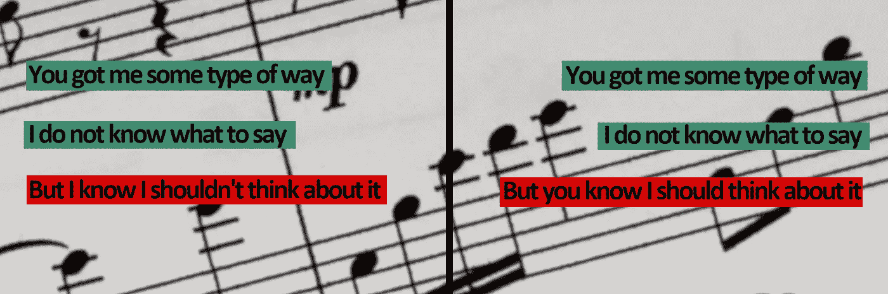

# 使用耳语的零镜头歌词转录

> 原文：<https://medium.com/mlearning-ai/zero-shot-song-lyrics-transcription-using-whisper-3f360499bcfe?source=collection_archive---------1----------------------->

## OpenAI 新语音模型的定性研究

Background Image by [Pixabay](https://www.pexels.com/de-de/foto/noten-mit-noten-534283/).

# 什么是耳语，为什么使用它？

就在最近的 9 月 21 日，OpenAI 发布了他们全新的语音转录模型[“耳语”](https://openai.com/blog/whisper/)。乍一看，Whisper 就像是另一个巨大的语音转录转换器。毕竟，它是在一个…