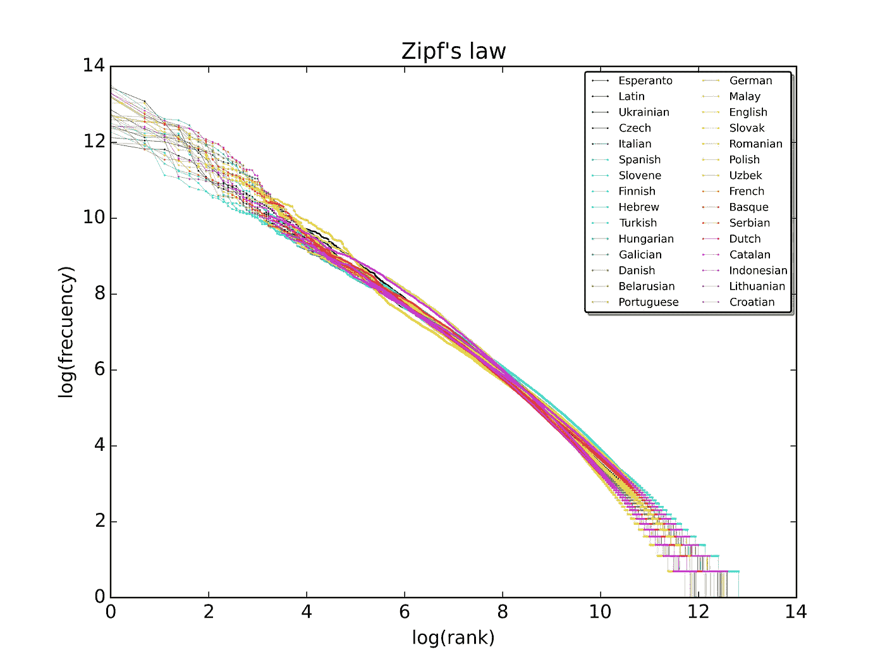
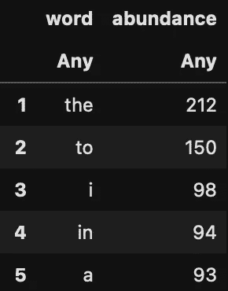
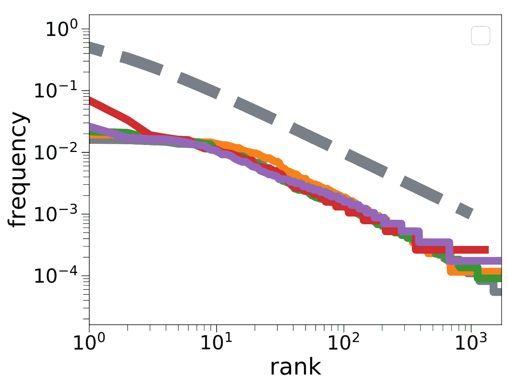

# WhatsApp 中的齐夫定律

> 原文：<https://medium.com/mlearning-ai/zipfs-law-in-whatsapp-ec47c8c38a97?source=collection_archive---------9----------------------->

## 最有趣的复杂定律是如何成为你聊天的一部分的

今天我将谈论我最喜欢的自然法则之一:所谓的 Zipf。

[齐夫定律](https://en.wikipedia.org/wiki/Zipf%27s_law)特别有趣，因为尽管它非常简单，但它在我们的生活中无处不在。你不知道，但确实如此。

*   想象一下，统计一下哪些词在维基百科中很常见，哪些不常见:答案是 Zipf！



A plot of the rank versus frequency for the first 10 million words in 30 Wikipedias (dumps from October 2015) in a log-log scale. Credits: Wikipedia ([SergioJimenez](https://commons.wikimedia.org/wiki/User:SergioJimenez), [Zipf 30wiki en labels](https://commons.wikimedia.org/wiki/File:Zipf_30wiki_en_labels.png), [CC BY-SA 4.0](https://creativecommons.org/licenses/by-sa/4.0/legalcode))

*   想象一下测量月球环形山的大小，[它们的大小分布是一个 Zipf](http://www.ptep-online.com/2016/PP-44-04.PDF) 。
*   如果有人测量日本的火灾规模。他们的分布如何？对，一个拉链
*   齐夫定律甚至在我们的 DNA 中也很普遍
*   细胞的转录物也有这种特征[1]

但它离你更近。你用的是 **Whatsapp** 吧？

让我们看看 Zipf 定律是如何在你的聊天中出现的！

# 一点数学知识

为了理解这一点，我们需要一点数学知识。

*   首先，我们需要一个单词的丰富度。丰度是一个单词在聊天中出现的总次数
*   我们可以将丰度归一化并获得频率。一个单词的**频率**是它在聊天中出现的次数占聊天中单词总数的比例
*   我们可以根据单词出现的频率对它们进行排序，并有一个**等级**。最丰富的作品将具有等级 1。



Most abundant words in a Whatsapp chat. Image by author.

# 获取数据

导出你的一个 WhatsApp 聊天记录:说明是

## 预处理您的字符串

首先，我们需要做一些预处理。

例如，是否有助于:

*   删除特殊字符
*   删除标点符号
*   在单词和表情之间添加一个空格

## 数数单词

我们准备在聊天中计算字数。下面的代码就是一个例子。

我建立了一个词汇表，如果一个单词在我的词汇表中，我就给它加 1，否则我就把它加到词汇表中。

```
function process_words(line, voc)
    for word in line
        if haskey(voc, word)
            voc[word]+=1
        else
            voc[word]=1
        end
    end
end
```

在这一点上，我们可以估计丰度和频率

```
function process_chat(chat_file="_chat.txt")
    vocabulary = Dict()
    open(chat_file,"r") do io
        while ! eof(io)
            message = readline(io)
            processed_message = preprocess(message)
            process_words(processed_message, vocabulary)
        end
    end
    frequencies = collect(values(voc))
    # Order by abundance
    frequencies = sort!(f, rev=true);
    # normalise
    frequencies = frequencies ./ sum(frequencies);
    return vocabulary, f
end
```

# 你的聊天很有趣

人们可以很容易地绘制出频率与等级的关系，这就是……齐夫定律！



Zipf’s law for different Whatsapp chats. Image by author.

# 代码

在 https://github.com/fvalle1/whatsanalyser 有一个包含这些代码的 GitHub 库

# 参考

[1] Silvia Lazzardi，Filippo Valle，Andrea Mazzolini，Antonio Scialdone，Michele Caselle，Matteo Osella [单细胞转录组数据中的涌现统计规律](https://doi.org/10.1101/2021.06.16.448706) (2021) bioRxiv